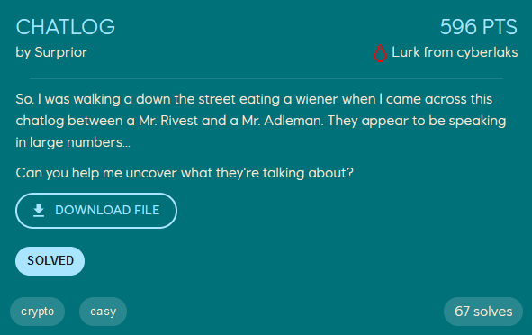

# Chatlog
<p align="center">
    
</p>

From reading the challenge description, it is clear that this is a RSA (Rivest–Shamir–Adleman) challenge. We are given a chatlog where the public factors `N` and `e` are given, along with the ciphertext.
```
[22:10:25]      <Mr.Rivest>     Hi, I need to send you something. Can you send me your key?
[22:11:03]      <Mr.Adleman>    Sure, here: n=109773001979060500556771371722004589561407766472974181720301601504038097307183054327771414952722378616410690575654297998413723333283006388834687489519816814313970602740394095998728900971165525449666220812031401613319432338039749036919424709291358478655637030475075112370396605574403821950130705107292457546429 e=6251728305055461128215101113791542074487626873355761684912706796947820318045025894574010369655098754702916182673592159941529716341070091220295342244632166182377719507598162603755176681008223777597129409701832290624714334993812111228876927501848766224885363439534844304635205290155102644689388281018248057599
[22:11:47]      <Mr.Rivest>     69065966519105922162577567455261680573815854481710157074477507437933398566834762071577601999308205592512262422922008600362846112148013817314127895526875891430442404421013800492060589763419224572960632800381314756724351337523874069656512900871727433364755041357985429952615910953420906893665747562715489326060
[22:12:19]      <Mr.Adleman>    Hmm, I see... Thanks!
```

The first thing we tried was to check with [factordb](https://www.factordb.com/) if `N` has any known factors. If this was the case, we would know `p` and `q`, and could subsequently construct the decryption key `d = e^-1 % ( (p-1)*(q-1) )`. Unfortunately, the `N` in this challenge has no known factors.

One thing that stands out is that `e` is very large in this challenge, as usually `e = 0x10001`. Because `e` is very large, the decryption key `d` is likely to be relatively small, and therefore vulnerable to [Wiener's attack](https://cryptohack.gitbook.io/cryptobook/untitled/low-private-component-attacks/wieners-attack) if certain size-requirements are met. Luckily, because this is a known attack we don't have to script all the code ourselves, and can just use [RsaCtfTool](https://github.com/RsaCtfTool/RsaCtfTool) for example.
```
$ python3 RsaCtfTool.py --attack wiener -n 109773001979060500556771371722004589561407766472974181720301601504038097307183054327771414952722378616410690575654297998413723333283006388834687489519816814313970602740394095998728900971165525449666220812031401613319432338039749036919424709291358478655637030475075112370396605574403821950130705107292457546429 -e 6251728305055461128215101113791542074487626873355761684912706796947820318045025894574010369655098754702916182673592159941529716341070091220295342244632166182377719507598162603755176681008223777597129409701832290624714334993812111228876927501848766224885363439534844304635205290155102644689388281018248057599 --decrypt 69065966519105922162577567455261680573815854481710157074477507437933398566834762071577601999308205592512262422922008600362846112148013817314127895526875891430442404421013800492060589763419224572960632800381314756724351337523874069656512900871727433364755041357985429952615910953420906893665747562715489326060
[*] Attack success with wiener method !
PKCS#1.5 padding decoded!
utf-8 : EPT{Shamir_is_up_2_something}
```