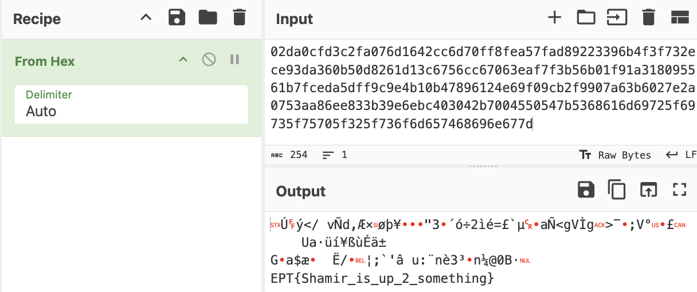

# Chatlog
Writeup by slayyy @ Dragonslayerz

__Lesson learned:__ Respect the KISS principle.

### Introduction
We are given a text file containing a brief conversation between misters Rivest and Adleman. The names are a reference to two of the three inventors of the RSA encryption algorithm ([Wikipedia](https://en.wikipedia.org/wiki/RSA_(cryptosystem))).

In this challenge, we were given the following parameters for an RSA encryption:
- `n` (modulus)
- `e` (public exponent)
- `ct` (ciphertext)

Our goal was to decrypt the ciphertext `ct` to retrieve the original message.

### Solution
The first thing that popped out is the use of a huge public exponent, `e`. After an extensive time used within the team trying to solve the puzzle, after the food was served at the venue, one team member used Google for research with the following query:


The first page of results indicated quite certain that huge exponents are vulnerable to [Wiener's Attack](https://en.wikipedia.org/wiki/Wiener%27s_attack).

The next step was finding appropriate tools in our programming language of choice, which led us to the `owiener` module ([PyPI](https://pypi.org/project/owiener/)).


#### Finding the `d`
```find_the_d.py
import owiener

e = 6251728305055461128215101113791542074487626873355761684912706796947820318045025894574010369655098754702916182673592159941529716341070091220295342244632166182377719507598162603755176681008223777597129409701832290624714334993812111228876927501848766224885363439534844304635205290155102644689388281018248057599
n = 109773001979060500556771371722004589561407766472974181720301601504038097307183054327771414952722378616410690575654297998413723333283006388834687489519816814313970602740394095998728900971165525449666220812031401613319432338039749036919424709291358478655637030475075112370396605574403821950130705107292457546429
d = owiener.attack(e, n)

if d is None:
    print("Failed")
else:
    print("Hacked d={}".format(d))

```

```output1:
Hacked d=18381494291594953056777362005644517143007478836617600171835005250178126922947

```

#### Decrypting the message
```rsa_solve.py
def rsa_decrypt(c, d, n):
    # Decrypt the message using RSA decryption formula: m = c^d mod n
    m = pow(c, d, n)
    return m

def int_to_bytes(n):
    return n.to_bytes((n.bit_length() + 7) // 8, 'big')

def main():
    # Integer values of c, d, and n
    d = 18381494291594953056777362005644517143007478836617600171835005250178126922947
    e = 6251728305055461128215101113791542074487626873355761684912706796947820318045025894574010369655098754702916182673592159941529716341070091220295342244632166182377719507598162603755176681008223777597129409701832290624714334993812111228876927501848766224885363439534844304635205290155102644689388281018248057599
    n = 109773001979060500556771371722004589561407766472974181720301601504038097307183054327771414952722378616410690575654297998413723333283006388834687489519816814313970602740394095998728900971165525449666220812031401613319432338039749036919424709291358478655637030475075112370396605574403821950130705107292457546429
    ct = 69065966519105922162577567455261680573815854481710157074477507437933398566834762071577601999308205592512262422922008600362846112148013817314127895526875891430442404421013800492060589763419224572960632800381314756724351337523874069656512900871727433364755041357985429952615910953420906893665747562715489326060

    # Decrypt the message
    decrypted_int = rsa_decrypt(ct, d, n)
    decrypted_bytes = int_to_bytes(decrypted_int)

    # Print the raw bytes in hexadecimal format
    print(f"Decrypted message (hex): {decrypted_bytes.hex()}")

    # Attempt to convert bytes to string (assuming the message is in UTF-8)
    try:
        decrypted_message = decrypted_bytes.decode('utf-8')
        print(f"Decrypted message (UTF-8): {decrypted_message}")
    except UnicodeDecodeError:
        print("Decrypted message is not valid UTF-8")

if __name__ == "__main__":
    main()
```

```output2
Decrypted message (hex): 02da0cfd3c2fa076d1642cc6d70ff8fea57fad89223396b4f3f732ece93da360b50d8261d13c6756cc67063eaf7f3b56b01f91a318095561b7fceda5dff9c9e4b10b47896124e69f09cb2f9907a63b6027e2a0753aa86ee833b39e6ebc403042b7004550547b5368616d69725f69735f75705f325f736f6d657468696e677d
Decrypted message is not valid UTF-8
```

For some reason or other, the decrypted message, when decoded in UTF-8, was invalid strings, but we still figured we should let Cyberchef take a whack at it - and voila, after some gibberish/invalid UTF-8, the flag was visible:



In addition to the flag itself, we also get the reference to the missing party of the trio behind the encryption algorithm.

### Tools Used
- Python
- owiener package
- Cyberchef

### Conclusion
By leveraging the Wiener Attack, we successfully decrypted the RSA-encrypted message. This challenge highlighted the importance of choosing secure parameters for RSA encryption to avoid such vulnerabilities.