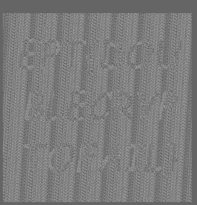

# LFSXOR

Writeup author: `Hoover`

## Overview

We are given a `out.bmp` file and a `enc.py` script. Upon first glance, we can see that the image is encrypted and contains a lot of noise.


## Code analysis

```py
import sys

import numpy
import matplotlib.pyplot as plt
from PIL import Image


def get_rand(x):
	def _random():
		nonlocal x
		x ^= (x << 14) & 0xFFFFFFFF
		x ^= (x >> 6) & 0xFFFFFFFF
		x ^= (x << 11) & 0xFFFFFFFF
		return x & 0xFF
	return _random


def encrypt(in_img, out_img, key):
	in_img = plt.imread(in_img)[:, :, 0]
	height = len(in_img)
	width = len(in_img[0])
	
	imarr = numpy.zeros((height, width, 3), dtype='uint8')
	rand = get_rand(key)
	
	for y in range(height):
		for x in range(width):
			imarr[y,x] = int(in_img[y,x] ^ rand())
	
	im = Image.fromarray(imarr.astype('uint8')).convert('RGB')
	im.save(out_img)


if __name__=='__main__':
	IN_IMG = sys.argv[1]
	OUT_IMG = sys.argv[2]
	KEY = int(sys.argv[3])
	encrypt(IN_IMG, OUT_IMG, KEY)
```

We are presented with a program that encrypts an image using an LFSR for generating PRNG out of a key and XOR that with a pixel from the original image. Something that I noticed straigh away was that if we dismiss the LFSR functionality in the `get_rand` function that implements the LFSR, and just look at the return value, it will only return a value between 0-255 no matter what the value of `x` is (in our case the key).

We can see this with the following code:

```py
def get_rand(x):
	def _random():
		nonlocal x
		x ^= (x << 14) & 0xFFFFFFFF
		x ^= (x >> 6) & 0xFFFFFFFF
		x ^= (x << 11) & 0xFFFFFFFF
@>		return x & 0xFF
	return _random
```	

Since the bitwise AND operation with `0xFF` (binary `11111111`) effectively masks the result to the least significant 8 bits. Since 8 bits can represent 256 distinct values (`2^8`), the function will only return integers from 0 to 255 inclusive, no matter what the value of `x` is. In our case it was the original key.

This means, we could just directly XOR the encrypted image with values from 0-255 and analyze the noise and hope we see something of interest. We do not aim for a clear image, only a good enough picture where we hopefully can see something. 

## Solving the challenge

Knowing that the image containing the flag is encrypted by XORing a key with values between 0-255, I wrote a Python script to decrypt the image with every possible key, save the results, and print the time taken for the process, allowing me to work on another challenge while waiting for the script to finish.

```python
import sys
import numpy
import matplotlib.pyplot as plt
from PIL import Image
from enc import get_rand
import time

def decrypt(in_img, key):
    in_img = plt.imread(in_img)[:, :, 0]
    height, width = in_img.shape
    
    imarr = numpy.zeros((height, width, 3), dtype='uint8')
    rand = get_rand(key)
    
    random_values = numpy.array([rand() for _ in range(height * width)], dtype='uint8').reshape(height, width)
    
    # xor but vectorized  efficiency and speed
    imarr[:, :, 0] = (in_img ^ random_values)  # just edit first channel
    imarr[:, :, 1] = imarr[:, :, 0]  # copy to other channels for RGB
    imarr[:, :, 2] = imarr[:, :, 0]
    return Image.fromarray(imarr.astype('uint8')).convert('RGB')

if len(sys.argv) != 2:
    print("Usage: python main.py <input_image>")
    sys.exit(1)

IN_IMG = sys.argv[1]

start_time = time.time()
for key in range(1, 256):
    decrypted_image = decrypt(IN_IMG, key)
    out_img = f"{key}.png"
    decrypted_image.save(out_img)
    print(f"Saved: {out_img}")
    
    if key % 5 == 0:
        elapsed_time = time.time() - start_time
        print(f"Time taken for {key} images: {elapsed_time:.2f} seconds")
        estimated_total_time = (elapsed_time / key) * 255
        print(f"Estimated total time for 255 images: {estimated_total_time:.2f} seconds")
```

## Extracting the flag

After XOR-ing the image with all possible keys, I uploaded one of the decrypted images to [AperiSolve](https://aperisolve.com/). The image contained a lot of noise, and I just hoped to find something recognizable. Interestingly, the images revealed the flag when viewed in AperiSolve's superimposed noise view and color view. Each image corresponds to a different key, resulting in varying levels of noise, hence I just inputted a random image and hoped for the best. This particular image was clear enough to discern the flag amidst the superimposed noise.



From this point, we read out the letters we could see and made an educated guess about the flag's content and successfully submitted it.

Flag: `EPT{DOUBLECRYPTOTOFAIL}`