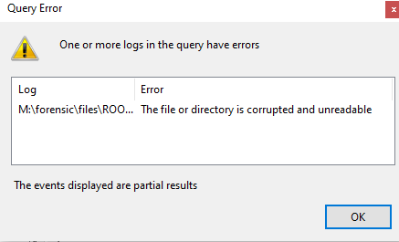
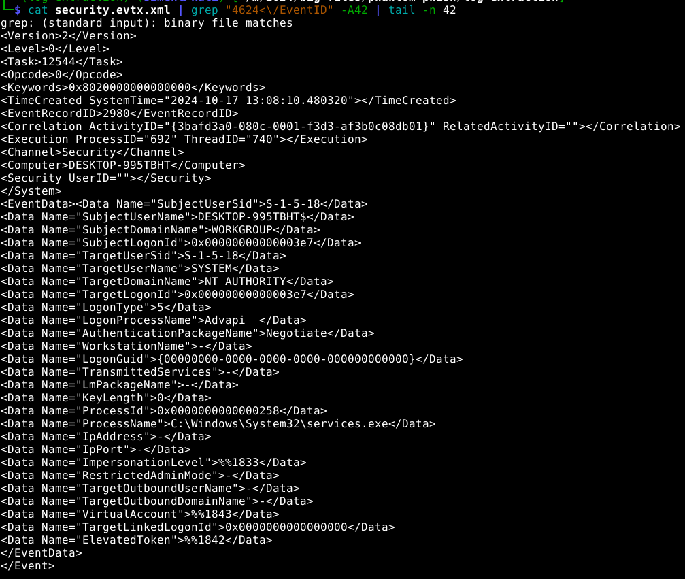
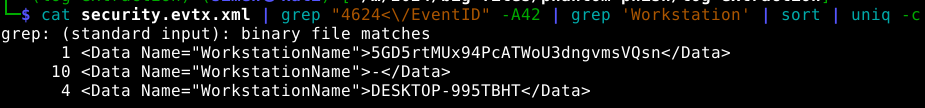
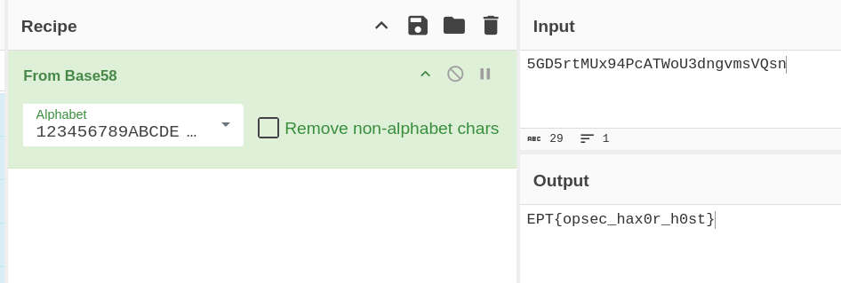

# Event Horizon
Challenge Author: `viipz`
Challenge Flag: `EPT{opsec_hax0r_h0st}`
Challenge Description:
```
Use the same memory dump from Phantom Phish.

Can you find the name of the workstation used by the attacker to access Benjamin's computer?
```

## Provided Challenge files
Memory dump of system.
- [dump.zip](https://platform.ept.gg/api/challenge/phantomphish/file) *(link may become unavailable)*


## Solution
### Preface
We have gotten a memory dump of a Windows system. The system has been compromised. The memory image is reused across different CTF challenges.

Our task is to figure out the name of the workstation used by the attacker.

### Solving the challenge
#### Choosing our tooling
> This is the same as for Phantom Phish writeup: [My Phantom Phish writeup](../../Phantom%20Phish/NorskeNøkkelsnikere-SimenBai/README.md)

Since we are investigating a memory image, we generally have two options. We can either use MemProcFS or Volatiltiy. We orginally solved it using Volatility, but this writeup will cover the MemProcFS option.

MemProcFS is cross-platform however it has a little better functionallity in Windows. So I will use windows for this writeup.

#### Running MemProcFs
> This is the same as for Phantom Phish writeup: [My Phantom Phish writeup](../../Phantom%20Phish/NorskeNøkkelsnikere-SimenBai/README.md)

MemProcFS works a little differently then Volatility. In volatility, you have to run plugins against the memory dump and it has to orient itself in the memory image each time. However, in MemProcFS, when you run it against a memory image it mounts a new drive letter, containing a virtual file system of the memory dump containg all the information. This way we can get access to everything instead of having to wait around and run all the different plugins.

It is also possible to execute YARA searches against the memory, so I did this too just in case it would find something interesting.

I started MemProcFs with the following command, making it run a forensic and yara scan (utilizing some Elastic Yara rules) against the memory image.
```
MemProcFS.exe -forensic 1 -device dump.dmp -license-accept-elastic-license-2.0
```
It takes a little while for it to fully load. But the `M:/forensic/progress_percent.txt` file tells us the progress.


#### Finding the logs

My first assumption when doing this challenge was that the would find the answer in the logs. I especially recalled that when doing RDP the target system would log the hostname of the requesting system. Doing a quick search I found that it should be found in the security event log.

Fetching this file with MemProcFS is quite easy, we just navigate to the `M:\forensic\files\ROOT\Windows\System32\winevt\Logs` folder and we should find the logs there.

However, when we try to open this file, it seems like the file is corrupted


I had not come across this before, so I initally assumed I did something wrong.

Later I saw the writeup of `RumbleInTheJungle`, but also decided to do some searching of my own, and found that this is salvageable.
When searching for `recover corrupted evtx file` I found both a [reddit post](https://www.reddit.com/r/sysadmin/comments/o2o1xd/corrupt_evtx_file/?rdt=57032) referencing a tool, but also the tool itself: https://github.com/williballenthin/EVTXtract

#### Extracting the logs
I moved the corruped security.evtx file over to my linux workstation. Installed and ran the tool
```bash
$ pip install evtxtract
$ evtxtract ffffc50ce048c510-Security.evtx > security.evtx.xml
INFO:evtxtract:no matching templates for record at offset: 0x1a6658
INFO:evtxtract:no matching templates for record at offset: 0x1a6ab0
INFO:evtxtract:no matching templates for record at offset: 0x1a82e0
INFO:root:recovered 460 complete records
INFO:root:recovered 3 incomplete records
```
It seemingly recovered some but not all of the logs.
I could now start looking for the events that seemed interesting.

First of, I wanted to check out the RDP session reconnect events (`4778`). There where none.
Next in line is the Successful logon events (`4624`).
There is 15 of these, a low enough number that they can easily be manually processed 
`cat security.evtx.xml | grep "4624<\/EventID" | wc -l`.

I saw that the Event ID tag was one of the first tags of the event. So we could look for the correct data in the data following the event.


We could now just grep for all the different workstation names.

```
1 <Data Name="WorkstationName">5GD5rtMUx94PcATWoU3dngvmsVQsn</Data>
10 <Data Name="WorkstationName">-</Data>
4 <Data Name="WorkstationName">DESKTOP-995TBHT</Data>
```
This gave us a list of workstations, where one obviously didn't fit in.

Putting the workstation name into cyberchef gave us the flag:


`EPT{opsec_hax0r_h0st}`