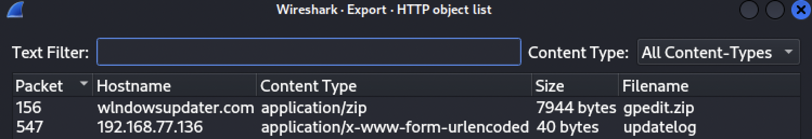
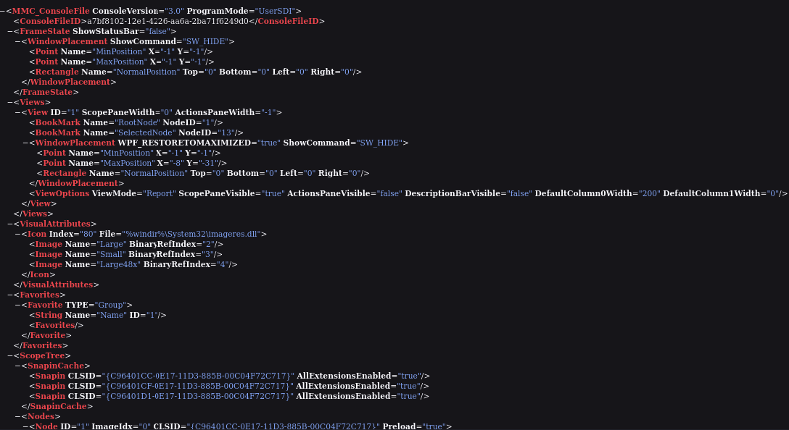
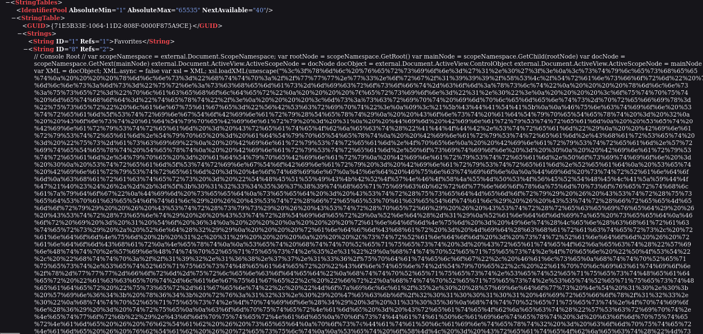
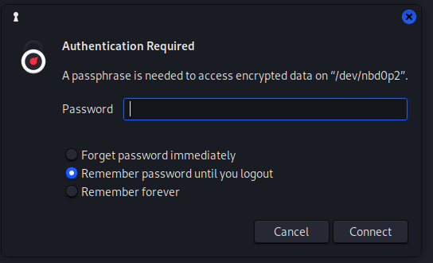
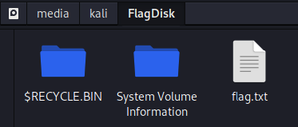

# Honey, I shrunk the skids
Writeup by slayyy @ Dragonslayerz

__Lesson learned:__ Don't trust the AI.

#### Note
This was unfortunately not completely finished until after the CTF was over. 

### Introduction
We are presented with a zip containing two files
- FlagDisk.vhdx
- shrunk.pcap

The challange points in the direction of a ransomware of a disk, and to decrypt the VHDX by finding information within the PCAP file.


### Solution steps
Opening the PCAP in Wireshark and doing a quick-and-dirty  `File --> Export Objects --> HTTP..` is nice to us for once, and shows some interesting options:



As seen in the screenshot, `gpedit.zip` is downloaded from windowsupdater[.]com, while the posting of the `updatelog` is towards IP 192[.]186[.]77[.]136.

The two files exported were `updatelog` and `gpedit.zip`. The first was a simple text file, containing  single string `upgrade=REVTS1RPUC01OUMxQzNECTQzOTA2Ljgz`.

Base 64 decode of the string gives the following: `DESKTOP-59C1C3D	43906.83`, of which one might assume this is the computer name in question.

The gpedit archive, named such that it might imply relation to the native Group Policy editor, contains a single `.msc` file, for use in Microsoft Managment Console.

At a first glance, it might seem plausible enough



but further down it we see huge chunk of URL encoded (or HEX) data.
 


While this could possibly be a benign use case, see the Base64 encoded icons for instance, it is worthy of another look.

By doing URL decode of the string in Cyberchef, we get a XML file containing a VBScript.

The VBScript contains a function `Stream_StringToBinary` that converts a given text string into its binary representation using the ADODB.Stream object.

Furthermore, we see references to the IP previously seen related to `updatelog`. Backtracking the variables, we see that it file consists of the following

```
upgrade=" & oNode.Text
```


where `oNode.Text` in turn is `computerName & vbTab & seed`.


`vbTab` is the tab character for use in strings, meaning that the number found when b64 decoding the string from the file before (`43906.83`), indeed is the seed used for generating the encryption key.

The seed is used within the "randomization" part of the script for generating the encryption key. However, it sets the `Rnd(-1)` which according to documentation ([ref](https://learn.microsoft.com/en-us/office/vba/language/reference/user-interface-help/rnd-function)) states it shall give "The same number every time, using Number as the seed.".

This means it should be possible to recover the enryption key based on the seed we got, and a modification of the key generation function in the following way:


```vbscript modified to print out the encryption key
Dim strRandom
characters = "THEQUICKBROWNFOXJUMPSOVERTHELAZYDOG!@#$&*-+=_;0123456789thequickbrownfoxjumpsoverthlazydog"

' Generate the seed
Dim seed
seed = 43906.83 'From the b64 decode of updatelog from before
Rnd(-1)
Randomize seed

' Generate the random string
For i = 1 To 64
    randomNum = Int(Len(characters) * Rnd(2))
    randomChar = Mid(characters, randomNum + 1, 1)
    strRandom = strRandom & randomChar
Next

' Print the generated random string (encryption key)
WScript.Echo "Generated Random String: " & strRandom
```

This returns the following output, which should indeed be the encryption key:

```output1
C:\Users\Administrator\Desktop>cscript.exe script.vbs
Microsoft (R) Windows Script Host Version 5.812
Copyright (C) Microsoft Corporation. All rights reserved.
Generated Random String: _tfeTIO$*Vy##f@GyRfDEJvRvNerHHDrE=GHr0CRFgSX3VYD4koa-LUU&OTDe;rb 
```

Mounting the vhdx in Kali makes it available in Thunar File manager, where it can be mounted. Upon mounting it requests a passphrase, which should be our encryption key



Entering the key seems to decrypt the disk, and indeed we can now open the `flag.txt`



The `flag.txt` indeed contains the flag: `EPT{it_works_the_machine_works!}`.