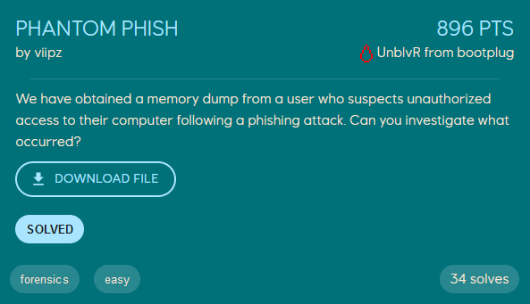
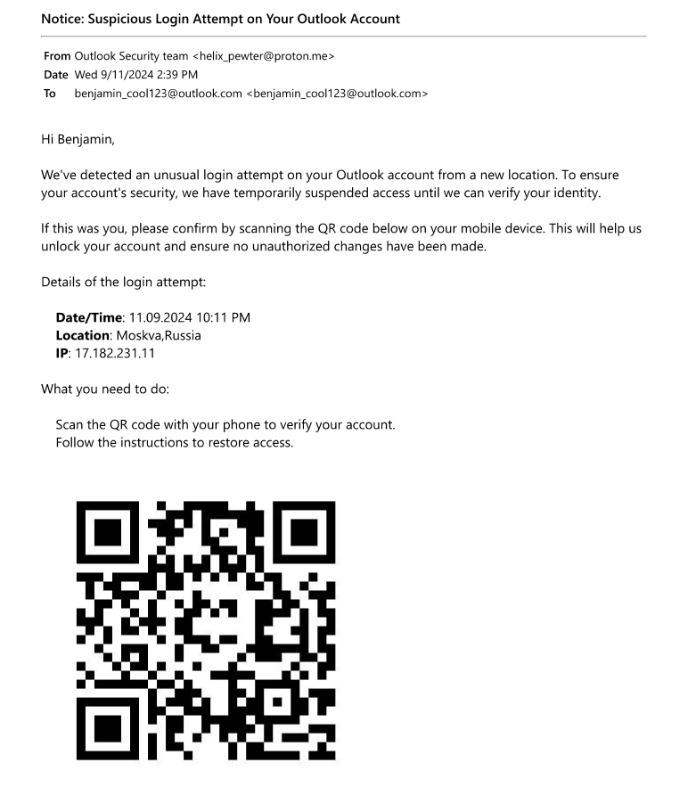
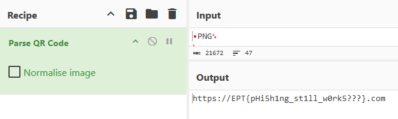

# Phantom Phish
<p align="center">
    
</p>

We are given a memory dump to analyze, with the goal of investiagting a phising attack. To get information from the memory dump we use [Volatility 3](https://github.com/volatilityfoundation/volatility3). The outputs showed from volatility will be trimmed down due to information-overload for a writeup.

To get an overview of what processes were running on the machine at the time when the memory dump was taken we run volatility's `windows.pstree` module. This will give a tree-view of of the process list, making it easier to determine the parent-child relationships between the processes. Although for this step, the `windows.pslist` module would also work fine (or alternatively `windows.cmdline`).
```
$ vol3 -f dump.dmp windows.pstree

PID     PPID    ImageFileName   CreateTime      Audit   Cmd
...
7300    1304    notepad.exe     2024-10-17 13:08:33.000000      \Device\HarddiskVolume3\Windows\System32\notepad.exe    "C:\Windows\system32\NOTEPAD.EXE" C:\Users\Benjamin\Documents\security email.pdf
```

Scrolling through the output we see that `notepad.exe` is running and has opened the file `C:\Users\Benjamin\Documents\security email.pdf`. Considering this challenge mentions a phishing attack, this file should be investigated further, and either ruled out or not as potentially malicious.

To dump files from memory we can use the module `windows.filescan.FileScan` and `windows.dumpfiles.DumpFiles`. We use the `FileScan` module to get the virtual offset of the file, which we give as an argument to `DumpFiles` to carve the file out of the memory dump.
```
$ vol3 -f dump.dmp windows.filescan.FileScan | grep "\.pdf"

Offset  Name    Size
...
0xc50ce5139980  \Users\Benjamin\Documents\security email.pdf    216
...

$ vol3 -f dump.dmp windows.dumpfiles.DumpFiles --virtaddr 0xc50ce5139980

Cache   FileObject      FileName        Result
DataSectionObject       0xc50ce5139980  security email.pdf      file.0xc50ce5139980.0xc50ce5c1ea70.DataSectionObject.security email.pdf.dat
``` 

The PDF file is *allegedly* a suspicious login attempt warning from Microsoft, with a QR code to scan.
<p align="center">
    
</p>

We can parse the QR code with [CyberChef](https://gchq.github.io/CyberChef/) to view its link, which reveals the flag.
<p align="center">
    
</p>