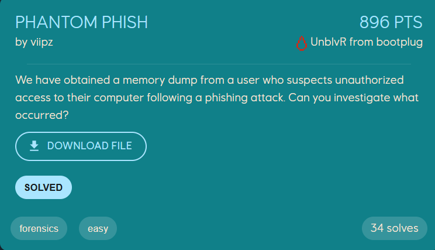
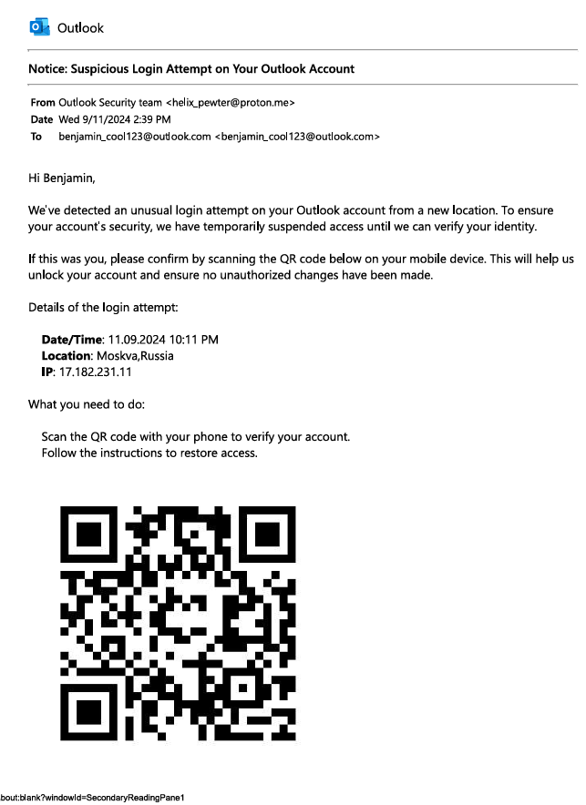
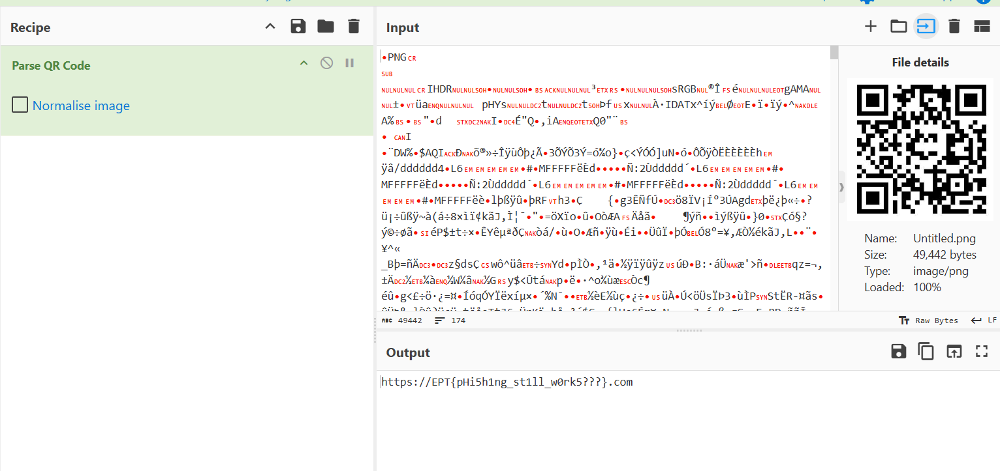

# Writeup
author: th@m456 @ FesseMisk

Creds to AsianAce who basicly did the whole challenge before I swept in and took the flag, hehe

## Phantom Phish
<p align="center">
    
</p>

### Solution

We have obtained a memory dump from a user who suspects unauthorized access to their computer following a phishing attack. Our task is to investigate what occurred - and we will use [Volatility 3](https://github.com/volatilityfoundation/volatility3) to do that.

First, we need to get an overview of the processes running on the machine at the time the memory dump was captured. We use the `windows.pstree` module to get a tree-view of the process list, which helps us identify parent-child relationships between processes.

```bash
$ python3 ~/src/volatility3/vol.py -f ./dump.dmp windows.pstree
(...)
```

the `notepad.exe` process seems suspicious. Let's print out all notepad occurances only.


```bash
$ python3 ~/src/volatility3/vol.py -f ./dump.dmp windows.pstree  | grep -i notepad

7300ress130400.0notepad.exe     0xc50ce492b080  7       -       1       False   2024-10-17 13:08:33.000000 UTC  N/A     \Device\HarddiskVolume3\Windows\System32\notepad.exe  "C:\Windows\system32\NOTEPAD.EXE" C:\Users\Benjamin\Documents\security email.pdf        C:\Windows\system32\NOTEPAD.EXE
```

We found that `notepad.exe` was used to open a file named `security email.pdf`. Considering the name of the file, and that we know there has been a phising attack - this is probably an important clue. Let's search for this PDF file in the memory dump.

```bash
$ python3 ~/src/volatility3/vol.py -f ./dump.dmp windows.filescan.FileScan | grep "\.pdf"
 0xc50ce51399800\Users\Benjamin\Documents\security email.pdf
```

We have located the PDF file in memory. The next step is to dump this file to disk so we can analyze its contents.

```bash
$ $ python3 ~/src/volatility3/vol.py -f ./dump.dmp windows.dumpfiles.DumpFiles --virtaddr
 0xc50ce5139980

Cache   FileObject      FileName        Result

DataSectionObject       0xc50ce5139980  security email.pdf      file.0xc50ce5139980.0xc50ce5c1ea70.DataSectionObject.security email.pdf.dat
``` 
We have now extracted the pdf, and are able to open it.
<p align="center">
    
</p>


The PDF seems to be a phising mail containing a QR code. The mail claims that there has been "suspicious Login Attempt on Your Outlook Account", from "helix_pewter@proton.me" (obviously not actually Outlook Security Team).

We can parse the QR code using [CyberChef](https://gchq.github.io/CyberChef/), which gives us our the flag formatted as a link!

<p align="center">
    
</p>