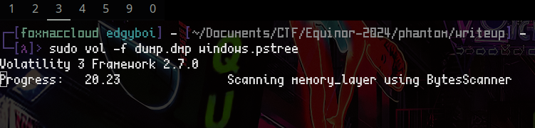
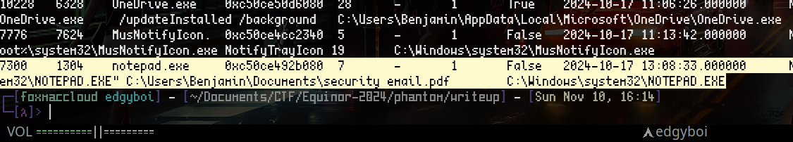
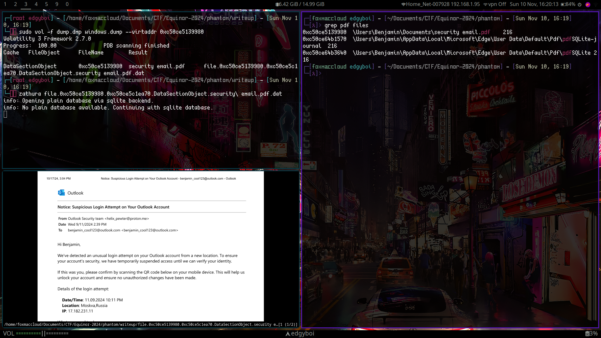

# Phantom Phish
Author: viipz

Flag: `EPT{pHi5h1ng_st1ll_w0rk5???}`
## Description
```
We have obtained a memory dump from a user who suspects unauthorized access to their computer following a phishing attack. Can you investigate what occurred?
```


---

Author: [FoxMaccloud](https://github.com/FoxMaccloud/)

Website: [Foxmaccloud.com](https://foxmaccloud.com/)

## Description

We've been given a windows memory dump which has been dumped by the DumpIt.exe process. This is a multipart challenge, but I only did solve the first one.

---

## volatility

One of the forensics tools I've used before and know for windows dumps is `Volatility`. Using volatility I was able to get myself a process tree of all the running processes on the system at the time of capture using this command: `sudo vol -f dump.dmp windows.pstree`



Beyond all the processes one stood out to me. That one being `security email.pdf` and that it was opened by notepad.



To get a list of all the files on the system I ran this command: `sudo vol -f dump.dmp windows.file > files`. After getting a full list of all the files, I was able to find the location of this email and recover it.

`sudo vol -f dump.dmp windows.dump --virtaddr 0xc50ce5139980`



In this pdf there was a QR code;


After using my phone to scan the code I was able to get the flag for Phantom Phish.