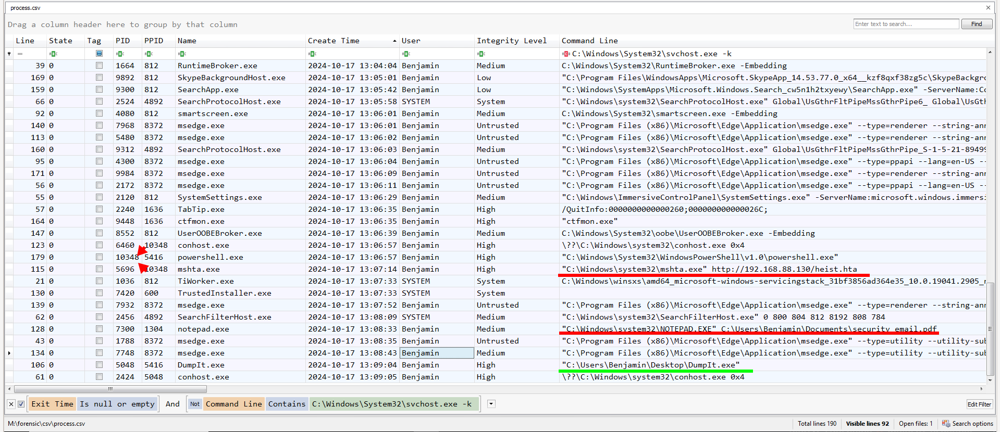
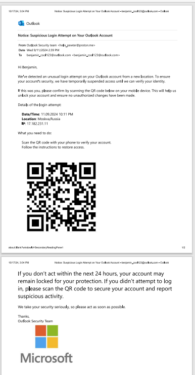
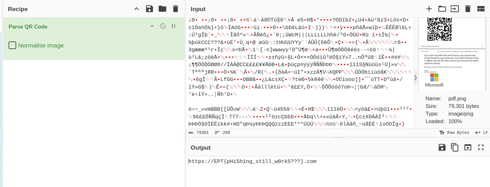

# Phantom Phish
Challenge Author: `viipz`
Challenge Flag: `EPT{pHi5h1ng_st1ll_w0rk5???}`
Challenge Description:
```
We have obtained a memory dump from a user who suspects unauthorized access to their computer following a phishing attack. Can you investigate what occurred?
```

## Provided Challenge files
Memory dump of system.
- [dump.zip](https://platform.ept.gg/api/challenge/phantomphish/file) *(link may become unavailable)*


## Solution
### Preface
We have gotten a memory dump of a Windows system. The system has been compromised. The memory image is reused across different CTF challenges.

Our first task is to figure out what first occured.

### Solving the challenge
#### Choosing our tooling
Since we are investigating a memory image, we generally have two options. We can either use MemProcFS or Volatiltiy. We orginally solved it using Volatility, but this writeup will cover the MemProcFS option.

MemProcFS is cross-platform however it has a little better functionallity in Windows. So I will use windows for this writeup.

#### Running MemProcFS
MemProcFS works a little differently then Volatility. In volatility, you have to run plugins against the memory dump and it has to orient itself in the memory image each time. However, in MemProcFS, when you run it against a memory image it mounts a new drive letter, containing a virtual file system of the memory dump containg all the information. This way we can get access to everything instead of having to wait around and run all the different plugins.

It is also possible to execute YARA searches against the memory, so I did this too just in case it would find something interesting.

I started MemProcFs with the following command, making it run a forensic and yara scan (utilizing some Elastic Yara rules) against the memory image.
```
MemProcFS.exe -forensic 1 -device dump.dmp -license-accept-elastic-license-2.0
```
It takes a little while for it to fully load. But the `M:/forensic/progress_percent.txt` file tells us the progress.


#### Finding the relevant processes
Usually the first thing we do when investigating a new memory dump is to look identify suspicious/intersting processes. The information we usually look for is weird `executable names`, `file paths`, `parent processes`, `command line parameters` and `start time information`.


A good starting place for that is to look at the `M:\forensic\csv\process.csv` file. It contains a lot of the information we are interested in. A good tool for looking at CSVs in forensics is utilizing the tool `Timeline Explorer` by Eric Zimmerman.

One of the first steps we can take, is to take a look at the exited processes to see if there is something interesting in them, or if we can just filter them away.


Nothing immediatly jumps out at us as being suspicious except the start time of the `svchost.exe` (pid 9440)which usually starts a few seconds after `System.exe` but this could still be legitimate. So we go back to the process list, now filtering away the exited processes.

There is a lot of `svchost.exe` processes, they might be interesting to look at but they also create a lot of noise. We know they are started with the `-k` and `-p` argument, so we will temporarily filter away those that start with `C:\Windows\System32\svchost.exe -k ` in their command line.

We now have a much shorter list, with 92 entries instead of 190. We can now quickly look through the list and see if we find anything suspicious.



When we sort it based on create time we can get an idea of what happened in what order. When looking at the most recent activity we find three interesting things.
1. We find the time that the `dumpit.exe` tool was executed. DumpIt.exe is a popular forensically sound memory dumping tool from Magnet. So we can assume this is legitimate and what has been used by the defenders to dump the memory. It seems to have been dumped at approximatly `2024-10-17 13:09:05`.

2. We see that notepad is being used to open a PDF file. This is very weird, and probably something that might be interesting to us. We want to take a look at that file. 
Information that is relevant: PID `7300`, PPID `1304` (Processe does no longer exist), File opened `C:\Users\Benjamin\Documents\security email.pdf`

3. We see that mshta.exe (A process used to exute html applications (.hta)) is being run towards an external resource. This is a common Living of the land attack pattern, https://lolbas-project.github.io/lolbas/Binaries/Mshta/. Information that is relevant is PID `5696`, PPID `10348` (`powershell.exe`, run under `explorer.exe`), Accessed external resource: `http://192.168.88.130/heist.hta`. It would be very interesting to look at the heist.hta file. (This will be covered in the [Stealth Stealer writeup](../../Stealth%20Stealer/NorskeNøkkelsnikere-SimenBai/README.md)). 

It's still unclear how they got access to the system. But we want to take a look at the files we discovered first. For this task, the `7300` process is the one that is interesting.

#### Finding the PDF file
Luckily for us, MemProcFs makes this easy. When running the forensics scan it also creates a files folder (`M:\forensic\files`). Here it tries to:
```
The files module tries to recover files from file handles in the system and  
display them in a directory structure. File handles that cannot be recovered 
are not shown.                                                               
Files that are shown may be partly or completely corrupt.                    
```
So now we just have to hope that the pdf is available.

We can search through `M:\forensic\files\files.txt` to see if it was recovered.

And it seems to be. Navigating to that folder we find the file:
`M:\forensic\files\ROOT\Users\Benjamin\Documents\ffffc50ce5139980-security email.pdf`

Opening the file we find the following pdf:


It looks like an email where someone is attempting a QR code phishing. Looking at the from email we see that it is clearly not an official email, `helix_pewter@proton.me`.

Scanning the QR code in Cyberchef gives us the flag.


`https://EPT{pHi5h1ng_st1ll_w0rk5???}.com`

`EPT{pHi5h1ng_st1ll_w0rk5???}`