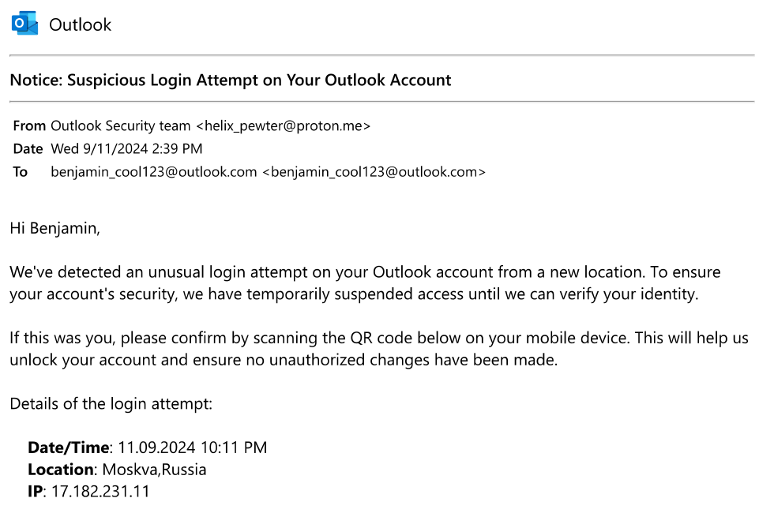

# Phantom Phish CTF Challenge Writeup

Writeup author: [`SondreUM`](https://github.com/SondreUM/)

Challenge file(s):

- [dump.zip](https://platform.ept.gg/api/challenge/phantomphish/file) *(link may become unavailable)*

Archive contents:

```bash
$ unzip -l dump.zip
Archive:  dump.zip
  Length      Date    Time    Name
---------  ---------- -----   ----
4293980160  2024-10-17 15:09   dump.dmp
---------                     -------
4293980160                     1 file
```

## Analysis

We are working with a memory dump file `dump.dmp`. The file is likely a memory dump from a system, and we need to analyze it to extract relevant information.

This writup will be using [Volatility 3](https://github.com/volatilityfoundation/volatility3) to perform memory forensics on the memory dump.

First we need to find what kind system the memory dump is from. Start with checking for Windows systems, since it is the most used client OS. We can do this by running the `windows.info` plugin.

```bash
$ python3 vol.py -f phantom_phish/dump.dmp windows.info
Volatility 3 Framework 2.11.0
Progress:  100.00               PDB scanning finished
Variable        Value

Kernel Base     0xf80502800000
DTB     0x1ad000
Symbols file:///home/user/Documents/ctf/tools/volatility3/volatility3/symbols/windows/ntkrnlmp.pdb/89284D0CA6ACC8274B9A44BD5AF9290B-1.json.xz
Is64Bit True
IsPAE   False
layer_name      0 WindowsIntel32e
memory_layer    1 WindowsCrashDump64Layer
base_layer      2 FileLayer
KdVersionBlock  0xf8050340f3a0
Major/Minor     15.19041
MachineType     34404
KeNumberProcessors      4
SystemTime      2024-10-17 13:09:07+00:00
NtSystemRoot    C:\Windows
NtProductType   NtProductWinNt
NtMajorVersion  10
NtMinorVersion  0
PE MajorOperatingSystemVersion  10
PE MinorOperatingSystemVersion  0
PE Machine      34404
PE TimeDateStamp        Fri May 20 08:24:42 2101
```

The output shows that the memory dump is from a Windows 10 system.

## Solving the challenge

I use the pretty format option to make the output more readable, and so that it can be written to a file for easier analysis.

Next step is to start digging through the system to find any clues that might be relevant to the challenge. With some help from the [interwebs](https://blog.onfvp.com/post/volatility-cheatsheet/) and `--help` we start running plugins on the memory dump.

```bash
$ python3 vol.py -f phantom_phish/dump.dmp -r pretty windows.psscan >> phantom_phish/psscan.txt
#
$ python3 vol.py -f phantom_phish/dump.dmp -r pretty windows.filescan >> phantom_phish/filescan.txt
#
$ python3 vol.py -f phantom_phish/dump.dmp -r pretty windows.envars >> phantom_phish/envars.txt
#
$ python3 vol.py -f phantom_phish/dump.dmp -r pretty windows.pslist >> phantom_phish/pslist.txt
#
$ python3 vol.py -f phantom_phish/dump.dmp -r pretty windows.cmdline >> phantom_phish/cmdline.txt
#
$ python3 vol.py -f phantom_phish/dump.dmp -r pretty windows.malfind >> phantom_phish/malfind.txt
```

In the cmdline plugin output we find a `notepad.exe` process with the argument targetting a `.pdf` file.

```bash
* |  7300 |    notepad.exe | "C:\Windows\system32\NOTEPAD.EXE" C:\Users\Benjamin\Documents\security email.pdf
```

Which is rather interesting, as notepad is neither the default program or capable of rendering pdf files. We find the same filepath in the `filescan` output at the virtual address `0xc50ce5139980`.

```bash
* | 0xc50ce5139980 | \Users\Benjamin\Documents\security email.pdf
```

We can extract the file from the memorydump using the `dumpfiles` plugin and the virtual address of the file.

```bash
$ python3 vol.py -f phantom_phish/dump.dmp -o phantom_phish/ windows.dumpfiles --virtaddr 0xc50ce5139980
Volatility 3 Framework 2.11.0
Progress:  100.00               PDB scanning finished
Cache   FileObject      FileName        Result

DataSectionObject       0xc50ce5139980  security email.pdf      file.0xc50ce5139980.0xc50ce5c1ea70.DataSectionObject.security email.pdf.dat
```

Which provides us with the file `security email.pdf`.
Opening the pdf file, we are met with a common looking phishing email.



However, at the bottom of the email, the hackers were kind enough to leave us a qr code wich contains the flag.


Lesson learned, always check emails for usefull qr codes and scan them uncritically.

The qr code links to `https[:]//ept{phi5h1ng_st1ll_w0rk5/???}[.]com` (passified link for safety), making the flag `EPT{phi5h1ng_st1ll_w0rk5/???}`.
