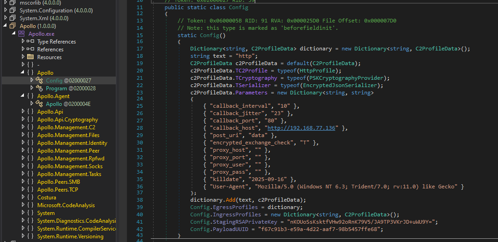
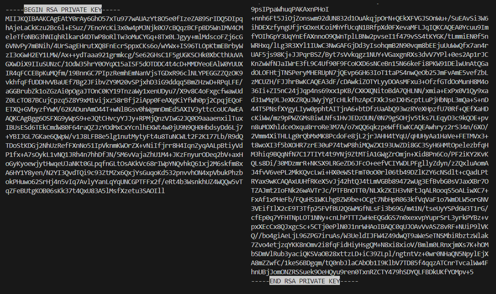

# 🔥 Red Alert 🔥
Solved by fjellape, MrFreddi007 & Danzi

### Challenge
Author: LOLASL
>Those idiots from IT Security claim I have created a "Red Alert" with my C2 traffic. They wanted my computer, but I am unable to comply (building in progress). Told them that it is called C&C and gave them a pcap and a memdump. Silos needed, unit lost, leave me alone!
\
Hint: The flag is in the packet capture but you probably need something from the memory dump to retrieve it.

### Writeup
Opening the pcap, we see a few domains that seem relevant to the challenge description and Command & Conquer - `downloads.cncnet.org` and `funkyfr3sh.cnc-comm.com`.
The most interesting traffic in the pcap are the POST requests to `192.168.77.136/data` with base64-encoded body. We suspect that these requests/responses contain the flag somehow. We extract these for later use:
\
`tshark -nr RedAlert.pcap -Y 'ip.addr==192.168.77.136' -T fields -e data.data > messages.txt`

MemProcFS lets us browse the memory dump for files of interest. In the user's downloads, there is one that matches the challenge description and the observed traffic from the pcap: `Command.and.Conquer.RedAlert-CRACKED-EPT24.exe`.

Looking at the running process' imports and linked DLLs, we see that it might be .NET related. Attaching dnSpy to the running process gives us a much clearer view of what the injected code is - a [Mythic](https://github.com/its-a-feature/Mythic) agent written in C#, called [Apollo](https://github.com/MythicAgents/Apollo).


After reading the [documentation](https://docs.mythic-c2.net/customizing/payload-type-development/create_tasking/agent-side-coding/initial-checkin#encrypted-key-exchange-checkins), we know a few things:
* The agent generates a RSA key pair in memory and sends the public key to the server
* The server then sends a new AES key, encrypted with the RSA public key, as `session_key`
* The new AES key is used for all remaining messages, and the message format is `b64(uuid + iv + ciphertext + hmac)`

We use strings to look for the RSA private key in memory.
\
`strings -el DESKTOP-R7UTVNN-20240930-180346.raw > strings.txt`
\
The key is found in two parts - one by searching for `BEGIN RSA PRIVATE KEY`, and the other by searching for `END RSA PRIVATE KEY`. We could only find two pieces that fit perfectly together. 


In the strings we also find the `session_key`, though we could also get it by decrypting the first message response in the pcap with StagingRsaPrivateKey `nKOUoSsKsktfVHw92oRnK79V5/JA9TP3VKrJD+uWU9Y=` found during malware analysis. We then decrypt `session_key` with the RSA private key using the following script:

```py
from Crypto.PublicKey import RSA
from Crypto.Cipher import PKCS1_OAEP
import base64

session_key = "FvCDxKMmhuyWvcIknsoJdzAzowbiR3UnZR4G8yETymw5NkU7eI+Dhw9skOlCR2tWp7PZLV9J1G3JwdKHJx6WYR70C8lwXEavtH8dmzPhqAcyN8pskSbxebx07SF0NX24M3miM/ui8NKXDsLV21hmSptZCl/fVN0Ssv8/Tw4JDt1vabghaG1D323v0EQ+wIPvnfbS+GTTKFd1m2YOQlETZB7xir3a2XEeWvNdPn2EbXIKQjWgcahLzlwl4z8qf/AKvtI7ea1xtqJDOJEooUC5rChcrzPQozgNHuT5yrPIUqYg9MtTfgnwhkueRWFdK6Bghi+CnX28wP9BGQ3P7aCG8+JF+hjdZ4eAktSHZ7TY21LUALpmRE3QbptTHrr24hcq623e04HoYUU2DsXjgPb6inOBAFLUTAhtBk22FnOgkiNIybC7iA16HkPC4d2hgzRSvVSwwu+UgeT30gHxxUiRUaMCoBflpGIaxhZHNjWw3EArBpffbE5X17iCayXRTvcRnJ6vitxdbo1zMwz3XFCqK0U0bjZe4HiYH4oRHO+y+3QJo17PUgZYl8nMkmn7ZyDxHJ6eyVVvmv1C+Sf3vL8J1lk3UgdQrg8iDfvAvfU+DqCm1qhGJoADwlYXJek3VKo5YqyZXmbzfa3THVnGzGY9E2SiftaxsKEUhapGGLpabWU="
rsa_key = RSA.import_key(open('private.pem','rb').read())
rsa = PKCS1_OAEP.new(rsa_key)
aes_key = rsa.decrypt(base64.b64decode(session_key)).hex()
print(aes_key)
# 90af1864dc256df5cd51bc7531f1e699170432ed74b3ad13abffb7d9ba5cb096
```

Now, all we need is to decrypt the rest of the messages from the pcap with this key. We chose to decrypt them all at once in [CyberChef](https://gchq.github.io/CyberChef/#recipe=Fork('%5C%5Cn','%5C%5Cn',false)From_Hex('None')From_Base64('A-Za-z0-9%2B/%3D',true,false)Drop_bytes(0,36,false)Drop_bytes(0,16,false)AES_Decrypt(%7B'option':'Hex','string':'90af1864dc256df5cd51bc7531f1e699170432ed74b3ad13abffb7d9ba5cb096'%7D,%7B'option':'Hex','string':'00000000000000000000000000000000'%7D,'CBC/NoPadding','Raw','Raw',%7B'option':'Hex','string':''%7D,%7B'option':'Hex','string':''%7D)), with `messages.txt` from earlier as input. The flag is found near the end of the output.

`EPT{should_have_played_brood_war_instead}`