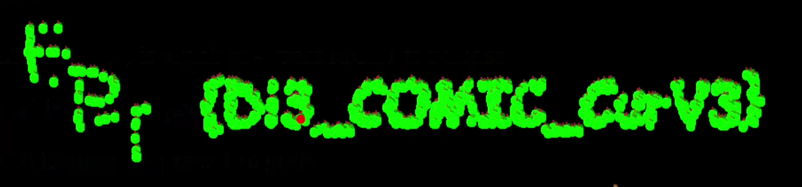

# Writeup
by fluffyhake

## Solution
Modifying a if condition in the clientside JavaScript lets you complete the game without playing. This reveals the flag using collected apples to display letters.

*A participant also solved this challenge by playing until they collected all 1000 apples. That was impressive. 👏*

### Example
#### game.js
```diff
function tick() {

            for(var snake in this.snakeArray) {

                if(this.collectedApples.length < 1000 ){

                    var xhit = Math.abs((Math.floor(this.snakeArray[snake].x)) - (this.apples[this.currentApplePosition].x)) <=10;
                    var yhit = Math.abs((Math.floor(this.snakeArray[snake].y)) - (this.apples[this.currentApplePosition].y)) <=10;
-                   if(xhit && yhit){
+                   if(true){
                        this.collectedApples.pushTitle(this.apples[this.currentApplePosition]);
                        delete this.apples[this.currentApplePosition];Title

                        this.currentApplePosition = this.randomAppl.next(0,409000);

                    }
                }
                else{
                    //stop game draw something to win
                    drawWin(450, 450,"rgba(0,0,255,1)");
                }

```



## Explanation
There were **three things** we found that pointed us to client side JavaScript code:

- Looking through the JavaScript and HTML we found no extra HTTP requests.

- We noticed apples spawining at the same location each playthrough.

- The code in `randomApple.js` to generate a new "random" apple seemed a bit too complex.


In order to run and modify the files locally we right clicked the webpage and pressed `Save Page As...` followed by `Web Page, Complete` in the dropdown.

Digging throug the JavaScript code we find a function that runs each tick called `tick()` This function contains code checking if you have collected the apple.


```javascript
function tick() {
// ...
    var xhit = Math.abs((Math.floor(this.snakeArray[snake].x)) - (this.apples[this.currentApplePosition].x)) <=10;
    var yhit = Math.abs((Math.floor(this.snakeArray[snake].y)) - (this.apples[this.currentApplePosition].y)) <=10;
    if(xhit && yhit){
        this.collectedApples.push(this.apples[this.currentApplePosition]);
        delete this.apples[this.currentApplePosition];

        this.currentApplePosition = this.randomAppl.next(0,409000);
    }
```
The section of code pushes the apple to a collectedApple array and creates the next apple. We want to modify this so it always runs each tick.
```javascript
function tick() {
// ...
    if(true){
        this.collectedApples.push(this.apples[this.currentApplePosition]);
        delete this.apples[this.currentApplePosition];

        this.currentApplePosition = this.randomAppl.next(0,409000);
    }
```
**After modifying we see the flag printed on the webpage:**


EPT{DI3_COMIC_CurV3}
