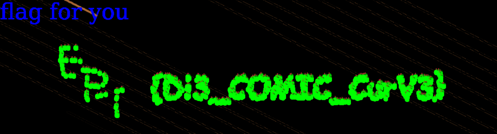

# Canvas Curve


## Description
Canvas Curve Snake game

You know the drill, collect apples for points, profit and flags! Gather up to 4 team members to help collect apples.

## Solution
The game is a simple snake game where you control a snake and collect apples. The goal is to collect 1000 apples to get the flag. But the game is entirely client-side, so we can manipulate the game to get the flag instantly.


Using the console in the browser, we can run the following code to overwrite the game.tick function with a modified one where the snake is hitting a apple on every tick:  
```javascript
game.tick = function() {
    for (var snake in this.snakeArray) {
        if (this.collectedApples.length < 1000) {
            // Force xhit and yhit to always be true
            var xhit = true; // THIS IS WHAT IS MODIFIED
            var yhit = true; // THIS IS WHAT IS MODIFIED
            if (xhit && yhit) {    
                this.collectedApples.push(this.apples[this.currentApplePosition]);
                delete this.apples[this.currentApplePosition];
                
                this.currentApplePosition = this.randomAppl.next(0, 409000);
            }
        } else {
            // stop game draw something to win
            drawWin(450, 450, "rgba(0,0,255,1)");
        }

        // check for collision loop all other snakes
        for (var othersnake in this.snakeArray) {
            if (snake != othersnake) {
                for (var othersnakeCoord in this.snakeArray[othersnake].snakeCoords) {
                    try {
                        var xshit = Math.abs((Math.floor(this.snakeArray[snake].x)) - (this.snakeArray[othersnake].snakeCoords[othersnakeCoord][0])) <= 2;
                        var yshit = Math.abs((Math.floor(this.snakeArray[snake].y)) - (this.snakeArray[othersnake].snakeCoords[othersnakeCoord][1])) <= 2;
                        if (xshit && yshit) {
                            delete this.snakeArray[snake];
                            return;
                        }
                    } catch (e) {
                        console.error('Error occurred:', e.message);
                    }
                }
            }
        }

        try {
            this.snakeArray[snake].move();
            drawSnakePoint(Math.floor(this.snakeArray[snake].x), Math.floor(this.snakeArray[snake].y), this.snakeArray[snake].color);
            drawSnakePoint(Math.floor(this.snakeArray[snake].deleteSnakePoint[0]), Math.floor(this.snakeArray[snake].deleteSnakePoint[1]), "rgb(0,0,0)");
        } catch (e) {
            console.error('Error occurred:', e.message);
        }

        this.drawAllCollectedApples();
        if (this.currentApplePosition < this.apples.length) {
            drawApple(this.apples[this.currentApplePosition].x, this.apples[this.currentApplePosition].y, this.apples[this.currentApplePosition].color);
        }
    }
};
```

This gives us the flag instantly:  
