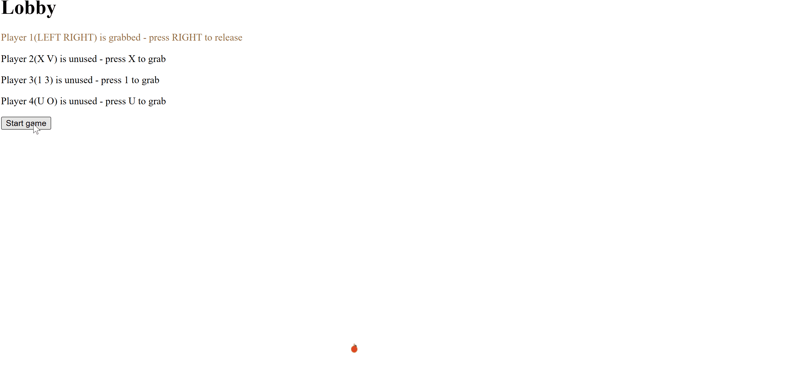

# Canvas Curve

Writeup author: `Hoover`

## Overview

To solve this challenge, we need to play the game snake until we collect 1000 apples. But who said we need to play the game?

## Analysis

We can read the source code of the game with the browser's developer tools which exposes the game logic. We see that we have a `pixel.js` file that contains a lot of pixel data and a `game.js` file that contains the game logic, and upon inspecting this `game.js` file we can see that the random apple that we need to collect is initialized with the same seed for each run. Having the same seed means that the apples will end up in the same place every time when the game is finished.

```js
this.randomAppl = new randomApple(1234);
```	

With this knowledge, we see that the `randomApple` function is defined in the `randomApple.js` and is looking complex and hard to understand.

```js
class randomApple {
    constructor(s) {
      this.modulus = 2 ** 31 - 1; 
      this.multiplier = 48271; 
      this.increment = 0;
      this.s = s % this.modulus;
      if (this.s < 0) this.s += this.modulus; 
    }
  
    n() {
      this.s = (this.multiplier * this.s + this.increment) % this.modulus;
      return this.s / this.modulus;
    }
  
    next(min, max) {
      return min + Math.floor(this.n() * (max - min + 1));
    }
  }
```	

## Solution

Since we can download the game from the challenge page, and run it locally, we can modify the game logic to reveal the flag when we collect 1000 apples, since we know the seed and the output of the `randomApple` function would be deterministic.

I revealed this with editing the `game.js` file, and making it automatically collect the current apple and move to the next apple until we have collected 1000 apples, and the game will print the flag in a satisfied manner.

```js
if(this.collectedApples.length < 1000) {
    // Automatically collect the current apple
    this.collectedApples.push(this.apples[this currentApplePosition]);
    delete this.apples[this.currentApplePosition];
    // Move to the next apple
    this.currentApplePosition = this.randomAppl.next(0, 409000);
    ...
}
```



Flag: `EPT{DI3_COMIC_CurV3}`
