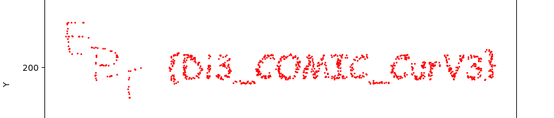

**Author: Zukane**

*Canvas Curve Snake game*
*You know the drill, collect apples for points, profit and flags! Gather up to 4 team members to help collect apples.*

##### Challenge overview

In this misc/web challenge we are given a URL to connect to at `https://canvascurve.ept.gg/`

By using inspect element (my most powerful tool) we can see numerous JavaScript files being loaded:

```html
<script src="./js/pixels.js"></script>
<script src="./js/snake.js"></script>
<script src="./js/game.js"></script>
<script src="./js/apple.js"></script>
<script src="./js/randomApple.js"></script>
<script src="./js/canvas.js"></script>
<script src="./js/index-html.js"></script>
```

In `game.js`, we can see that we win the game after collecting 1000 apples.

```javascript
if(this.collectedApples.length < 1000 ){
	var xhit = Math.abs((Math.floor(this.snakeArray[snake].x)) - (this.apples[this.currentApplePosition].x)) <=10;
	var yhit = Math.abs((Math.floor(this.snakeArray[snake].y)) - (this.apples[this.currentApplePosition].y)) <=10;
	if(xhit && yhit){    
		this.collectedApples.push(this.apples[this.currentApplePosition]);
		delete this.apples[this.currentApplePosition];
		this.currentApplePosition = this.randomAppl.next(0,409000);
	}
}
else{
	//stop game draw something to win
	drawWin(450, 450,"rgba(0,0,255,1)");
}
```

While some are crazy enough to do it manually, I am personally not. 

##### Solution

Examining the code, we see that the apples are given a new random location when they are collected.

```javascript
this.currentApplePosition = this.randomAppl.next(0,409000);
```

where `this.randomAppl` is defined as:

```javascript
this.randomAppl = new randomApple(1234);
```

Examining `randomApple.js`, we can see what the function is:

```javascript
class randomApple {
    constructor(s) {
      this.modulus = 2 ** 31 - 1; 
      this.multiplier = 48271; 
      this.increment = 0;
      this.s = s % this.modulus;
      if (this.s < 0) this.s += this.modulus; 
    }
  
    n() {
      this.s = (this.multiplier * this.s + this.increment) % this.modulus;
      return this.s / this.modulus;
    }
  
    next(min, max) {
      return min + Math.floor(this.n() * (max - min + 1));
    }
  }
```

Essentially, it is instantiated with a seed `s` (1234 in this case) and the function just generates a random number between the min and max (0 and 409000)

The file `pixels.js` contains a large list of coordinates: 

```javascript
window.pixelsArray = [[568, 354], [44, 105], [827, 373], ..., [39, 320], [17, 365]];
```

The value generated from the `randomApple` function is used as the index of this large array. This is how the coordinate of the apple is generated. If we generate enough apples, it should spell out the flag for us.

Using matplotlib, I implemented the following solution to plot the apples. I simply downloaded the pixels.js file using wget. 

```python
import ast
import matplotlib.pyplot as plt

class RandomApple:
    def __init__(self, s):
        self.modulus = 2 ** 31 - 1
        self.multiplier = 48271
        self.increment = 0
        self.s = s % self.modulus
        if self.s < 0:
            self.s += self.modulus

    def n(self):
        self.s = (self.multiplier * self.s + self.increment) % self.modulus
        return self.s / self.modulus

    def next(self, min_val, max_val):
        return min_val + int(self.n() * (max_val - min_val + 1))

with open('pixels.js', 'r') as f:
    content = f.read()
array_str = content[len('window.pixelsArray = '):-1].strip()
pixelsArray = ast.literal_eval(array_str)

random_apple = RandomApple(1234)
currentApplePosition = 0
collected_indices = []

# collect 1000 apples
for _ in range(1000):
    collected_indices.append(currentApplePosition)
    currentApplePosition = random_apple.next(0, 409000)
    
collected_coords = []
for idx in collected_indices:
    collected_coords.append(pixelsArray[idx])

all_x_coords = [coord[0] for coord in pixelsArray]
all_y_coords = [coord[1] for coord in pixelsArray]

max_x = max(all_x_coords)
max_y = max(all_y_coords)

# Transform collected coordinates
transformed_coords = []
for x, y in collected_coords:
    # Flip vertically (upside down): new_y = max_y - y
    new_x = max_x + x
    new_y = max_y - y
    transformed_coords.append((new_x, new_y))

# Plot
x_coords = [coord[0] for coord in transformed_coords]
y_coords = [coord[1] for coord in transformed_coords]
plt.figure(figsize=(10, 10))
plt.scatter(x_coords, y_coords, c='red', s=1)
plt.title('Collected Apples (Flipped and Mirrored)')
plt.xlabel('X')
plt.ylabel('Y')
plt.axis('equal')
plt.show()
```

Running this script, we can see the flag is indeed plotted from all the apple coordinates:



The flag is therefore: `EPT{DI3_COMIC_CurV3}`
