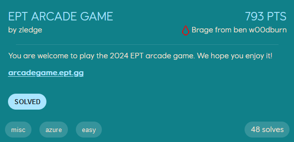
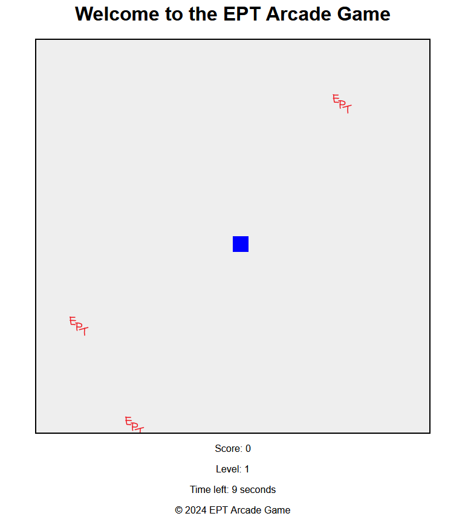

# EPT Arcade Game
<p align="center">
    
</p>

This challenge is a snake-like game where we control the blue square, and get points when we collide with the EPT-logos. We have 20 seconds per level to get all the logos, which advances us to the next level.
<p align="center">
    
</p>

Unfortunately, this game seems to run endlessly.

Looking at the html-code of the webpage we see the following:
```html
<!DOCTYPE html>
<html lang="en">
    <head>
        <meta charset="UTF-8">
        <meta name="viewport" content="width=device-width, initial-scale=1.0">
        <title>Arcade Game - Play</title>
        <link rel="icon" type="image/png" href="https://a8261cebfbaccblob.blob.core.windows.net/private/ept.png">
        <link rel="stylesheet" href="/static/css/styles.css">
    </head>
    <body>
        <header>
            <h1>Welcome to the EPT Arcade Game</h1>
        </header>
        <div class="content">
            <div id="game-container">
                <canvas id="gameCanvas"></canvas>
            </div>
            <div id="score-container">
                <p>Score: <span id="score">0</span></p>
                <p>Level: <span id="level">1</span></p>
                <p>Time left: <span id="time">20</span> seconds</p>
            </div>
            <script>
                // Pass the target URL from Flask to the JavaScript
                const target_url = "https://a8261cebfbaccblob.blob.core.windows.net/private/ept.svg";
            </script>
        </div>
        <footer>
            <p>&copy; 2024 EPT Arcade Game</p>
        </footer>
        <script src="/static/js/game.js"></script>
    </body>
</html>
```

The `target_url` is interesting. It references what seems like an Azure Blob storage, where it stores its image files. Without any knowledge of how this could be useful, googling `ctf blob.core.windows.net` lead to [this](https://braropad.medium.com/azure-pentesting-exploiting-the-anonymous-access-to-the-blob-storage-draft-english-d80f3831a590) writeup of a similar challenge. It seems that if `anonymous access` is enabled for this type of storage, requesting the url `<StorageAccountName>.blob.core.windows.net/<ContainerName>?restype=container&comp=list` will list the files stored within this container. The `ContainerName` is in our case `private`, and requesting the url lists the following three files:
- `ept.png`
- `ept.svg`
- `flag-1s-h3r3.txt`

We can then just get the flag from the storage.
```
$ curl https://<StorageAccountName>.blob.core.windows.net/private/flag-1s-h3r3.txt
EPT{b72b9f5611694c29b334c246f1d16a6d}
```