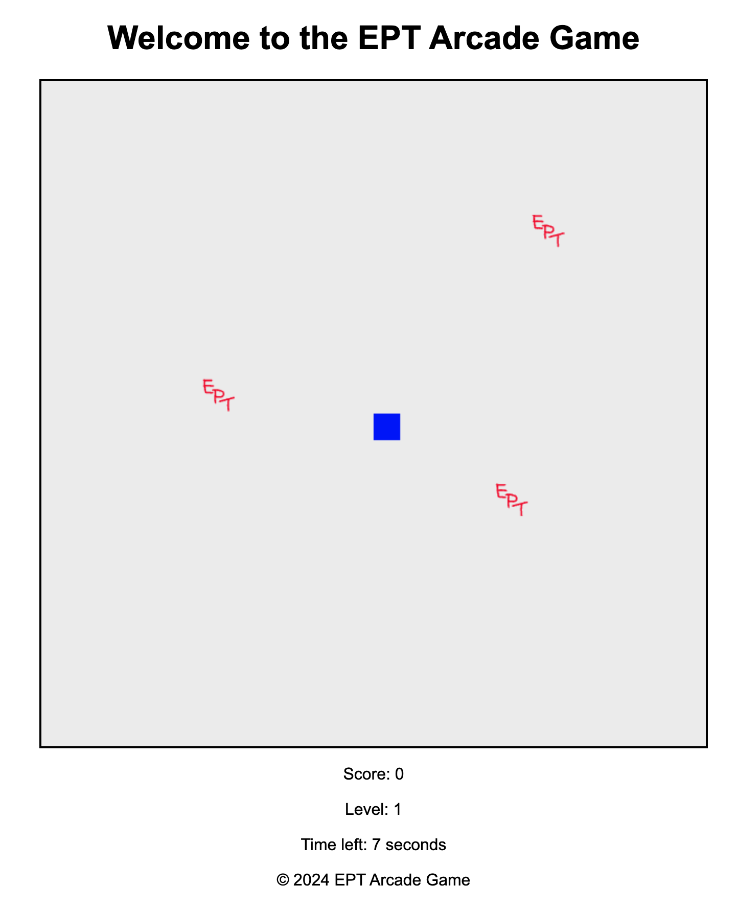
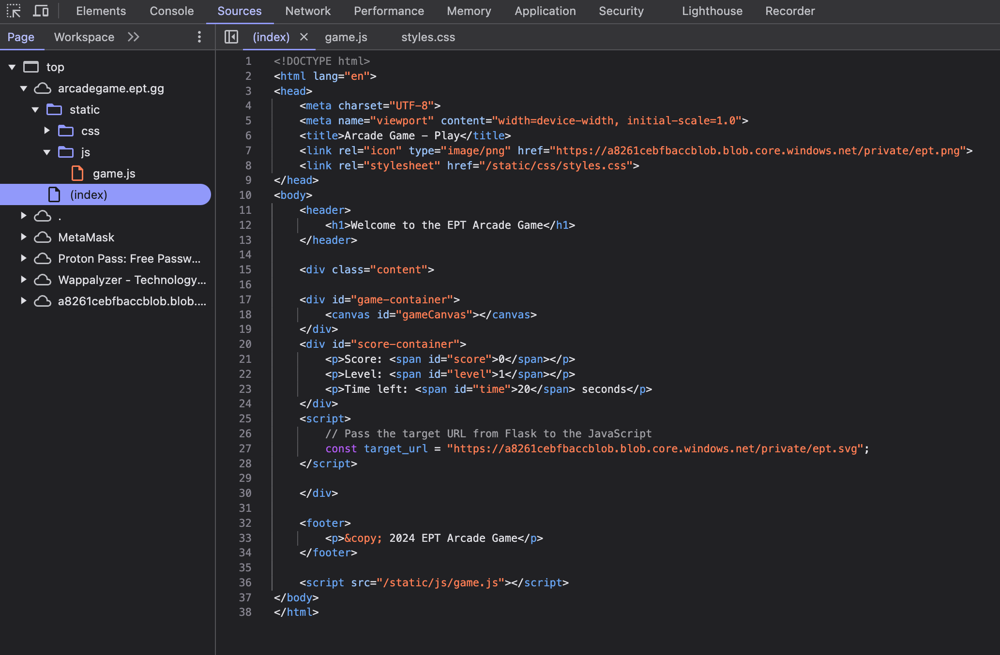
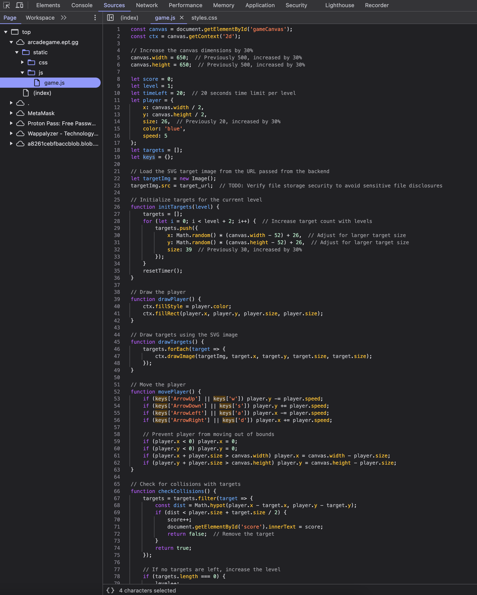
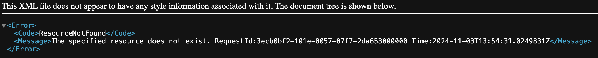
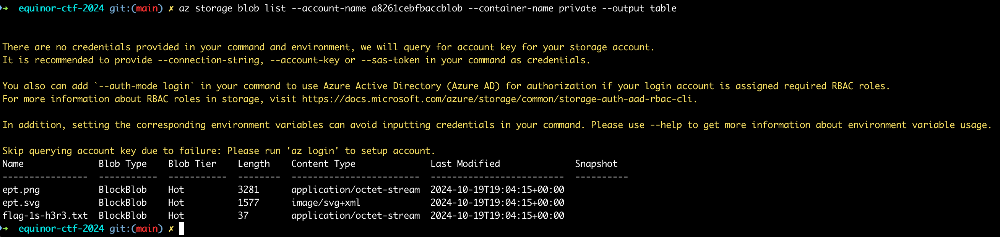

# EPT Arcade Game

Writeup Author: gardc

## Analysis

When visiting [the link](https://arcadegame.ept.gg/) provided in the EPT Arcade Game challenge, you are greeted with a simple arcade game.



By inspecting the source code of site we see a simple site fetching the site icon and the EPT logo from an external source.
It also creates a canvas, text elements for score and calls the `/static/js/game.js` script.



Upon inspecting the `game.js` script it looks like a normal game without any obvious abnormalities.



## Solution

The most intersting part so far is that the `https://a8261cebfbaccblob.blob.core.windows.net` referenced in `index.html`. That means we decide not to inspect the game itself any further and instead try to investigate this 3rd party link.

Trying to visit `https://a8261cebfbaccblob.blob.core.windows.net/private/` gives us a 403 Forbidden error.



Knowing that the site is hosted on Azure due to the `blob.core.windows.net` which looks suspiciously Microsoft-y, we can try to use [Azure CLI](https://docs.microsoft.com/en-us/cli/azure/install-azure-cli) to inspect further.

Once the Azure CLI is installed, we can use the `az storage blob list` command to list the blobs in the storage account.

The URL for the SVG is `https://a8261cebfbaccblob.blob.core.windows.net/private/ept.svg`, and so we know the parameter `--account-name` is `a8261cebfbaccblob` and the parameter `--container-name` is `private`.

That leaves us with this command:

`az storage blob list --account-name a8261cebfbaccblob --container-name private --output table`



We can see that there is a `flag-1s-h3r3.txt` file in the storage account!

Visiting `https://a8261cebfbaccblob.blob.core.windows.net/private/flag-1s-h3r3.txt` gives us the flag, which we can see is `EPT{b72b9f5611694c29b334c246f1d16a6d}`.

## Side note

This arcade site has an annoying popup when time runs out. To supress it, open the developer console and run

```js
window.alert = function () {
  console.log("Alert suppressed:", arguments);
};
```

This will suppress the alert popup and write to console instead.
