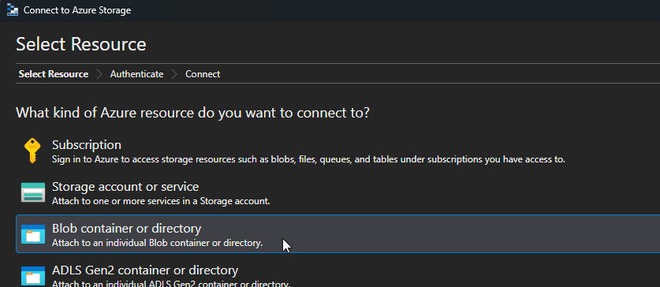
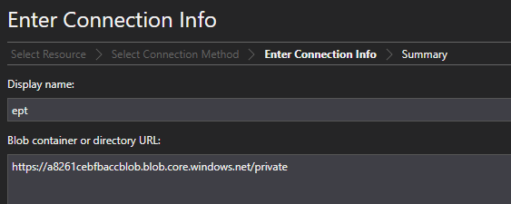
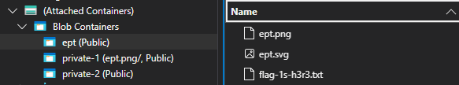

We are presented with a game, which upon closer inspection of the javascript code runs forever and seems unsolvable.

In the main html file however, we see links to azure blobs. Maybe its a publicly readable blob?

```html
<!DOCTYPE html>
<html lang="en">
  <head>
    <meta charset="UTF-8" />
    <meta name="viewport" content="width=device-width, initial-scale=1.0" />
    <title>Arcade Game - Play</title>
    <link
      rel="icon"
      type="image/png"
      href="https://a8261cebfbaccblob.blob.core.windows.net/private/ept.png"
    />
    <link rel="stylesheet" href="/static/css/styles.css" />
  </head>
  <body>
    <header>
      <h1>Welcome to the EPT Arcade Game</h1>
    </header>

    <div class="content">
      <div id="game-container">
        <canvas id="gameCanvas"></canvas>
      </div>
      <div id="score-container">
        <p>Score: <span id="score">0</span></p>
        <p>Level: <span id="level">1</span></p>
        <p>Time left: <span id="time">20</span> seconds</p>
      </div>
      <script>
        // Pass the target URL from Flask to the JavaScript
        const target_url =
          "https://a8261cebfbaccblob.blob.core.windows.net/private/ept.svg";
      </script>
    </div>

    <footer>
      <p>&copy; 2024 EPT Arcade Game</p>
    </footer>

    <script src="/static/js/game.js"></script>
  </body>
</html>
```

Using Azure Storage Explorer, lets try to connect to the blobs url.





Yep, its public.



Download the file and open it to get the flag.


