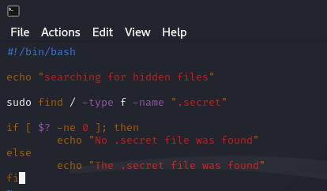
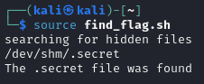
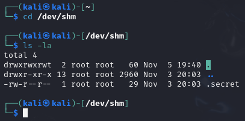
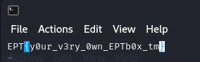

# 👶 EPT Got talent? 👶

Writeup author: **Snorkfröken**

## Solution 

When we first read the challenge description we get 2 hints. 

1. >"... But where would they hide a .secret?" 
   
the "**.secret**" is the important part here which suggests that we are looking for a hidden file.
we also get a 2nd hint 

2. >"Hint: The flag is hidden on your teams EPT Box™"

This is pretty straight forward so after following the instructions on https://ctf.ept.gg/ept-box
we are presented with this Text in our terminal 

 

### Finding the .secret file

Since we know that we are looking for a hidden file we can use the linux command 

>ls -la (ls shows all files and -la shows all the hidden files)
this results in all the files and hidden files that are accessible from the base directory showing up.   

Here we also see the total number of files <ins>**56**</ins> going through them all would take a long time
so we are better off creating a bash script to find the flag for us.

>first we need to make a new file with the Linux command  
**touch <file_name>** lets call it find_flag.sh (.sh for bash file)

we can now make sure our file was created correctly by doing ls -la again.

>After we have created the file we use the linux command  
**chmod +x find_flag.sh** -This will give our newly created file execute permissions. 

Then we open the file and insert our written code using our chosen method I will use vim

>**vim find_flag.sh**

> press i to go to insert mode and be able to write and then :wq to save and quit (write+quit)

then we run the command with the linux command
>**source find_flag.sh**

this then shows us where the .secret file is located in **"/dev/shm/ .secret"**

we can then simply navigate into the shm directory by doing 
> cd /dev/shm/ 

and since we know that the hidden file .secret exists there we can do
> ls -la again which shows us the file .secret

we can then open the file with a linux command that opens a file  
>vim .secret

and the flag is displayed

