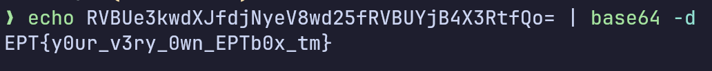
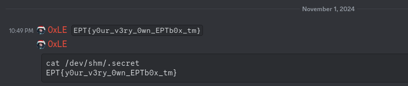

# 👶 EPT Got talent? 👶

Writeup author: `0xle`

## Analysis

Without knowing the existence of this challenge, we were looking around the EPT Box™.

The following publicly available information was happily shared by *duniel*:


Knowing the existence of the AWS metdata endpoints and that EPT uses AWS, we
decided to poke around
the [AWS metadata endpoints](https://docs.aws.amazon.com/AWSEC2/latest/UserGuide/ec2-instance-metadata.html#instancedata-data-categories),
specifically the `user-data` endpoint which contains the initialization script for the VM. We ran the following command
from the EPT Box™:

```bash
curl http://169.254.169.254/latest/user-data
```

The following line can be found in the [initialization script](init.sh):

```bash
echo RVBUe3kwdXJfdjNyeV8wd25fRVBUYjB4X3RtfQo= | sudo base64 -d > /dev/shm/.secret
```

## Solving the challenge

By decoding the Base64-encoded string we found in the [Analysis](#analysis) phase, we found the flag.



However, this was found a day before the actual CTF, and we had no clue where to submit it.



The actual task now becomes: how do we submit the flag?

We decided to designate a task force to submit the flag at the beginning of the CTF, including our very own EPT CLI™.
Unfortunately, the regex for the challenge name, `/box/` did not match the challenge id nor name, so one of the human
beings on our team had to manually submit the flag either via the CLI or the frontend.

In the end, we managed to submit the flag at 5.440812 + ε seconds after the competition start.
