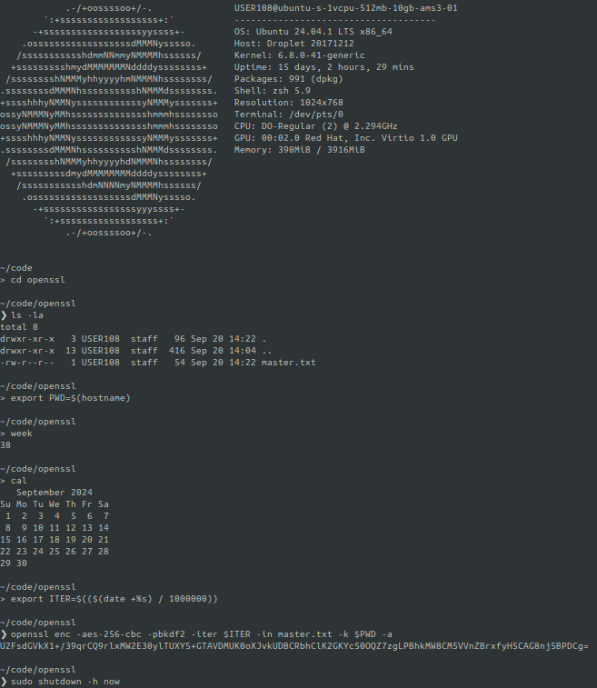
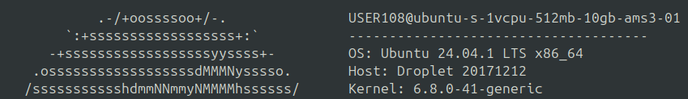
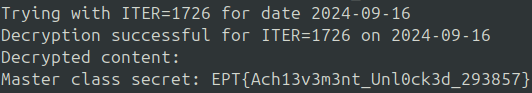

# LEFTOVERS
By: `Hansern` - **Munintrollet**

*Our "employee of the week" eloped. He was the only one that knew the master class secret. We managed to extract logs from his last activities.*

*Can you find anything from this?*

---
# Initial Analysis 
From the challenge description we know there is a "*master class secret*" to be found.

The attached [terminal.log.txt](https://github.com/ept-team/equinor-ctf-2024/blob/main/writeups/misc/Leftovers/terminal.log.txt) file contains both commands and the following output from an Ubuntu terminal session:
\

\
During this session the user does some interesting stuff before encrypting a `master.txt` file using `openssl`. This is most likely the highly regarded "*master class secret*" we are on the look out for. Since the log contains both output and command, we actually have the encrypted version of `master.txt` which is:
```
U2FsdGVkX1+/39qrCQ9rlxMW2E30ylTUXYS+GTAVDMUK0oXJvkUDBCRbhClK2GKYc50OQZ7zgLPBhkMW8CM5VVnZBrxfyH5CAG8nj5BPDCg=
```

This seems simple enough; we know *how* the user encrypted the highly regarded "*master class secret*", ~~but we don't know *why* :(~~ and we have the encrypted output. So, let's decrypt this dubious "*master class secret*".

---
# OpenSSL
Before solving this challenge we need to understand what this argument-ridden `openssl` command line does. 

From the forever helpful `man` command: 
*The `openssl` program is a command line program for using the various cryptography functions of OpenSSL's crypto library from the shell.*

For the arguments, we get this from the lovely `man`:
* **`enc`:** Enables encryption, decryption, and encoding
* **`-aes-256-cbc`:** Use AES 256-bit size encryption algorithm
* **`-pbkdf2`:** Something called *Password-Based Key Derivation Function 2*, tries to make brute-force difficult
* **`-iter`:** Number of iterations
* **`-in`:** Input filename
* **`-k`:** Password used to *derive* the key from
* **`-a`:** Process the data with `Base64` after encryption

Now we have memorized all this useful information, we can finally decrypt this sinister "*master class secret*".

---
# Decryption
Before we start to decrypt this surprising "*master class secret*", we need to figure out what the `$ITER` and `$PWD` variables are.

Lets start with **`$PWD`**:
>Normally `$PWD` is our `Printed Working Directory`, i.e. which directory we currently reside in. But in this case, it's different. In this terminal session it would (probably) be something like `/home/USER108/code/openssl`, but the 3rd command executed changes this `$PWD` environmental variable to `$(hostname)`. Where `$(hostname)` is the output from the command `hostname`. 
> 
>The problem is that we do not have the `hostname` in any of our commands or output! But in the welcome message displayed by the Ubuntu terminal, it displays the `hostname` at the very top:
>
> Specifically: **`ubuntu-s-1vcpu-512mb-10gb-ams3-01`**

Now for **`$ITER`**:
>The command run prior to the encryption command itself sets the `$ITER` value. It's *simply* the output of `date +%s` divided by `1000000`. But what *`tf`* is this `date +%s` thingy? 
>Turns out it is the number of seconds since January 1, 1970, at 00:00:00 UTC. This is because `Linux > everything`. So, `$ITER` is the number of seconds since the 1st of January 1970 at 00:00:00 UTC divided by `1000000`. Easy enough.
>
>But when was this encrypted? Well, our user had to check which week and month it was before encrypting this undoubtedly "*master class secret*". So we do actually have all the information we need. It was encrypted during week `38` in `September 2024`, between 16th to 22nd September 2024.

Since we have established that `Linux > everything`, we will decrypt this powerful "*master class secret*" using a special crafted bash-script, [decrypt_leftovers.sh](./attachments/decrypt_leftovers.sh). This script decrypts the discstuing "*master class secret*" inside the `master.txt` file.

This script does the following:
* Sets `$PWD` and `$DATES` to values found by the analysis above. I.e. `$PWD` contains the `hostname`, and `$DATES` contains every day in week 38 of 2024.
>```bash
>PWD="ubuntu-s-1vcpu-512mb-10gb-ams3-01"
>DATES=("2024-09-16" "2024-09-17" "2024-09-18" "2024-09-19" "2024-09-20" "2024-09-21" "2024-09-22")
>```
>*DISCLAIMER: Using every day in week 38 turned out to be unnecessary, we will get to that later...*
* Iterate over each day in week 38 2024.
>```bash
>for DATE in "${DATES[@]}"; do
>	[...]
>done
>```
* For each iteration, try to decrypt the un-believable "*master class secret*" using the current day, and check the exit code for decryption command after success.
>```bash
>ITER=$(($(date -d "$DATE" +%s) / 1000000))
>echo "Trying with ITER=$ITER for date $DATE"
>
>DECRYPTED_OUTPUT=$(openssl enc -aes-256-cbc -pbkdf2 -iter $ITER -d -in $ENCRYPTED_OUTPUT -k "$PWD" -a 2>&1)
>
>if [[ $? -eq 0 && -n "$DECRYPTED_OUTPUT" ]]; then
>	echo "Decryption successful for ITER=$ITER on $DATE"
>	echo "Decrypted content:"
>	echo "$DECRYPTED_OUTPUT"
>exit 0  
>fi
>```

---
# FLAG
Here we have output of the decryption script containing the decrypted juicy "*master class secret*":
\

\
We have successfully retrieved the eccentric "*master class secret*":
```FLAG
EPT{Ach13v3m3nt_Unl0ck3d_293857}
```

---
# Turtle > Rabbit
While writing this writeup explaining what the `openssl` command and bash-script does. I quickly realized that, as mentioned in the disclaimer above, we do not need to iterate over all the days in week 38 of 2024. This is because the calculation of `$ITER`  is a bit extreme. Specifically, the division part.

First day of week 38 in 2024 (16th sept.), is  `1 726 080 000` seconds after that random day in 1970. So, `$ITER` will be `1 726 080 000` / `1 000 000` = **`1726`**. Last day of week 38 in 2024 (22nd sept.), is `1 726 144 000` seconds after that day in 1970. So, here `$ITER` will become `1 726 144 000` / `1 000 000` = **`1726`**. THE SAME VALUE. EACH DAY (AND BEYOND) RETURNS THE SAME `$ITER` VALUE. The division value of `1 000 000` is way too big and does not affect the `$ITER` value nearly enough.

Channelling the inner turtle during a CTF tournament is something we all, at least I, should do more often. Or maybe not the inner turtle, since `first bloods > air`,  but the inner **turbit**:
\


---