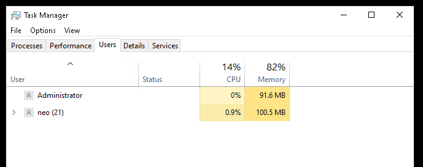
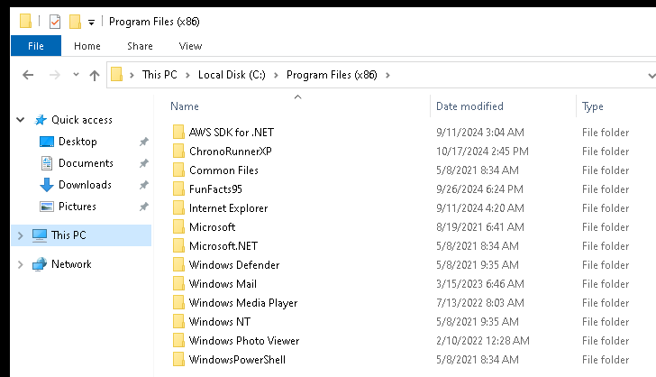
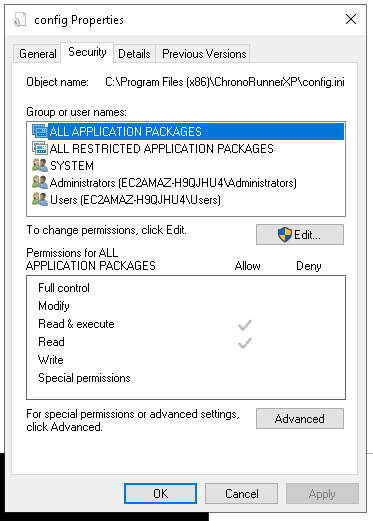
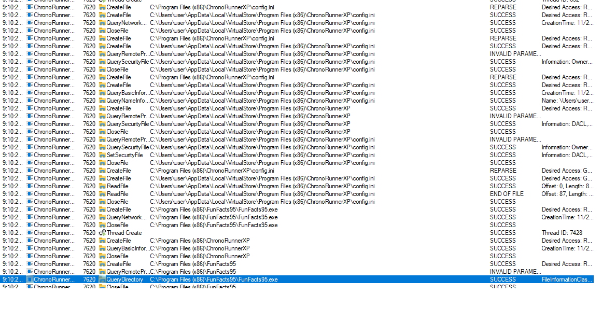
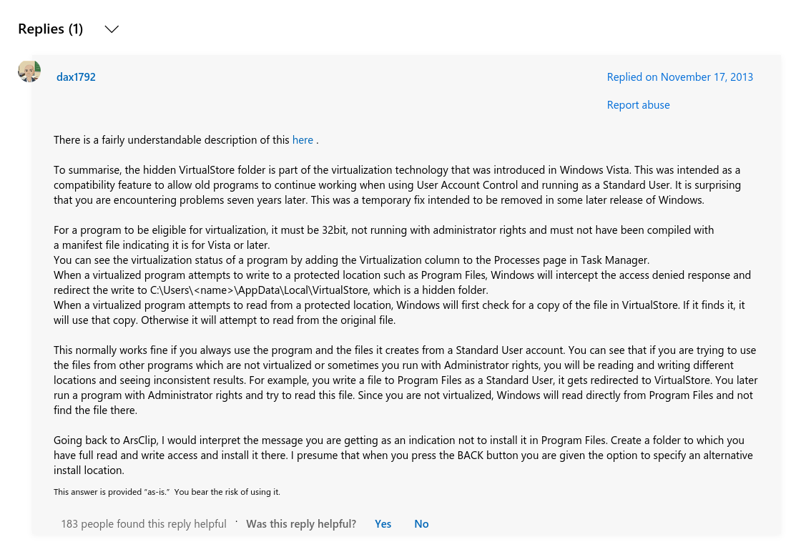
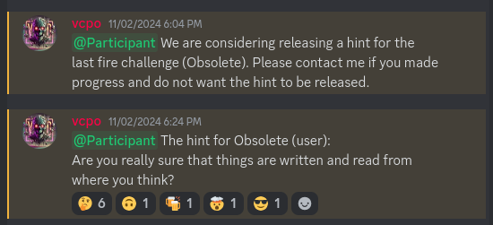
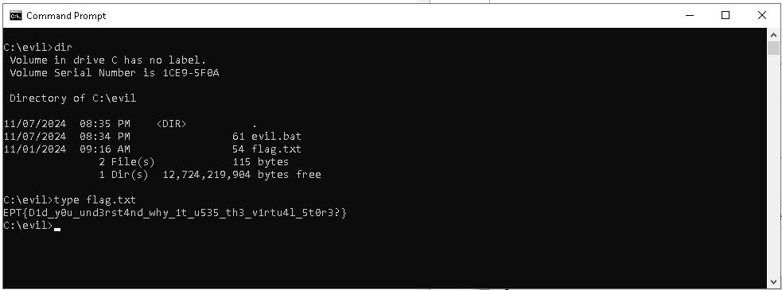

# Obsolete (user)

Writeup by erlend in team mneF00

## Challenge Description

A venture into the past. Login using RDP with the following credentials:

neo / F0ll0w_Th3_Wh173_R4bb17

The flag is in a flag.txt file on the desktop of the Administrator user.

Challenge VM: \<your instance ip here>

This is a VM, so it might take some while before the system and applications actually boot.

You need to use your team EPT Box™ to connect to this challenge. Check your team page.

# Solution

You connect to the VM as per instructions and take a look around. You see that the Administrator user is currently logged on:



So, you are not alone. Unfortunately, you cannot see what processes the Administrator is currently running. Looking
around even more, you will find some _obsolete_ programs lying in `c:\program files (x86)\`



Namely, ChronoRunnerXP and FunFacts95.

FunFacts95 is not interesting, but you can use it to confirm that the ChronoRunnerXP is actually running by watching its log files.


## ChronoRunnerXP

In the ChronoRunnerXP folder, there are two files. `config.ini` and `ChronoRunnerXP.exe`. I copied these files over to my Flare VM for reversing.

The config.ini contains the following configuration:
```ini
[Settings]
ExecutePath=C:\Program Files (x86)\FunFacts95\FunFacts95.exe
Interval=60000
```

`ChronoRunnerXP` is a DotNet application, which makes it easy to decompile. I used dnSpy as I had it lying on my FlareVM.
You can find the decompiled program [here](ChronoRunnerXP.cs).

```cs
private static void Main(string[] args)
{
    if (!Program.IsAdmin())
    {
        Console.WriteLine("Error: This application requires a user with administrative privileges.");
        Environment.Exit(1);
    }
    Console.CancelKeyPress += delegate(object sender, ConsoleCancelEventArgs eventArgs)
    {
        Console.WriteLine("Shutting down...");
        Timer timer = Program._timer;
        if (timer != null)
        {
            timer.Dispose();
        }
        Environment.Exit(0);
    };
    Program.EnsureConfigFileExists();
    Program.interval = Program.ReadIntervalFromConfig();
    Program._timer = new Timer(new TimerCallback(Program.OnTimerElapsed), null, Program.interval, -1);
    Console.WriteLine("ChronoRunner XP is running. Press Ctrl+C to exit.");
    for (;;)
    {
        Thread.Sleep(-1);
    }
}
```
When ChronoRunnerXP starts, it will do three things.
* Check if current user is Admin, exit otherwise.
* Read the interval from the configuration file (how often the program referenced in `config.ini` should execute)
* Start a timer that will execute the function `OnTimerElapsed` at the specified interval.

The `OnTimerElapsed` function will execute the task, read and update the interval.
```cs
private static void OnTimerElapsed(object state)
{
    Program.ReadAndExecuteTask();
    Program.interval = Program.ReadIntervalFromConfig();
    Program._timer.Change(Program.interval, -1);
}
```

 
The `ReadAndExecuteTask` will call `EnsureConfigFileExists`.

```cs
private static void ReadAndExecuteTask()
{
    Program.EnsureConfigFileExists();
    try
    {
        string[] array = File.ReadAllLines(Program.configFilePath);
        string text = string.Empty;
        foreach (string text2 in array)
        {
            if (text2.StartsWith("ExecutePath="))
            {
                text = text2.Substring("ExecutePath=".Length);
                break;
            }
        }
        if (!string.IsNullOrEmpty(text) && File.Exists(text))
        {
            Program.ExecuteProgram(text);
        }
    }
    catch (Exception)
    {
    }
}
```

And finally, the `EnsureConfigFileExists` function:

```cs
private static void EnsureConfigFileExists()
{
    if (!File.Exists(Program.configFilePath))
    {
        Directory.CreateDirectory(Path.GetDirectoryName(Program.configFilePath));
        string text = "[Settings]\nExecutePath=C:\\Program Files (x86)\\FunFacts95\\FunFacts95.exe\nInterval=60000\n";
        File.WriteAllText(Program.configFilePath, text);
    }
    FileSecurity accessControl = File.GetAccessControl(Program.configFilePath);
    accessControl.AddAccessRule(new FileSystemAccessRule("Everyone", FileSystemRights.FullControl, AccessControlType.Allow));
    File.SetAccessControl(Program.configFilePath, accessControl);
}
```

Yes! This is what we are looking for. The `EnsureConfigFileExists` will make sure that the `config.ini` file exists, and
then it will always modify permissions to `FullControl` for `Everyone`. This should include our user `neo`.

But! I do not have access to modify `config.ini`. Here I expect to so `Everyone` under "Group or user names" with `Full Control`permissions.
The expected permissions are missing!



Confused, I ran the ChronoRunnerXP locally and watched it using process monitor. Is there more that meets eye?
Process monitor is VERY verbose, so I set an initial filter to `Process Name contains ChronoRunnerXP.exe`

I see that it read the `config.ini` file, and later execute `FunFacts95.exe` as specified in the `config.ini` file.


I also noted that it tries to read the file from a VirtualStore path in my user's AppData folder.
A quick google search explained to me that this would happen if a program is not running as administrator and tries to write to `C:\program files (x86)` directory.



Because I ran the program on my computer as user `user`, I disregarded this observation because I thought this was because I executed it locally. The Administrator user on the challenge VM would not need no VirtualStore, right?

At this point, I concluded that I would need to find some way to get the operating system to delete the `c:\program files (x86)\ChronoRunnerXP\config.ini` file so that it could be recreated with the correct permissions.

I moved on to other challenges...

## Hint dropped

At around 18:30, EPT Crew decided to drop a hint because noone had solved this challenge yet.
The hint was:

```Are you really sure that things are written and read from where you think?```



This clicked instantly. The `config.ini` file had to be read from `C:\Users\Administrator\AppData\Local\VirtualStore\Program Files (x86)\ChronoRunnerXP\config.ini`
Windows is funny when it comes to file permissions. Even though you do not have any rights to `C:\Users\Administrators\*`, you can still access the specific files you have access to.

To open the file, I ran the command `notepad C:\Users\Administrator\AppData\Local\VirtualStore\Program Files (x86)\ChronoRunnerXP\config.ini`
And modified it to:
```ini
[Settings]
ExecutePath=C:\evil\evil.bat
Interval=5000
```

Then I created a file named `c:\evil\evil.bat`:

```bat
@echo off
cp c:\user\administrator\desktop\flag.txt c:\evil\
```

After waiting for less than I minute, a flag appears!



My answer to the question in the flag is  ... no. If you know, please let me know :)
