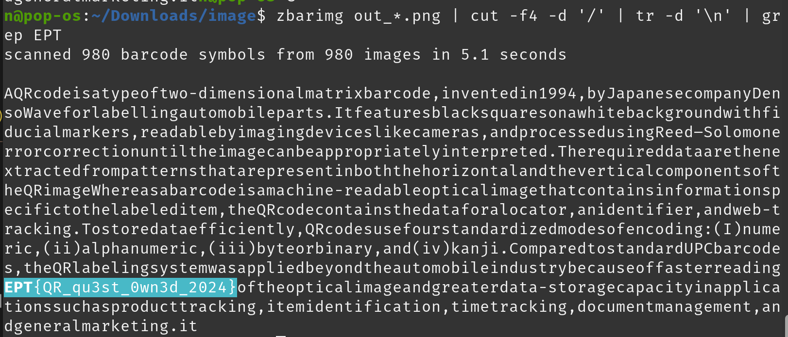

## QR MADNESS
By: Nikolas "n0k0" Papaioannou

We have been given a _huge_ image filled with QR codes.


## Solution

First step i started with was to crop out everything that is not a part of the QR code grid. Mainly the black box at the bottom.

Afterwards i counted the amount of QR codes, which is 10 x 98.

Using the following script to slice the QR's

```py
from PIL import Image

# Load the image
image = Image.open('qr.png')

# Define the grid layout
columns, rows = 10, 98  # Number of QR codes horizontally and vertically

height = image.height
width = image.width
qr_width = width / columns
qr_height = height / rows

# Iterate over the grid and crop each QR code
index =0
for row in range(rows):
    for col in range(columns):
        left = col * qr_width
        upper = row * qr_height
        right = left + qr_width
        lower = upper + qr_height

        # Crop the QR code
        qr_code = image.crop((left, upper, right, lower))

        # Save the cropped QR code
        index = index + 1
        string = str(index).zfill(4)
        qr_code.save(f'out_{string}_{row}_{col}.png')

print("QR codes have been split and saved.")

```

Next up i used zbarimg:

```sh
zbarimg out_*.png | cut -f4 -d '/' | tr -d '\n' | grep EPT
```




Flag: `EPT{QR_qu3st_0wn3d_2024}`