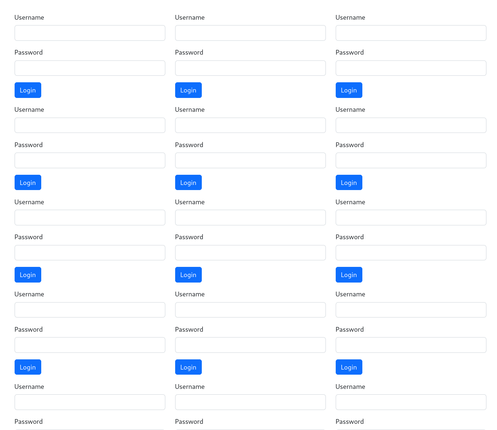
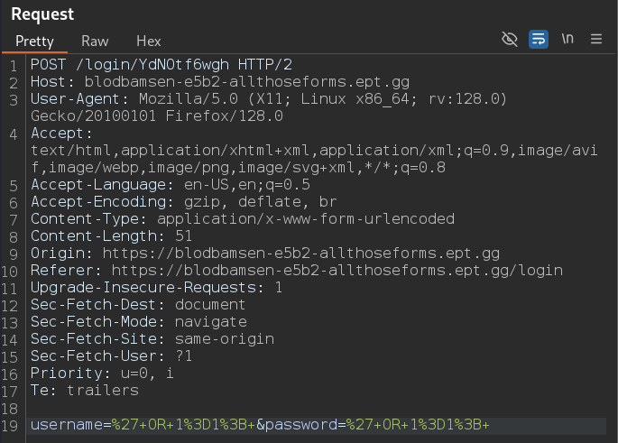
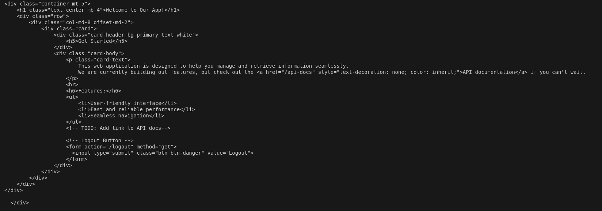
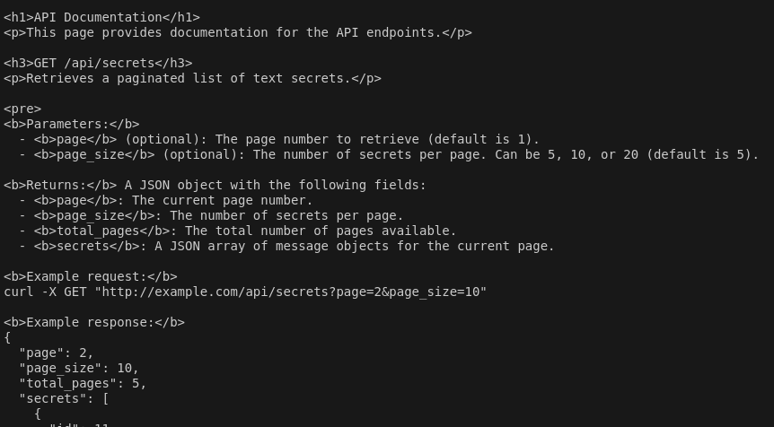
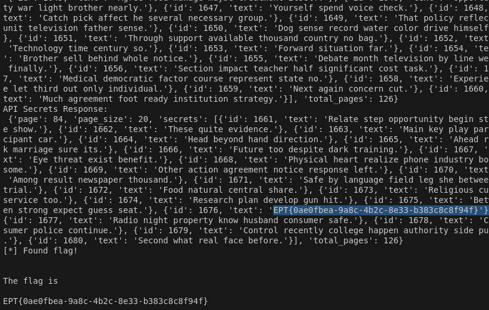

# SQL 101 CTF Challenge Writeup

**Solved by**: 4LT3R_3GO

## Description
<i>There are a lot of login forms on this page, but unfortunately one of them is apparently vulnerable. Luckily, the rest of the forms are fine so in general we should be safe. However, to avoid hackers, we had to set the session validity to 60 seconds to ensure hackers have no time to explore the protected areas of the web app. The login endpoints are refreshed every 30 seconds to avoid hackers going straight back in.</i>

## Walkthrough
Following the link, we are presented with a web page with no more than **only** 101 login boxes - where one is supposed to be vulnerable to SQL injection.



Okay, an excellent place to start is intercepting some traffic with Burp. By using a simple SQLi payload `' OR 1=1;`. An incorrect attempt results in the message <span style="color:red;">Invalid login credentials!</span>. Inspecting the traffic, we can see that the POST request was sent to the endpoint /login/YdNOtf6wgh, and by inspecting the page source, each login form has its own /login/ endpoint. Additionally, each form submission redirects the page back to the login page and refreshes all endpoints. 



We can either try our luck to find the one login form that supposedly is vulnerable -- **or** -- try them all as fast as we can.

The first step is to identify all the different forms and endpoints.
Here Python with a bit of help from bs4 and requests. 

```py
# Function to retrieve login endpoints from the main page
def fetch_login_endpoints():
    try:
        print("[*] Fetching login endpoints...")
 response = requests.get(base_url + login_page, timeout=5)
 soup = BeautifulSoup(response.text, "html.parser")
        
        # Find all form action URLs with "/login/"
 login_endpoints = [
 form["action"] for form in soup.find_all("form", action=True)
            if "/login/" in form["action"]
 ]
        print(f"[+] Found {len(login_endpoints)} login endpoints.")
        return login_endpoints
    except requests.RequestException as e:
        print(f"[!] Error fetching login endpoints: {e}")
        return []
```
This function finds all endpoints (and confirms that there are 101 of them).

Now that this is done, the second step is to try each one of them with a payload. 
We have a 30-second window before each endpoint is refreshed and a 101 to try. 
Threading can be used to try multiple endpoints concurrently to achieve efficience.

Finally, we get a 200 with a friendly redirect!

We are met with a **"Welcome to our app"**, which points to our next clue/endpoint: **/api-docs**.

Fetching this, using the current session, gives us information of how to fetch data using this API.


After reading through it, we can craft a final get request to fetch data.

And... after some waiting and testing...




### FLAG
**EPT{0ae0fbea-9a8c-4b2c-8e33-b383c8c8f94f}** 

----
The complete script: [solve.py](./solve.py)

----


## Disclaimer (more an honest confession)
We took a break from this around dinner time (half-done in a frustrating ThIs:mUsT:bE:a:RaBbIt:hOlE) and started with other challenges. However, we started up again when it was 10 minutes left and found the flag 5 minutes past TimesUp-Sry-TooLate ㄟ( ▔, ▔ )ㄏ