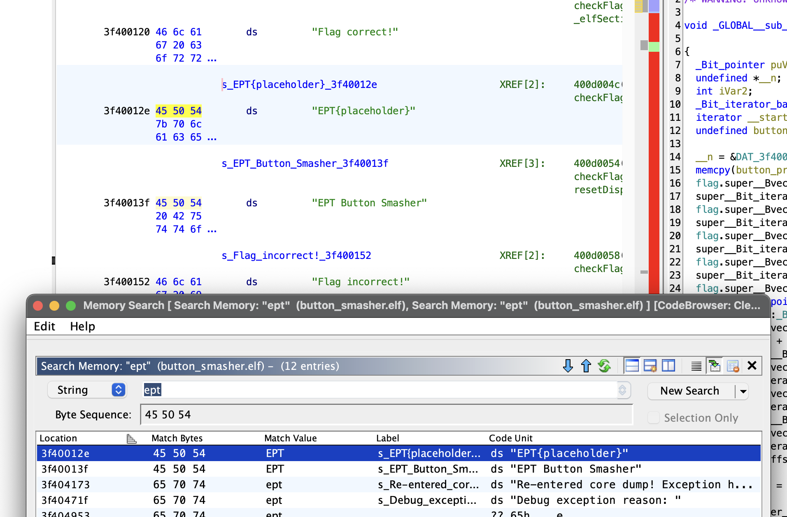
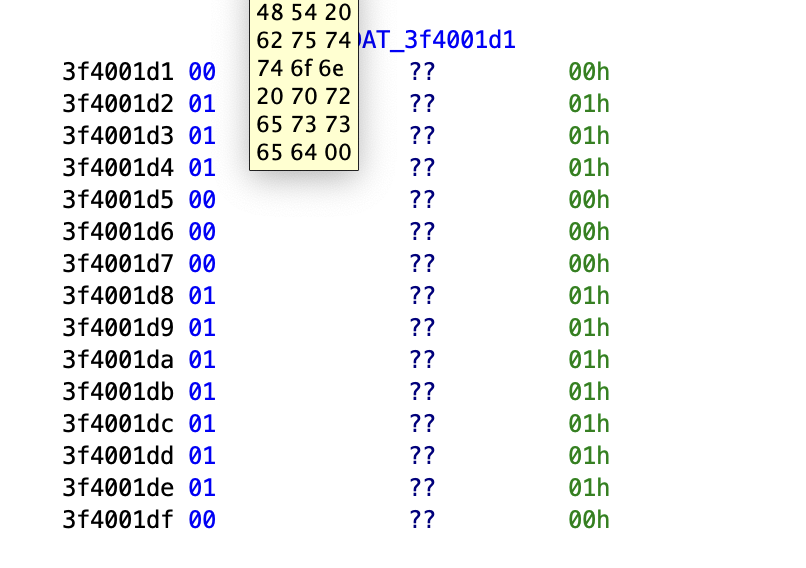
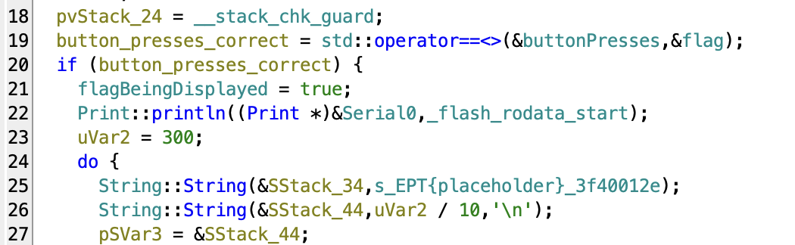
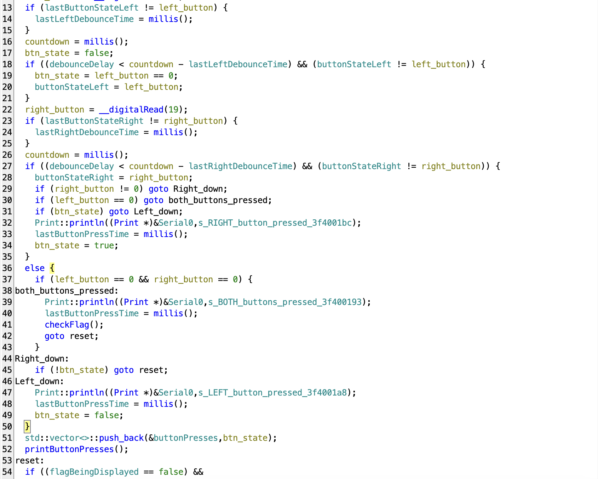
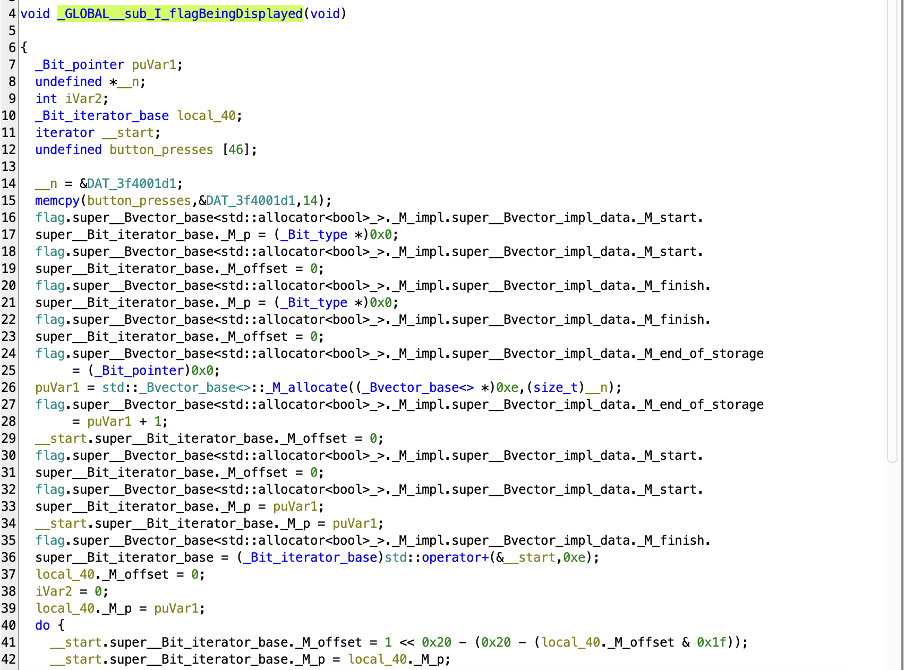
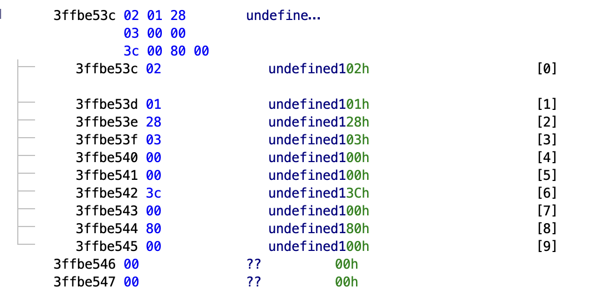
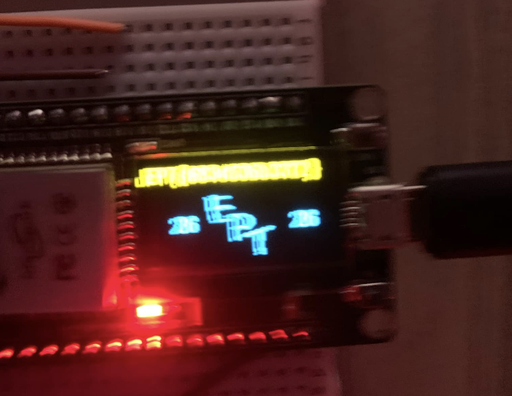
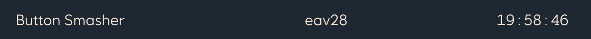

# Button Smasher Writeup

Writeup Author: eav28 (SIFI)

Solved by: eav28, SveinPavel & vegaj

## Description
```
We are total noobs when it comes to hardware, so we decided to smash some buttons.

We forgot the sequence though, are you able to figure it out?

**NOTE:** This is an onsite challenge, you can find it some place in the venue. This challenge can be solved on your own computer, you only need to come over once you know the correct input.
```

## Analysis
We begun by opening button_smasher.elf in Ghidra. Here we did a quick search for "EPT" to get an idea of where the flag is located and where it might be used. This is what we got:

<p align="center">

</p>

Here we got a good list of strings that we can check through to get an idea of what is happening in the program.

At the bottom of all the strings we find a data value of 15 elements with values of 1's and 0's. (This picture was taken at 18:33... 1h and 27 minutes to go!):

<p align="center">

</p>

We walk up to the button smashing machines and try to enter ```<>>><<<>>>>>>><```, however the machine did not dispaly anything and it even accepted 4 or 5 more inputs  before displaying ```Incorrect input!```.

We did notice that when we pressed both buttons at the same time we also got the ```Incorrect input!```, so we decided to try entering the same input and then pressing both buttons at the same time. However, this did not work either :/

We then decided to continue reversing the program. We start by finding the references to the EPT{placeholder} string to see when this is printed out. This leads us to a function called ```checkflag```:

<p align="center">

</p>

In the decoder of Ghidra there seems to be a comparison beteen ```&button_presses``` and ```&flag```, and the flag ```EPT{placeholder}``` should be displayed if these are equal.

We then continued through the program by checking the references to the ```checkflag()``` function, and found a function called ```loop()```:

<p align="center">

</p>

We used some time reversing the code and guessing what the variables might be used for. And we concluded that our assumtion about pressing both buttons at the same time might be the correct way to call the ```checkFlag()``` function.

We still did not know what the actual combination could be, so we continued exploring. We ended up finding a function called ```_GLOBAL__sub_I_flagBeingDisplayed()```, but the decoding was very messy:

<p align="center">

</p>

However, at the top we can see (the button_presses variable was originaly called something else):
```c++
memcpy(button_presses, &DAT_3f4001d1, 14)
```

This ```&DAT_3f4001d1``` value was the same value that we had seen at the beginning, but it was only taking in 14 of the 15 byte values:

```
                             DAT_3f4001d1                                    XREF[1]:     400d00a8(*)  
        3f4001d1 00              ??         00h
        3f4001d2 01              ??         01h
        3f4001d3 01              ??         01h
        3f4001d4 01              ??         01h
        3f4001d5 00              ??         00h
        3f4001d6 00              ??         00h
        3f4001d7 00              ??         00h
        3f4001d8 01              ??         01h
        3f4001d9 01              ??         01h
        3f4001da 01              ??         01h
        3f4001db 01              ??         01h
        3f4001dc 01              ??         01h
        3f4001dd 01              ??         01h
        3f4001de 01              ??         01h
        3f4001df 00              ??         00h
```

We still hadn't figured out what the rest of the button combinations were, so we just continued trying to search trough the program. 

The time was beginning to near the end of the CTF, so we were getting desparate (SveinPavel was becoming slightly skitzo). In addition to that, 10 minutes before the deadline, our team had been overtaken placing SIFI in 3rd place among the student teams.

Once there was 3 minutes left, SveinPavel found some random data that could be interpereted as left and right inputs (Image of random data for demonstration purposes only, this was not the actual data SveinPavel found):

<p align="center">

</p>

We ran to check if we were able to solve the challenge, but SveinPavel's random data did not work either :/

I decided to go back to the data values located in ```&DAT_3f4001d1``` and wrote in 14 of the 15 characters before pressing both buttons at the same time. And to our suprise it worked o_0

Me and SveinPavel panicked as there was barely any time of the CTF left... and SveinPavel took this amazing picture of the flag:

<p align="center">

</p>

I rushed to write in the flag, and we managed to send in the flag 74 seconds before the deadline, placing SIFI in 2nd place among the students.


