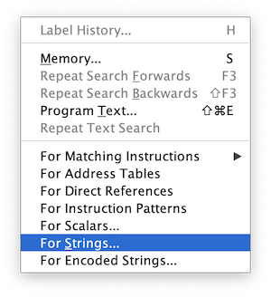
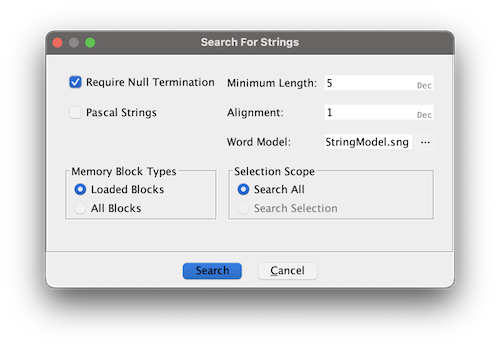
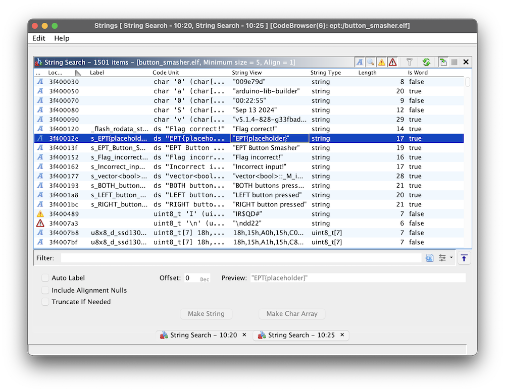
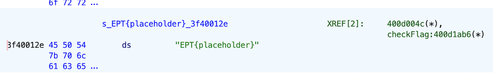
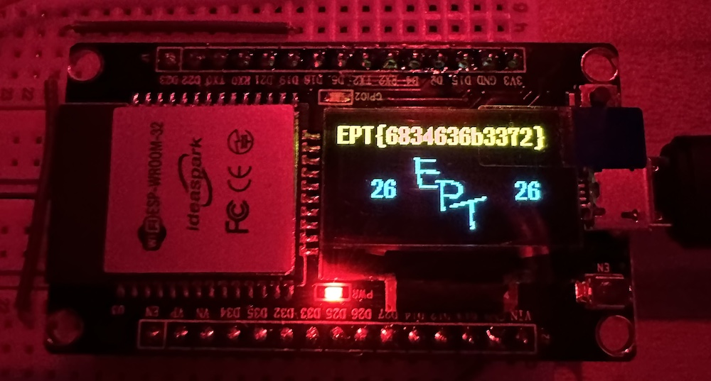

# Button smasher
By: langemyh @ Corax

Categories: Onsite, Hardware, Reversing

Solves: 12

## Info
> We are total noobs when it comes to hardware, so we decided to smash some buttons.
> 
> We forgot the sequence though, are you able to figure it out?
> 
> NOTE: This is an onsite challenge, you can find it some place in the venue. This challenge can be solved on your own computer, you only need to come over once you know the correct input.

## Introduction
The goal of this reversing challenge is to find the button combination to get the flag. 

Using a combination for the `strings` command and `ghidra`, I was able to find the correct combination and get the flag.

## Writeup
As with any reversing challenge, starting with `strings` to see if there is anything to gain from that command:
```bash
❯ strings button_smasher.elf|head -n 15
009e79d
arduino-lib-builder
00:22:55
Sep 13 2024
v5.1.4-828-g33fbade6b8-dirty
Flag correct!
EPT{placeholder}
EPT Button Smasher
Flag incorrect!
Incorrect input!
vector<bool>::_M_insert_aux
BOTH buttons pressed
LEFT button pressed
RIGHT button pressed
Q&T)
```

Looks like a lot of information could be gained here. It looks like the buttons are to be pressed individually OR both at the same time. not really finding anything else interesting from `strings`, so firing up `ghidra` the get a better understanding of how the flow is.

Starting with some initial browsing of the source code using `ghidra` without really finding anything more. Since the `strings` command gave information, it's worth a shot in `ghidra` as well. By clicking the `Search` menu and finding `For Strings`, we could find all of the strings (minimum length of 5 as default) in the file:




This yields the same results as for the `string` command, and we find the `EPT{placeholder}` string here as well:



Double clicking the value will bring us to were this string is declared in the code, and shown in the `Listing` window:



Here we can see that the flag variable is being referrenced by the `checkFlag()` function. Double cliking `checkFlag:400d1ab6(*)` will jump to the correct function and were it is being referrenced from. Reading through the `checkFlag()` to get a better understanding of the code.

This snippet from `checkFlag()` looks to be were the flag gets printed, because of the `flagBeingDisplayed`:
```c++
  bVar1 = std::operator==<>(&buttonPresses,&flag);
  if (bVar1) {
    flagBeingDisplayed = true;
    Print::println((Print *)&Serial0,_flash_rodata_start);
    uVar3 = 300;
    do {
      String::String(&SStack_34,s_EPT{placeholder}_3f40012e);
      String::String(&SStack_44,uVar3 / 10,'\n');
```

To trigger and set the `flagBeingDisplayed` to `true`, this one has to be `true`:
```c++
bVar1 = std::operator==<>(&buttonPresses,&flag);
```

We'll assume that `&buttonPresses` is the button combination pressed by the user and that `&flag` is the correct combination. So, if the buttons pressed by the user equals the `&flag` combination, the flag should be displayed. 

Checking where `checkFlag()` is being referrenced from, we'll find the function `loop()`. The referrencing code is snipped below:
```c++
  else {
    if (iVar1 == 0 && iVar3 == 0) {
LAB_400d2085:
      Print::println((Print *)&Serial0,s_BOTH_buttons_pressed_3f400193);
      lastButtonPressTime = millis();
      checkFlag();
      goto LAB_400d2026;
    }
```

It looks like we need to push _both_ buttons to trigger the `checkFlag()` function! Now all that is left is to find the correct combination.

To find the value of `&flag`, we'll start by double clicking the name which will make the `Listing` window to jump to were `&flag` is being declared:


We already know what the `checkFlag()` reference is, so checking out the next one by double clicking `_GLOBAL__sub_I_flagBeingDisplaye...`. Which make the `Decompile` window jump to the function:
```c++
void _GLOBAL__sub_I_flagBeingDisplayed(void)

{
  _Bit_pointer puVar1;
  undefined *__n;
  int iVar2;
  _Bit_iterator_base local_40;
  iterator __start;
  undefined local_2e [46];
  
  __n = &DAT_3f4001d1;
  memcpy(local_2e,&DAT_3f4001d1,0xe);
```

This looks to be the interesting bits of the function `_GLOBAL__sub_I_flagBeingDisplayed`, especially the line:
```c++
memcpy(local_2e,&DAT_3f4001d1,0xe);
```

Double clicking the `&DAT_3f4001d1` will jump to were it is being declared in the `Listings` window:
```
DAT_3f4001d1                          XREF[1]:     400d00a8(*)  
3f4001d1 00              ??         00h
3f4001d2 01              ??         01h
3f4001d3 01              ??         01h
3f4001d4 01              ??         01h
3f4001d5 00              ??         00h
3f4001d6 00              ??         00h
3f4001d7 00              ??         00h
3f4001d8 01              ??         01h
3f4001d9 01              ??         01h
3f4001da 01              ??         01h
3f4001db 01              ??         01h
3f4001dc 01              ??         01h
3f4001dd 01              ??         01h
3f4001de 01              ??         01h
3f4001df 00              ??         00h
```

This looks promising! Going back to the `loop()` function, we find these if statements:

```c++
  if ((debounceDelay < uVar2 - lastRightDebounceTime) && (buttonStateRight != iVar3)) {
    buttonStateRight = iVar3;
    if (iVar3 != 0) goto LAB_400d2023;
    if (iVar1 == 0) goto LAB_400d2085;
    if (bVar4) goto LAB_400d2065;
    Print::println((Print *)&Serial0,s_RIGHT_button_pressed_3f4001bc);
    lastButtonPressTime = millis();
    bVar4 = true;
  }
```

```c++
    if (!bVar4) goto LAB_400d2026;
LAB_400d2065:
    Print::println((Print *)&Serial0,s_LEFT_button_pressed_3f4001a8);
    lastButtonPressTime = millis();
    bVar4 = false;
  }
```

This looks to be that pressing the left button results in `false` and pressing the right button results in `true`. Applying this logic to the data in `&DAT_3f4001d1`:
```
<>>><<<>>>>>>> # L R R R L L L R R R R R R R
```

and then confirming by pressing both buttons at the same time to trigger the `checkFlag()` function. Doing this resulted in the flag being shown:



> EPT{6834636b3372}

For the fun of it, `6834636b3372` is hex for `h4ck3r`.