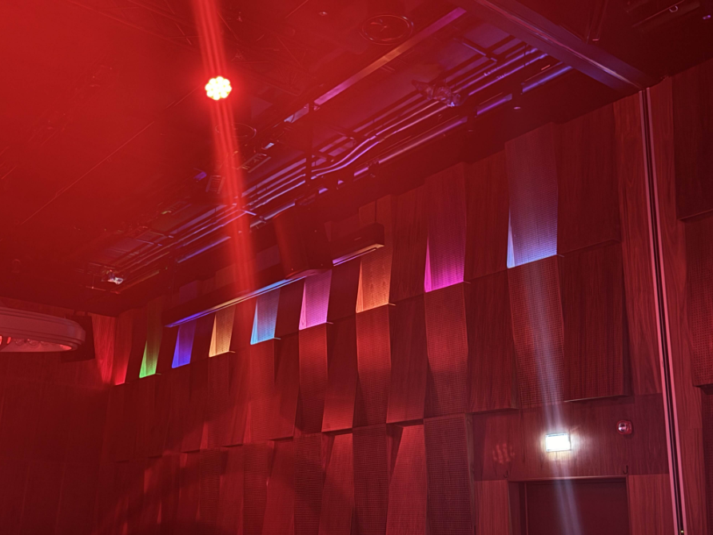

At 12 o'clock, the CTF hosts put us on our first knife's edge of the day. They served lunch at the same time as they released the fire challenges. Naturally, we did as any proud CTF player would and chose the fire challenges. Food could wait another 8 hours. We put our heads down.

**Task:**  
`Something in your surroundings just changed. What?!`

We lifted our heads back up. What had changed? @Tuxeren had the correct angle and instantly spotted moving lights appearing on the wall.

We started looking into how text could be hidden in color combinations. Our research indicated that "Gravity Falls color" was a plausible way to get text from color. This was a rabbit hole we do not recommend going down.

Then we noticed the top row of lights were not moving—16 different lights remained static, with two lights moving across the wall. The top row could represent 0-16 values, and pairs of these values could make up a byte. This could be encoded as hex values! Time to consult our trusted friend, Cyberchef!

**Color Mapping:**  
0 (Red) - 8 (Light Blue):  

9 (Orange) - 16 (F in hex) (White):  

First, we wanted to confirm what we were looking for. What is `EPT{` in hex values?

**EPT{ in Hex:**  

* 45 = Cyan + Light Pink  
* 50 = Light Pink + Red  
* 54 = Light Pink + Cyan  
* 7b = Pink + Deep Pink  

**Next Issue:** The lighting sequence does not start with Cyan + Light Pink...  
**Solution:** Look for the first time this combination appears!

From there, it was a straightforward algorithm: match the lights in sequence to their respective numbers. Continue this until you reach Pink + Lime Green (7d, which equals `}` in hex).  

*(It REALLY helps not to use video sent over Discord; this obfuscates the color clarity.)*

**Solution:**  

— *munintrollet*
