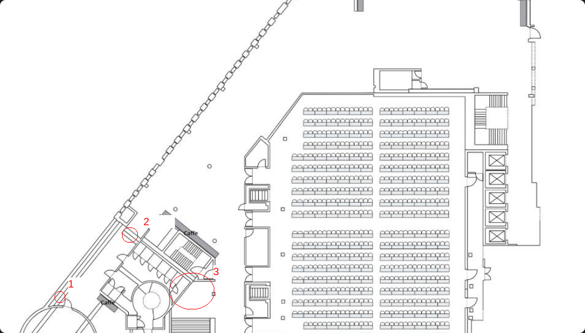

# Writeup
by fluffyhake

## Solution

Walking up to these three locations and scanning it with our access card marked the challenge as solved.

### Example

Scan the card at readers in the following locations:

1. Behind a information sign showing the way to the `Wooden Treasure Chest` challenge

2. Underneath the stairs 

3. On the wall in the circled area

### Solution
We did not record the scanning process, but here is a image of a access card:

We looked around for scanners and found number 3. 
We found the other two (1, 2) by accident. When hanging around the venue we saw other people scan their cards. People laying in the stairs looked suspicious, and we decided to investigate.