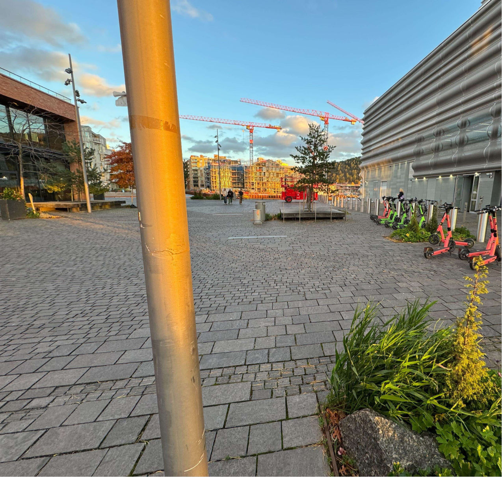
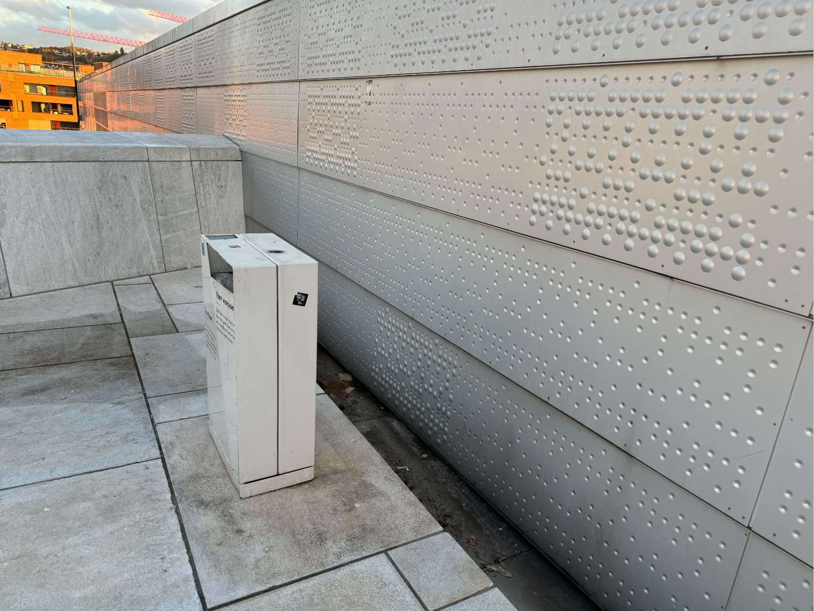
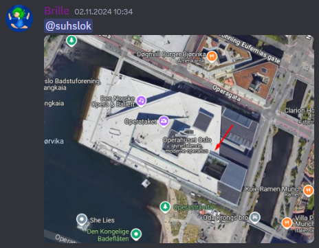
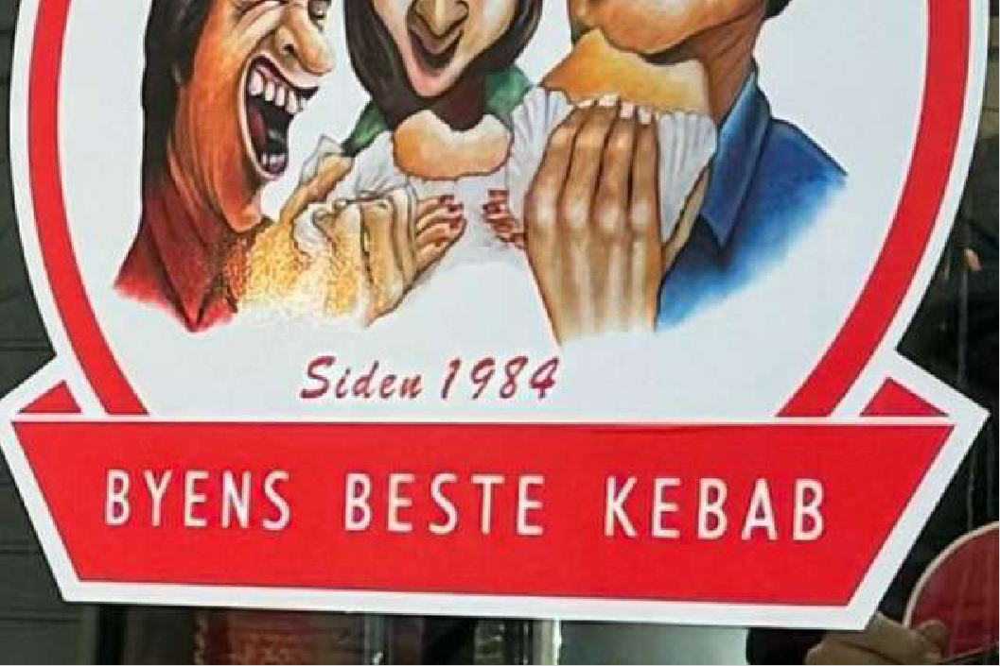
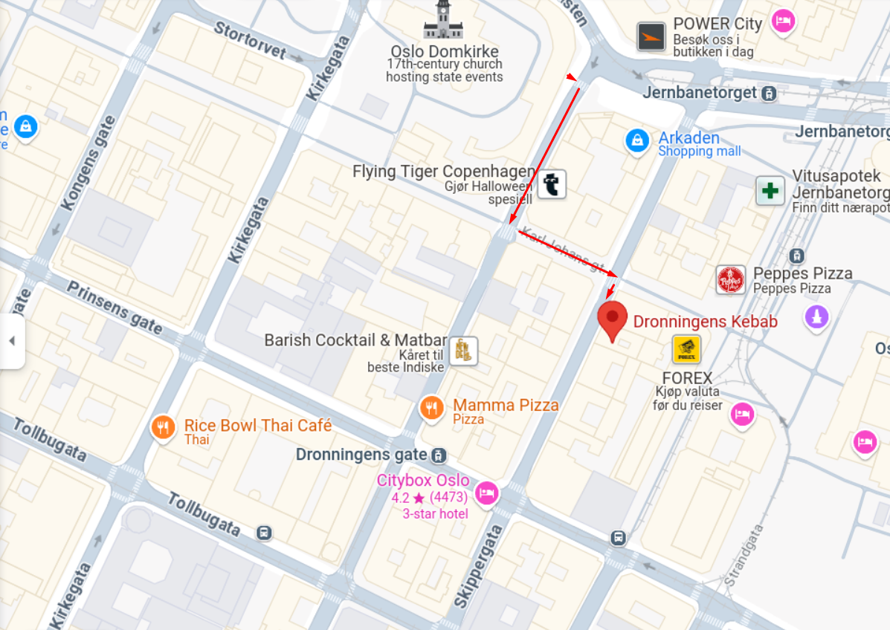
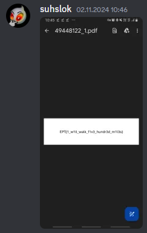
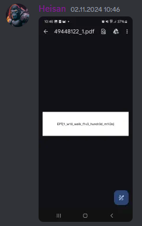

## Walkabout (multithreaded solution)

### First location

Once the first baby tasks where solved it was time to check out this one.

The first image was quickly solved to an approximate location. Suhslok rushed out to run for the flag, meanwhile Brille became *the guy in the chair*.

After researching the image we found that it was just north of the Munch Museum, with Sørenga in the backgound.

### Second location

As noone had solved the challenge yet, we wanted to be as fast as possible. After just a few minutes our field agent sent this in chat:

Therefore we had to up the game to be faster for the next locations to beat the competition.

### Second location

Now headed for the next location *the guy in the chair* provided a gps grid of the exact location:

Ez find.

### Thrid location

Now for the next one HQ wanted to find the exact location to make it a fast run. Brille dropped the Streetview man and got the exact angle the image was taken. This way the distance of the runner could be optimized to the brim:

Suhslok, sprinting like his life depended on it, followed the instructions from the *guy in the chair*, Brille, who barked out directions: “Cross the street NOW — no, wait, too close to the buildings, I’m losing you!” - ”Agent. You are on your own now”

### Forth location

And now we are headed for the last location:

As the local knower he is "Byens beste bebab" was not a hard find for Suhslok. With one exception:

**Dronningens Kebab has recently moved to a new location**

But after Suhslok recievs a GPS grid from HQ this becomes a quick find:

So then it is just to submit...

What???

H.w. h.o .?.. how?

Two flags subitted side by side. For the same team? Oh man.

### Heisans Perspective:

After completing the onsite Wooden Treasure Hunt I went to explore the streets of Oslo. On my way out of the venue I got up to the first local woman I saw and showed her the first picture. Perf! now I know where to go! I then rented a VOI and scooted to the first location. As the "Harstadværing" I am, I dont know Oslo. Therefor i just asked around to get my answers.

On my way to the Opera I passed a little kid running for his life to compete with me. Puh... **He stands no chance**

Dronningens was quickly found with a Google search. Boom! Flag already captured?

## Last notes

Key takeaway from this is that two threads in a process doesn't communicate with each other. Threads share the same memory space but don’t automatically coordinate, so achieving reliable inter-thread communication requires additional mechanisms. It's essential to weigh its benefits against the costs of increased complexity and potential communication challenges. Therefore solving the problem in parallel is not always the best solution. 

\- ChatGPT

## Flag

Here is the flag:

`EPT{1_w1ll_w4lk_f1v3_hundr3d_m1l3s}` `EPT{1_w1ll_w4lk_f1v3_hundr3d_m1l3s}`