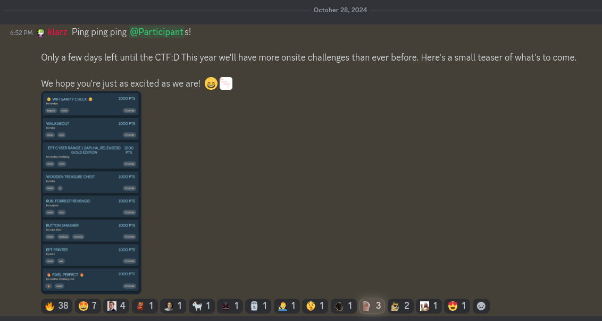
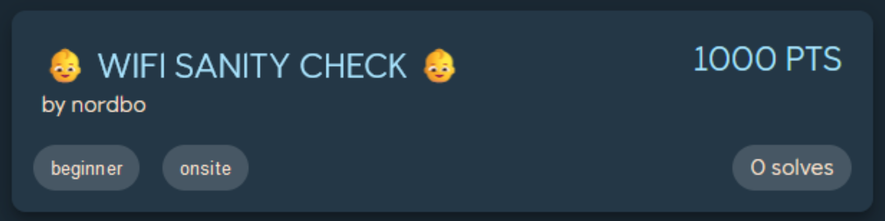
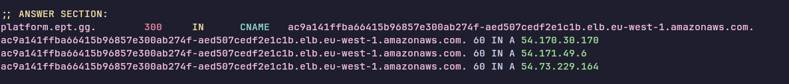
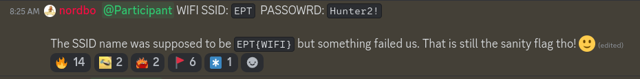
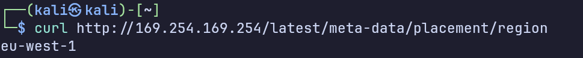
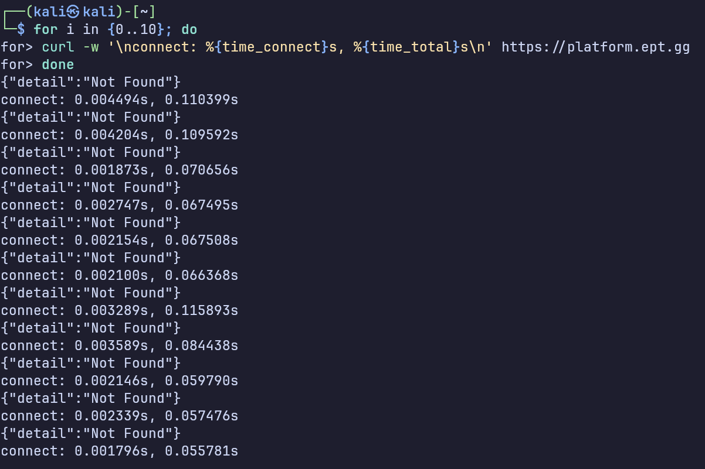

# 👶 WiFi Sanity Check 👶

Writeup author: `0xle`

The flag was provided on Discord prior to the competition start. The real question is, how does one submit the flag
*first*?

## Recon

The first step to solve this challenge properly is to perform some reconnaissance.

Luckily for us, *klarz* was more than happy to tease the task list for this CTF a few days prior to the CTF.



By looking closely, we can notice that the challenge's name is "👶 WiFi Sanity Check 👶".



To submit the flag, we need to be able to interact with the CTF platform. Since we have been to Equinor CFT
before, we are familiar with the API endpoint needed to submit the flag 😉.

Lastly, we should familiarize ourselves with the infrastructure. By running `dig platform.ept.gg`, we can observe that
the platform (at least the LB) is being hosted on AWS `eu-west-1`. This information can be crucial later on.



## Solving the challenge

The flag was given in an announcement by *nordbo* an hour and a few minutes before the start time, and we had to prepare
ourselves.



To quickly submit the flag, we wrote a Rust program to do this job for us. The following code snippet is provided for
reference:

```rust
let data = utils::read_cli_data().await?;
let client = EptClient::new(&data.token);
let chall_regex = Regex::new(&cmd.challenge).context("unable to compile regex")?;

let challenges = get_challenges(&client).await;
tracing::info!("fetched {} challenges", challenges.len());

for challenge in challenges {
    if !chall_regex.is_match(&challenge.name.to_lowercase())
        && !chall_regex.is_match(&challenge.id.to_lowercase())
    {
        continue;
    }

    let res = submit_flag(
        &client,
        &challenge.id,
        &FlagSubmissionRequest {
            flag: cmd.flag.clone(),
        },
    )
    .await;
    tracing::info!("flag correct at '{}': {}", challenge.name, res.correct);
}
```

The implementation details are omitted for strategic reasons™.

Finally, we need to find a way to quickly run the command with as low latency to the platform as possible. Recall the
*Cursed CTF* guide:


We needed to employ a similar strategy to "renting vps in same colo to brute" for the best performance and result.
Luckily for us, the EPT Box™ is located in the same AWS region as the platform (at least the LB). We can verify this by
calling
the [AWS metadata endpoint](https://docs.aws.amazon.com/AWSEC2/latest/UserGuide/ec2-instance-metadata.html#instancedata-data-categories)
from the EPT Box™.



We can anecdotally measure that the connect time taken is just a few milliseconds at most.



Putting everything together, we managed to submit the flag from the EPT Box™ using our hyper-optimized™ 🦀 code while
most participants were still struggling with the Wi-Fi.

This resulted in the first first blood and a submission at `2024-11-02T09:00:00.155530Z`, which is 0.155530 + ε seconds
after the competition started.
